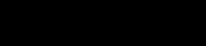

#

| |
|---|
||
| |

---

| | |
|:---|---:|
|||
| | |

## DADOS PESSOAIS

| | | |
|:---|---|---:|
|NOME|---|Jaqueline Villagra Costa|
|IDADE|---|31 anos|
|CIDADE|---|Carapicuíba / SP|
|CURSANDO|---|Bacharelado em Ciência de Dados (4° sem) - UNIVESP|
|GRADUADA|---|Bacharelado em Letras - Habilitação em Português e Japonês (2021) - USP|
||||

## EXPERIÊNCIAS NA ÁREA DE DADOS

* **Analista de Metainformação Sênior & Squad Leader | Omnilogic SA**  
Início como estagiária, e posteriormente efetivada para analista de metainformação junior, desempenhando tarefas de anotação de dados e controle de qualidade.  
    Posteriormente, como analista sênior, exercendo a coordenação de rotinas de squad, responsável pela documentação de processos, padronização de metadados com base em modelos ontológicos e pré-processamento em batch de dados, com uso de RegEx e SQL em ambiente Databricks; rotinas alinhadas aos processos do squad de MLOps na otimização dos modelos de machine learning dos produtos voltados à área de e-commerce.

* **Integrante | [SemioCom](https://semio.cc/) - Grupo Experimental em Semiótica Computacional**  
Breve participação no grupo com contribuição de ideias e códigos. Nesse período, buscávamos o desenvolvimento de alternativas de processamento de linguagem natural, em específico para análise de sentimento, baseadas em uma abordagem metodológica semiótica.

* **Pesquisadora | Projeto TermNeo - Observatório de Neologismos do Português Brasileiro Contemporâneo | [Profª Drª Ieda Maria Alves](http://lattes.cnpq.br/1928032004153127)**  
Coleta e elaboração de *corpora* terminológicos, bem como análise lexical de compostos lúdicos e neologismos da área de Desenvolvimento Sustentável.  

## MOTIVAÇÕES E INTERESSES

* **Línguas & Códigos**  

    Acho que me tornei confortável com ideias codificadas em escrita muito antes de conseguir o mesmo oralmente. Buscar mensagens transmitidas em padrões desconhecidos se tornou um hobby desde criança.  

    Aprender novas línguas é expandir meu mundo ao incorporar outros: novas maneiras de perceber e (re)criar a realidade, explorando permutações infinitas a partir do finito; ao ensinar minha mão a traçar novas escritas e meu trato vocal a produzir novos sons, fortaleço minha propiocepção e me reconecto com meu corpo.  

    

* **Cozinha, Yoga & Vipassana**  
    Esses são os condutores, citados por ordem de adoção ao meu modo de viver, que impulsionam minha reorientação e a busca constante do equilíbrio de minha postura, meus hábitos e minhas ações.

* **Genética & Bioinformática**  
    Estive em um período sabático neste último ano, e pude me permitir o tempo de firmar meus fundamentos, explorar e me aprofundar no campo da Biologia, em especial da Genética. Assim como meu prazer por línguas e códigos, a transmissão de informações por DNA, RNA e aminoácidos me fascina.

    Passei o último semestre no laboratório, acolhida pelo Senai Bom Retiro - Biotecnologia, praticando cultivos e análises microbiológicas, e entendendo como analisar e manipular material genético.

    Futuramente, após minha graduação e meu desenvolvimento na carreira de dados, pretendo me especializar na área de bioinformática e adicionar a tratativa de big data de genes e proteínas ao meu rol de habilidades.

## LEITURAS RECENTES QUE ME TRANSFORMARAM

* **Scattered Minds** - Gabor Maté [֍](https://www.amazon.com.br/Scattered-Minds-Origins-Attention-Disorder/dp/1785042211)
* **The Selfish Gene** - Richard Dawkins [֍](https://www.amazon.com/Selfish-Gene-Anniversary-Introduction/dp/0199291152)
* **Material Ecology** - Neri Oxman [֍](https://www.media.mit.edu/publications/material-ecology/)
* **Assembly Theory Explains and Quantifies Selection and Evolution** - Leroy Cronin, Sara Imari Walker et al [֍](https://www.nature.com/articles/s41586-023-06600-9)

---

## TRILHA DE APRENDIZADO

  
  
  
  
  
  
  
  
