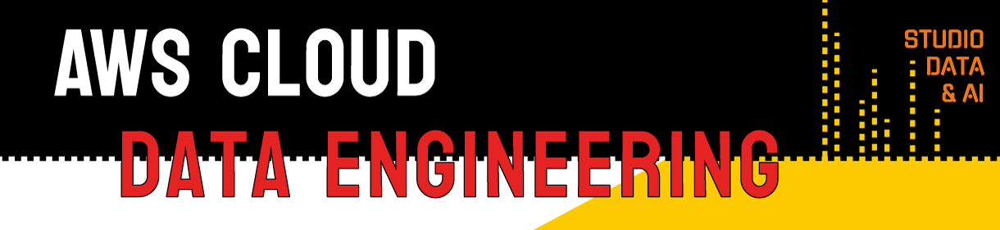

#

| |
|---|
||

---

## DADOS PESSOAIS

| | | |
|:---|---|---:|
|CIDADE|---|Carapicuíba / SP|
|CURSANDO|---|Bacharelado em Ciência de Dados (3°sem) - UNIVESP|
|GRADUADA|---|Bacharelado em Letras - Habilitação em Português e Japonês (2021) - USP|
||||

## EXPERIÊNCIAS NA ÁREA DE DADOS

* **Pesquisadora | Projeto TermNeo - Observatório de Neologismos do Português Brasileiro Contemporâneo | [Profª Drª Ieda Maria Alves](http://lattes.cnpq.br/1928032004153127)**  
Coleta e elaboração de *corpora* terminológicos, bem como análise lexical de compostos lúdicos e neologismos da área de Desenvolvimento Sustentável.  

* **Integrante | [SemioCom](https://semio.cc/) - Grupo Experimental em Semiótica Computacional**  
Breve participação no grupo com contribuição de códigos de desenvolvimento de alternativas de processamento de linguagem natural baseado em metodologias de análise semióticas.

* **Analista de Metainformação Sênior & Squad Leader | Omnilogic SA**  
Coordenação de rotinas de squad responsável pela documentação de processos, padronização de metadados e processamentos em batch de dados, com uso de RegEx e SQL, auxiliando o squad de MLOps na otimização dos modelos de machine learning dos produtos voltados à área de e-commerce.  

## ALGUMAS INSPIRAÇÕES

* **Línguas & Códigos**  

    Acho que me tornei confortável com ideias codificadas em escrita muito antes de conseguir o mesmo oralmente. Aos 5 anos, recebi esse ensinamento de minha avó e acredito que foi essencial para minha formação em ser o que hoje sou. Encontrar mensagens transmitidas em padrões desconhecidos se tornou um hobby desde cedo.  

    Aprender novas línguas é expandir meu mundo ao incorporar outros, longínquos e perpétuos.  
    Novas maneiras de perceber e (re)criar a realidade, a minha e a dos outros, com explorações semânticas e permutações morfossintáticas, codificando ideias e sensações.  
    Das belas artes da escrita, saberes antepassados desenlaçam oferendas transmitidas a mim pela minha mão que traça no papel, formas há muito tempo já traçadas repetidamente, formas que tomam vida e que moldam minha própria autoexpressão.  
    Ao aprender a produzir novos sons me reconecto com meu corpo e exploro novos espaços de mim mesma outrora inacessados.  
    -: **meta de vida**: aprender a falar alguma língua com [cliques](https://pt.wikipedia.org/wiki/Clique_(fon%C3%A9tica)#:~:text=Na%20fon%C3%A9tica%2C%20um%20clique%20%C3%A9,chamados%20tamb%C3%A9m%20de%20cliques%20consonantais.)!  

* **Yoga & Vipassana**  
Logo antes da pandemia, me iniciei como praticante (ainda não muito disciplinada) da meditação [Vipassana](https://www.dhamma.org/pt-BR/about/vipassana), e há algum tempo antes disso já buscava incorporar Yoga em minha vida, não somente as posturas físicas mas a filosofia e os antigos saberes dos sutras.  
Ambos demarcaram uma fase de ruptura em minha vida, a partir do qual venho me desenlaçando de hábitos improdutivos e fortalecendo novos modos de agir (ou não agir).  

* **Genética & Bioinformática**  

## IDEIAS QUE ME TRANSFORMARAM

* **Siddharta** - Herman Hesse [֍](https://pt.wikipedia.org/wiki/Sidarta_(livro))
* **Speaker For The Dead** - Orson Scott Card [֍](https://pt.wikipedia.org/wiki/Speaker_for_the_Dead)
* **Scattered Minds** - Gabor Maté [֍](https://www.amazon.com.br/Scattered-Minds-Origins-Attention-Disorder/dp/1785042211)
* **The Selfish Gene** - Richard Dawkins [֍](https://pt.wikipedia.org/wiki/O_Gene_Ego%C3%ADsta)
* **Material Ecology** - Neri Oxman [֍](https://www.media.mit.edu/publications/material-ecology/)
* **Assembly Theory Explains and Quantifies Selection and Evolution** - Leroy Cronin, Sara Walker et al [֍](https://www.ncbi.nlm.nih.gov/pmc/articles/PMC10567559/)

---
