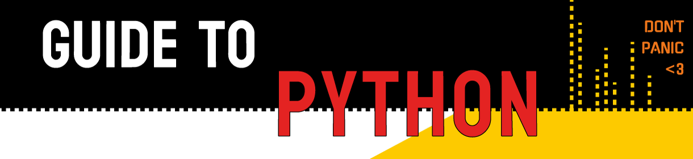
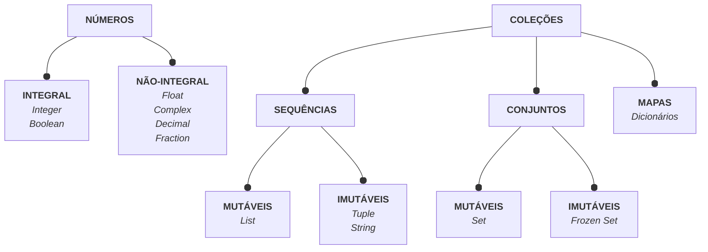

#

||
|---|
||
||

## HIERARQUIA DE TIPOS

```mermaid
flowchart TB
        NUM@{ shape: rect, label: "**NÚMEROS**"}
    INT@{ shape: rect, label: "**INTEGRAL**\n*Integer*\n*Boolean*"}
    NINT@{ shape: rect, label: "**NÃO-INTEGRAL**\n*Float*\n*Complex*\n*Decimal*\n*Fraction*"}
    NUM --o INT & NINT
    COL@{ shape: rect, label: "**COLEÇÕES**"}
    SEQ@{ shape: rect, label: "**SEQUÊNCIAS**"}
    SET@{ shape: rect, label: "**CONJUNTOS**"}
    MAP@{ shape: rect, label: "**MAPAS**\n*Dicionários*"}
    MUT@{ shape: rect, label: "**MUTÁVEIS**\n*List*"}
    IMUT@{ shape: rect, label: "**IMUTÁVEIS**\n*Tuple*\n*String*"}
    MUT2@{ shape: rect, label: "**MUTÁVEIS**\n*Set*"}
    IMUT2@{ shape: rect, label: "**IMUTÁVEIS**\n*Frozen Set*"}
    COL --o SEQ & SET & MAP
    SEQ --o MUT & IMUT
    SET --o MUT2 & IMUT2
```
