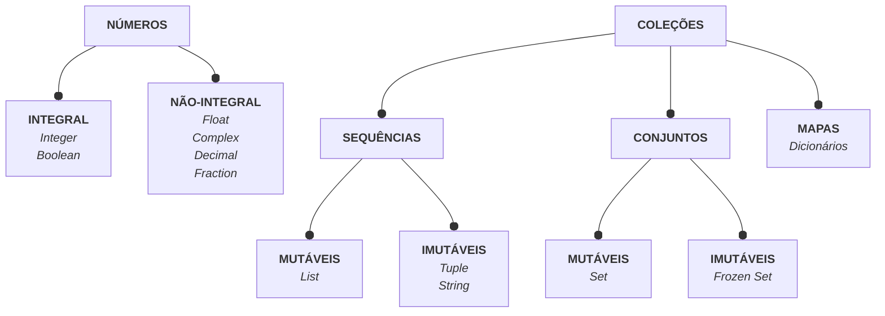
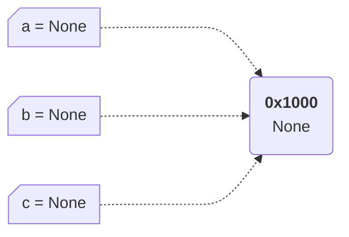
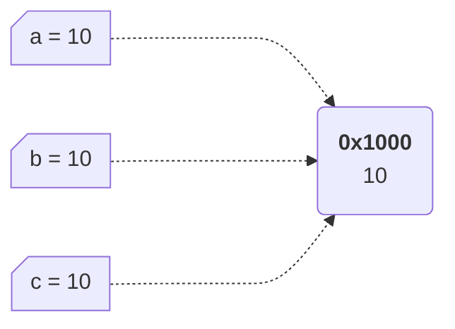

#

||
|---|
||
||

## HIERARQUIA DE TIPOS



## COLEÇÕES E INTENÇÕES

A escolha de uma coleção, por si só, já é um tipo de comunicação sobre a intenção de utilização, a seguir o comportamento esperado para algumas coleções (VIAFORE, 2021, p. 13):

> ***Iterable**: objeto capaz de retornar valores, um por vez.*

- **List**: coleção para ser iterada, mutável, contém duplicação.
  - Raramente se espera recuperar um valor do meio da lista por meio de indexação.
- **String**: coleção imutável de caracteres.
- **Generator**: coleção para ser iterada e nunca indexada.
  - O acesso aos elementos é *lazy*, pode levar um tempo/recursos a cada iteração.
  - Ideal para coleções "infinitas" e/ou computacionalmente caras.
- **Tuple**: coleção imutável.
  - Comum de se recuperar elementos do meio da tupla, por meio de indexação ou *unpacking*.
  - Raramente usada para iteração.
- **Set**: coleção para ser iterada, não contém duplicação.
  - Não é possível depender da ordenação dos elementos.
- **Dictionary**: coleção-mapa de chaves únicas para valores.
  - Geralmente usado para iteração, ou indexação utilizando chaves dinâmicas.

> *Sets e dicionários são basicamente **hashmaps**.*

## CONVENÇÃO DE NOMES

- `_uma_variavel` uso interno, protegido ou objetos privados. Objetos nomeados desta maneira não serão importados por declarações tais quais `from module import *`.

- `__uma_variavel` usada para *name-mangling*, processo em que Python altera o nome da variável para incluir o nome da classe, tornando difícil de acessar ou sobrescrever acidentalmente; por conseguinte, torna a variável ***mais privada*** que o uso de só um underscore. É utilizado para evitar conflito de nomes em subclasses.
  - ex: `_ClassName__uma_variavel`

- `__uma_variavel__` usada para nomes definidos pelo sistema que possuem um significado particular para o interpretador.

---
  
- **pacotes | *packages*** : nomes curtos, só minúsculas; de preferência, sem underscores `_` .
  - `utilities`
- **módulos | *modules*** : nomes curtos, só minúsculas; podem conter underscores `_` .
  - `db_utils` | `dbutils`
- **classes | *classes*** : palavras iniciadas com maiúscula (*upper camel case*).
  - `NomeDeClasse`
- **funções | *functions*** : minúsculas, palavras separadas por underscores `_` (*snake case*).
  - `uma_funcao`
- **variáveis | *variables*** : minúsculas, palavras separadas por underscores `_` (*snake case*).
  - `uma_variavel`
- **constantes | *constants*** : somente maiúsculas, palavras separadas por underscores `_` .
  - `UMA_CONSTANTE`

## IGUALDADE DE VARIÁVEIS

||||
|:---:|:---:|:---:|
|---|**Endereço de Memória**|**Estado do Objeto (*data*)**|
|---| ***Operador de Identidade***|***Operador de Igualdade***|
|Asserção|**is**|**==**|
|Negação|**is not**|**!=**|
||||

## O OBJETO NONE

`None` é utilizado para representar um objeto "vazio" ou *null pointer*, indicando que uma variável não está declarada com conteúdo algum.

No entanto, `None` é um objeto e possui endereço de memória, controlado pelo gerenciador de memória.

Além disso, o gerenciados designa referências compartilhadas (*shared references*) para todas as variáveis que referenciam `None`.



Portanto, para testar se uma variável não foi declarada ou está "vazia", pode-se utilizar o ***operador de identidade***.

```python
  a is None
  >> True
```

## INTERNING

***Interning*** é o processo de reutilização de objetos sob demanda.

### INTEGERS

Durante a inicialização, Python *(CPython)* pré-carrega (faz ***cache***) de uma lista global de integers no intervalo `[-5, 256]`.

Sempre que um `integer` neste intervalo é referenciado, Python utiliza a versão cacheada do objeto --> **Shared Reference**.

> ***Integers** e **Strings** são da classe **singleton**, uma classe que só pode ser instanciada uma única vez.*



> *Esta é uma estratégia de **otimização** para integers pequenos que tendem a ocorrer com frequência.  
> Essa otimização depende tanto da implementação quanto da versão de Python.*

### STRINGS

Algumas strings podem passar pelo processo de **interning** na seguinte condição:

- strings que se parecem com identificadores (seguem as convenções de nomes)
  - às vezes, mesmo começando com um dígito, pode ser internalizada

Esse processo é um otimizador de **velocidade** (e **memória**): internamente, existe uma alta frequência de testes de igualdade e *lookups* em `strings`.

```python
  a = "uma_string_bastante_longa_mais um_pouco_de_texto"
  b = "uma_string_bastante_longa_mais um_pouco_de_texto"

  # comparação caractere a caractere | LENTO
  a == b
  # comparação por endereço de memória (shared reference) | VELOZ
  a is b
```

> É muito mais rápido comparar strings por endereço de memória do que caractere por caractere.**

---
**Forçando *String Interning***

Não é recomendado, mas para casos muito específicos é possível forçar o ***interning*** de *strings* com o método `sys.intern()`.

```python
  import sys

  a = sys.intern("string frequentemente acessada")
  b = sys.intern("string frequentemente acessada")

  # a is b
  # >> True
  # Muito mais rápido que:
  #  a == b
  # >> True
```

Nota-se que para cada repetição em uma variável, o método deve ser invocado.

Exemplos de utilização:

- tratamento de alto volume de *strings* com alta frequência de repetição
- alta frequência de comparação entre *strings*

### CONTAGEM DE REFERÊNCIAS: REFERENCE COUNT

Com o método `getrefcount()` é possível contabilizar quantas variáveis estão referenciando determinado endereço de memória.

```python
  import sys

  # retorna uma referência extra
  sys.getrefcount(uma_variavel) -> int
```

> *A própria chamada do método já é contabilizada como uma referência!*  
> *Portanto, para contabilizar somente variáveis já existentes, é preciso subtrair 1.*

Para contornar esse comportamento, pode-se utilizar o método `from_address()`, ao importar a biblioteca `ctypes` e a classe `c_long`.

```python
  import ctypes

  # não adiciona uma referência extra
  ctypes.c_long.address(endereco: int).value -> int
```

Neste caso, é preciso passar o endereço da variável, pode-se obtê-lo com `id(uma_variavel)`.

## TYPE ANNOTATIONS

Anotações de tipos são um incremento na sintaxe para notificar o usuário do tipo esperado para as variáveis. São consideradas *type hints*, dicas para o leitor, mas não são realmente usadas pelo Python em tempo de execução.

> *Servem como um meio de comunicação, tornando seu ambiente mais inteligente e detectam erros quando combinadas com **typecheckers**. Protegem a intenção do autor original. Ao anotar tipos, você diminui o fardo de um leitor ao tentar compreender seu código. Você diminui a necessidade de implementar uma função para saber o que ela faz. Código é complicado, você deveria minimizar o quanto um programador precisa ler. Ao utilizar tipos bem-planejados, você reduz surpresas e aumenta a compreensão de leitura.* (VIAFORE, 2021, p. 44)

```python
  # função que recebe uma lista de integers e retorna um integer
  def funcao(param: list[int]) -> int
```

**Benefícios Adicionais**

- **Autocomplete** : com anotações de tipo, muitas IDEs irão detectar e autocompletar as operações em variáveis de acordo com o tipo especificado.

- **Typecheckers** : são ferramentas de análise estática de tipos, que executam no código-fonte, e não impactam o tempo de execução (*runtime*). Em alguns ambientes de desenvolvimento, ainda é possível detectar erros durante a digitação do código.

```python
  !pip install mypy

  # é preciso executar mypy no arquivo
  mypy arquivo_para_testar.py
```

### RESTRIÇÕES DE TIPOS

Uma forma de restringir a criação ou utilização de tipos que são contraditórios ou inválidos em seu sistema. 

As anotações a seguir estão disponíveis na biblioteca `typing` :

#### OPTIONAL
  
Substitui referências *default* a `None`; indica que uma variável pode assumir este valor e deve ser tratada preventivamente.  
  
  ```python
    # pode acontecer de não existir uma resposta de retorno, resultando em None
    def funcao_de_respostas(pergunta: str) -> Optional[str]
  ```

  > *Visto que qualquer valor pode tornar-se `None` em Python, pode parecer que você deve assumir uma programação defensiva e usar uma checagem `is None` em toda dereferência. [...] E aqui mora o problema: contar com intervenções manuais para capturar erros não é confiável.* (VIAFORE, 2021, p. 48)

  A ocorrência de valores `None`, sem tratamento, podem causar a quebra de programas, porém, com o uso de `Optional` existe a comunicação de `None` potenciais, e o benefício de checagem automática com *typecheckers*.

#### UNION

Apresenta uma seleção de tipos, indicando que uma variável pode assumir uma variedade de tipos diferentes.

```python
  # a função indica que a resposta pode ser uma string ou um integer
  def funcao_de_respostas(pergunta: str) -> Union[str, int]
```

#### LITERAL

Restringe programadores a tipos específicos

#### ANNOTATED

Apresentar descrições adicionais aos tipos

#### NEWTYPE

Restringe um tipo a um contexto específico

#### FINAL

Previne que variáveis obtenham novos valores

## BIBLIOGRAFIA

VIAFORE, Patrick. **Robust Python: Write Clean and Maintainable Code**. Sebastopol: O'Reilly, 2021.
