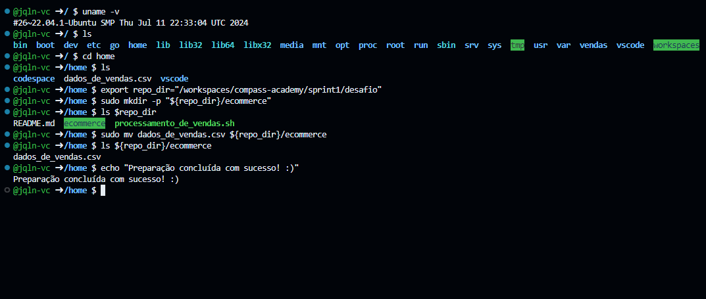
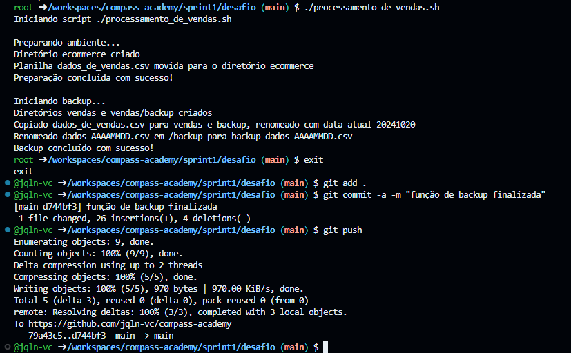
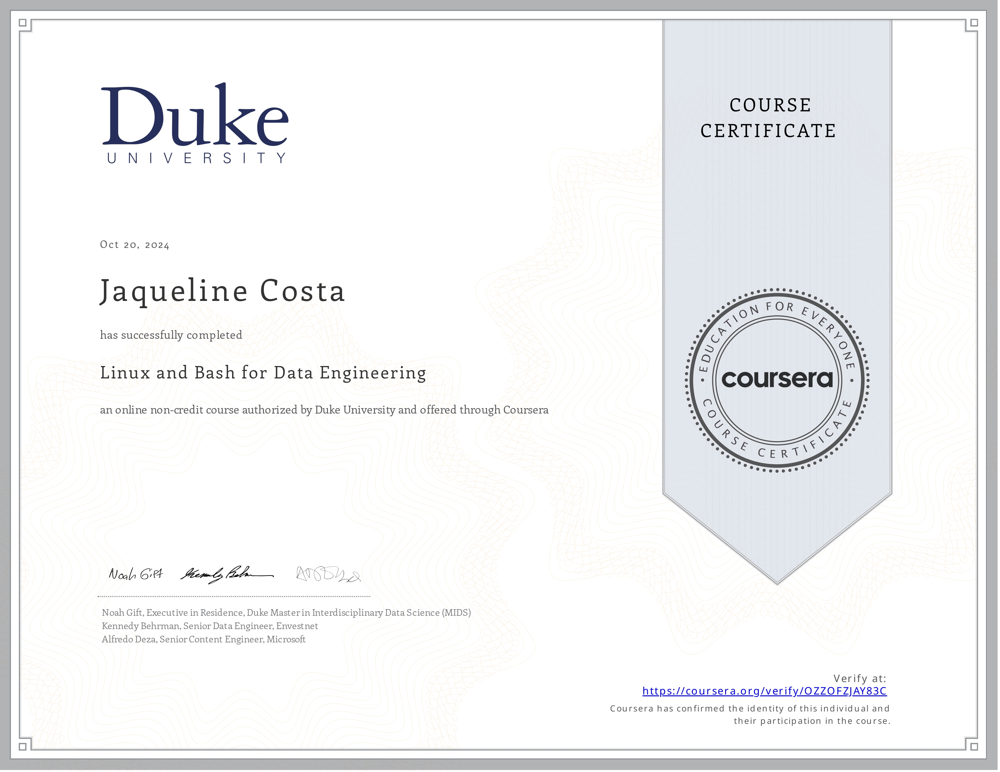
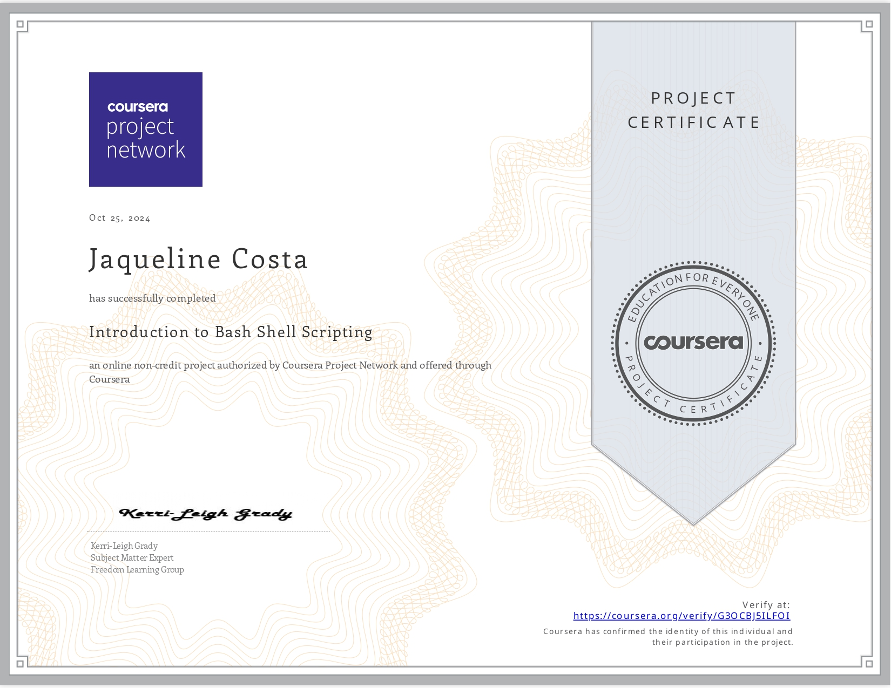

#

||
|---|
||
||

## RELATOS DE APRENDIZADO

### Linux

Apesar de ter o Ubuntu instalado em meu PC pessoal, para tentar me habituar ao sistema por coerção, antes da sprint, eu tinha pouca familiaridade e um certo desconforto com o terminal.

Hoje, após experienciar o poder dos scripts e desmistificar o uso do terminal (não é tão difícil quanto parece!), sinto prazer em utilizá-lo, e tenho confiança em escrever rotinas mais básicas, me localizar no Linux, debuggar meus scripts ou buscar referências para a solução de problemas.

Tenho interesse em continuar me aprofundando em Bash e melhorar meus códigos e habilidades com a linha de comando, interiorizando boas práticas e praticando com a automação de processos.  

  
Repositório pessoal, onde comecei a compilar minhas práticas a partir de referências diversas.

---

### Git & GitHub

Antes da sprint, já utilizava Git e GitHub na minha rotina pessoal, portanto conhecia comandos básicos de envio e recebimento de alterações entre o repositório local e o remoto.

Agora tenho um entendimento mais aprofundado do versionamento com uso de ramificações, checkpoints e anotações semânticas, abordagens essenciais para o desenvolvimento em grupo.

No entanto, sinto que ainda preciso melhorar minha organização com o uso dos meus commits, e adotar o uso de branches, merges e técnicas de comparação e resolução de conflitos entre versões para desenvolver minha confiança.

## DESAFIO

* [preparacao_ecommerce.sh](./desafio/preparacao_ecommerce.sh): script que cria o diretório `ecommerce`, localiza o arquivo `dados_de_vendas.csv` e o move para `ecommerce`
* [processamento_de_vendas.sh](./desafio/processamento_de_vendas.sh): script de tarefas de backup e geração de relatórios, possui as funções:
  * **vendas_backup**: criação dos diretórios `vendas` e `vendas/backup`, faz cópia de backup e nomeia os arquivos com data atual
  * **relatorio**: geração de relatórios
  * **compressao**: compressão de arquivo de backup
  * **limpeza_arquivos**: remoção de arquivos já processados
* [consolidador_de_processamento_de_vendas.sh](./desafio/consolidador_de_processamento_de_vendas.sh): script que consolida todos os relatórios gerados em um único relatório

## EVIDÊNCIAS

Na pasta `evidencias`, encontram-se prints referentes a momentos de execução do código, exemplificando abordagens adotadas para a conclusão do desafio.  
No passo a passo explicativo, encontrado na pasta `desafio`, serão comentados outros prints de pontos específicos.

### Etapa de Preparação em Ambiente Linux

Demonstração do ambiente utilizado, com o sistema Ubuntu. Na imagem abaixo, está sendo executada a preparação do ambiente `ecommerce`.

### Fluxo de Atualizações de Código com Git

Demonstração das aplicações de versionamento de código aplicadas no projeto desta sprint. Na imagem abaixo, após o teste, foi feito o commit + push da versão do código com a função `vendas_backup` finalizada.

## CERTIFICADOS COMPLEMENTARES

Para absorver melhor o conteúdo desta sprint e me aprofundar em pontos de interesse, concluí em paralelo os cursos abaixo, externos à Udemy.

### Linux and Bash for Data Engineering

*Ministrado por Noah Gift, Alfredo Deza e Kennedy Behrman @ Coursera*

| |
|---|
||
||

### Introduction to Bash Shell Scripting

*Ministrado por Kerri-Leigh Grady @ Coursera Project Network*

| |
|---|
||
||

## BIBLIOGRAFIA

ALBING, Carl; VOSSEN, JP. **Bash Idioms: Write Powerful, Flexible, Readable Shell Scripts**. Sebastopol: O’Reilly, 2022.

BARRETT, Daniel. **Efficient Linux at the Command Line.** Sebastopol: O’Reilly, 2022.
