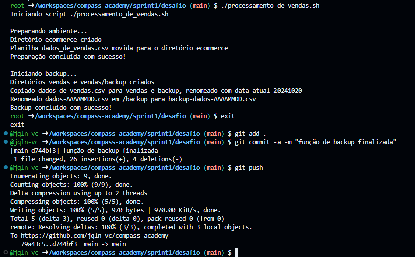
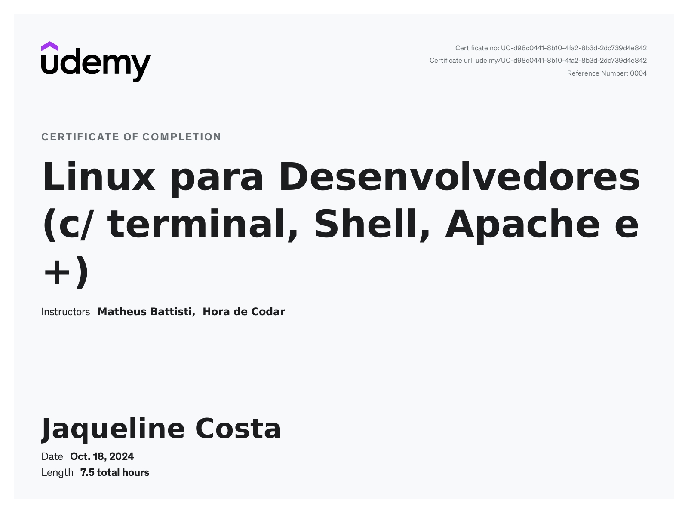
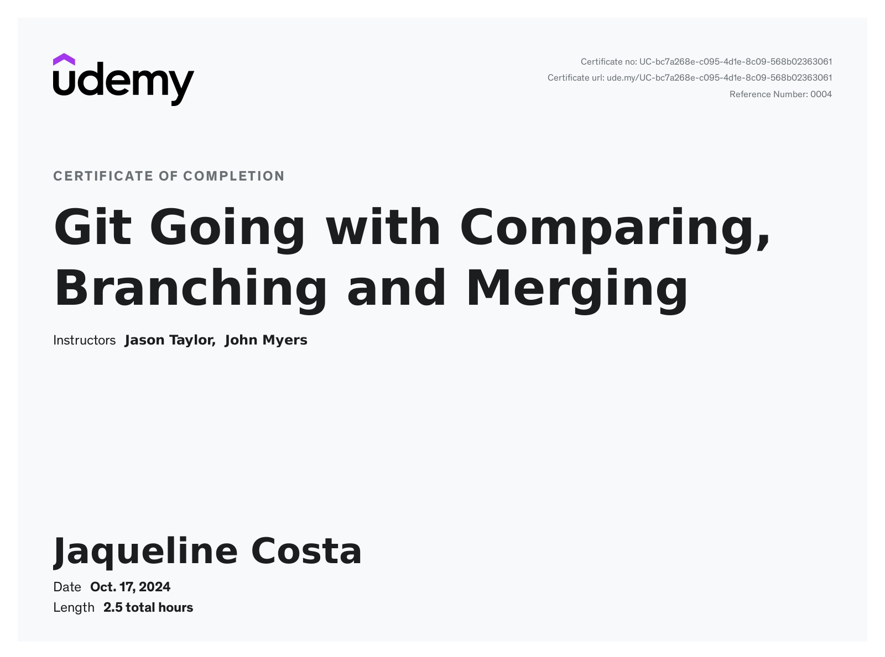
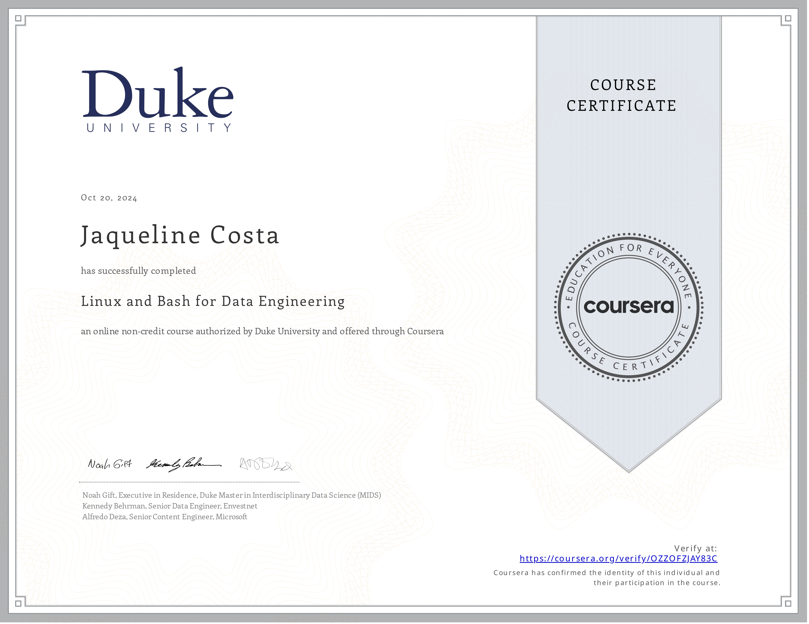

#

||
|---|
||
||

## RELATOS DE APRENDIZADO

| | | |
|:---|---|---:|
|**LINUX**|**NOTAS DE ESTUDO**||
| | | |

| | | |
|:---|---|---:|
|**GIT & GITHUB**|**NOTAS DE ESTUDO**||
| | | |

## DESAFIO

## EVIDÊNCIAS

Na pasta `evidencias`, encontram-se prints referentes a momentos de execução do código, exemplificando abordagens adotas para a conclusão do desafio.  
No passo a passo explicativo, encontrado na pasta `desafio`, serão comentados outros print de pontos específicos.

### Etapa de Preparação em Ambiente Linux

### Fluxo de Atualizações de Código com Git

## CERTIFICADOS

### Linux para Desenvolvedores (c/ Terminal, Shell, Apache e +)

*Ministrado por Matheus Battisti @ Udemy*

| |
|---|
||
||

### Git e GitHub do Básico ao Avançado (c/ Gist e GitHub Pages)

*Ministrado por Matheus Battisti @ Udemy*

| |
|---|
||
||

## CERTIFICADOS COMPLEMENTARES

Para absorver melhor o conteúdo desta sprint e me aprofundar em pontos de interesse, concluí em paralelo os cursos abaixo.

### Git Going with Comparing, Branching and Merging

*Ministrado por Jason Taylor e John Myers @ Udemy*

| |
|---|
||
||

### Linux and Bash for Data Engineering

*Ministrado por Noah Gift, Alfredo Deza e Kennedy Behrman @ Coursera*

| |
|---|
||
||

### Shell Scripting: Discover How to Automate Command Line Tasks

*Ministrado por Jason Cannon @ Udemy*

| |
|---|
||
||