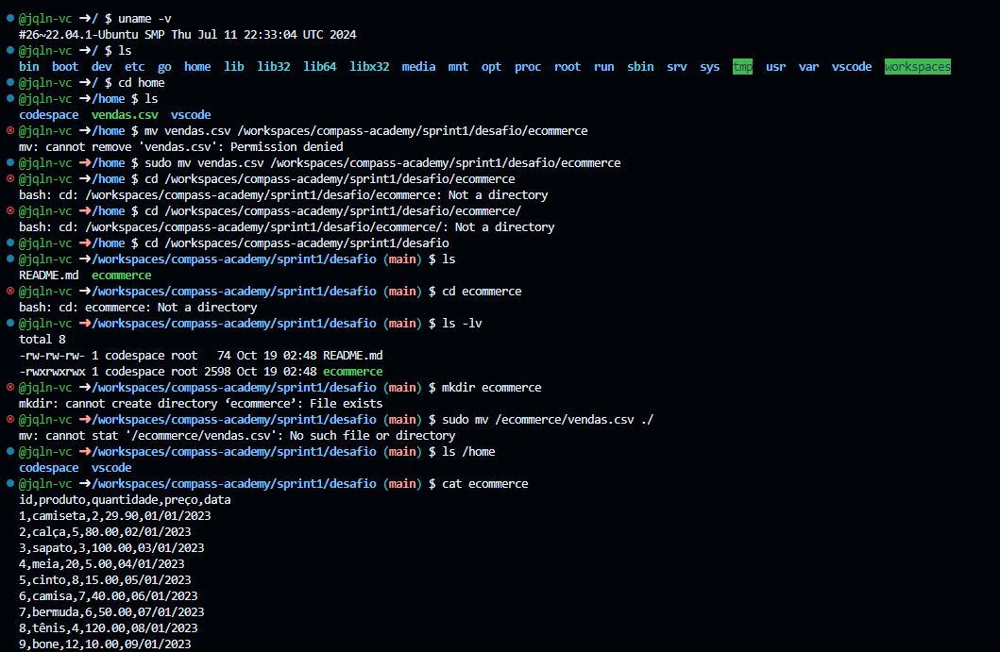

#

||
|---|
||
||

## ETAPAS

### PREPARAÇÃO

Download do arquivo `vendas.csv` realizado na pasta `/home`, criação da pasta `ecommerce` e envio do arquivo para lá.


Verifica-se na imagem que tive alguns problemas iniciais, relacionados a  

* **permissão de acesso:** *solucionada utilizando o comando `sudo` na linha abaixo*

```bash
sudo mv vendas.csv /workspaces/compass-academy/sprint1/desafio/ecommerce
```

* **uso incorreto do comando `mv` :** em vez de criar a pasta no caminho acima, movi o arquivo `vendas.csv` para a pasta `desafio` e renomeei o arquivo para `ecommerce`. :clown_face:  

   Percebi que tinha errado, e que `ecommerce` não era um diretório, tanto com as mensagens de erro quanto com a verificação das permissões do arquivo `-rwxrwxrwx`, mas ainda não tinha entendido o ocorrido, até fui verificar se `vendas.csv` tinha sido realmente movido da pasta `/home`. 😢

> [!NOTE]
> Sei que não é uma boa prática habilitar todas as permissões para todos, porém, como estou em ambiente virtual, só quis me certificar de que teria o acesso.

   Após refletir um pouco, entendi que `ecommerce` era a planilha de vendas ao rodar o comando abaixo: 🤔

   ```bash
   cat ecommerce
   ```

   *Resolvi o problema renomeando o arquivo para `vendas.csv` novamente (para não dar conflito), criando a pasta `ecommerce` e, então, movendo corretamente.* 🎆

   ```bash
   mv ecommerce vendas.csv
   mkdir ecommerce
   mv -v vendas.csv ecommerce
   ```


