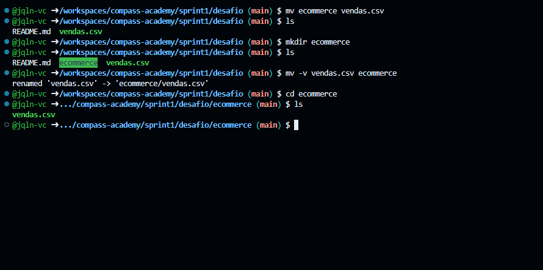

#

||
|---|
||
||

## ETAPAS

### PREPARAÇÃO

Em ambiente Linux Ubuntu, foi realizado o download do arquivo `dados_de_vendas.csv` na pasta `/home`, a criação da pasta `ecommerce` e envio do arquivo para lá.

> [!NOTE]
> A pasta `ecommerce` foi criada diretamente no repositório da trilha de aprendizado, já trackeada pelo Git, na subpasta `desafio`. No momento da execução da preparação do print abaixo, já haviam sido criados alguns arquivos.


Como o caminho completo até para a criação da pasta `ecommerce` é longo, e ele seria utilizado algumas vezes, foi criada uma variável para facilitar o processo.

```bash
export repo_dir="/workspaces/compass-academy/sprint1/desafio"
```

<--  -->

## REFERÊNCIAS
