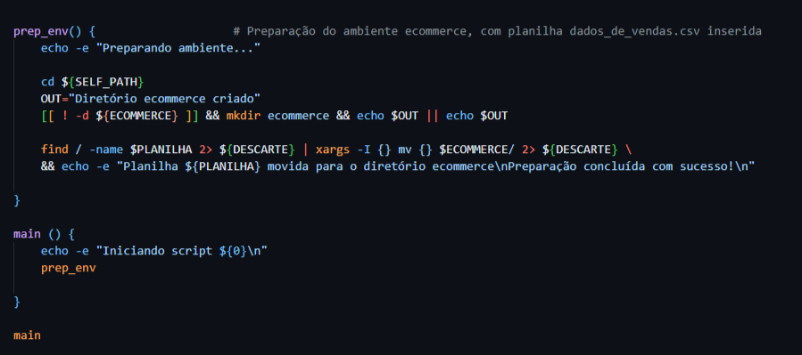
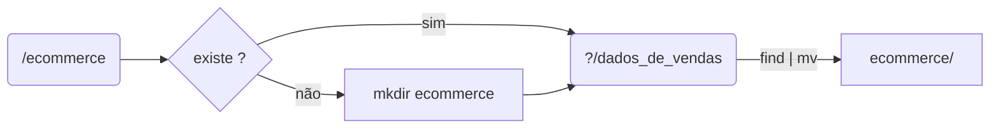
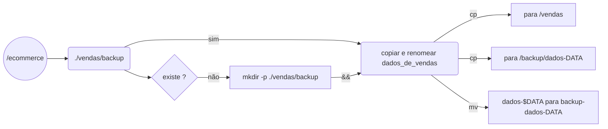
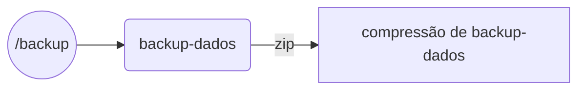
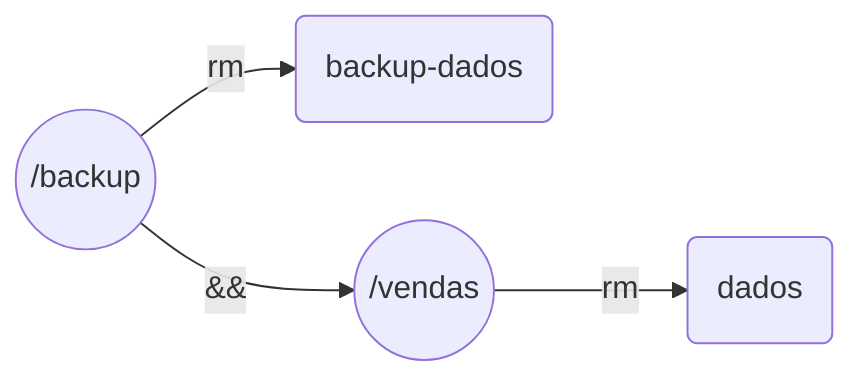
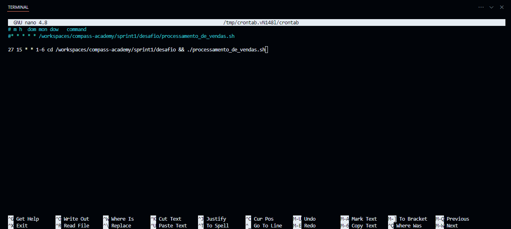
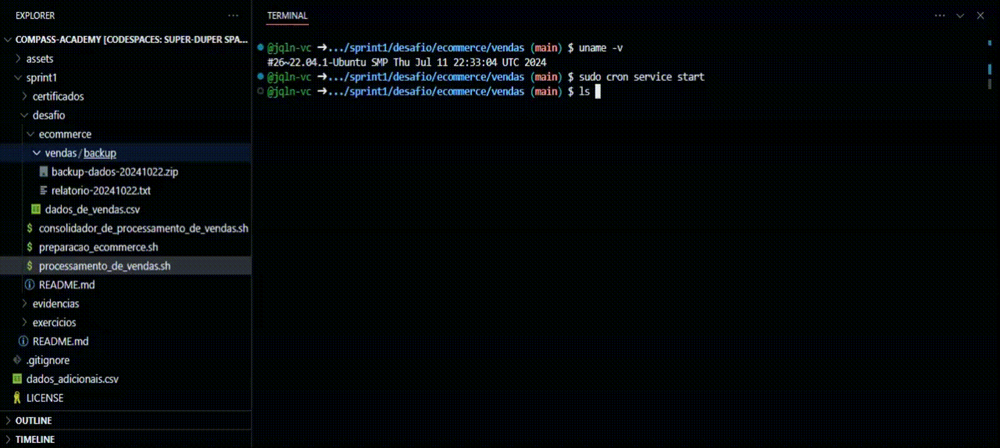
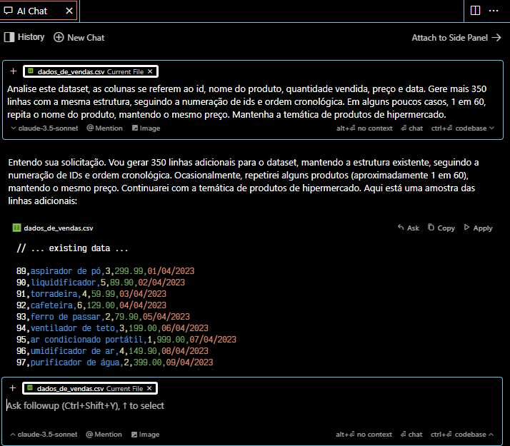

#

||
|---|
||
||

Para embasar algumas motivações no desenlvovimento do desafio, quando oportuno, serão trazidas referências da literatura; citações indicadas na seção [REFERÊNCIAS](https://github.com/jqln-vc/compass-academy/blob/main/sprint1/desafio/README.md#refer%C3%AAncias), e publicações indicadas na seção [BIBLIOGRAFIA](https://github.com/jqln-vc/compass-academy/blob/main/sprint1/README.md#bibliografia) no diretório `sprint1`.  

## PREPARAÇÃO DO AMBIENTE ECOMMERCE

Em ambiente Linux Ubuntu, foi realizado o download do arquivo `dados_de_vendas.csv` na pasta `/home`, a criação da pasta `ecommerce` e envio do arquivo para lá.

> [!NOTE]
> A pasta `ecommerce` foi criada diretamente no repositório da trilha de aprendizado, já trackeada pelo Git, na subpasta `desafio`. No momento da execução da preparação do print abaixo, já haviam sido criados alguns arquivos.

| |
|---|
||
| |

Como o caminho completo até para a criação da pasta `ecommerce` é longo, e ele seria utilizado algumas vezes, foi criada uma variável para facilitar o processo.

```bash
export repo_dir="/workspaces/compass-academy/sprint1/desafio"
```

Abaixo os comandos para criação da pasta `ecommerce` e movimentação da planilha para lá.

```bash
# uso de sudo para evitar quaisquer erros de permissão relacionados a outros (sub)diretórios
sudo mkdir -p "${repo_dir}/ecommerce"
sudo mv dados_de_vendas.csv ${repo_dir}/ecommerce
```

### BÔNUS: preparacao_ecommerce.sh

Complementarmente, foi feita a automatização do procedimento acima no script `preparacao_ecommerce.sh`.

| |
|---|
||
| |

#### FLUXO DE LÓGICA

[//]: # (Caso não possua suporte para mermaid, sugiro abrir no site do GitHub para visuzalizar o grafo a seguir ou instalar extensão compatível)



## PROCESSAMENTO DE VENDAS

A seguir serão comentadas as funções do script `processamento_de_vendas.sh`.

### FUNÇÃO vendas_backup

#### FLUXO DE LÓGICA

[//]: # (Caso não possua suporte para mermaid, sugiro abrir no site do GitHub para visuzalizar o grafo a seguir ou instalar extensão compatível)



### FUNÇÃO relatorio

#### FLUXO DE LÓGICA

[//]: # (Caso não possua suporte para mermaid, sugiro abrir no site do GitHub para visuzalizar o grafo a seguir ou instalar extensão compatível)


### FUNÇÃO compressao

#### FLUXO DE LÓGICA

[//]: # (Caso não possua suporte para mermaid, sugiro abrir no site do GitHub para visuzalizar o grafo a seguir ou instalar extensão compatível)



### FUNÇÃO limpeza_arquivos

#### FLUXO DE LÓGICA

[//]: # (Caso não possua suporte para mermaid, sugiro abrir no site do GitHub para visuzalizar o grafo a seguir ou instalar extensão compatível)



## AGENDAMENTO DE ROTINAS: CRONTAB

O agendamento da rotina de execução do script de processamento foi feito por meio do programa `crontab`, com a configuração do arquivo feita com o editor de texto Nano.

| |
|---|
||
| |

> [!NOTE]
> O script foi executado nos dias 22, 24, 25 e 26 de outubro. No dia 23, não foi possível executá-lo por motivos de força maior (desatenção ao estar em horário de reunião), portanto, o agendamento abrange os dias necessários para geração dos 4 relatórios.

Antes de utilizar o programa, foi necessário fazer sua instalação e alterar o horário do sistema, que estava com o fuso UTC. Abaixo os comandos utilizados no terminal para esta etapa.

```bash
# Configuração do fuso horário do sistema
sudo ln -sf /usr/share/zoneinfo/America/Sao_Paulo /etc/localtime

# Configuração dos agendamento, abre o editor de texto
crontab -e

# Ativação do programa
sudo cron service start
```

### EXECUÇÃO DE CRON JOB

---



---

## GERAÇÃO DE DATASET PARA RELATÓRIOS SUBSQUENTES

Segue abaixo o prompt utilizado com o modelo Claude 3.5 Sonnet para gerar linhas adicionais, buscando manter a sequência de ids e ordem cronológica, produtos dentro da mesma temática e repetições ocasionais de itens, para testar a função `relatorio` nestas situações.

---

| |
|---|
||
| |

---

## METODOLOGIA UTILIZADA

Os scripts foram desenvolvidos priorizando a modularização dos processos em funções, adotando boas práticas de documentação, legibilidade, reusabilidade e tratamento de erros.

### CABEÇALHO E SECCIONAMENTO

> Para a organização e legibilidade do código, quebre ações em seções.[^1]

### CONTROLE DE FLUXO

Para os controles de fluxo, foi priorizada a escrita simplificada, sem a utilização explícita de `if` e `then`, para otimizar a legilibilidade do código.

IMAGEM DE IFS

> *[...] para situações de teste e checagem de ações simples, usar **&&** e **||** pode ser muito conveniente e não desviará a atenção do fluxo de lógica principal.*[^2]

Ademais, o encadeamento lógico de comandos com `&&` assegura a **atomicidade** das execuções, ou seja, ou todos os comandos de determinado bloco lógico são executados em conjunto, ou nenhum será. Já a utilização de quebras de linha com `\` é uma adoção inspirada em estilos utilizados atualmente pela comunidade.

### TRATATIVAS DE ERRO

IMAGEM DE STERR

> *Mensagens de erro devem ir para STDERR, como echo "Algo ruim aconteceu" 1>&2.*[^3]

Nos comandos que poderiam gerar erros potenciais, foi feita a trativa com a abordagem a seguir:

```bash
DESCARTE="/dev/null"
2> $DESCARTE
```

## MELHORIAS A FAZER

- [x] **Remover dependência dos scripts ao caminho absoluto do ambiente virtual de execução**  
Devido à execução do crontab a partir da raíz, inicialmente foram utilizados caminhos absolutos para contornar criações errôneas de pastas e arquivos durante os cron jobs.  
Com uma alteração no agendamento no cron, foi possível adotar o caminho `SELF_PATH` partindo do diretório atual, assegurando assim a portabilidade do código.

```bash
    # agendamento no crontab
    27 15 * * * 1-6 cd /workspaces/compass-academy/sprint1/desafio && ./processamento_de_vendas.sh

    # declaração de variável global de caminho
    SELF_PATH=$(pwd)
```

- [ ] **Adicionar função que recebe argumento `help` para printar instruções de utilização da funções do(s) script(s)**.

- [ ] **Receber nome da planilha de vendas (ex. "dados_de_vendas.csv") como argumento na linha de comando.**

- [ ] **Execução de funções separadamente a partir de chamada por argumento na linha de comando.**

---

## REFERÊNCIAS

[^1]: ALBING, VOSSEN, 2022, p. 27  
[^2]: Ibid., p. 7  
[^3]: Ibid., p. 132
