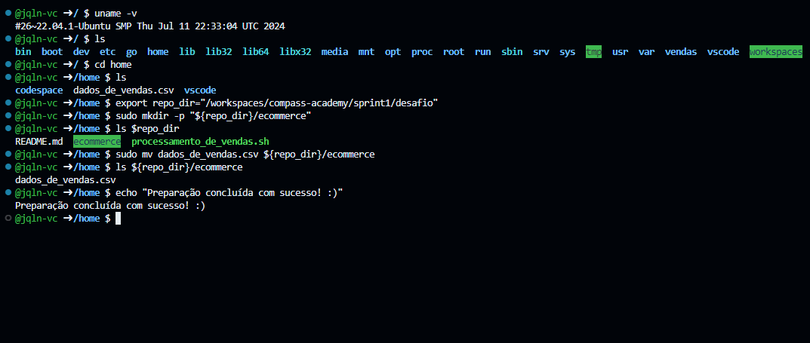

#

||
|---|
||
||

Para embasar algumas motivações no desenlvovimento do desafio, quando oportuno, serão trazidas referências da literatura; citações indicadas na seção REFERÊNCIAS, e publicações indicadas na seção BIBLIOGRAFIA do diretório `sprint1`.  

## PREPARAÇÃO

Em ambiente Linux Ubuntu, foi realizado o download do arquivo `dados_de_vendas.csv` na pasta `/home`, a criação da pasta `ecommerce` e envio do arquivo para lá.

> [!NOTE]
> A pasta `ecommerce` foi criada diretamente no repositório da trilha de aprendizado, já trackeada pelo Git, na subpasta `desafio`. No momento da execução da preparação do print abaixo, já haviam sido criados alguns arquivos.



Como o caminho completo até para a criação da pasta `ecommerce` é longo, e ele seria utilizado algumas vezes, foi criada uma variável para facilitar o processo.

```bash
export repo_dir="/workspaces/compass-academy/sprint1/desafio"
```

Abaixo os comandos para criação da pasta `ecommerce` e movimentação da planilha para lá.

```bash
# uso de sudo para evitar quaisquer erros de permissão relacionados a outros (sub)diretórios
sudo mkdir -p "${repo_dir}/ecommerce"
sudo mv dados_de_vendas.csv ${repo_dir}/ecommerce
```

## COMENTÁRIOS DE SCRIPTS

Os scripts foram desenvolvidos priorizando a modularização dos processos em funções, adotando boas práticas para documentação, legibilidade, reusabilidade e tratamento de erros.

### Controle de Fluxo

Para os controles de fluxo, foi priorizada a escrita simplificada, sem a utilização explícita de `if` e `then`, para otimizar a legilibilidade do código.

IMAGEM DE IFS

> *[...] para situações de teste e checagem de ações simples, usar **&&** e **||** pode ser muito conveniente e não desviará a atenção do fluxo de lógica principal.*[^X]

O encadeamento lógico de comandos com `&&` assegura a **atomicidade** das execuções, e a utilização de quebras de linha com `\` é uma adoção inspirada em estilos utilizados atualmente pela comunidade.

## REFERÊNCIAS

[^X] ALBING, VOSSEN, 2022, p. 7
