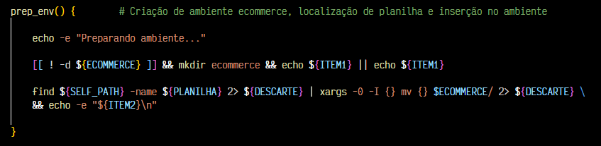
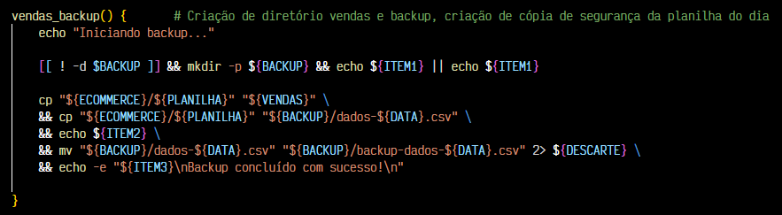
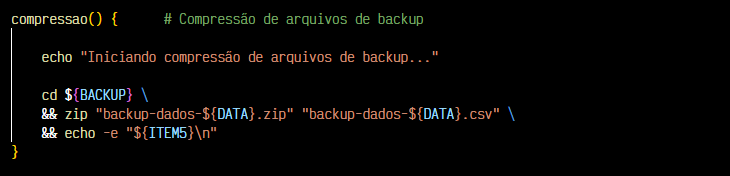
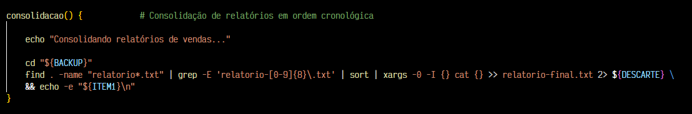
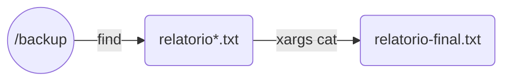
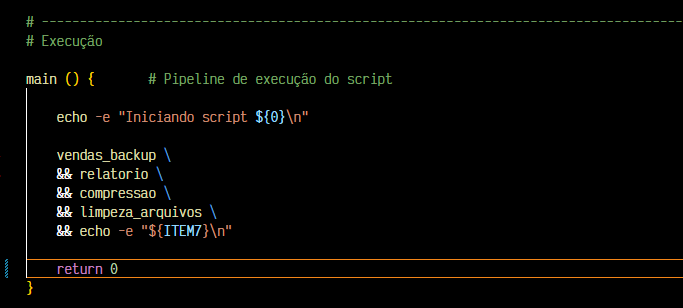

#

||
|---|
||
||

## SEÇÕES

-  **Preparação do Ambiente Ecommerce** [֍](https://github.com/jqln-vc/compass-academy/blob/main/sprint1/desafio/README.md#prepara%C3%A7%C3%A3o-do-ambiente-ecommerce)
    - Bônus: preparacao_ecommerce.sh [֍](https://github.com/jqln-vc/compass-academy/blob/main/sprint1/desafio/README.md#b%C3%B4nus-preparacao_ecommercesh)
        - Fluxo de Lógica: preparacao_ecommerce [֍](https://github.com/jqln-vc/compass-academy/blob/main/sprint1/desafio/README.md#fluxo-de-l%C3%B3gica)
- **Processamento de Vendas** [֍](https://github.com/jqln-vc/compass-academy/blob/main/sprint1/desafio/README.md#processamento-de-vendas)
    - Função: vendas_backup [֍](https://github.com/jqln-vc/compass-academy/blob/main/sprint1/desafio/README.md#fun%C3%A7%C3%A3o-vendas_backup)
        - Fluxo de Lógica: vendas_backup [֍](https://github.com/jqln-vc/compass-academy/blob/main/sprint1/desafio/README.md#fluxo-de-l%C3%B3gica-1)
    - Função: relatorio [֍](https://github.com/jqln-vc/compass-academy/blob/main/sprint1/desafio/README.md#fun%C3%A7%C3%A3o-relatorio)
        - Fluxo de Lógica: relatorio [֍](https://github.com/jqln-vc/compass-academy/blob/main/sprint1/desafio/README.md#fluxo-de-l%C3%B3gica-2)
    - Função: compressao [֍](https://github.com/jqln-vc/compass-academy/blob/main/sprint1/desafio/README.md#fun%C3%A7%C3%A3o-compressao)
        - Fluxo de Lógica: compressao [֍](https://github.com/jqln-vc/compass-academy/blob/main/sprint1/desafio/README.md#fluxo-de-l%C3%B3gica-3)
    - Função: limpeza_arquivos [֍](https://github.com/jqln-vc/compass-academy/blob/main/sprint1/desafio/README.md#fun%C3%A7%C3%A3o-limpeza_arquivos)
        - Fluxo de Lógica: limpeza_arquivos [֍](https://github.com/jqln-vc/compass-academy/blob/main/sprint1/desafio/README.md#fluxo-de-l%C3%B3gica-4)
- **Consolidação do Processamento de Vendas** [֍](https://github.com/jqln-vc/compass-academy/blob/main/sprint1/desafio/README.md#consolida%C3%A7%C3%A3o-do-processamento-de-vendas)
    - Função: consolidacao [֍](https://github.com/jqln-vc/compass-academy/blob/main/sprint1/desafio/README.md#fun%C3%A7%C3%A3o-consolidacao)
        - Fluxo de Lógica: consolidacao [֍](https://github.com/jqln-vc/compass-academy/blob/main/sprint1/desafio/README.md#fluxo-de-l%C3%B3gica-5)
        - Execução [֍](https://github.com/jqln-vc/compass-academy/blob/main/sprint1/desafio/README.md#execu%C3%A7%C3%A3o)
- **Agendamento de Rotinas: crontab** [֍](https://github.com/jqln-vc/compass-academy/blob/main/sprint1/desafio/README.md#agendamento-de-rotinas-crontab)
    - Execução de Cron Job [֍](https://github.com/jqln-vc/compass-academy/blob/main/sprint1/desafio/README.md#execu%C3%A7%C3%A3o-de-cron-job)
- **Geração de Dataset para Relatório Subsequentes** [֍](https://github.com/jqln-vc/compass-academy/blob/main/sprint1/desafio/README.md#gera%C3%A7%C3%A3o-de-dataset-para-relat%C3%B3rios-subsquentes)
- **Metologia Utilizada** [֍](https://github.com/jqln-vc/compass-academy/blob/main/sprint1/desafio/README.md#metodologia-utilizada)
    - Cabeçalho e Seccionamento [֍](https://github.com/jqln-vc/compass-academy/blob/main/sprint1/desafio/README.md#cabe%C3%A7alho-e-seccionamento)
    - Variáveis Semânticas [֍](https://github.com/jqln-vc/compass-academy/blob/main/sprint1/desafio/README.md#vari%C3%A1veis-sem%C3%A2nticas)
    - Controle de Fluxo [֍](https://github.com/jqln-vc/compass-academy/blob/main/sprint1/desafio/README.md#controle-de-fluxo)
    - Tratativas de Erro [֍](https://github.com/jqln-vc/compass-academy/blob/main/sprint1/desafio/README.md#tratativas-de-erro)
- **Melhorias a Implementar** [֍](https://github.com/jqln-vc/compass-academy/blob/main/sprint1/desafio/README.md#melhorias-a-implementar)
- **Referências** [֍](https://github.com/jqln-vc/compass-academy/blob/main/sprint1/desafio/README.md#refer%C3%AAncias)

---

## PREPARAÇÃO DO AMBIENTE ECOMMERCE

*Voltar para **Seções*** [֍](https://github.com/jqln-vc/compass-academy/blob/main/sprint1/desafio/README.md#se%C3%A7%C3%B5es)

Em ambiente Linux Ubuntu, foi realizado o download do arquivo `dados_de_vendas.csv` na pasta `/home`, a criação da pasta `ecommerce` e envio do arquivo para lá.

> :exclamation: A pasta `ecommerce` foi criada diretamente no repositório da trilha de aprendizado, já trackeada pelo Git, na subpasta `desafio`. No momento da execução da preparação do print abaixo, já haviam sido criados alguns arquivos.

| |
|---|
||
| |

Como o caminho completo até para a criação da pasta `ecommerce` é longo, e ele seria utilizado algumas vezes, foi criada uma variável para facilitar o processo.

```bash
    export repo_dir="/workspaces/compass-academy/sprint1/desafio"
```

Abaixo os comandos para criação da pasta `ecommerce` e movimentação da planilha para lá.

```bash
    # Uso de sudo para evitar quaisquer erros de permissão relacionados a outros (sub)diretórios.

    sudo mkdir -p "${repo_dir}/ecommerce"
    sudo mv dados_de_vendas.csv ${repo_dir}/ecommerce
```

### BÔNUS: preparacao_ecommerce.sh

*Voltar para **Seções*** [֍](https://github.com/jqln-vc/compass-academy/blob/main/sprint1/desafio/README.md#se%C3%A7%C3%B5es)

Complementarmente, foi feita a automatização do procedimento acima no script `preparacao_ecommerce.sh`.

| |
|---|
||
| |

Confirmação de existência da pasta /ecommerce, antes da sua criação, caso a pasta já exista, a mensagem de confirmação é printada.

```bash
    [[ ! -d ${ECOMMERCE} ]] && mkdir ecommerce && echo ${ITEM1} || echo ${ITEM1}
```

Localização da planilha a partir do repositório atual, o output é direcionado com `xargs` para o deslocamento do arquivo para `/ecommerce` com `mv`.

> *Ao combinar `find` e `xargs`, utilize `xargs -0` [...] para proteção contra caracteres especiais nas strings de input. [...] Normalmente, `xargs` espera que as strings de input sejam separadas por espaços em branco, como caracteres de nova linha. Este é um problema quando as strings de input contém espaços, como arquivos com espaços no nome.*[^1]

```bash
    # -0: muda os separadores de inputs, em vez de espaço, são utilizados valores null. Assim, um arquivo com espaço no nome não é tratado com 2 arquivos diferentes.
    # -I {}: controla onde o input será inserido no próximo comando, {} funciona como um placeholder (poderia ser qualquer string).

    find ${SELF_PATH} -name ${PLANILHA} 2> ${DESCARTE} | xargs -0 -I {} mv {} $ECOMMERCE/ 2> ${DESCARTE} \
    && echo -e "${ITEM2}\n" 
```

#### FLUXO DE LÓGICA: PREPARAÇÃO DE ECOMMERCE

*Voltar para **Seções*** [֍](https://github.com/jqln-vc/compass-academy/blob/main/sprint1/desafio/README.md#se%C3%A7%C3%B5es)

[//]: # (Caso não possua suporte para mermaid, sugiro abrir no site do GitHub para visualizar o grafo a seguir ou instalar extensão compatível)


## PROCESSAMENTO DE VENDAS

*Voltar para **Seções*** [֍](https://github.com/jqln-vc/compass-academy/blob/main/sprint1/desafio/README.md#se%C3%A7%C3%B5es)

A seguir serão comentadas as funções do script `processamento_de_vendas.sh`.

### FUNÇÃO vendas_backup

*Voltar para **Seções*** [֍](https://github.com/jqln-vc/compass-academy/blob/main/sprint1/desafio/README.md#se%C3%A7%C3%B5es)

A função cria as pastas `vendas` e `/vendas/backup` dentro da pasta `/ecommerce`. Após a criação, copia a planilha de vendas para essas pastas, renomeando aquela referente ao backup.

| |
|---|
||
| |

Verificação da existência da pasta `/backup`, antes da criação e confirmação. Caso já exista, a confirmação de criação é enviada, sem nenhuma alteração.

```bash
    # ! -d: retorna True se o diretório não existir.

    [[ ! -d $BACKUP ]] && mkdir -p ${BACKUP} && echo ${ITEM1} || echo ${ITEM1}
```

A seguir o passo a passo solicitado a cópia da planilha dentro dos diretórios `/vendas` e `/vendas/backup`. Seguida da renomeação para o padrão `backup-dados-YYYYMMDD.csv`.

```bash
    cp "${ECOMMERCE}/${PLANILHA}" "${VENDAS}" \
    && cp "${ECOMMERCE}/${PLANILHA}" "${BACKUP}/dados-${DATA}.csv" \
    && echo ${ITEM2} \
    && mv "${BACKUP}/dados-${DATA}.csv" "${BACKUP}/backup-dados-${DATA}.csv" 2> ${DESCARTE} \
    && echo -e "${ITEM3}\nBackup concluído com sucesso!\n"
```

#### FLUXO DE LÓGICA: CRIAÇÃO DE PASTAS VENDAS E BACKUP

*Voltar para **Seções*** [֍](https://github.com/jqln-vc/compass-academy/blob/main/sprint1/desafio/README.md#se%C3%A7%C3%B5es)

[//]: # (Caso não possua suporte para mermaid, sugiro abrir no site do GitHub para visualizar o grafo a seguir ou instalar extensão compatível)


### FUNÇÃO relatorio

*Voltar para **Seções*** [֍](https://github.com/jqln-vc/compass-academy/blob/main/sprint1/desafio/README.md#se%C3%A7%C3%B5es)

A função faz o processamento da planilha de vendas, extraindo alguns dados, e inserindo-os em um relatório em formato `txt`.

| |
|---|
||
| |

Na pasta `/backup`, o relatório é criado e identificado com a data atual, no formato `YYYYMMDD`.

- **1ª inserção**: data e hora atual são inseridas no relatório, no formato `YYYY/MM/DD HH:MM`.

```bash
    # >  : direciona e insere, sobrescrevendo, um output ao local-alvo.
    # >> : direciona e adiciona um output ao local-alvo.

    cd ${BACKUP} \
    && touch "relatorio-${DATA}.txt" \
    && echo ${DATA_HORA} >> "relatorio-${DATA}.txt" \
```

- **2ª inserção**: data da venda do 1º item

```bash
    # cut: corta a string em "campos" ou "seções".
        # -d ',': indica o delimitador a considerar no corte.
        # - f 5: após cortado, indica o campo de interesse, neste caso, corresponde à 5ª coluna.
    # sed: edita um streaming de strings.
        # -n: indica quais linhas serão consideradas.
        # '2p': imprime a 2ª linha (p --> print).

    cut -d ',' -f 5 backup*.csv | sed -n '2p' >> "relatorio-${DATA}.txt" 2> ${DESCARTE}
```

- **3ª inserção**: data da venda do último item

```bash
    # tail: retorna, por padrão, as 10 últimas linhas.
        # -n '1': retorna somente 1 linha, a última.

    cut -d ',' -f 5 backup*.csv | tail -n 1 >> "relatorio-${DATA}.txt" 2> ${DESCARTE}
```

- **4ª inserção**: contagem de itens distintos vendidos

```bash
    # cut: seleção da 2ª coluna.
    # sed '1d': deleta a 1ª linha, de colunas.
    # sort: ordena os itens (necessários pois uniq conta somente itens distintos adjacentes).
    # uniq -c: contagem de itens distintos.

    cut -d ',' -f 2 backup*.csv | sed '1d' | sort | uniq -c | wc -l >> "relatorio-${DATA}.txt" 2> ${DESCARTE}
```

- **5ª inserção**: listagem dos 10 primeiros itens (desconsiderando a linha de colunas)

```bash
    sed '1d' backup*.csv | head -n 10 >> "relatorio-${DATA}.txt" \
    && echo >> "relatorio-${DATA}.txt" \
    && echo -e "${ITEM4}\n"
```

#### FLUXO DE LÓGICA: GERAÇÃO DE RELATÓRIO

*Voltar para **Seções*** [֍](https://github.com/jqln-vc/compass-academy/blob/main/sprint1/desafio/README.md#se%C3%A7%C3%B5es)

[//]: # (Caso não possua suporte para mermaid, sugiro abrir no site do GitHub para visualizar o grafo a seguir ou instalar extensão compatível)


### FUNÇÃO compressao

*Voltar para **Seções*** [֍](https://github.com/jqln-vc/compass-academy/blob/main/sprint1/desafio/README.md#se%C3%A7%C3%B5es)

A função é executada no diretório `/backup`, comprimindo o arquivo de backup do dia em um arquivo compactado `.zip`.

| |
|---|
||
| |

```bash
    # DATA: variável que contém a data atual do momento de execução, no formato YYYYMMDD.

    cd ${BACKUP} \
    && zip "backup-dados-${DATA}.zip" "backup-dados-${DATA}.csv" \
    && echo -e "${ITEM5}\n"
```

#### FLUXO DE LÓGICA: COMPRESSÃO DE ARQUIVO DE BACKUP

*Voltar para **Seções*** [֍](https://github.com/jqln-vc/compass-academy/blob/main/sprint1/desafio/README.md#se%C3%A7%C3%B5es)

[//]: # (Caso não possua suporte para mermaid, sugiro abrir no site do GitHub para visualizar o grafo a seguir ou instalar extensão compatível)


### FUNÇÃO limpeza_arquivos

*Voltar para **Seções*** [֍](https://github.com/jqln-vc/compass-academy/blob/main/sprint1/desafio/README.md#se%C3%A7%C3%B5es)

A função faz a remoção dos arquivos `.csv` da pasta `/vendas` e `/backup`, após seu processamento em um relatório `.txt` e backup compactado em `.zip`.

| |
|---|
||
| |

```bash
    # Uso de wildcard (*) para considerar arquivos com quaisquer datas no nome, e a extensão para garantir que não sejam removidos os arquivos compactados.

    rm -f ${BACKUP}/backup*.csv \
    && rm -f ${VENDAS}/dados*.csv \
    && echo -e "${ITEM6}\n"
```

#### FLUXO DE LÓGICA: LIMPEZA DE ARQUIVOS PROCESSADOS

*Voltar para **Seções*** [֍](https://github.com/jqln-vc/compass-academy/blob/main/sprint1/desafio/README.md#se%C3%A7%C3%B5es)

[//]: # (Caso não possua suporte para mermaid, sugiro abrir no site do GitHub para visualizar o grafo a seguir ou instalar extensão compatível)


## CONSOLIDAÇÃO DO PROCESSAMENTO DE VENDAS

*Voltar para **Seções*** [֍](https://github.com/jqln-vc/compass-academy/blob/main/sprint1/desafio/README.md#se%C3%A7%C3%B5es)

O script `consolidador_de_processamento_de_vendas.sh` une todos os relatórios gerados, em ordem cronológica, em um único relatório final.

### FUNÇÃO consolidacao

*Voltar para **Seções*** [֍](https://github.com/jqln-vc/compass-academy/blob/main/sprint1/desafio/README.md#se%C3%A7%C3%B5es)

A função é executada dentro do diretório `/backup`, primeiramente localiza todos os arquivos de relatório que tenham o nome dentro do padrão `relatorio-YYYYMMDD.txt`, organiza os arquivos em ordem crescente, e copia seu conteúdo para um arquivo `relatório-final.txt`. 

Para garantir que o próprio relatório final não fosse passado pelo pipeline (isso estava acontecendo), foi usado RegEx para garantir o padrão.

| |
|---|
||
| |

```bash
    # grep -E: utiliza extended regex.
        # [0-9]{8}: aceita somente 8 dígitos.

    find . -name "relatorio*.txt" | grep -E 'relatorio-[0-9]{8}\.txt' | sort | xargs -0 -I {} cat {} >> relatorio-final.txt 2> ${DESCARTE}
```

#### FLUXO DE LÓGICA: CONSOLIDAÇÃO DE RELATÓRIOS

*Voltar para **Seções*** [֍](https://github.com/jqln-vc/compass-academy/blob/main/sprint1/desafio/README.md#se%C3%A7%C3%B5es)

[//]: # (Caso não possua suporte para mermaid, sugiro abrir no site do GitHub para visualizar o grafo a seguir ou instalar extensão compatível)



#### EXECUÇÃO

*Voltar para **Seções*** [֍](https://github.com/jqln-vc/compass-academy/blob/main/sprint1/desafio/README.md#se%C3%A7%C3%B5es)

| |
|---|
||
| |

> :exclamation: O relatório gerado durante a gravação do vídeo foi mantido na pasta `backup`, porém não foi considerado na execução do script de consolidação.

## AGENDAMENTO DE ROTINAS: CRONTAB

*Voltar para **Seções*** [֍](https://github.com/jqln-vc/compass-academy/blob/main/sprint1/desafio/README.md#se%C3%A7%C3%B5es)

O agendamento da rotina de execução do script de processamento foi feito por meio do programa `crontab`, com a configuração do arquivo feita com o editor de texto Nano.

| |
|---|
||
| |

> :exclamation: O script foi executado nos dias 22, 24, 25 e 26 de outubro. No dia 23, não foi possível executá-lo por motivos de força maior (desatenção ao estar em horário de reunião), portanto, o agendamento abrange os dias necessários para geração dos 4 relatórios.

Antes de utilizar o programa, foi necessário fazer sua instalação e alterar o horário do sistema, que estava com o fuso UTC. Abaixo os comandos utilizados no terminal para esta etapa.

```bash
    # Configuração do fuso horário do sistema.
    sudo ln -sf /usr/share/zoneinfo/America/Sao_Paulo /etc/localtime

    # Configuração dos agendamentos, abre o editor de texto.
    crontab -e

    # Ativação do programa.
    sudo cron service start
```

### EXECUÇÃO DE CRON JOB

*Voltar para **Seções*** [֍](https://github.com/jqln-vc/compass-academy/blob/main/sprint1/desafio/README.md#se%C3%A7%C3%B5es)

---


---

## GERAÇÃO DE DATASET PARA RELATÓRIOS SUBSQUENTES

*Voltar para **Seções*** [֍](https://github.com/jqln-vc/compass-academy/blob/main/sprint1/desafio/README.md#se%C3%A7%C3%B5es)

Segue abaixo o prompt utilizado com o modelo Claude 3.5 Sonnet para gerar linhas adicionais, buscando manter a sequência de ids e ordem cronológica, produtos dentro da mesma temática e repetições ocasionais de itens, para testar a função `relatorio` nestas situações.

---

| |
|---|
||
| |

> ! O arquivo com os dados gerados foi mantido na pasta `/ecommerce`, nomeado `dados_adicionais.csv`.

---

## METODOLOGIA UTILIZADA

*Voltar para **Seções*** [֍](https://github.com/jqln-vc/compass-academy/blob/main/sprint1/desafio/README.md#se%C3%A7%C3%B5es)

Os scripts foram desenvolvidos priorizando a modularização dos processos em funções, adotando boas práticas de documentação, legibilidade, reusabilidade e tratamento de erros.

### CABEÇALHO E SECCIONAMENTO

*Voltar para **Seções*** [֍](https://github.com/jqln-vc/compass-academy/blob/main/sprint1/desafio/README.md#se%C3%A7%C3%B5es)

> *Para a organização e legibilidade do código, quebre ações em seções*.[^2]

No cabeçalho, além da linha de chamada do interpretador ***bash***, encontram-se informações de identificação, autoria e data, e descrição sobre a utilidade do script.

| |
|---|
||
| |

Seção inicial do script, com definição de variáveis globais.

| |
|---|
||
| |

### VARIÁVEIS SEMÂNTICAS

*Voltar para **Seções*** [֍](https://github.com/jqln-vc/compass-academy/blob/main/sprint1/desafio/README.md#se%C3%A7%C3%B5es)

O exemplo acima, a seção de definição de variáveis globais, incorpora escolhas semânticas que otimizam a leitura e compreensão do código.

> *Nomear é importante [...] reduzindo erros no código, e no futuro ao reler, debugar e aprimorar.*[^3]

### CONTROLE DE FLUXO

*Voltar para **Seções*** [֍](https://github.com/jqln-vc/compass-academy/blob/main/sprint1/desafio/README.md#se%C3%A7%C3%B5es)

Para os controles de fluxo, foi priorizada a escrita simplificada, sem a utilização explícita de `if` e `then`, para otimizar a legilibilidade do código.

> *[...] para situações de teste e checagem de ações simples, usar **&&** e **||** pode ser muito conveniente e não desviará a atenção do fluxo de lógica principal.*[^4]

| |
|---|
||
| |

O encadeamento lógico de comandos foi utilizado com a técnica de ***piping***, utilizando o output de um comando para ser o input da função seguinte. Além disso, também foi aplicado com condicionais encadeadas `&&`, assegurando a **atomicidade** das execuções, ou seja, ou todos os comandos de determinado bloco lógico são executados em conjunto, ou nenhum será.

Já a utilização de quebras de linha com `\` é uma adoção inspirada em estilos utilizados atualmente pela comunidade, também uma contribuição para legibilidade em linhas mais extensas.

### TRATATIVAS DE ERRO

*Voltar para **Seções*** [֍](https://github.com/jqln-vc/compass-academy/blob/main/sprint1/desafio/README.md#se%C3%A7%C3%B5es)

> *Mensagens de erro devem ir para STDERR, como echo "Algo ruim aconteceu" 1>&2.*[^5]

Nos comandos suscetíveis à geração de erros, foi feita a tratativa com a abordagem a seguir:

```bash
    DESCARTE="/dev/null"
    2> $DESCARTE
```

## MELHORIAS A IMPLEMENTAR

*Voltar para **Seções*** [֍](https://github.com/jqln-vc/compass-academy/blob/main/sprint1/desafio/README.md#se%C3%A7%C3%B5es)

- [x] **Remover dependência dos scripts ao caminho absoluto do ambiente virtual de execução**  
Devido à execução do crontab a partir da raíz, inicialmente foram utilizados caminhos absolutos para contornar criações errôneas de pastas e arquivos durante os cron jobs.  
Com uma alteração no agendamento no cron, foi possível adotar o caminho `SELF_PATH` partindo do diretório atual, assegurando assim a portabilidade do código.

```bash
    # Agendamento no crontab.
    27 15 * * * 1-6 cd /workspaces/compass-academy/sprint1/desafio && ./processamento_de_vendas.sh

    # Declaração de variável global de caminho.
    SELF_PATH=$(pwd)
```

- [ ] **Adicionar função que recebe argumento `help` para printar instruções de utilização da funções do(s) script(s)**.

- [ ] **Receber nome da planilha de vendas (ex. "dados_de_vendas.csv") como argumento na linha de comando.**
Alteração já realizada no script `preparacao_ecommerce`.

- [ ] **Execução de funções separadamente a partir de chamada por argumento na linha de comando.**

---

## REFERÊNCIAS

*Voltar para **Seções*** [֍](https://github.com/jqln-vc/compass-academy/blob/main/sprint1/desafio/README.md#se%C3%A7%C3%B5es)

Publicações indicadas na seção [Bibliografia](https://github.com/jqln-vc/compass-academy/blob/main/sprint1/README.md#bibliografia), localizada no diretório `sprint1`.  

[^1]: BARRETT, 2022, p. 122
[^2]: ALBING, VOSSEN, 2022, p. 27
[^3]: Ibid., p.127
[^4]: Ibid., p. 7
[^5]: Ibid., p. 132
