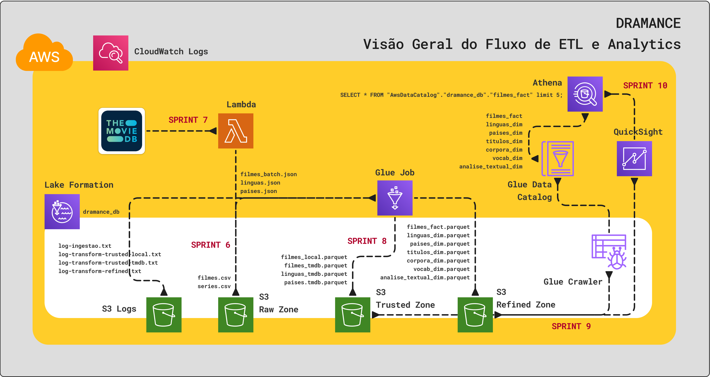
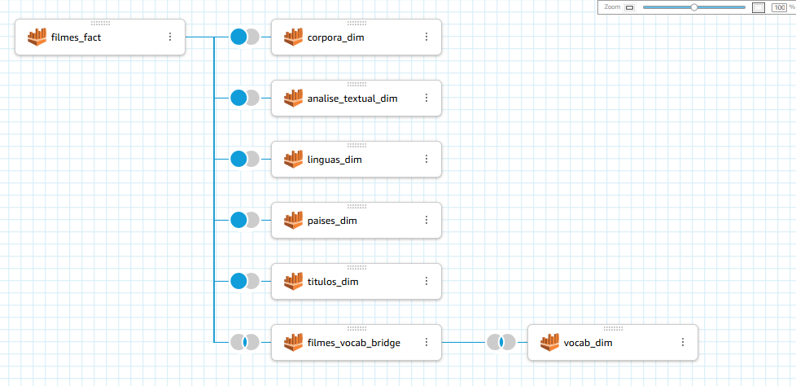

#

||
|---|
||
||

## RELATOS DE APRENDIZADO

## DESAFIO

O projeto final desenvolve um fluxo de processamento e análise de dados, a partir de uma arquitetura data lake. Para a quinta e última etapa, os dados já dimensionalmente modelados, armazenados na camada Refined Zone, são finalmente consumidos e analisados por meio do AWS QuickSight, uma ferramenta de BI e Analytics que demanda pouquíssima utilização de código.

Esse é o fluxo *downstream* do processamento, nesta etapa, é possível verificar toda qualidade e otimização do fluxo *upstream*, e essa comunicação entre as etapas é essencial para entender gaps e melhorias no processo, produzindo um retorno constante de *feedback loops* no dia a dia da Engenharia de Dados.

* [**dash_dramance_com_filtros.pdf**](./desafio/dash_dramance_com_filtros.pdf) : versão com aplicação dos seguintes filtros **exclusão de conteúdo sexual e sexista**, **exclusão de filmes coreanos** e **seleção de substantivos no gráfico heat map**.
* [**dash_dramance_sem_filtros.pdf**](./desafio/dash_dramance_sem_filtros.pdf) : versão sem nenhum filtro aplicado, com todos os dados do dataset.
* [**dramance dashboard interativo**](https://us-east-1.quicksight.aws.amazon.com/sn/accounts/257394448616/dashboards/f0b59a30-aa86-4e7e-b08a-00816b5a8eac?directory_alias=jaquelinecostapb) : link do dashboard interativo no QuickSight, sujeito a permissões de acesso.

## EVIDÊNCIAS

Na pasta `evidencias`, encontram-se prints referentes a momentos de execução, exemplificando abordagens adotadas para o desenvolvimento do desafio. No passo a passo explicativo, encontrado na pasta `desafio`, serão comentados outros prints de pontos específicos.

### VISÃO GERAL DO DATA LAKE

### QUICKSIGHT: DESATIVAÇÃO DE BILLING DE PIXEL REPORTS

### VISÃO GERAL DO DATASET INTEGRADO (PÓS-JOIN) COM QUICKSIGHT

## BIBLIOGRAFIA

BARROS, Diana Luz Pessoa de. **Teoria do Discurso: Fundamentos Semióticos**. São Paulo: Humanitas, 2001.

FIORIN, José Luiz. **Linguagem e Ideologia**. São Paulo: Editora Ática, 1998.

ORLANDI, Eli P. **Análise do Discurso: Princípios e Procedimentos**. Campinas: Pontes Editores, 2015.

PAPADIMITRIOU, Isabel; MANNING, Christopher. **Language** In: On the Opportunities and Risks of Foundation Models. Stanford University, CRFM, 2021. p. 22-27. Disponível em: <[dl.acm.org/doi/pdf](https://dl.acm.org/doi/pdf/10.1145/1327452)>.

POTTS et al. **Philosophy of Understanding** In: On the Opportunities and Risks of Foundation Models. Stanford University, CRFM, 2021. p. 48-52. Disponível em: <[dl.acm.org/doi/pdf](https://dl.acm.org/doi/pdf/10.1145/1327452)>.

REBOUL, Olivier. **Introdução à Retórica**. São Paulo: Martins Fontes, 2004.

SZEPESI, Patrik. **Mathematics Behind Large Language Models and Transformers
**. Udemy / Github. Disponível em: <[github.com/patrikszepesi/LLM_course](https://github.com/patrikszepesi/LLM_course)>. Último acesso em:.

VAN ROSSUM, Guido; WARSAW, Barry; COGHLAN, Alyssa. **PEP 8 – Style Guide for Python Code**. Última atualização: 2013. Disponível em: <[peps.python.org/pep-0008/](https://peps.python.org/pep-0008/)>.  

VAN ROSSUM, Guido; GOODGER, David. **PEP 257 – Docstring Conventions**. Última atualização: 2001. Disponível em: <[peps.python.org/pep-0257/](https://peps.python.org/pep-0257/)>.

VASWANI, Ashish et al. **Attention Is All You Need** In: Advances in Neural Information Processing Systems, ed 31. Long Beach: NIPS, 2017. Disponível em: <[papers.nips.cc/paper_files/](https://papers.nips.cc/paper_files/paper/2017/file/3f5ee243547dee91fbd053c1c4a845aa-Paper.pdf)>.
