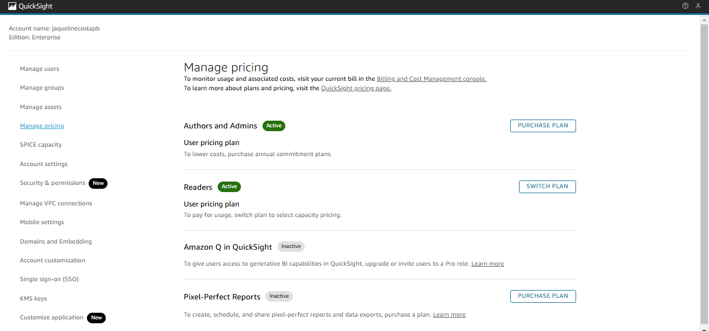

#

||
|---|
||
||

## RELATOS DE APRENDIZADO

Nesta sprint pude aplicar tanto meus conhecimentos de modelagem, análise de dados, design, como também minhas bases de formação linguística.

Dentro da esfera de dados, minha preferência é o tratamento e modelagem de dados em larga escala, principalmente dados de texto; e a possibilidade de incorporar modelos de língua e técnicas de normalização de Processamento de Linguagem Natural foi uma das partes mais prazerosas.

Além da área de PLN/IA, a abstração de componentes e o planejamento da integração e otimização de microsserviços, tendo em vista uma arquitetura e fins de consumo específicos, foram as tarefas com que mais me identifiquei e pretendo continuar aperfeiçoando meus conhecimentos prático-teóricos.

## DESAFIO

O projeto final desenvolve um fluxo de processamento e análise de dados, a partir de uma arquitetura data lake.

Para a quinta e última etapa, os dados já dimensionalmente modelados e armazenados na camada Refined Zone são finalmente consumidos e analisados por meio do AWS QuickSight, uma ferramenta de BI e Analytics que demanda pouquíssima utilização de código.

Esse é o fluxo *downstream* do processamento, nesta etapa, é possível verificar toda a qualidade e otimização do fluxo *upstream*, e essa comunicação entre as etapas é essencial para entender gaps e melhorias no processo, produzindo um retorno constante de *feedback loops* no dia a dia da Engenharia de Dados.

* [**dash_dramance_com_filtros.pdf**](./desafio/dash_dramance_com_filtros.pdf) : versão com aplicação dos seguintes filtros **exclusão de conteúdo sexual e sexista**, **exclusão de filmes coreanos** e **seleção de substantivos no gráfico heat map**.
* [**dash_dramance_sem_filtros.pdf**](./desafio/dash_dramance_sem_filtros.pdf) : versão sem nenhum filtro aplicado, com todos os dados do dataset.
* [**dramance dashboard interativo**](https://us-east-1.quicksight.aws.amazon.com/sn/accounts/257394448616/dashboards/f0b59a30-aa86-4e7e-b08a-00816b5a8eac?directory_alias=jaquelinecostapb) : link do dashboard interativo no QuickSight, sujeito a permissões de acesso.

## EVIDÊNCIAS

Na pasta `evidencias`, encontram-se prints referentes a momentos de execução, exemplificando abordagens adotadas para o desenvolvimento do desafio. No passo a passo explicativo, encontrado na pasta `desafio`, serão comentados outros prints de pontos específicos.

### VISÃO GERAL DO DATA LAKE

### QUICKSIGHT: DESATIVAÇÃO DE BILLING DE PIXEL REPORTS

### VISÃO GERAL DO DATASET INTEGRADO (PÓS-JOIN) COM QUICKSIGHT

### VISUALIZAÇÃO DO DASHBOARD COM INTERAÇÕES E FILTROS APLICADOS

## BIBLIOGRAFIA

BARROS, Diana Luz Pessoa de. **Teoria do Discurso: Fundamentos Semióticos**. São Paulo: Humanitas, 2001.

FIORIN, José Luiz. **Linguagem e Ideologia**. São Paulo: Editora Ática, 1998.

ORLANDI, Eli P. **Análise do Discurso: Princípios e Procedimentos**. Campinas: Pontes Editores, 2015.

REBOUL, Olivier. **Introdução à Retórica**. São Paulo: Martins Fontes, 2004.
