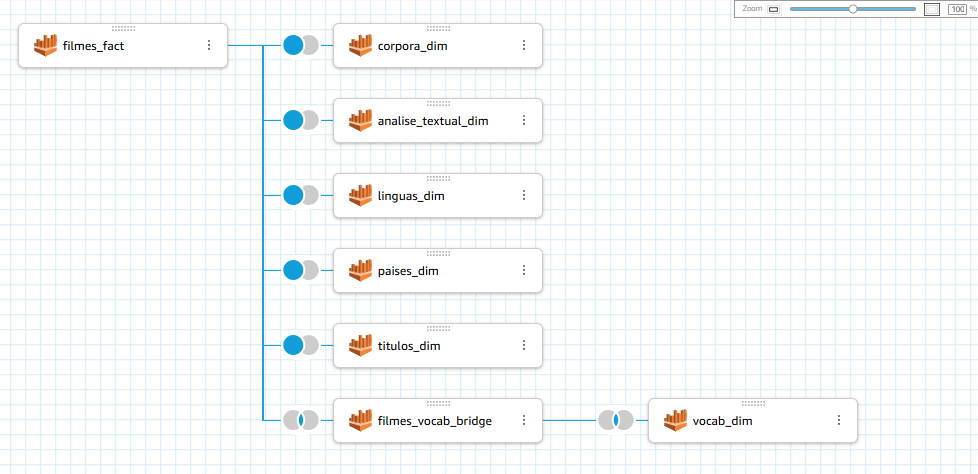

#

||
|---|
||
||

## SEÇÕES

* **Revisitando o Projeto Dramance** [֍]()
  * **Questões Norteadoras para a Análise** [֍]()
  * **Revisão Crítica das Implementações Atuais** [֍]()
    * **Testes de Modelos e Processamentos em GPU** [֍]()
    * **Ineficácia do Uso de UDFs para Pipelines de LLMs** [֍]()
* **Arquitetura de Transformers** [֍]()
* **Considerações Finais** [֍](#considerações-finais)
* **Referências** [֍](#referências)

## REVISITANDO O PROJETO DRAMANCE

*Voltar para **Seções*** [֍](#seções)

### QUESTÕES NORTEADORAS PARA A ANÁLISE

### REVISÃO CRÍTICA DAS IMPLEMENTAÇÕES ATUAIS

*Voltar para **Seções*** [֍](#seções)

Em vista das dificuldades de implementação das inferências de LLMs na análise passada, com tempos de execução elevados para os Glue Jobs, uma das prioridades foi identificar pontos de melhoria no pipeline de dados, detalhados a seguir.

#### TESTES DE MODELOS E PROCESSAMENTOS EM GPU

#### INEFICÁCIA DO USO DE UDFs PARA PIPELINES DE LLMs

* Os modelos são carregados separadamente para cada *worker*
* UDFs são inicializados a cada linha, não utilizando processamentos em batch
* UDFs não utilizam GPUs de maneira eficaz

## TOPIC MODELING

### DF-IDF

### SIMILARIDADE SEMÂNTICA

* **Distância Mínima (Mininum Edit Distance)

> *Edit distance gives us a way to quantify these intuitions about string similarity.
More formally, the minimum edit distance between two strings is defined as the minimum edit distance minimum number of editing operations (operations like insertion, deletion, substitution) needed to transform one string into another. [...] We can also assign a particular cost or weight to each of these operations. The Levenshtein distance between two sequences is the simplest weighting factor in which each of the three operations has a cost of 1 (Levenshtein, 1966)—we assume that the substitution of a letter for itself, for example, t for t, has zero cost.* (JURAFSKY, MARTIN; 2025, p. 25)

## ARQUITETURA DE TRANSFORMERS

*Voltar para **Seções*** [֍](#seções)

Transformer models mentioned above (GPT, BERT, BART, T5, etc.) have been trained as language models. This means they have been trained on large amounts of raw text in a self-supervised fashion. Self-supervised learning is a type of training in which the objective is automatically computed from the inputs of the model.

This type of model develops a statistical understanding of the language it has been trained on, but it’s not very useful for specific practical tasks. Because of this, the general pretrained model then goes through a process called transfer learning. During this process, the model is fine-tuned in a supervised way — that is, using human-annotated labels — on a given task.

### ENCODER E DECODER

*Voltar para **Seções*** [֍](#seções)

### POSITIONAL ENCODINGS

*Voltar para **Seções*** [֍](#seções)

### MECANISMO DE ATENÇÃO

*Voltar para **Seções*** [֍](#seções)

>*Mecanismos de atenção têm se tornado uma parte fundamental de modelagens de sequências e modelos de transdução em várias tarefas, permitindo a modelagem de dependências não obstante sua distância nas sequências de input ou output. [2, 16].* (VASWANI, Ashish et al, 2010, p. 2)

> ***Self-attention**, às vezes denominado "intra-atenção" é um mecanismo de atenção relacionando as diferentes posições de uma única sequência de modo a computar uma representação da sequência* (VASWANI, Ashish et al, 2010, p. 3)

#### QUERY MATRIX

*Voltar para **Seções*** [֍](#seções)

#### KEY MATRIX

*Voltar para **Seções*** [֍](#seções)

#### VALUE MATRIX

*Voltar para **Seções*** [֍](#seções)

#### RAW ATTENTION SCORES

*Voltar para **Seções*** [֍](#seções)

#### MULTI HEAD ATTENTION

*Voltar para **Seções*** [֍](#seções)

## LLMs, FOUNDATION MODELS E FINE-TUNING

*Voltar para **Seções*** [֍](#seções)

### PROMPT-ENGINEERING

*Voltar para **Seções*** [֍](#seções)

### RETRIEVAL-AUGMENTED GENERATION (RAG)

*Voltar para **Seções*** [֍](#seções)

* **Datasets**

https://huggingface.co/datasets/hendrycks/ethics
https://huggingface.co/datasets/society-ethics/laion2b_100k_religion
https://huggingface.co/datasets/society-ethics/laion2B-en_continents
https://huggingface.co/datasets/BramDelisse/ETHICS_llama-chat
https://huggingface.co/datasets/yirenc/4_ethics_all
https://huggingface.co/datasets/RedaAlami/ethics-safe-deontology
https://huggingface.co/datasets/yirenc/10K_general_1K_ethics
https://huggingface.co/datasets/yirenc/all_ethics_1000_2024
https://huggingface.co/datasets/wassname/ethics_expression_preferences

## NOVA ETAPA DE ENRIQUECIMENTO DE DADOS NA REFINED ZONE

*Voltar para **Seções*** [֍](#seções)

## REVISÃO DO CICLO DE VIDA DA ENGENHARIA DE DADOS

*Voltar para **Seções*** [֍](#seções)

## PROCESSAMENTO DE DADOS: PREPARO DOS DATASETS PARA ANALYTICS

*Voltar para **Seções*** [֍](#seções)

### INTRODUÇÃO AO AMAZON QUICKSIGHT

*Voltar para **Seções*** [֍](#seções)

Para o consumo dos dados processados nas etapas anteriores do fluxo do data lake, foi utilizado o serviço de BI (Business Intelligence) *serverless* Amazon QuickSight. O serviço permite a integração de datasets provenientes de diversas fontes de dados, possibilitando a relação entre tabelas e a criação de dashboards interativos e compartilhados entre diversos usuários, com atualização em tempo real e capacidade de utilização de modelos de aprendizado de máquina para inferências até mesmo em linguagem natural.

A integração com os dados foi realizada a partir das tabelas identificadas com o Glue Crawler e mapeadas no Glue Data Catalog, assim o acesso com o QuickSight teve o Athena como *data source*. Abaixo a configuração do dataset `dramance_data` :

### RELAÇÕES ENTRE TABELAS: FATO, DIMENSÃO E BRIDGE

*Voltar para **Seções*** [֍](#seções)

### COMPREENSÃO DOS DADOS UTILIZADOS

*Voltar para **Seções*** [֍](#seções)

### TRATAMENTO DE DADOS DO DATASET: CONVERSÃO DE BOOLEANOS

*Voltar para **Seções*** [֍](#seções)

Nas colunas `conteudo_sexual` e `sexismo`, os valores booleanos estavam representados como inteiros, sendo `1` para "sim" e `0` para "não". Tais valores podem ser utilizados nesse formato, no entanto, não incorporam a semântica necessária para a compreensão imediata em legendas e nos gráficos.

Para facilitar, foi utilizada um estrutura condicional para converter tais valores para `Yes` e `No` (como o dataset já possuía seus valores originais em inglês, foi mantido o padrão).

Após a criação das novas colunas modificadas, estas tiveram seu nome alterado para o anterior, `conteudo_sexual` e `sexismo` , e as antigas foram renomeadas e removidas do dataset.

## FLUXO DOWNSTREAM DO DATA LAKE: CONSUMO DOS DADOS

*Voltar para **Seções*** [֍](#seções)

Nesta etapa, após a preparação inicial do dataset e a integração de tabelas com seus devidos relacionamentos, foi desenvolvido o dashboard final que consolida a análise proposta em um relatório visualmente enriquecido com os padrões identificados nos dados.

Buscando responder às perguntas iniciais, encontrando respostas não esperadas, esta etapa de visualização de dados se aproxima ao design, à redação criativa e à pesquisa.

É preciso entender o tema que se estuda, é preciso entender as motivações iniciais da pesquisa e, mais importante, é preciso entender quem não estava presente durante o processo e estará vendo tudo pela primeira vez.

### CONTRA-HEGEMONIA NO CINEMA: SEMÂNTICAS AFETIVAS NA ERA PÓS-STREAMING

*Voltar para **Seções*** [֍](#seções)

A pesquisa desenvolvida no projeto Dramance de Data Lake e Engenharia de Dados foi baseada na análise norteadora intitulada **Contra-Hegemonia no Cinema: Semânticas Afetivas na Era Pós-Streaming**. Antes de prosseguir com a apresentação dos dados no dashboard, é essencial destrinchar as intenções evidenciadas no título e as perguntas às quais buscou-se responder.

> *[...] a elocução (lexis), que não diz respeito à palavra oral, mas à redação escrita do discurso, ao estilo.* (REBOUL, 2004, p. 43)

> *O **ethos** é o caráter que o orador deve assumir para inspirar confiança no auditório, pois, sejam quais forem seus argumentos lógicos, eles nada obtêm sem essa confiança.* (REBOUL, 2004, p. 48)

> *O **pathos** é o conjunto de emoções, paixões e sentimentos que o orador deve suscitar no auditório com seu discurso. [...] Aqui o **ethos** já não é o caráter (moral) que o orador deve assumir, mas o caráter (psicológico) dos diferentes públicos, aos quais o orador deve adaptar-se.* (REBOUL, 2004, p. 48)

> *A linguagem é um fenômeno extremamente complexo, que pode ser estudado de múltiplos pontos de vista, pois pertence a diferentes domínios. É, ao mesmo tempo, individual e social, física, fisiológica e psíquica.* (FIORIN, 1998, p. 8)

> *O campo das determinações inconscientes é a semântica discursiva, pois o conjunto de elementos semânticos habitualmente usado nos discursos de uma dada época constitui a maneira de ver o mundo numa dada formação social. Esses elementos surgem a partir de outros discursos já construídos, cristalizados e cujas condições de produção foram apagadas. [...] A semântica discursiva é o campo da determinação ideológica propriamente dita. Embora esta seja inconsciente, também pode ser consciente.* (FIORIN, 1998, p. 19)

> *[...] dois discursos podem trabalhar com os mesmos elementos semânticos e revelar duas visões de mundo completamente diferentes, porque o falante pode dar valores distintos aos elementos semânticos que utiliza. Alguns são considerados eufóricos, isto é, são valorizados positivamente; outros, disfóricos, ou seja são valorizados negativamente.* (FIORIN, 1998, p. 21)

> *Tema é o elemento semântico que designa um elemento não-presente no mundo natural, mas que exerce o papel de categoria ordenadora dos fatos observáveis. São temas, por exemplo, amor, paixão, lealdade, alegria. Figura é o elemento semântico que remete a um elemento do mundo natural: casa, mesa, mulher, rosa, etc. A distinção entre ambos é, pois, de maior ou menor grau de concretude [...] concreto e abstrato são dois pólos de uma escala que comporta toda espécie de gradação. [...] O discurso figurativo é a concretização de um discurso temático. Para entender um discurso figurativo é preciso, pois, antes de mais nada, apreender o discurso temático que subjaz a ele.* (FIORIN, 1998, p. 24)

> *A esse conjunto de ideias, a essas representações que servem para justificar e explicar a ordem social, as condições de vida do homem e as relações que ele mantém com os outros homens é o que comumente se chama **ideologia**.* (FIORIN, 1998, p. 28)

> *Podemos então afirmar que não há um conhecimento neutro, pois ele sempre expressa o ponto de vista de uma classe a respeito da realidade. Todo conhecimento está comprometido com os interesses sociais. Esse fato dá uma dimensão mais ampla ao conceito de ideologia; ela é uma "visão de mundo", ou seja, o ponto de vista de uma classe social a respeito da realidade, a maneira como uma classe ordena, justifica e explica a ordem social.*  (FIORIN, 1998, p. 29)

> * Há, portanto, dois momentos essenciais na passagem da semântica fundamental à semântica narrativa: a seleção dos valores, articulados nos quadrados semióticos, e a relação com os sujeitos. A escolha de valores corresponde a uma primeira decisão do sujeito da enunciação, quanto ao discurso que será produzido. A atualização dos valores ocorre, como visto, no enunciado de estado, em que o valor é investido no objeto e relacionado, por disjunção ou conjunção, com o sujeito.* (BARROS, 2001, p. 45)

#### RECORTES DE CLASSIFICAÇÃO TEXTUAL: CONTEÚDO SEXUAL E SEXISMO

*Voltar para **Seções*** [֍](#seções)

|||
|---|---|
|||
|||

#### RECORTES GEOGRÁFICOS

*Voltar para **Seções*** [֍](#seções)

Dentre os filmes do dataset, é possível visualizar a localização no mapa das regiões--

|||
|---|---|
|||
|||

#### RECORTES TEMPORAIS

*Voltar para **Seções*** [֍](#seções)

|||
|---|---|
|||
|||

#### RECORTES POR MÉTRICAS DE AVALIAÇÕES E POPULARIDADE

*Voltar para **Seções*** [֍](#seções)

|||
|---|---|
|||
|||

|||
|---|---|
|||
|||

#### RECORTES LINGUÍSTICOS

#### RECORTES SEMÂNTICOS

## VISÃO PANORÂMICA DA ARQUITETURA E COMPONENTES DO DATA LAKE

*Voltar para **Seções*** [֍](#seções)

## CONSIDERAÇÕES FINAIS

*Voltar para **Seções*** [֍](#seções)

Para uma compreensão de especificidades discursivas relativas às diferentes culturas, seria preciso buscar um comparativo nos discursos dos filmes excluídos no recorte inicial. Seriam os termos lexicais recorrentes um reflexo de simbologias afetivas inerentemente humanas, desejos e referentes partilhados por todos independentemente de cultura? Ou existiriam novas formas de figurativizar os temas da dimensão emocional, do *pathos*, quando migramos para outras vivências sociais?

A globalização facilita o contato com outras culturas, assim podemos vislumbrar novos modos de criar a realidade, no entanto, essa é uma faca de dois gumes, pois com o passar do tempos, as diferenças também estão sujeitas à normalização, dando espaço a novos padrões globais e um apagamento cultural.

## REFERÊNCIAS

*Voltar para **Seções*** [֍](#seções)
