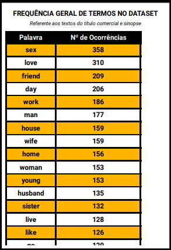

#

||
|---|
||
||

## SEÇÕES

* **Revisitando a Proposta de Análise do Projeto Dramance** [֍](#revisitando-a-proposta-de-análise-do-projeto-dramance)
  * **Questões Norteadoras para a Análise** [֍](#questões-norteadoras-para-a-análise)
  * **Revisão Crítica das Implementações Atuais** [֍](#revisão-crítica-das-implementações-atuais)
    * **Testes de Modelos e Processamentos em GPU** [֍](#testes-de-modelos-e-processamentos-em-gpu)
    * **Ineficácia do Uso de UDFs para Pipelines de LLMs** [֍](#ineficácia-do-uso-de-udfs-para-pipelines-de-llms)
* **Revisão do Ciclo de Vida da Engenharia de Dados** [֍](#revisão-do-ciclo-de-vida-da-engenharia-de-dados)
* **Processamento de Dados: Preparo do Dataset para Analytics** [֍](#processamento-de-dados-preparo-do-dataset-para-analytics)
  * **Introdução ao Amazon QuickSight** [֍](#introdução-ao-amazon-quicksight)
  * **Relações entre Tabelas: Fato, Dimensão e Bridge** [֍](#relações-entre-tabelas-fato-dimensão-e-bridge)
  * **Tratamento de Dados do Dataset: Conversão de Booleanos** [֍](#tratamento-de-dados-do-dataset-conversão-de-booleanos)
  * **Fluxo Downstream do Data Lake: Consumo dos Dados** [֍](#fluxo-downstream-do-data-lake-consumo-dos-dados)
* **Contra-Hegemonia no Cinema: Semânticas Afetivas na Era Pós-Streaming** [֍](#contra-hegemonia-no-cinema-semânticas-afetivas-na-era-pós-streaming)
  * **Recortes de Classificação Textual: Conteúdo Sexual e Sexismo** [֍](#recortes-de-classificação-textual-conteúdo-sexual-e-sexismo)
  * **Recortes Geográficos** [֍](#recortes-geográficos)
  * **Recortes Temporais** [֍](#recortes-temporais)
  * **Métricas de Avaliações e Popularidade** [֍](#métricas-de-avaliações-e-popularidade)
  * **Recortes Linguísticos** [֍](#recortes-linguísticos)
  * **Visualização do Dashboard com Interações e Filtros Aplicados** [֍](#visualização-do-dashboard-com-interações-e-filtros-aplicados)
* **Visão Panorâmica da Arquitetura e Componentes do Data Lake** [֍](#visão-panorâmica-da-arquitetura-e-componentes-do-data-lake)
* **Considerações Finais** [֍](#considerações-finais)
* **Referências** [֍](#referências)

## REVISITANDO A PROPOSTA DE ANÁLISE DO PROJETO DRAMANCE

*Voltar para **Seções*** [֍](#seções)

A pesquisa desenvolvida no projeto Dramance de Data Lake e Engenharia de Dados foi baseada na análise norteadora intitulada [**Contra-Hegemonia no Cinema: Semânticas Afetivas na Era Pós-Streaming**](#contra-hegemonia-no-cinema-semânticas-afetivas-na-era-pós-streaming). Antes de prosseguir com a apresentação dos dados no dashboard, é essencial destrinchar as intenções evidenciadas no título e as perguntas às quais buscou-se responder.

Utilizando dados do banco TMDB, propõe-se analisar a produção cinematográfica de países fora do eixo historicamente dominante, tanto por meios quantitativos para caracterizar a predominância de novas vozes, quanto a partir da **Análise do Discurso** aliada às técnicas de **Processamento de Linguagem Natural**, buscando identificar novos padrões de expressão por meios linguísticos.

> *A **Análise do Discurso** visa fazer compreender como os objetos simbólicos produzem sentidos, analisando assim os próprios gestos de interpretação que ela considera como atos no domínio simbólico, pois eles intervêm no real do sentido. A **Análise do Discurso** não estaciona na interpretação, trabalha seus limites, seus mecanismos, como parte dos processos de significação. [...] Não há uma verdade oculta atrás do texto. Há gestos de interpretação que o constituem e que o analista, com seu dispositivo, deve ser capaz de compreender.* [^1]

Já o recorte de filmes exclusivamente do **gênero Romance** traz o enfoque ao campo semântico relacionado às expressões emocionais-afetivas das relações humanas.

> *O **ethos** é o caráter que o orador deve assumir para inspirar confiança no auditório, pois, sejam quais forem seus argumentos lógicos, eles nada obtêm sem essa confiança. [...] O **pathos** é o conjunto de emoções, paixões e sentimentos que o orador deve suscitar no auditório com seu discurso. [...] Aqui o **ethos** já não é o caráter (moral) que o orador deve assumir, mas o caráter (psicológico) dos diferentes públicos, aos quais o orador deve adaptar-se.* [^2]

A partir desse recorte, é possível vislumbrar a individualidade de uma única produção ou uma única cultura, expandir padrões buscando uma cultura partilhada por pessoas de uma mesma região e, por fim, identificar formas de expressão comuns a todos, originados nas necessidades básicas humanas.

> *A linguagem é um fenômeno extremamente complexo, que pode ser estudado de múltiplos pontos de vista, pois pertence a diferentes domínios. É, ao mesmo tempo, individual e social, física, fisiológica e psíquica.* [^3]

### QUESTÕES NORTEADORAS PARA A ANÁLISE

*Voltar para **Seções*** [֍](#seções)

A análise foi desenvolvida com algumas intenções iniciais, progressivamente ajustadas conforme a familiaridade com os dados se desenvolvia e padrões ali contidos se evidenciavam.

Ainda que seja essencial manter certo distanciamento de quaisquer pretensões, de modo a não interferir nos resultados da análise, o papel do observador é inseparável do resultado final, pois o olhar se direciona para onde se busca ver, e cada recorte é uma exclusão.

> *Gostaríamos de acrescentar que como a pergunta é de responsabilidade do pesquisador, é essa responsabilidade que organiza sua relação com o discurso, levando-o à construção de "seu" dispositivo analítico, optando pela mobilização desses ou aqueles conceitos, esse ou aquele procedimento, com os quais ele se compromete na resolução de sua questão.* [^4]

A seguir as questões selecionadas para nortear a análise do corpus composto dos textos do `título comercial` e `sinopse` :

* *Qual a quantidade de filmes lançados anualmente, por região?*
* *Quais os países com maior quantidade de filmes lançados? Desses países, quais línguas são mais utilizadas?*
* *Quais as línguas com maior quantidade de títulos?*
* *Quais os termos (unigramas) mais recorrentes nas narrativas dos títulos selecionados? Dentre estes, quais suas funções sintáticas no discurso?*
* *Quais os tópicos mais encontrados em cada país?*
* *Quais os tópicos mais encontrados por língua?*
* *Qual a proporção de "sexualidade" e "nuances sexistas" nas narrativas desses filmes?*

Para fundamentar e estruturar a análise teoricamente, foram utilizadas obras referentes à Teoria do Discurso, dos autores Diana Luz Pessoa de Barros, José Luiz Fiorin, Eli Orlandi e Reboul Olivier.

### REVISÃO CRÍTICA DAS IMPLEMENTAÇÕES ATUAIS

*Voltar para **Seções*** [֍](#seções)

Em vista das dificuldades de implementação das inferências de LLMs na sprint passada, com tempos de execução elevados para os Glue Jobs, uma das prioridades foi identificar pontos de melhoria no pipeline de tratamento e extração de dados, detalhados a seguir.

#### TESTES DE MODELOS E PROCESSAMENTOS EM GPU

*Voltar para **Seções*** [֍](#seções)

Todos os testes realizados no ambiente do Databricks não utilizaram GPU, aproveitar o uso com a implementação dos códigos abaixo poderia ter reduzido significantemente os tempos de teste e, deste modo, haveria mais tempo e poder computacional para novas extrações e implementações no dataset.

A seguir os passos para a utilização de GPU, considerando as mesmas condições anteriores:

* **1ª etapa: verificar a disponibilidade de GPU CUDA**

```python
  print("Disponibilidade de CUDA:", torch.cuda.is_available())
  print("Quantidade de Dispositivos CUDA:", torch.cuda.device_count())
```

* **2ª etapa: verificar os detalhes do dispositivo, caso disponível**

```python
  if torch.cuda.is_available():
    print("Dispositivo CUDA atual:", torch.cuda.current_device())
    print("Nome do dispositivo CUDA:", torch.cuda.get_device_name(0))
```

* **3ª etapa: configuração de sessão Spark com GPU**

```python
  spark = SparkSession.builder \
    .appName("Spark com GPU") \
    .config("spark.rapids.sql.enabled", "true") \
    .config("spark.rapids.sql.gpu.enabled", "true") \
    .getOrCreate()
```

* **4ª etapa: forçar os modelos a utilizarem GPU**

```python
  # MODELOS HUGGING FACE + PIPELINE
  device = 0 if torch.cuda.is_available() else -1

  # Argumento "device":
  # 0 para a 1ª GPU 
  # -1 para CPU
  classificador_texto = pipeline('text-classification', 
                      model='gpt2', 
                      device=device)
  
  # MODELO SPACY

  # Carregando o modelo desabilitando o uso default de CPU
  try:
      nlp = spacy.load("en_core_web_trf")
      nlp.disable_gpu = False
  except Exception as e:
      print("SpaCy GPU falhou:", e)
```

#### INEFICÁCIA DO USO DE UDFs PARA PIPELINES DE LLMs

*Voltar para **Seções*** [֍](#seções)

Uma possível otimização na extração de valores com os modelos de língua utilizados seria utilizar funções simples, sem o uso de UDFs do Spark como foi implementado no script. Com UDFs:

* Os modelos são carregados separadamente para cada *worker*
* UDFs são inicializados a cada linha, não utilizando processamentos em batch
* UDFs não utilizam GPUs de maneira eficaz

## REVISÃO DO CICLO DE VIDA DA ENGENHARIA DE DADOS

*Voltar para **Seções*** [֍](#seções)

Uma revisão do fluxo de dados inserido no âmbito da Engenharia de Dados, em que as etapas mais *upstream* (aquelas acima do fluxo) referem-se à **ingestão** dos dados dos sistemas-fonte e as mais *downstream* aquelas referentes ao consumo por ferramentas de BI e Analytics.

Tais componentes do fluxo aqui estão inseridos no ambiente contextual de nuvem da AWS, com integração das ferramentas estudadas e aplicadas nas rotinas ao longo do Programa de Bolsas em geral.


## PROCESSAMENTO DE DADOS: PREPARO DO DATASET PARA ANALYTICS

*Voltar para **Seções*** [֍](#seções)

A seguir, será explicitado o processo de consumo e integração dos dados resultantes do fluxo *upstream* da Engenharia de Dados, incluindo a integração das diversas tabelas da camada Refined Zone em um dataset único, possuidor de relacionamentos entre si por meio de chaves comuns entre tabelas fato, dimensões e bridge.

### INTRODUÇÃO AO AMAZON QUICKSIGHT

*Voltar para **Seções*** [֍](#seções)

Para o consumo dos dados processados nas etapas anteriores do fluxo do data lake, foi utilizado o serviço de BI (Business Intelligence) *serverless* Amazon QuickSight. O serviço permite a integração de datasets provenientes de diversas fontes de dados, possibilitando a relação entre tabelas e a criação de dashboards interativos e compartilhados entre diversos usuários, com atualização em tempo real e capacidade de utilização de modelos de aprendizado de máquina para inferências, até mesmo em linguagem natural.

A integração com os dados foi realizada a partir das tabelas identificadas com o Glue Crawler e mapeadas no Glue Data Catalog, assim o acesso com o QuickSight teve o Athena como *data source*. Abaixo a configuração do dataset `dramance_data` :


### RELAÇÕES ENTRE TABELAS: FATO, DIMENSÃO E BRIDGE

*Voltar para **Seções*** [֍](#seções)

As tabelas foram integradas com JOINs sugeridos pelo sistema, de forma a otimizar a computação reduzindo a necessidade de leituras, no caso dos LEFT JOINs, considerando que as tabelas dimensionais desses casos possuíam IDs únicos de referência.


Para a associação entre as tabelas fato filmes e dimensão vocabulário, foi utilizado INNER JOINs, visto que ali é uma relação de muitos para muitos.


### TRATAMENTO DE DADOS DO DATASET: CONVERSÃO DE BOOLEANOS

*Voltar para **Seções*** [֍](#seções)

Nas colunas `conteudo_sexual` e `sexismo`, os valores booleanos estavam representados como inteiros, sendo `1` para "sim" e `0` para "não". Tais valores podem ser utilizados nesse formato, no entanto, não incorporam a semântica necessária para a compreensão imediata em legendas e nos gráficos.

Para facilitar, foi utilizada uma estrutura condicional para converter tais valores para `Yes` e `No` (como o dataset já possuía seus valores originais em inglês, foi mantido o padrão).


Após a criação das novas colunas modificadas, estas tiveram seu nome alterado para o anterior, `conteudo_sexual` e `sexismo` , e as antigas foram renomeadas e removidas do dataset.

### FLUXO DOWNSTREAM DO DATA LAKE: CONSUMO DOS DADOS

*Voltar para **Seções*** [֍](#seções)

Nesta etapa, após a preparação inicial do dataset e a integração de tabelas com seus devidos relacionamentos, foi desenvolvido o dashboard final que consolida a análise proposta em um relatório visualmente enriquecido com os padrões identificados nos dados.

Buscando responder às perguntas iniciais e encontrando respostas não esperadas, esta etapa de visualização de dados se aproxima ao design, à redação criativa e à pesquisa.

É preciso entender o tema que se estuda, é preciso entender as motivações iniciais da pesquisa, é preciso se aproximar de quem não estava presente durante o processo e estará vendo tudo pela primeira vez e, mais importante, é preciso entender os viéses de quem analisa e cria um novo discurso a partir de sua interpretação dos dados, isto é, quem aqui vos escreve.

> *[...] podemos dizer que o sentido não existe em si mas é determinado pelas posições ideológicas colocadas em jogo no processo sócio-histórico em que as palavras são produzidas. As palavras mudam de sentido segundo as posições daqueles que as empregam.* [^5]

## CONTRA-HEGEMONIA NO CINEMA: SEMÂNTICAS AFETIVAS NA ERA PÓS-STREAMING

*Voltar para **Seções*** [֍](#seções)

A identidade e expressão de um povo fortalece a coesão de suas relações sociais, a consciência e persistência de modos de ser e fazer nos conectam aos nossos antepassados e à nossa história.

> *Na análise do discurso, procura-se compreender a língua fazendo sentido, enquanto trabalho simbólico, parte do trabalho social geral, constitutivo do homem e da sua história.* [^6]

Contudo, as marcas do colonialismo perduram nas diversas esferas humanas; além dos efeitos estruturais socioeconômicos, o processo contínuo de independência e soberania dos países subjugados também inclui a luta contra seu apagamento linguístico e cultural.

Com a acessibilização da Internet e suas possibilidades de troca, novas tendências de consumo vêm florescendo, e a visibilidade de outras culturas proporciona a cada indivíduo a adoção de formas de expressão alinhadas às suas perspectivas pessoais, eliminando fronteiras.

> *A esse conjunto de ideias, a essas representações que servem para justificar e explicar a ordem social, as condições de vida do homem e as relações que ele mantém com os outros homens é o que comumente se chama **ideologia**.* [^7]

### RECORTES DE CLASSIFICAÇÃO TEXTUAL: CONTEÚDO SEXUAL E SEXISMO

*Voltar para **Seções*** [֍](#seções)

Em vista da inconsistência dos dados do TMDB referente às classificações de conteúdo adulto, ocorreu que, mesmo aplicando o filtro de exclusão de tais filmes, estes foram incluídos no dataset por estarem erroneamente classificados.

A princípio, esse tipo de produção não era de interesse para a análise e, para contornar a presença desses dados, foram utilizados 2 modelos de língua para identificar a presença de conteúdo sexual e conotações sexistas nos textos do título e da sinopse.

Foi utilizado o gráfico do tipo **donut** para essa visualização, com interação para filtrar os demais gráficos, em que **amarelo** significa `não` e **vermelho** `sim` .

|||
|---|---|
|||
|||

Ainda que esse tipo de produção não estivesse prevista para compor o dataset, sua presença também agrega à análise discursiva, visto que tais filmes apresentam termos característicos de interpretação das relações humanas e a construção de semânticas em torno da sexualidade. Tais construções, em âmbito sociopolítico, demonstram certas expectativas de identidade e gênero em suas narrativas.

> *O que interessa primordialmente ao analista são as propriedades internas ao processo discursivo: condições, remissão a formações discursivas, modo de funcionamento. [...] Discursos, a priori, não tidos como políticos, podem estar funcionando como tal.* [^8]

### RECORTES GEOGRÁFICOS

*Voltar para **Seções*** [֍](#seções)

Dentre os filmes do dataset, é possível visualizar a localização no mapa das regiões selecionadas (classificadas por cor) e quantidade de filmes lançados por país (tamanho das bolhas).

|||
|---|---|
|||
|||

> *Podemos então afirmar que não há um conhecimento neutro, pois ele sempre expressa o ponto de vista de uma classe a respeito da realidade. Todo conhecimento está comprometido com os interesses sociais. Esse fato dá uma dimensão mais ampla ao conceito de ideologia; ela é uma "visão de mundo", ou seja, o ponto de vista de uma classe social a respeito da realidade, a maneira como uma classe ordena, justifica e explica a ordem social.* [^9]

### RECORTES TEMPORAIS

*Voltar para **Seções*** [֍](#seções)

Para o recorte temporal, foi utilizada como referência a presença global da plataforma de streaming Netflix, escolhida devido ao vasto catálogo de produções estrangeiras com diversidade de gêneros, dublagens e traduções em diversas línguas, principalmente aquelas inclusivas dos países de interesse desta análise.


Os filmes do banco TMDB foram selecionados dentro do período de 2013 aos dias atuais, buscando compreender tanto um período anterior quanto posterior à globalização da plataforma, em 2016.

> *O campo das determinações inconscientes é a semântica discursiva, pois o conjunto de elementos semânticos habitualmente usado nos discursos de uma dada época constitui a maneira de ver o mundo numa dada formação social. Esses elementos surgem a partir de outros discursos já construídos, cristalizados e cujas condições de produção foram apagadas. [...] A semântica discursiva é o campo da determinação ideológica propriamente dita. Embora esta seja inconsciente, também pode ser consciente.* [^10]

* **Lançamentos Anuais** : gráfico do tipo funil, mostra a quantidade de produções lançadas por ano, independentemente do país de origem.

|||
|---|---|
|||
|||

* **Lançamentos Anuais por Região** : gráfico do tipo barras verticais empilhadas, organiza os lançamentos anuais de acordo com a região.

|||
|---|---|
|||
|||

### MÉTRICAS DE AVALIAÇÕES E POPULARIDADE

*Voltar para **Seções*** [֍](#seções)

A seleção de dois gráficos referentes às metricas de aceitação do público busca relativizar que nem sempre determinado discurso estará alinhado com as perspectivas da cultura em que se insere.

* **Média de Avaliações em Relação à Avaliação Máxima** : gráfico do tipo velocímetro, traz a métrica de avaliação média em relação ao máximo atingido de acordo com o filtro aplicado.

|||
|---|---|
|||
|||

* **Performance de Popularidade ao Longo do Anos** : gráfico do tipo indicador chave de desempenho (KPI), relaciona a popularidade média do ano atual com a do anterior, indicando tendências de alta ou baixa.

A [popularidade](https://developer.themoviedb.org/docs/popularity-and-trending#:~:text=Popularity%20is%20a%20fairly%20important,impacted%20by%20the%20attributes%20below.) mensurada é uma métrica calculada pelo TMDB, criando um modelo que utiliza os seguintes atributos, atualizados diariamente: nº de votos, nº de visualizações, nº de usuários que marcaram o filme como favorito, nº de usuários que adicionaram o filme à sua "watchlist", data de lançamento, nº total de votos, métrica dos dias anteriores.

|||
|---|---|
|||
|||

### RECORTES LINGUÍSTICOS

*Voltar para **Seções*** [֍](#seções)

Os gráficos associados aos recortes de língua e termos discursivos buscam identificar a existência de tendências de adoção de figuras e temas de acordo com a língua original. Deste modo, sendo a língua o canal de expressão construtor da realidade de uma cultura, os termos que aparecem em línguas diferentes podem indicar generalizações humanas da esfera afetiva.

> *Tema é o elemento semântico que designa um elemento não-presente no mundo natural, mas que exerce o papel de categoria ordenadora dos fatos observáveis. São temas, por exemplo, amor, paixão, lealdade, alegria. Figura é o elemento semântico que remete a um elemento do mundo natural: casa, mesa, mulher, rosa, etc. A distinção entre ambos é, pois, de maior ou menor grau de concretude [...] concreto e abstrato são dois pólos de uma escala que comporta toda espécie de gradação. [...] O discurso figurativo é a concretização de um discurso temático. Para entender um discurso figurativo é preciso, pois, antes de mais nada, apreender o discurso temático que subjaz a ele.* [^11]

* **Quantidade de Filmes por Língua** : gráfico do tipo mapa de árvore, além de contabilizar a quantidade de lançamentos por língua, identifica a avaliação média dessas produções.

Um indício visualizado aponta que uma quantidade maior de lançamentos em determinada língua não está, necessariamente, relacionada ao nível de aceitação, representado pela média de avaliações.

||
|---|
||
||

||
|---|
||
||

* **Tabela de Títulos com Maior Popularidade** : tabela com títulos ordenados de acordo com maior pontuação de popularidade, separados por país.

|||
|---|---|
|||
|||

* **Termos Mais Frequentes** : gráficos do tipo nuvem de palavras, separados de acordo com a classificação sintática dos termos, assim é possível salientar algumas possíveis associações entre termos qualificativos (adjetivos e advérbios) e seus qualificados (substantivos e verbos).

> *Há, portanto, dois momentos essenciais na passagem da semântica fundamental à semântica narrativa: a seleção dos valores, articulados nos quadrados semióticos, e a relação com os sujeitos. A escolha de valores corresponde a uma primeira decisão do sujeito da enunciação, quanto ao discurso que será produzido. A atualização dos valores ocorre, como visto, no enunciado de estado, em que o valor é investido no objeto e relacionado, por disjunção ou conjunção, com o sujeito.* [^12]

|||
|:---|---|
|**substantivos**|representam os temas e figuras *per se*, produzem as entidades, físicas ou abstratas, social e historicamente relevantes para o discurso|
|**adjetivos**|dão as qualidades e julgamentos de valor às entidades expressas por substantivos|
|**verbos**|a partir de ações e interações entre entidades e ambiente social, assim aquelas constroem e modificam sua realidade|
|**advérbios**|qualificam as ações e acontecimentos, incutindo também valores às interações humanas|

||
|---|
||
||

Uma amostra da configuração utilizada para quantificar os termos da nuvem:

||
|---|
||
||

A construção de um ***ethos* coletivizado** se dá tanto pelas personagens interpretadas quanto pelas personas que, representadas por arquétipos, caracterizam determinados tipos da sociedade. Por exemplos, as figuras: *esposa (wife), mãe (mother / mom), pai (father), irmã (sister), amigos (friend), esposo (husband), etc*.

Com relação ao ***pathos***, a suscitação de emoções se dá por meio de adjetivos e advérbios, que buscam caracterizar pessoas, sensações e comportamentos a partir da perspectiva de quem discursa: *jovem (young), perigoso (dangerous), incapaz (unable), secretamente (secretely), de repente (suddenly), sem intenção (unintentionally), entre outros*.

* **Frequência Geral de Palavras** : tabela de frequência de palavras, em ordem decrescente, referente ao dataset como um todo, sem distinção de funções sintáticas.

|||
|---|---|
|||
|||

* **Frequência de Termos por País** : gráfico do tipo mapa de calor com filtro para classificação sintática, possibilita a comparação de termos com relação à sua frequência de ocorrências por cada país. Abaixo uma amostra com o filtro aplicado para substantivos.

||
|---|
||
||

A seguir os filtros e a configuração para o gráfico:

|||
|---|---|
|||
|||

> *[...] dois discursos podem trabalhar com os mesmos elementos semânticos e revelar duas visões de mundo completamente diferentes, porque o falante pode dar valores distintos aos elementos semânticos que utiliza. Alguns são considerados eufóricos, isto é, são valorizados positivamente; outros, disfóricos, ou seja são valorizados negativamente.* [^13]

### VISUALIZAÇÃO DO DASHBOARD COM INTERAÇÕES E FILTROS APLICADOS

*Voltar para **Seções*** [֍](#seções)

Visualização geral do dataset e demonstração de aplicação de alguns filtros, possibilitando recortes analíticos com relação ao período, região, países e termos linguísticos.


## VISÃO PANORÂMICA DA ARQUITETURA E COMPONENTES DO DATA LAKE

*Voltar para **Seções*** [֍](#seções)

A seguir um diagrama demonstrando como as etapas desenvolvidas e os componentes utilizados se complementam na arquitetura do data lake.

* **Sprint 6**: ingestão de dados locais | Raw Zone
* **Sprint 7**: ingestão de dados externos via API (TMDB) | Raw Zone
* **Sprint 8**: seleção de dados de interesse, limpeza, tratamento de tipos e otimização para leitura em Parquet | Trusted Zone
* **Sprint 9**: modelagem dimensional e extrações adicionais com LLMs | Refined Zone
* **Sprint 10**: consumo de dados com ferramentas de BI e Analytics | Dashboard QuickSight


## CONSIDERAÇÕES FINAIS

*Voltar para **Seções*** [֍](#seções)

Os dados obtidos na análise do dataset ingerido sugerem uma esfera do romance e afeto orientada em temas familiares e cotidianos: as figuras do "marido", da "esposa", da "amiga" ou "amigo", dos "irmãos" ou familiares de alguém são entidades representativas das relações humanas mais básicas.

Além disso, a localização dessas figuras no espaço das relações, como no "trabalho", na "casa" ou no "lar"; bem como as qualificações das relações como "de repente", "perigoso", "secretamente" e "sem intenção", trazem à esfera repetitiva e banal do dia a dia ideais de descoberta e exploração.

Para uma compreensão de especificidades discursivas relativas às diferentes culturas, seria preciso buscar um comparativo nos discursos dos filmes excluídos nos recortes iniciais de línguas e países hegemônicos.

Seriam os termos lexicais recorrentes um reflexo de simbologias afetivas inerentemente humanas, desejos e referentes partilhados por todos independentemente da cultura? Ou existiriam novas formas de figurativizar os temas da dimensão emocional, do *pathos*, quando migramos para outras vivências sociais? Por exemplo, a frequência relativamente alta do termo "lei" (law) sugere uma possível característica cultural, não aparentemente vinculada às semânticas ocidentais, que poderia ser explorada mais a fundo.

A globalização facilita o contato com outras culturas, assim podemos vislumbrar novos modos de criar a realidade, no entanto, essa é uma faca de dois gumes, pois com o passar do tempos, as diferenças também estão sujeitas à normalização, dando espaço a novos padrões globais e um apagamento cultural.

## REFERÊNCIAS

*Voltar para **Seções*** [֍](#seções)

[^1]: ORLANDI, 2015, p. 26

[^2]: REBOUL, 2004, p. 48

[^3]: FIORIN, 1998, p. 8

[^4]: ORLANDI, 2015, p. 27

[^5]: Ibid., p. 42

[^6]: Ibid., p. 15

[^7]: FIORIN, 1998, p. 28

[^8]: ORLANDI, 2015, p. 86

[^9]: FIORIN, 1998, p. 29

[^10]: Ibid., p. 19

[^11]: Ibid., p. 24

[^12]: BARROS, 2001, p. 45

[^13]: FIORIN, 1998, p. 21
