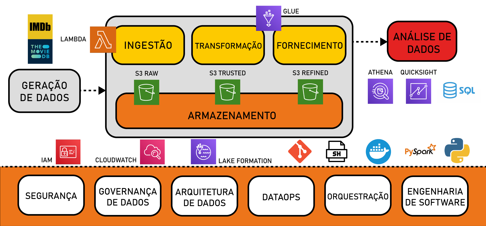
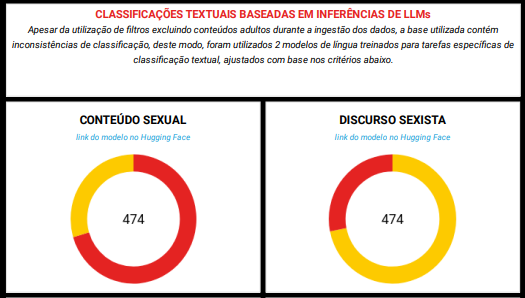

#

||
|---|
||
||

## SEÇÕES

* **Revisitando a Proposta de Análise do Projeto Dramance** [֍](#revisitando-a-proposta-de-análise-do-projeto-dramance)
  * **Questões Norteadoras para a Análise** [֍](#questões-norteadoras-para-a-análise)
  * **Revisão Crítica das Implementações Atuais** [֍](#revisão-crítica-das-implementações-atuais)
    * **Testes de Modelos e Processamentos em GPU** [֍](#testes-de-modelos-e-processamentos-em-gpu)
    * **Ineficácia do Uso de UDFs para Pipelines de LLMs** [֍](#ineficácia-do-uso-de-udfs-para-pipelines-de-llms)
* **Revisão do Ciclo de Vida da Engenharia de Dados** [֍](#revisão-do-ciclo-de-vida-da-engenharia-de-dados)
* **Processamento de Dados: Preparo do Dataset para Analytics** [֍](#processamento-de-dados-preparo-do-dataset-para-analytics)
  * **Introdução ao Amazon QuickSight** [֍](#introdução-ao-amazon-quicksight)
  * **Relações entre Tabelas: Fato, Dimensão e Bridge** [֍](#relações-entre-tabelas-fato-dimensão-e-bridge)
  * **Compreensão dos Dados Utilizados** [֍](#compreensão-dos-dados-utilizados)
    * **Dimensão Línguas** [֍](#dimensão-línguas)
    * **Dimensão Países** [֍](#dimensão-países)
    * **Dimensão Títulos** [֍](#dimensão-títulos)
    * **Dimensão Análise Textual** [֍](#dimensão-análise-textual)
    * **Dimensão Corpora** [֍](#dimensão-corpora)
    * **Dimensão Vocabulário** [֍](#dimensão-vocabulário)
    * **Fato Filmes** [֍](#fato-filmes)
    * **Bridge Filmes-Vocabulário** [֍](#bridge-filmes-vocabulário)
  * **Tratamento de Dados do Dataset: Conversão de Booleanos** [֍](#tratamento-de-dados-do-dataset-conversão-de-booleanos)
  * **Fluxo Downstream do Data Lake: Consumo dos Dados** [֍](#fluxo-downstream-do-data-lake-consumo-dos-dados)
* **Contra-Hegemonia no Cinema: Semânticas Afetivas na Era Pós-Streaming** [֍](#contra-hegemonia-no-cinema-semânticas-afetivas-na-era-pós-streaming)
  * **Recortes de Classificação Textual: Conteúdo Sexual e Sexismo** [֍](#recortes-de-classificação-textual-conteúdo-sexual-e-sexismo)
  * **Recortes Geográficos** [֍](#recortes-geográficos)
  * **Recortes Temporais** [֍](#recortes-temporais)
  * **Métricas de Avaliações e Popularidade** [֍](#métricas-de-avaliações-e-popularidade)
  * **Recortes Linguísticos** [֍](#recortes-linguísticos)
  * **Visualização do Dashboard com Interações e Filtros Aplicados** [֍](#visualização-do-dashboard-com-interações-e-filtros-aplicados)
* **Visão Panorâmica da Arquitetura e Componentes do Data Lake** [֍](#visão-panorâmica-da-arquitetura-e-componentes-do-data-lake)
* **Considerações Finais** [֍](#considerações-finais)
* **Referências** [֍](#referências)

## REVISITANDO A PROPOSTA DE ANÁLISE DO PROJETO DRAMANCE

*Voltar para **Seções*** [֍](#seções)

A pesquisa desenvolvida no projeto Dramance de Data Lake e Engenharia de Dados foi baseada na análise norteadora intitulada [**Contra-Hegemonia no Cinema: Semânticas Afetivas na Era Pós-Streaming**](#contra-hegemonia-no-cinema-semânticas-afetivas-na-era-pós-streaming). Antes de prosseguir com a apresentação dos dados no dashboard, é essencial destrinchar as intenções evidenciadas no título e as perguntas às quais buscou-se responder.

Utilizando dados do banco TMDB, propõe-se analisar a produção cinematográfica de países fora do eixo historicamente dominante, tanto por meios quantitativos para caracterizar a predominância de novas vozes, quanto a partir da **Análise do Discurso** aliada às técnicas de **Processamento de Linguagem Natural**, buscando identificar novos padrões de expressão por meios linguísticos.

Já o recorte de filmes exclusivamente do **gênero Romance** traz o enfoque ao campo semântico relacionado às expressões emocionais-afetivas das relações humanas.

> *A **Análise do Discurso** visa fazer compreender como os objetos simbólicos produzem sentidos, analisando assim os próprios gestos de interpretação que ela considera como atos no domínio simbólico, pois eles intervêm no real do sentido. A **Análise do Discurso** não estaciona na interpretação, trabalha seus limites, seus mecanismos, como parte dos processos de significação. [...] Não há uma verdade oculta atrás do texto. Há gestos de interpretação que o constituem e que o analista, com seu dispositivo, deve ser capaz de compreender.* [^1]

### QUESTÕES NORTEADORAS PARA A ANÁLISE

*Voltar para **Seções*** [֍](#seções)

> *Gostaríamos de acrescentar que como a pergunta é de responsabilidade do pesquisador, é essa responsabilidade que organiza sua relação com o discurso, levando-o à construção de "seu" dispositivo analítico, optando pela mobilização desses ou aqueles conceitos, esse ou aquele procedimento, com os quais ele se compromete na resolução de sua questão.* (ORLANDI, 2015, p. 27)

### REVISÃO CRÍTICA DAS IMPLEMENTAÇÕES ATUAIS

*Voltar para **Seções*** [֍](#seções)

Em vista das dificuldades de implementação das inferências de LLMs na análise passada, com tempos de execução elevados para os Glue Jobs, uma das prioridades foi identificar pontos de melhoria no pipeline de dados, detalhados a seguir.

#### TESTES DE MODELOS E PROCESSAMENTOS EM GPU

*Voltar para **Seções*** [֍](#seções)

Todos os testes realizados no ambiente do Databricks não utilizaram GPU, aproveitar o uso com a implementação dos códigos abaixo poderia ter reduzido significantemente os tempos de teste e, deste modo, haveria mais tempo e poder computacional para novas extrações e implementações no dataset.

A seguir os passos para a utilização de GPU, considerando as mesmas condições anteriores:

* **1ª etapa: verificar a disponibilidade de GPU CUDA**

```python
  print("Disponibilidade de CUDA:", torch.cuda.is_available())
  print("Quantidade de Dispositivos CUDA:", torch.cuda.device_count())
```

* **2ª etapa: verificar os detalhes do dispositivo, caso disponível**

```python
  if torch.cuda.is_available():
    print("Dispositivo CUDA atual:", torch.cuda.current_device())
    print("Nome do dispositivo CUDA:", torch.cuda.get_device_name(0))
```

* **3ª etapa: configuração de sessão Spark com GPU**

```python
  spark = SparkSession.builder \
    .appName("Spark com GPU") \
    .config("spark.rapids.sql.enabled", "true") \
    .config("spark.rapids.sql.gpu.enabled", "true") \
    .getOrCreate()
```

* **4ª etapa: forçar os modelos a utilizarem GPU**

```python
  # MODELOS HUGGING FACE + PIPELINE
  device = 0 if torch.cuda.is_available() else -1

  # Argumento "device":
  # 0 para a 1ª GPU 
  # -1 para CPU
  classificador_texto = pipeline('text-classification', 
                      model='gpt2', 
                      device=device)
  
  # MODELO SPACY

  # Carregando o modelo desabilitando o uso default de CPU
  try:
      nlp = spacy.load("en_core_web_trf")
      nlp.disable_gpu = False
  except Exception as e:
      print("SpaCy GPU falhou:", e)
```

#### INEFICÁCIA DO USO DE UDFs PARA PIPELINES DE LLMs

*Voltar para **Seções*** [֍](#seções)

Uma possível otimização na extração de valores com os modelos de língua utilizados, seria utilizar funções simples, sem o uso de UDFs do Spark como foi implementado no script. Com UDFs:

* Os modelos são carregados separadamente para cada *worker*
* UDFs são inicializados a cada linha, não utilizando processamentos em batch
* UDFs não utilizam GPUs de maneira eficaz

## REVISÃO DO CICLO DE VIDA DA ENGENHARIA DE DADOS

*Voltar para **Seções*** [֍](#seções)

Uma revisão do fluxo de dados inserido no âmbito da Engenharia de Dados, em que as etapas mais *upstream*, aquelas acima do fluxo, referem-se à **ingestão** dos dados dos sistemas-fonte e as mais *downstream* aquelas referentes ao consumo por ferramentas de BI e Analytics.

Tais componentes do fluxo aqui estão inseridos no ambiente contextual de nuvem da AWS, com integração das ferramentas estudadas e aplicadas nas rotinas ao longo do Programa de Bolsas em geral.



## PROCESSAMENTO DE DADOS: PREPARO DO DATASET PARA ANALYTICS

*Voltar para **Seções*** [֍](#seções)

A seguir, será explicitado o processo de consumo e integração dos dados resultantes do fluxo *upstream* da Engenharia de Dados, incluindo a integração das diversas tabelas da camada Refined Zone em um dataset único, possuidor de relacionamentos entre si por meio de chaves comuns entre tabelas fato, dimensões e bridge.

### INTRODUÇÃO AO AMAZON QUICKSIGHT

*Voltar para **Seções*** [֍](#seções)

Para o consumo dos dados processados nas etapas anteriores do fluxo do data lake, foi utilizado o serviço de BI (Business Intelligence) *serverless* Amazon QuickSight. O serviço permite a integração de datasets provenientes de diversas fontes de dados, possibilitando a relação entre tabelas e a criação de dashboards interativos e compartilhados entre diversos usuários, com atualização em tempo real e capacidade de utilização de modelos de aprendizado de máquina para inferências até mesmo em linguagem natural.

A integração com os dados foi realizada a partir das tabelas identificadas com o Glue Crawler e mapeadas no Glue Data Catalog, assim o acesso com o QuickSight teve o Athena como *data source*. Abaixo a configuração do dataset `dramance_data` :


### RELAÇÕES ENTRE TABELAS: FATO, DIMENSÃO E BRIDGE

*Voltar para **Seções*** [֍](#seções)


### COMPREENSÃO DOS DADOS UTILIZADOS

*Voltar para **Seções*** [֍](#seções)

Abaixo, serão brevemente comentados os dados contidos nas colunas de cada tabela que constituem o dataset final.

#### DIMENSÃO LÍNGUAS

*Voltar para **Seções*** [֍](#seções)

#### DIMENSÃO PAÍSES

*Voltar para **Seções*** [֍](#seções)

#### DIMENSÃO TÍTULOS

*Voltar para **Seções*** [֍](#seções)

#### DIMENSÃO ANÁLISE TEXTUAL

*Voltar para **Seções*** [֍](#seções)

#### DIMENSÃO CORPORA

*Voltar para **Seções*** [֍](#seções)

#### DIMENSÃO VOCABULÁRIO

*Voltar para **Seções*** [֍](#seções)

#### FATO FILMES

*Voltar para **Seções*** [֍](#seções)

#### BRIDGE FILMES-VOCABULÁRIO

*Voltar para **Seções*** [֍](#seções)

### TRATAMENTO DE DADOS DO DATASET: CONVERSÃO DE BOOLEANOS

*Voltar para **Seções*** [֍](#seções)

Nas colunas `conteudo_sexual` e `sexismo`, os valores booleanos estavam representados como inteiros, sendo `1` para "sim" e `0` para "não". Tais valores podem ser utilizados nesse formato, no entanto, não incorporam a semântica necessária para a compreensão imediata em legendas e nos gráficos.

Para facilitar, foi utilizada um estrutura condicional para converter tais valores para `Yes` e `No` (como o dataset já possuía seus valores originais em inglês, foi mantido o padrão).


Após a criação das novas colunas modificadas, estas tiveram seu nome alterado para o anterior, `conteudo_sexual` e `sexismo` , e as antigas foram renomeadas e removidas do dataset.

### FLUXO DOWNSTREAM DO DATA LAKE: CONSUMO DOS DADOS

*Voltar para **Seções*** [֍](#seções)

Nesta etapa, após a preparação inicial do dataset e a integração de tabelas com seus devidos relacionamentos, foi desenvolvido o dashboard final que consolida a análise proposta em um relatório visualmente enriquecido com os padrões identificados nos dados.

Buscando responder às perguntas iniciais, encontrando respostas não esperadas, esta etapa de visualização de dados se aproxima ao design, à redação criativa e à pesquisa.

É preciso entender o tema que se estuda, é preciso entender as motivações iniciais da pesquisa e, mais importante, é preciso se aproximar de quem não estava presente durante o processo e estará vendo tudo pela primeira vez.

## CONTRA-HEGEMONIA NO CINEMA: SEMÂNTICAS AFETIVAS NA ERA PÓS-STREAMING

*Voltar para **Seções*** [֍](#seções)

A identidade e expressão de um povo fortalece a coesão de suas relações sociais, a consciência e persistência de modos de ser e fazer nos conectam aos nossos antepassados e à nossa história.

Contudo, as marcas do colonialismo perduram nas diversas esferas humanas; além dos efeitos estruturais socioeconômicos, o processo contínuo de independência e soberania dos países subjugados também inclui a luta contra seu apagamento linguístico e cultural.

Com a acessibilização da Internet e suas possibilidades de troca, novas tendências de consumo vêm florescendo, e a visibilidade de outras culturas proporciona a cada indivíduo a adoção de formas de expressão alinhadas às suas perspectivas pessoais, eliminando fronteiras.

> *[...] a elocução (lexis), que não diz respeito à palavra oral, mas à redação escrita do discurso, ao estilo.* (REBOUL, 2004, p. 43)

> *Em suma, a **Análise do Discurso** visa a compreensão de como um objeto simbólico produz sentidos, como ele está investido de significância para e por sujeitos*. (ORLANDI, 2015, p. 26)

> *O **ethos** é o caráter que o orador deve assumir para inspirar confiança no auditório, pois, sejam quais forem seus argumentos lógicos, eles nada obtêm sem essa confiança.* (REBOUL, 2004, p. 48)

> *O **pathos** é o conjunto de emoções, paixões e sentimentos que o orador deve suscitar no auditório com seu discurso. [...] Aqui o **ethos** já não é o caráter (moral) que o orador deve assumir, mas o caráter (psicológico) dos diferentes públicos, aos quais o orador deve adaptar-se.* (REBOUL, 2004, p. 48)

> *A linguagem é um fenômeno extremamente complexo, que pode ser estudado de múltiplos pontos de vista, pois pertence a diferentes domínios. É, ao mesmo tempo, individual e social, física, fisiológica e psíquica.* (FIORIN, 1998, p. 8)

> *O campo das determinações inconscientes é a semântica discursiva, pois o conjunto de elementos semânticos habitualmente usado nos discursos de uma dada época constitui a maneira de ver o mundo numa dada formação social. Esses elementos surgem a partir de outros discursos já construídos, cristalizados e cujas condições de produção foram apagadas. [...] A semântica discursiva é o campo da determinação ideológica propriamente dita. Embora esta seja inconsciente, também pode ser consciente.* (FIORIN, 1998, p. 19)

> *[...] dois discursos podem trabalhar com os mesmos elementos semânticos e revelar duas visões de mundo completamente diferentes, porque o falante pode dar valores distintos aos elementos semânticos que utiliza. Alguns são considerados eufóricos, isto é, são valorizados positivamente; outros, disfóricos, ou seja são valorizados negativamente.* (FIORIN, 1998, p. 21)

> *Tema é o elemento semântico que designa um elemento não-presente no mundo natural, mas que exerce o papel de categoria ordenadora dos fatos observáveis. São temas, por exemplo, amor, paixão, lealdade, alegria. Figura é o elemento semântico que remete a um elemento do mundo natural: casa, mesa, mulher, rosa, etc. A distinção entre ambos é, pois, de maior ou menor grau de concretude [...] concreto e abstrato são dois pólos de uma escala que comporta toda espécie de gradação. [...] O discurso figurativo é a concretização de um discurso temático. Para entender um discurso figurativo é preciso, pois, antes de mais nada, apreender o discurso temático que subjaz a ele.* (FIORIN, 1998, p. 24)

> *A esse conjunto de ideias, a essas representações que servem para justificar e explicar a ordem social, as condições de vida do homem e as relações que ele mantém com os outros homens é o que comumente se chama **ideologia**.* (FIORIN, 1998, p. 28)

> *Podemos então afirmar que não há um conhecimento neutro, pois ele sempre expressa o ponto de vista de uma classe a respeito da realidade. Todo conhecimento está comprometido com os interesses sociais. Esse fato dá uma dimensão mais ampla ao conceito de ideologia; ela é uma "visão de mundo", ou seja, o ponto de vista de uma classe social a respeito da realidade, a maneira como uma classe ordena, justifica e explica a ordem social.*  (FIORIN, 1998, p. 29)

> *Há, portanto, dois momentos essenciais na passagem da semântica fundamental à semântica narrativa: a seleção dos valores, articulados nos quadrados semióticos, e a relação com os sujeitos. A escolha de valores corresponde a uma primeira decisão do sujeito da enunciação, quanto ao discurso que será produzido. A atualização dos valores ocorre, como visto, no enunciado de estado, em que o valor é investido no objeto e relacionado, por disjunção ou conjunção, com o sujeito.* (BARROS, 2001, p. 45)

> *Na análise do discurso, procura-se compreender a língua fazendo sentido, enquanto trabalho simbólico, parte do trabalho social geral, constitutivo do homem e da sua história.* (ORLANDI, 2015, p. 15)

> *[...] podemos dizer que o sentido não existe em si mas é determinado pelas posições ideológicas colocadas em jogo no processo sócio-histórico em que as palavras são produzidas. As palavras mudam de sentido segundo as posições daqueles que as empregam.* (ORLANDI, 2015, p. 42)


### RECORTES DE CLASSIFICAÇÃO TEXTUAL: CONTEÚDO SEXUAL E SEXISMO

*Voltar para **Seções*** [֍](#seções)

Em vista da inconsistência dos dados do TMDB referente às classificações de conteúdo adulto, ocorreu que, mesmo aplicando o filtro de exclusão de tais filmes, estes foram incluídos no dataset por estar erroneamente classificados.

A princípio, esse tipo de produção não era de interesse para a análise, e para contornar a presença desses dados, foram utilizados 2 modelos de língua para identificar a presença de conteúdo sexual e conotações sexistas nos textos do título e da sinopse.

Foi utilizado o gráfico do tipo **donut** para essa visualização, com interação para filtrar os demais gráficos, em que **amarelo** significa `não` e **vermelho** `sim` .

|||
|---|---|
|||
|||

Ainda que esse tipo de produção não estivesse prevista para incluir o dataset, sua presença também agrega à análise discursiva, visto que tais filmes apresentam termos característicos de interpretação das relações humanas e a construção de semânticas em torno da sexualidade. Tais construções, em âmbito sociopolítico, demonstram certas expectativas de identidade e gênero em suas narrativas.

> *O que interessa primordialmente ao analista são as propriedades internas ao processo discursivo: condições, remissão a formações discursivas, modo de funcionamento. [...] Discursos, a priori, não tidos como políticos, podem estar funcionando como tal.* (ORLANDI, 2015, p. 86)

### RECORTES GEOGRÁFICOS

*Voltar para **Seções*** [֍](#seções)

Dentre os filmes do dataset, é possível visualizar a localização no mapa das regiões--

|||
|---|---|
|||
|||

### RECORTES TEMPORAIS

*Voltar para **Seções*** [֍](#seções)

|||
|---|---|
|||
|||

### MÉTRICAS DE AVALIAÇÕES E POPULARIDADE

*Voltar para **Seções*** [֍](#seções)

|||
|---|---|
|||
|||

|||
|---|---|
|||
|||

### RECORTES LINGUÍSTICOS

*Voltar para **Seções*** [֍](#seções)

### VISUALIZAÇÃO DO DASHBOARD COM INTERAÇÕES E FILTROS APLICADOS

*Voltar para **Seções*** [֍](#seções)

Visualização geral do dataset e demonstração de aplicação de alguns filtros, possibilitando recortes analíticos com relação ao período, região, países e termos linguísticos.


## VISÃO PANORÂMICA DA ARQUITETURA E COMPONENTES DO DATA LAKE

*Voltar para **Seções*** [֍](#seções)


## CONSIDERAÇÕES FINAIS

*Voltar para **Seções*** [֍](#seções)

Os dados obtidos na análise do dataset ingerido sugerem uma esfera do romance e afeto orientada em temas familiares e cotidianos: as figuras do "marido", da "esposa", da "amiga" ou "amigo", dos "irmãos" ou familiares de alguém são entidades representativas das relações humanas mais básicas. 

Além disso, a localização dessas figuras no espaço das relações, como no "trabalho", na "casa" ou no "lar"; bem como as qualificações das relações como "de repente", "perigoso", "secretamente" e "sem intenção", trazem à esfera repetitiva e banal do dia a dia ideais de descoberta e exploração.

Para uma compreensão de especificidades discursivas relativas às diferentes culturas, seria preciso buscar um comparativo nos discursos dos filmes excluídos no recorte inicial.

Seriam os termos lexicais recorrentes um reflexo de simbologias afetivas inerentemente humanas, desejos e referentes partilhados por todos independentemente da cultura? Ou existiriam novas formas de figurativizar os temas da dimensão emocional, do *pathos*, quando migramos para outras vivências sociais? Por exemplo, a frequência relativamente alta do termo "lei" (law) sugere uma possível característica cultural, não aparentemente vinculada às semânticas ocidentais, que poderia ser explorada mais a fundo.

A globalização facilita o contato com outras culturas, assim podemos vislumbrar novos modos de criar a realidade, no entanto, essa é uma faca de dois gumes, pois com o passar do tempos, as diferenças também estão sujeitas à normalização, dando espaço a novos padrões globais e um apagamento cultural.

## REFERÊNCIAS

*Voltar para **Seções*** [֍](#seções)

[^1]: ORLANDI, 2015, p. 26