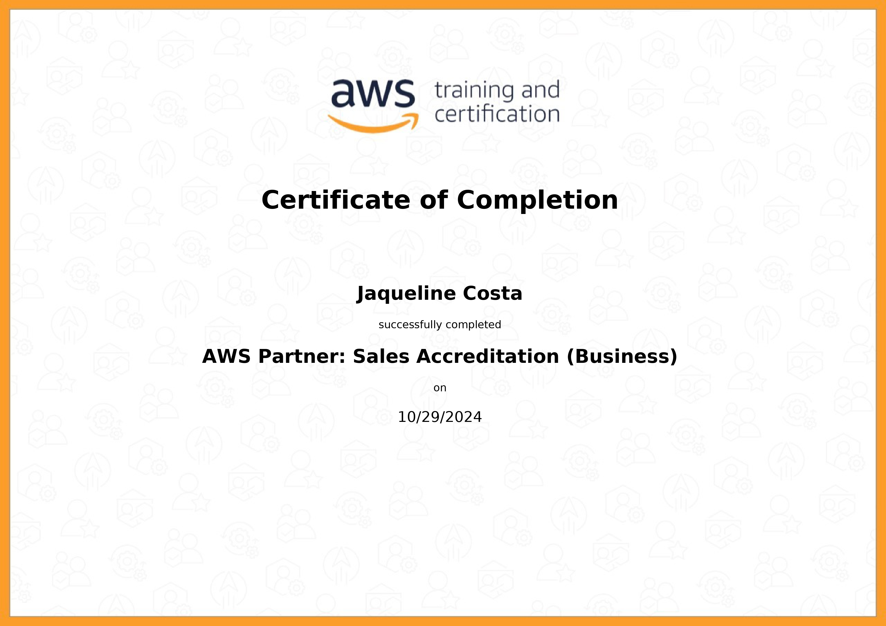
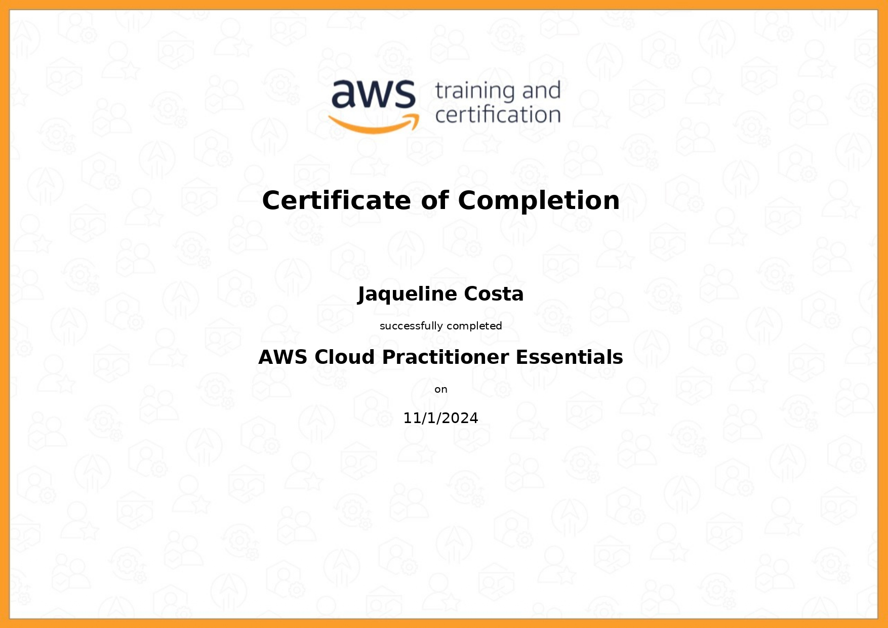
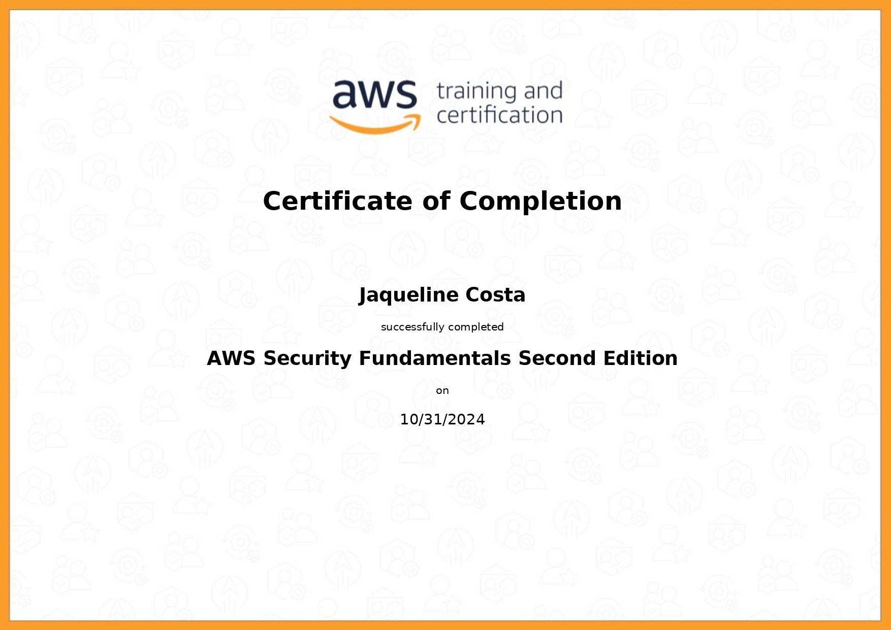

#

||
|---|
||
||

## RELATOS DE APRENDIZADO

### SQL & Banco de Dados Relacionais

  
  

---

### AWS Partner: Sales Accreditation

## EXERCÍCIOS

## DESAFIO

* [Normalização](./desafio/concessionaria_normalizacao.sql):

* [Modelagem Dimensional - Star Schema](./desafio/concessionaria_star_schema.sql):

## EVIDÊNCIAS

Na pasta `evidencias`, encontram-se prints referentes a momentos de execução do código, exemplificando abordagens adotadas para a conclusão do desafio.  
No passo a passo explicativo, encontrado na pasta `desafio`, serão comentados outros prints de pontos específicos.

## CERTIFICADOS AWS SKILL BUILDER

### AWS Partner: Sales Accreditation (Business)

| |
|---|
||
||

## CERTIFICADOS COMPLEMENTARES

Para absorver melhor o conteúdo desta sprint e me aprofundar em pontos de interesse, concluí em paralelo os cursos abaixo, externos à Udemy.

### AWS Cloud Practitioner Essentials

| |
|---|
||
||

### AWS Security Fundamentals - Second Edition

| |
|---|
||
||

## BIBLIOGRAFIA

FAROULT, Stephane; ROBSON, Peter. **The Art of SQL**. Sebastopol: O'Reilly, 2006.  
SERRA, James. **Deciphering Data Architectures: Choosing Betweeen a Modern Warehouse, Data Fabric, Data Lakehouse, and Data Mesh**. Sebastopol: O'Reilly, 2024.
