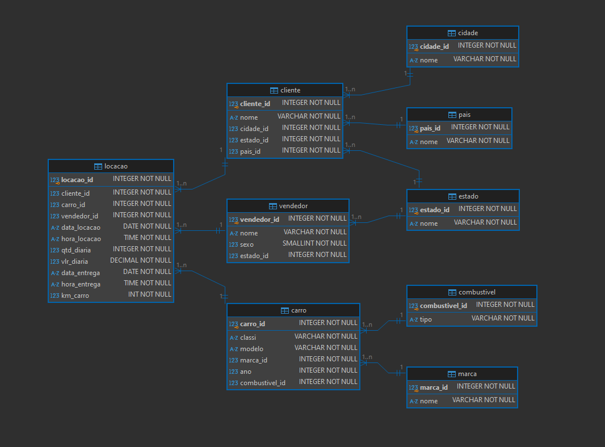
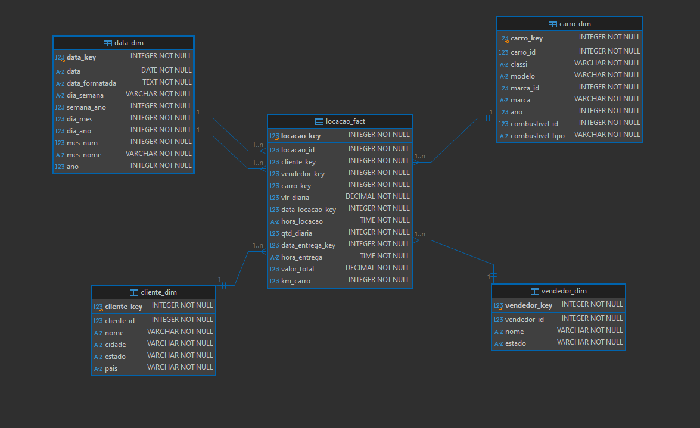

#

||
|---|
||
||

## EXERCÍCIOS

- **Banco de Dados: Biblioteca**

  - [Exercício 1](./exercicios/exercicio1.sql)
  - [Exercício 2](./exercicios/exercicio2.sql)
  - [Exercício 3](./exercicios/exercicio3.sql)
  - [Exercício 4](./exercicios/exercicio4.sql)
  - [Exercício 5](./exercicios/exercicio5.sql)
  - [Exercício 6](./exercicios/exercicio6.sql)
  - [Exercício 7](./exercicios/exercicio7.sql)
  
- **Banco de Dados: Loja**
  - [Exercício 8](./exercicios/exercicio8.sql)
  - [Exercício 9](./exercicios/exercicio9.sql)
  - [Exercício 10](./exercicios/exercicio10.sql)
  - [Exercício 11](./exercicios/exercicio11.sql)
  - [Exercício 12](./exercicios/exercicio12.sql)
  - [Exercício 13](./exercicios/exercicio13.sql)
  - [Exercício 14](./exercicios/exercicio14.sql)
  - [Exercício 15](./exercicios/exercicio15.sql)
  - [Exercício 16](./exercicios/exercicio16.sql)

- **Exportação de Dados**
  - [Exportação 1](./exercicios/exportacao1.sql) | [Planilha CSV](./exercicios/exportacao1.csv)
  - [Exportação 2](./exercicios/exportacao2.sql) | [Planilha CSV](./exercicios/exportacao2.csv)

## DESAFIO

- [Normalização](./desafio/concessionaria_normalizacao.sql): normalização de tabelas até a 3ª forma normal, otimizada para sistemas OLTP, de acordo com as diretrizes e motivações de Codd. Este processo também foi contextualizado no projeto de data warehouse, aplicado na camada CIF (*Corporate Information Factory*) que serve de repositório consolidado de informações do negócio, bem como fonte de retroalimentação dos sistemas-fonte por meio de ETL Reverso.

- [Modelagem Dimensional - Star Schema](./desafio/concessionaria_star_schema.sql): modelagem dimensional em star schema, otimizando o banco de dados para sistemas OLAP e implementando tabela-fato de tipo snapshot acumulativo, contextualizando o processo a partir de um design de data warehouse híbrido, inspirados nas metodologias de Kimball e Inmon.

- **Bônus:** [Modelagem Dimensional - Snowflake Schema](./desafio/concessionaria_snowflake_schema.sql): exemplificação alternativa de modelagem dimensional em snowflake schema, com a normalização de hierarquias dimensionais.
  
- **Bônus:** [Modelagem Dimensional - Cubos](./desafio/concessionaria_cubos.sql): implementação de cubos por meio de views para exemplificar a aplicação do projeto, bem como alguns outros tipos de análise bidimensionais ("planos"), contextualizando o processo na etapa de distribuição da arquitetura de data warehouse planejada, com motivações inspiradas nas metodologias de Kimball e Inmon.

## EVIDÊNCIAS

Na pasta `evidencias`, encontram-se prints referentes a momentos de execução do código, exemplificando abordagens adotadas para a conclusão do desafio.  
No passo a passo explicativo, encontrado na pasta `desafio`, serão comentados outros prints de pontos específicos.

### NORMALIZAÇÃO

### MODELAGEM STAR SCHEMA

### MODELAGEM SNOWFLAKE SCHEMA

## BIBLIOGRAFIA

- CODD, F. Edgar. **Further Normalization of the Database Relational Model**. San Jose: IBM Research Laboratory, 1971. Disponível em: <[forum.thethirdmanifesto.com](https://forum.thethirdmanifesto.com/wp-content/uploads/asgarosforum/987737/00-efc-further-normalization.pdf)>.  
- FAROULT, Stephane; ROBSON, Peter. **The Art of SQL**. Sebastopol: O'Reilly, 2006.  
- KIMBALL, Ralph; ROSS, Margy. **The Data Warehouse Toolkit: The Definitive Guide to Dimensional Modeling**, 3 ed. Indianapolis: Wiley, 2013.  
- SERRA, James. **Deciphering Data Architectures: Choosing Betweeen a Modern Warehouse, Data Fabric, Data Lakehouse, and Data Mesh**. Sebastopol: O'Reilly, 2024.
