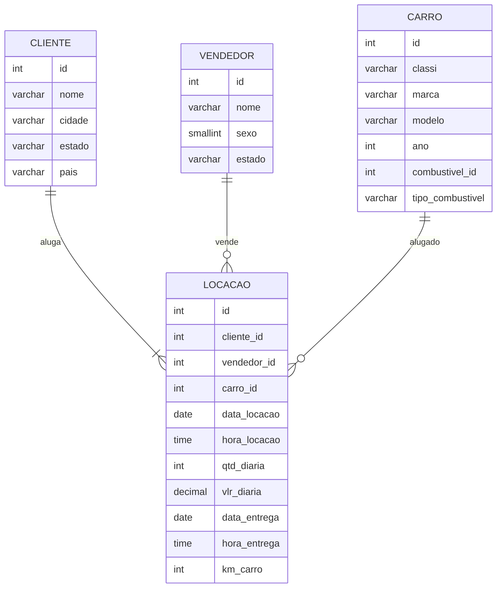

#

||
|---|
||
||

## SEÇÕES

-  **Compreensão Inicial dos Dados** [֍]()
   - Diagrama Conceitual [֍]()
   -

## COMPREENSÃO INICIAL DOS DADOS

*Voltar para **Seções*** [֍]()

Antes de iniciar qualquer processamento, é preciso compreender não somente os dados que estamos tratando, mas também qual seu contexto de utilização, e qual a finalidade das transformações a serem feitas.

As etapas de **normalização** e **modelagem dimensional** foram projetadas considerando o sistema em que esses dados seriam encontrados e quais tipos de ações seriam aplicadas em cada contexto.

Primeiramente, observemos os dados em seu estado bruto.

Por meio de explorações iniciais, foi possível identificar algumas relações já presentes entre valores, que precisavam ser consideradas para a normalização, e só então foi traçado um diagrama conceitual. A seguir, algumas dessas relações não triviais:

1. Os dados em `kmCarro` são variáveis de acordo com o `idLocacao`, logo, independem da entidade `Carro`.

2. Em um único caso, o dado `vlrDiaria` apresentou variação para o mesmo `idCarro`, logo, também não poderia ser inferido por essa entidade, e foi associado ao `idLocacao`.

A partir dessas observações, foi construído o diagrama conceitual para fundamentar os processos seguintes. Nesta etapa, somente foi considerada a organização de entidades, atributos e cardinalidade dos relacionamentos.

### DIAGRAMA CONCEITUAL

[//]: # (Caso não possua suporte para mermaid, sugiro abrir no site do GitHub para visualizar o grafo a seguir ou instalar extensão compatível)

### CONTEXTUALIZAÇÃO: SISTEMAS OLTP X OLAP

#### SISTEMA-FONTE: NORMALIZAÇÃO

O processo de **normalização** de dados é característico de sistemas OLTP, *Online Transaction Processing*, nos quais ocorrem transações em tempo real e demandam a utilização do banco de dados para processos CRUD: criação, leitura, atualização e deleção. É um sistema com intuito operacional e está atrelado às aplicações do negócio.

Considerando sua aplicação, tomaram-se as decisões para as formas normais:

- padronização de tipos de dados
- eliminação de dados duplicados
- restrições de unicidade e valores não nulos, com tratamento para casos em que poderiam ocorrer

#### DATA WAREHOUSE: MODELAGEM DIMENSIONAL

O processo de **modelagem dimensional** é característico de sistemas OLAP, *Online Analytical Processing*, nos quais o foco principal é a consolidação de diversos bancos de dados provenientes de sistemas-fonte diferentes, buscando uma visão histórica do negócio para análises mais complexas e suporte à tomada de decisões.

## PROCESSO DE NORMALIZAÇÃO

## PROCESSO DE MODELAGEM DIMENSIONAL

## REFERÊNCIAS

Publicações indicadas na seção [Bibliografia](https://github.com/jqln-vc/compass-academy/blob/main/sprint2/README.md#bibliografia), localizada no diretório `sprint2`.