#

||
|---|
||
||

## SEÇÕES

- **Compreensão Inicial dos Dados** [֍](README.md#compreens%C3%A3o-inicial-dos-dados)
  - Diagrama Conceitual [֍](README.md#diagrama-conceitual)
    - Tratamento de Dados [֍](README.md#tratamento-de-dados)
    - Data de Locação e Data de Entrega [֍](README.md#data-de-loca%C3%A7%C3%A3o-e-data-de-entrega)
    - Hora de Locação e Hora de Entrega [֍](README.md#hora-de-loca%C3%A7%C3%A3o-e-hora-de-entrega)
  - Bônus Investigativo [֍](README.md#b%C3%B4nus-investigativo-%EF%B8%8F)
- **Contextualização: Sistemas OLTP x OLAP** [֍](README.md#contextualiza%C3%A7%C3%A3o-sistemas-oltp-x-olap)
  - Sistemas-Fonte: Normalização [֍](README.md#sistemas-fonte-normaliza%C3%A7%C3%A3o)
  - Data Warehouse: Modelagem Dimensional [֍](README.md#data-warehouse-modelagem-dimensional)
- **Metodologia Adotada: Híbrido de Inmon e Kimball** [֍](README.md#metodologia-adotada-h%C3%ADbrido-de-kimball-e-inmon) 
- **Processo de Normalização** [֍](README.md#processo-de-normaliza%C3%A7%C3%A3o)
  - 1ª Formal Normal [֍](README.md#1%C2%AA-forma-normal)
  - 2ª Forma Normal [֍](README.md#2%C2%AA-forma-normal)
  - 3ª Forma Normal [֍](README.md#3%C2%AA-forma-normal)
  - Concessionária: Banco Relacional Normalizado [֍](README.md#concession%C3%A1ria-banco-relacional-normalizado)
    - Obtendo a Kilometragem Atual: Exemplo de Implementação com View [֍](README.md#obtendo-a-kilometragem-atual-exemplo-de-implementa%C3%A7%C3%A3o-com-view)
- **Processo de Modelagem Dimensional** [֍](README.md#processo-de-modelagem-dimensional)
  - Surrogate Keys: Chaves Substitutas [֍](README.md#surrogate-keys-chaves-substitutas)
  - Tabela-Fato Locação: Tipo Snapshot Acumulativo [֍](README.md#tabela-fato-loca%C3%A7%C3%A3o-tipo-snapshot-acumulativo)
    - Dimensão Data: Tipo Role-Playing [֍](README.md#dimens%C3%A3o-data-tipo-role-playing)
  - Star Schema [֍](README.md#star-schema)
  - Snowflake Schema [֍](README.md#snowflake-schema)
  - Cubos: Camada de Análise Multidimensional [֍](README.md#cubos-camada-de-an%C3%A1lise-multidimensional)
- **Futuras Melhorias no Projeto** [֍](README.md#futuras-melhorias-no-projeto)
- **Considerações Finais** [֍](README.md#considera%C3%A7%C3%B5es-finais)
- **Referências** [֍](README.md#refer%C3%AAncias)

## COMPREENSÃO INICIAL DOS DADOS

*Voltar para **Seções*** [֍](README.md#se%C3%A7%C3%B5es)

Antes de iniciar qualquer processamento, é preciso compreender não somente os dados a serem tratados, mas também qual seu contexto de utilização, a finalidade das transformações a serem feitas, bem como uma projeção de necessidades de negócio futuras.

As etapas de **normalização** e **modelagem dimensional** foram projetadas considerando o sistema em que esses dados seriam encontrados e quais tipos de ações seriam aplicadas em cada contexto.

Primeiramente, os dados foram observados em seu estado bruto.

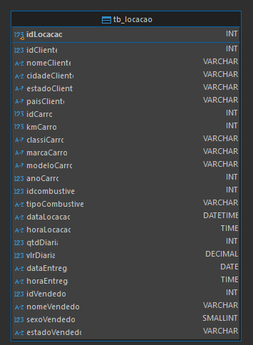

Por meio de explorações iniciais, foi possível identificar algumas relações já presentes entre valores, relevantes para a etapa de normalização, e só então foi traçado um diagrama conceitual. A seguir, algumas dessas relações não triviais:

**1. Os dados em `kmCarro` são variáveis de acordo com o `idLocacao`, logo, independem da entidade `Carro`.**

```sql
    SELECT idLocacao,
	       idCarro,
	       modeloCarro,
	       kmCarro
    FROM tb_locacao
    ORDER BY idCarro ASC, kmCarro DESC;
```

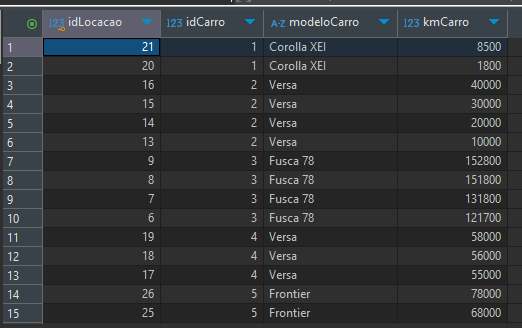

> ❗ Na seção [***Obtendo A Kilometragem Atual: Exemplo Com View***](https://github.com/jqln-vc/compass-academy/blob/main/sprint2/desafio/README.md#obtendo-a-kilometragem-atual-exemplo-de-implementa%C3%A7%C3%A3o-com-view), será mostrada uma maneira de obter os valores de kilometragem para cada veículo, de modo a facilitar a análise operacional sem comprometer a **normalização** do banco relacional.

**2. Em um único caso, o dado `vlrDiaria` apresentou variação para o mesmo `idCarro`, logo, também não poderia ser inferido por essa entidade, e foi associado ao `idLocacao`.**

```sql
    SELECT idCarro, 
           modeloCarro, 
           idLocacao, 
           vlrDiaria
    FROM tb_locacao
    WHERE idCarro IN (
        SELECT idCarro
        FROM tb_locacao
        GROUP BY idCarro
        HAVING COUNT(DISTINCT vlrDiaria) > 1
    )
    ORDER BY idCarro;
```

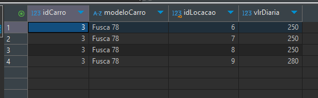

A partir dessas observações, foi construído o diagrama conceitual para fundamentar os processos seguintes. Nesta etapa, somente foi considerada a organização de entidades e seus atributos, e a cardinalidade dos relacionamentos entre entidades.

### DIAGRAMA CONCEITUAL

*Voltar para **Seções*** [֍](README.md#se%C3%A7%C3%B5es)

[//]: # (Caso não possua suporte para mermaid, sugiro abrir no site do GitHub para visualizar o diagrama a seguir ou instalar extensão compatível)

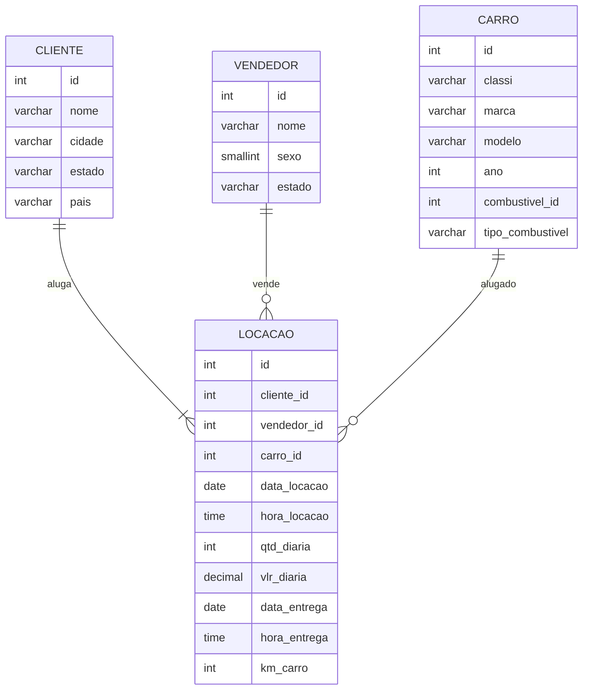

### TRATAMENTO DE DADOS

*Voltar para **Seções*** [֍](README.md#se%C3%A7%C3%B5es)

Analisando o formato das datas e horas, nota-se uma inconsistência que prejudica o reconhecimento e manipulação dos tipos de dados corretamente. Em SQLite, os formatos de datas e horas devem ser `YYYY-MM-DD` e `HH:MM`, respectivamente.

```sql
    SELECT dataLocacao,
	       horaLocacao,
	       dataEntrega,
	       horaEntrega
    FROM tb_locacao
    ORDER BY horaLocacao;
```

Abaixo, já é possível notar um problema gerado pela não adequação dos valores aos tipos: ao ordernarmos as horas de locação de modo ascendente, o valor `8:00` não é reconhecido, e fica fora de ordem.

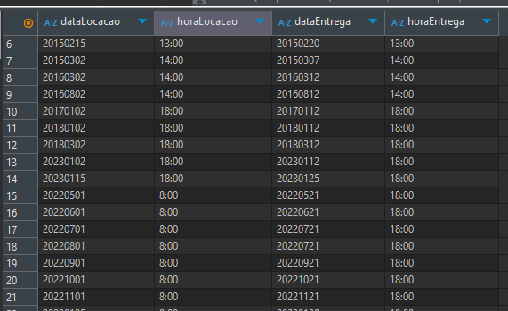

#### DATA DE LOCAÇÃO E DATA DE ENTREGA

*Voltar para **Seções*** [֍](README.md#se%C3%A7%C3%B5es)

Durante a população das tabelas normalizadas já criadas, foi utilizada a tratativa abaixo para cada atributo de data, na qual são selecionados ano, mês e dia com a função `SUBSTR` , separados por `-` por meio do operador de concatenação `||`.

- **SUBSTR ( *string*, *início*, [*quantidade de caracteres*] )** : a função subtrai e retorna um trecho de uma string, identificada pelo index do caractere (iniciado em 1).

```sql
    SUBSTR(dataLocacao, 1, 4) || '-' || 
    SUBSTR(dataLocacao, 5, 2) || '-' || 
    SUBSTR(dataLocacao, 7, 2) AS dataLocacao
```

Além disso, os tipos dos atributos divergiam em `DATE` e `DATETIME`; na criação da tabela de locação normalizada, foi mantido o tipo `DATE` para ambas.

#### HORA DE LOCAÇÃO E HORA DE ENTREGA

*Voltar para **Seções*** [֍](README.md#se%C3%A7%C3%B5es)

Para a tratativa dos dados de hora, foi necessário assegurar que a porção das horas no formato `HH:MM` sempre conteriam 2 dígitos; por exemplo, o valor `8:00` deve aparecer como `08:00` para ser reconhecido devidamente como tipo `TIME`.

- **INSTR ( *string*, *trecho buscado* )** : a função localiza e retorna o index do trecho buscado na string.
  - No caso de seleção de **hora**, ao subtrair 1 do index retornado para o separador `:` obtém-se:

    - `8:00` 1, para casos de hora com 1 dígito  
    - `12:00` 2, para casos de hora com 2 dígitos
  - Para seleção de **minutos**, soma-se 1 ao index retornado.
  - O valor retornado por esta função é inserido como parâmetro da função SUBSTR.
- **PRINTF ( *formato*, *valor1*, *[valor2]* )** : a função recebe os 2 inteiros referentes à hora e aos minutos, retornados na etapa anterior, e aplica o formato `%02d:%02d` passado como parâmetro.
  
  - `%` indica o início de um formato
  - `0` valor de preenchimento, caso o valor passado por parâmetro não contenha o mesmo número de dígitos determinado
  - `2d` quantidade de dígitos determinada
  - `:` valor literal que separa horas e minutos

```sql
    PRINTF('%02d:%02d', 
        CAST(SUBSTR(horaLocacao, 1, INSTR(horaLocacao, ':') - 1) AS INTEGER),
        CAST(SUBSTR(horaLocacao, INSTR(horaLocacao, ':') + 1) AS INTEGER)
    	) AS horaLocacao
```

### BÔNUS INVESTIGATIVO 🕵🏽‍♀️

*Voltar para **Seções*** [֍](README.md#se%C3%A7%C3%B5es)

Durante a análise do atributo `kmCarro`, foi notada uma inconsistência nas transações, na qual um dos ids apresenta uma data de locação posterior à data de entrega. Veja mais abaixo:

```sql
    SELECT idCarro, 
           modeloCarro, 
           kmCarro,
           idLocacao,
           dataLocacao,
           horaLocacao,
           dataEntrega,
           horaEntrega 
    FROM tb_locacao
    ORDER BY idCarro, kmCarro DESC;
```

Ao rodar a query acima, nota-se um problema nas transações de ids 15 e 16.


Suspeito? No mínimo. Necessário manter as observações e coletar mais indícios de atividades fraudulentas. 🧐🔎

## CONTEXTUALIZAÇÃO: SISTEMAS OLTP X OLAP

*Voltar para **Seções*** [֍](README.md#se%C3%A7%C3%B5es)

### SISTEMAS-FONTE: NORMALIZAÇÃO

*Voltar para **Seções*** [֍](README.md#se%C3%A7%C3%B5es)

O processo de **normalização** de dados é característico de sistemas OLTP, *Online Transaction Processing*, nos quais ocorrem transações em tempo real e demandam a utilização do banco de dados para processos CRUD: criação, leitura, atualização e deleção. É um sistema com intuito operacional e está atrelado às aplicações do negócio.

Os objetivos buscados com a **normalização** são[^1]:

1. *liberar a coleção de relações de dependências indesejáveis de inserção, atualização e deleção;*
2. *minimizar a necessidade de reestruturação da coleção de relações conforme novos tipos de dados são introduzidos e, com isso, aumentando o tempo de vida das aplicações;*
3. *tornar o modelo relacional mais informativo para os usuários;*
4. *tornar a coleção de relações neutra em relação às estatísticas de queries, visto que estas estão sujeitas a mudanças com o passar do tempo.*

Considerando sua aplicação, em geral, tomaram-se as decisões para as formas normais:

- padronização de tipos de dados
- eliminação de dados duplicados
- restrições de unicidade e valores não nulos, com tratamento para casos em que poderiam ocorrer

### DATA WAREHOUSE: MODELAGEM DIMENSIONAL

*Voltar para **Seções*** [֍](README.md#se%C3%A7%C3%B5es)

O processo de **modelagem dimensional** é característico de sistemas OLAP, *Online Analytical Processing*, nos quais o foco principal é a consolidação de diversos bancos de dados provenientes de sistemas-fonte diferentes, buscando uma visão histórica do negócio para análises mais complexas e suporte à tomada de decisões.

## METODOLOGIA ADOTADA: HÍBRIDO DE KIMBALL E INMON

*Voltar para **Seções*** [֍](README.md#se%C3%A7%C3%B5es)
Abaixo uma hibridização das metodologias de Inmon e Kimball, a qual serviu de inspiração para a arquitetura planejada para o projeto `Concessionária`[^2]:

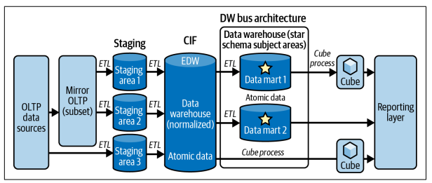

A seguir a estrutura da implementação adotada para o projeto, a ser detalhada adiante:

[//]: # (Caso não possua suporte para mermaid, sugiro abrir no site do GitHub para visualizar o diagrama a seguir ou instalar extensão compatível)

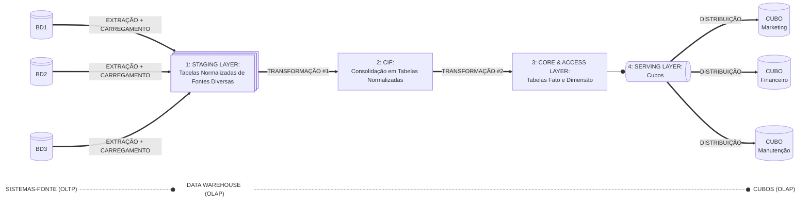

1. **Staging Layer**  
   Esta é uma camada *ad hoc*, um espaço temporário onde os dados são extraídos dos sistemas-fonte e carregados rapidamente, sem nenhuma transformação, de forma a não gerar sobrecarga na origem da ingestão. Após a transformação e armazenamento na camada CIF (a seguir), estes dados são deletados e a camada esvaziada.

   A adoção desta camada caracteriza a adoção de ingestão ELT, em que o carregamento inicial dos dados é feito sem nenhum tipo de transformação.

2. **CIF: Corporate Information Factory**  
   Uma adoção do conceito de Inmon de *Fábrica de Informação Corporativa*, aqui os dados provenientes das diversas franquias são integrados, consolidados e preservados.

   > *[...] onde todos os dados são centralizados e armazenados no nível atômico (o mais granular possível) na terceira forma normal. Pode-se considerar como um data warehouse empresarial que é uma fonte única da verdade.*[^3]

   A partir desta camada, pode-se realizar um processo de ETL reverso, realimentando os bancos dos sistemas-fonte e aprimorando as capacidades analíticas no lado operacional, respondendo necessidades imediatas integrando informações das demais franquias.

3. **Core & Access Layer**  
   Considerando o fato de que um sistema OLAP busca a otimização para análise trazida com a modelagem dimensional, optou-se por manter esta camada fisicamente, sem a utilização de views.  
   Esta escolha é um tanto trivial visto que, ainda que tivesse a aparência de um star schema, as análises ainda estariam consumindo de uma camada normalizada ao utilizar views, logo, não não se beneficiariam da modelagem dimensional.

4. **Serving Layer**  
   Na camada de distribuição serão utilizados os cubos por meio de views, os quais irão consumir os dados da camada CIF, em star schema, logo, se beneficiando da otimização para OLAP.

   > *A CIF está fora de limites aos usuários finais, que acessam os dados por meio de data marts ou cubos. Uma desvantagem é que isto implica que os dados são duplicados permanentemente até 3 vezes, para o CIF, o data mart e o cubo.*[^4]

   A utilização de views nesta camada traz diversos benefícios, além de solucionar o problema de duplicação acima, mantendo somente 2 duplicações no data warehouse, a camada de cubos com views também proporciona a aplicação de privacidade e restrições de acesso aos dados, visto que pode-se selecionar e filtrar somente os dados necessários para cada tipo de usuário final.

## PROCESSO DE NORMALIZAÇÃO

*Voltar para **Seções*** [֍](README.md#se%C3%A7%C3%B5es)

> *A inconsistência nos dados, a dificuldade em codificar o controle na inserção de dados, e gerenciamento de erros [...] são riscos reais, assim como empobrecimento em performance e a incapacidade de evolução do modelo. Esses riscos têm uma alta probabilidade de ocorrer se não aderimos às formas normais.*[^5]

### 1ª FORMA NORMAL

*Voltar para **Seções*** [֍](README.md#se%C3%A7%C3%B5es)

- assegurar atomicidade de atributos: separação de atributos multivalorados
- caracterização de chaves-primárias: localizar (ou criar, quando necessário) o atributo que identifica uma linha como única.

Para o projeto da `Concessionária`, não foi preciso realizar nenhuma tratativa de multivaloração. Nesta etapa, foram identificadas as entidades já claramente existentes, as quais continham chaves-primárias que as caracterizam. A seguir a relação dessas entidades:

|||
|:---:|:---:|
|**Entidade**|**Chave-Primária**|
|Locação|*idLocacao*|
|Carro|*idCarro*|
|Combustível|*idcombustivel*|
|Cliente|*idCliente*|
|Vendedor|*idVendedor*|

### 2ª FORMA NORMAL

*Voltar para **Seções*** [֍](README.md#se%C3%A7%C3%B5es)

Para obter a 2ª forma normal, foram identificados os atributos que não possuem dependência total da chave-primária da entidade. Isso ocorre nos casos de `Marca`, `Combustível`, `Estado` e `País`; a seguir uma exemplificação a partir de `marcaCarro` :

```sql
    SELECT idCarro,
           classiCarro,
           modeloCarro,
           marcaCarro
    FROM tb_locacao tl ;
```

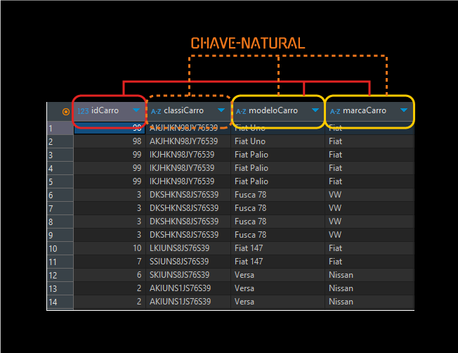

> *Para remover dependências de parte da chave, precisamos criar tabelas (tal qual car_model). Cada uma das chaves dessas novas tabelas serão parte da chave para nossa tabela original [...] Então devemos mover todos os atributos que dependem dessas novas chaves para as novas tabelas [...] Assim que finalizarmos a remoção dos atributos que dependem de somente parte da chave, nossas tabelas estarão na 2ª forma normal (2NF).*[^6]

Acima nota-se que `marcaCarro` possui dependência parcial de `modeloCarro`. Contudo, nota-se que o ideal seria manter somente a dependência total aparente manifestada pelo atributo `classiCarro`, o qual parece inferir todos os demais valores dos atributos da entidade `Carro`: `modeloCarro`, `marcaCarro`, etc.

> ❗ **Isso não foi feito por falta de confirmações de que essa chave-natural seria sempre única, porém com mais informações sobre a regra de negócio da `Concessionária`, seria uma futura implementação.**

Considerou-se também que uma das finalidades desse processo é a eliminação de redundâncias:

> *Dados duplicados são custosos, tanto em termos de espaço em disco quanto capacidade de processamento, mas também introduzem um grande aumento de possibilidade dos dados se tornarem corrompidos. A corrupção acontece quando uma instância de um valor é modificada, mas a modificação simultânea (e idêntica) do mesmo dado mantido em outra parte do banco de dados falha em ocorrer.*[^7]

Bem como a otimização da performance de queries:

> *Se você deseja visualizar uma lista selecionada de modelos de carro disponíveis, uma tabela desnormalizada irá requerer uma aplicação de SELECT DISTINCT em todos os carros disponíveis [...] isso não só significa escanear muito mais linhas do que teríamos que fazer com uma tabela `car_model` separada, mas também significa ter que ordenar todas essas linhas para eliminar duplicações.*[^8]

Portanto, com esse objetivo em mente, os atributos referentes à `cidade` do cliente e `estado` do vendedor, mesmo dependentes da chave-primária destas entidades, foram removidos para suas respectivas tabelas. Abaixo as entidades já identificadas na 1NF, as novas entidades e suas respectivas novas chaves-primárias:

|||
|:---:|:---:|
|**Entidade**|**Chave-Primária**|
|Locação|*idLocacao*|
|Carro|*idCarro*|
|Combustível|*idcombustivel*|
|Cliente|*idCliente*|
|Vendedor|*idVendedor*|
|Marca|*marca_id*|
|Cidade|*cidade_id*|
|Estado|*estado_id*|
|País|*pais_id*|

### 3ª FORMA NORMAL

*Voltar para **Seções*** [֍](README.md#se%C3%A7%C3%B5es)

Com frequência, após a obtenção da 2ª forma normal, é possível já se ter chegado também à 3ª forma normal. No entanto, não foi o caso, aqui são retomadas as observações não-triviais de `vlrDiaria` e `kmCarro` identificadas na seção [Compreensão Inicial dos Dados](README.md#compreens%C3%A3o-inicial-dos-dados).

> *A 3NF é alcançada quando não podemos inferir o valor de um atributo por nenhum outro atributo que não seja pertencente à chave única.*[^9]

### CONCESSIONÁRIA: BANCO RELACIONAL NORMALIZADO

*Voltar para **Seções*** [֍](README.md#se%C3%A7%C3%B5es)

A seguir, a execução do script de normalização:


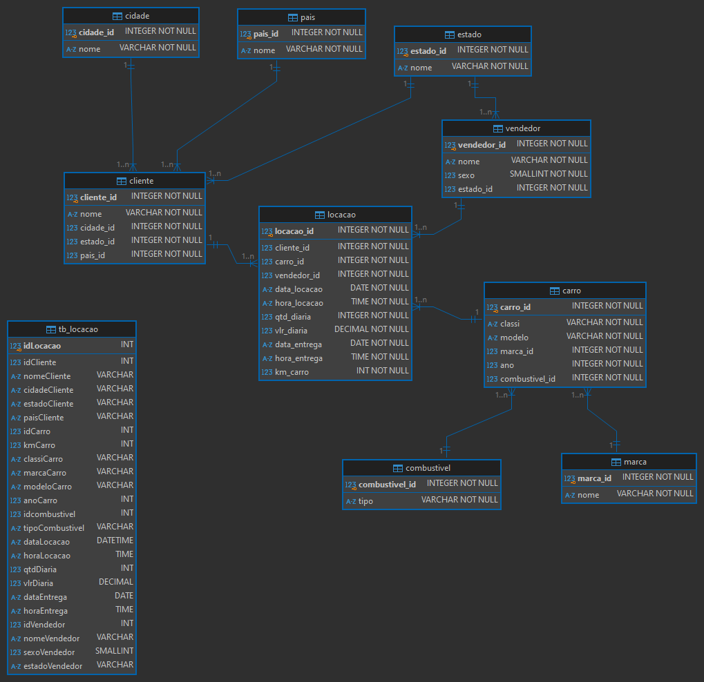

#### OBTENDO A KILOMETRAGEM ATUAL: EXEMPLO DE IMPLEMENTAÇÃO COM VIEW

*Voltar para **Seções*** [֍](README.md#se%C3%A7%C3%B5es)

Uma objeção dos utilizadores do banco de dados, com a remoção da relação de km com o id dos veículos após a normalização, pode ser a não trivialidade no acesso do valor atual de kilometragem para cada veículo da base.

Retomando a 1ª e 4ª motivações de Codd, o banco normalizado busca a otimização de inserção, atualização e deleção (e consultas rápidas e pontuais); logo, não é recomendado prejudicar as dependências do banco para ater-se a necessidades de buscas específicas.

No entanto, esse tipo de problema pode ser facilmente solucionado com a implementação de uma view, tornando os dados normalizados mais intuitivos aos usuários finais:

```sql
    CREATE VIEW kilometragem (
			carro_id,
			classi,
			modelo,
			ano,
			km_atual
	)
    AS
    SELECT car.carro_id,
           car.classi,
           car.modelo,
           car.ano,
           MAX(loc.km_carro) as km_atual
    FROM carro car
    JOIN locacao loc
        ON car.carro_id = loc.carro_id
    GROUP BY car.carro_id, car.modelo
    ORDER BY 1, 3 DESC;
```

A partir da criação da view `kilometragem` , pode-se analisar o portfolio de veículos, e obter informações como o fato de que "*os veículos mais rodados não são necessariamente os mais antigos*", como é possível notar no modelo Frontier.

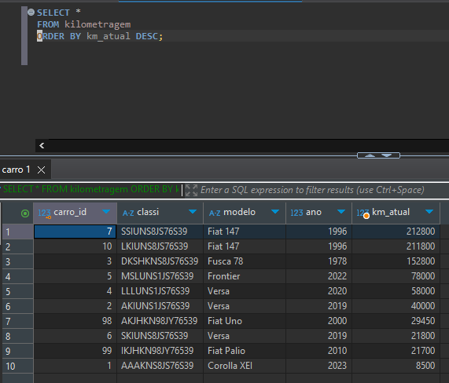

## PROCESSO DE MODELAGEM DIMENSIONAL

*Voltar para **Seções*** [֍](README.md#se%C3%A7%C3%B5es)

> *Modelos dimensionais usam um processo chamado **desnormalização**, no qual você inclui cópias redundantes dos dados em diversas tabelas. Isso reduz o número de tabelas. Quando você realiza uma busca no banco de dados, não há necessidade de fazer joins entre tantas tabelas, tornando a busca muito mais rápida. [...] No entanto, significa que as cópias redundantes de dados precisam ser mantidas em sincronia para assegurar a integridade dos dados [...]*[^10]

Um **fato** é caracterizado por:

- numérico e mensurável
- medidas e métricas
- não é lógico (booleano)

A **tabela-fato** contém os fatos, os quais no caso da `Concessionária` são caracterizados pelos atributos que definem as transações de locações.

### SURROGATE KEYS: CHAVES SUBSTITUTAS

*Voltar para **Seções*** [֍](README.md#se%C3%A7%C3%B5es)

Pensando no contexto de data warehouse, os dados extraídos são provenientes de diversos sistemas-fonte, cada um com seu schema e sequência de ids de chaves primárias. Durante o processo de consolidação desses dados, a boa prática é criar **chaves substitutas**, ***surrogate keys***, que servirão de chaves primárias e manterão a sequência e unicidade no data warehouse.

As principais motivações para substituição das chaves naturais originárias são[^11]:

- *podem ser mais longas e complexas do que chaves substitutas e, logo, mais complicadas para lidar;*
- *geralmente contêm informação sensível, o que pode resultar em questões de privacidade;*
- *geralmente geram dificuldades devido a formatos duplicados e despadronizados. [...] Duplicações podem ser um problema ao mesclar ou comparar dados entre sistemas diferentes, e a inconsistência entre formatos pode complicar o processo de integração ainda mais.*

As **chaves naturais**, as chaves primárias trazidas dos sistemas-fonte, podem ser mantidas como referência dentro das suas respectivas tabelas dimensão.

O projeto atual para a `Concessionária` lida com uma única fonte de dados, no entanto, caso surjam novas franquias, esse seria um problema já solucionado. Abaixo, um exemplo de uma possível inconsistência na dimensão `Carro` tratada com a utilização de ***surrogate keys***:

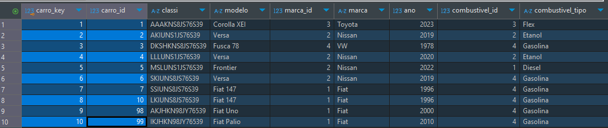

### TABELA-FATO LOCAÇÃO: TIPO SNAPSHOT ACUMULATIVO

*Voltar para **Seções*** [֍](README.md#se%C3%A7%C3%B5es)

A regra de negócio identificada pelas transações de locação no projeto `Concessionária` indica que cada fato é demarcado por uma data de início, `data_locacao`, e uma data de finalização, `data_entrega`. Essa característica implica na implementação de uma tabela-fato do tipo **snapshot acumulativo**:

> *Uma linha em uma tabela-fato de snapshot acumulativo sumariza os eventos mensurados que ocorrem em etapas previsíveis entre o início e o fim de um processo. [...] Existe uma chave-estrangeira de data na tabela-fato para cada etapa crítica do processo. Uma linha individual [...] é inicialmente inserida quando a transação é criada. Conforme o progresso do pipeline ocorre, a linha do fato acumulativo é revisitada e atualizada.*[^12]

Verifica-se que as surrogate-keys referentes à dimensão de data foram geradas a partir do formato da data em `YYYYMMDD` convertido no tipo `INTEGER`.

> *Tipicamente, a data associada a uma série de métricas (uma linha) na tabela-fato não será armazenada como uma coluna do tipo data, mas como um número gerado pelo sistema que irá referenciar uma linha na tabela dimensão data, a qual será declinada em todas as formas possíveis.*[^13]


A seguir, a demonstração da tabela-dimensão `data_dim`.

#### DIMENSÃO DATA: TIPO ROLE-PLAYING

*Voltar para **Seções*** [֍](README.md#se%C3%A7%C3%B5es)

Uma dimensão do tipo **role-playing** é aquela referenciada mais de uma vez por um fato. Nas tabelas de tipo **snapshot acumulativo** é comum acontecer com a dimensão de tempo, referenciada ao demarcar início e fim das etapas temporais de um fato.

No diagrama, a existência de uma dimensão **role-playing** é caracterizada por mais de uma relação entre a tabela fato e a dimensão.

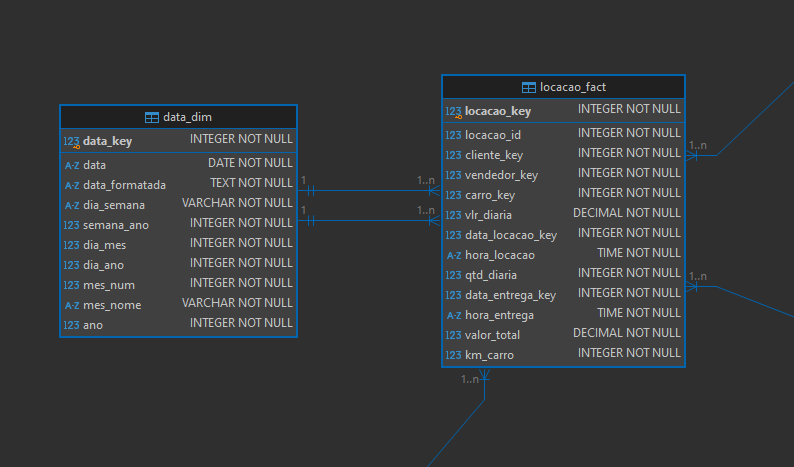

### STAR SCHEMA

*Voltar para **Seções*** [֍](README.md#se%C3%A7%C3%B5es)

- todas as dimensões de uma hierarquia representadas em **uma tabela dimensional**
- um único nível de distância da **tabela fato**
- menor quantidade de joins necessários
- relações simples entre chave-primária->chave-estrangeira
- maior armazenamento necessário para dados dimensionais (maior duplicação)
- tabela dimensão "não-normalizada" (maior duplicação)

A partir das tabelas já normalizadas, foi executado o script de modelagem dimensional em star schema:


Visto que não existiam tabelas-dimensão suficientes, o diagrama não contempla as 5 pontas da estrela. 😢

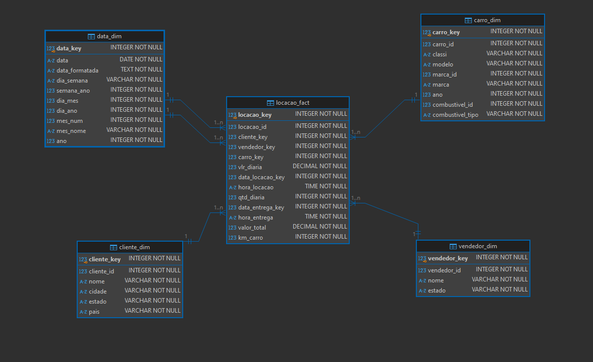

### SNOWFLAKE SCHEMA

*Voltar para **Seções*** [֍](README.md#se%C3%A7%C3%B5es)

- cada dimensão de uma hierarquia representadas em **uma tabela dimensional**
- um ou mais níveis de distância da **tabela fato** ao longo de cada hierarquia
- maior quantidade de joins necessários
- relações complexas entre chave-primária->chave-estrangeira
- menor armazenamento necessário para dados dimensionais (menor duplicação)
- tabela dimensão "normalizada" (menor duplicação)


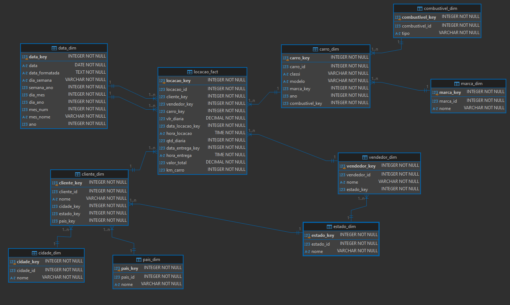

### CUBOS: CAMADA DE ANÁLISE MULTIDIMENSIONAL

*Voltar para **Seções*** [֍](README.md#se%C3%A7%C3%B5es)

Com a query abaixo, implementada na view `locacoes_dia_semana`, é demonstrado visualmente o conceito de análise multidimensional por cubos, a qual ocorre na etapa de distribuição e consumo dos dados em um sistema OLAP.

> *Um banco de dados OLAP é tipicamente composto de um ou mais cubos. Em um cubo OLAP, os dados são pré-agregados [...] isto é, já foram sumarizados e agrupados por certas dimensões [...] Criar um cubo OLAP geralmente involve a utilização de um modelo multidimensional, o qual utiliza-se de um schema em star ou snowflake para representar os dados.*[^14]

```sql
    CREATE VIEW locacoes_dia_semana (
        carro_key,
        modelo,
        dia_semana,
        dias_locado,
        lucro_total
    )
    AS
    SELECT loc.carro_key,
        car.modelo,
        dt.dia_semana,
        SUM(loc.qtd_diaria) AS dias_locado,
        SUM(loc.valor_total) AS lucro_total
    FROM locacao_fact loc
    JOIN carro_dim car
        ON loc.carro_key = car.carro_key 
    JOIN data_dim dt 
        ON loc.data_locacao_key = dt.data_key
    GROUP BY loc.carro_key, dt.dia_semana
    ORDER BY 1 ASC;

    SELECT * FROM locacoes_dias_semana;
```

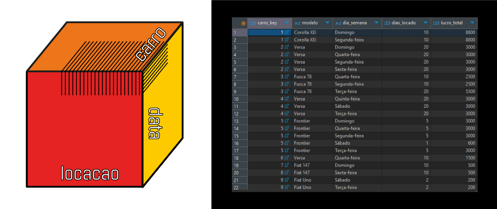

Na metodologia adotada para o projeto `Concessionária`, em vista do escopo estreito dos dados tratados, optou-se por não utilizar uma camada de ***data marts***, utilizando a distribuição dos dados diretamente por meio de cubos.

> *A view também pode ser utilizada em cubos. [...] Usar views simplifica o gerenciamento de variações rápidas e proporciona controle total de quaisquer joins enviados à fonte da qual o cubo consome os dados.*[^15]

Os benefícios advindos da adoção de cubos são mais do que suficientes para o projeto[^16]:

- *proporciona uma camada semântica;*
- *lida com diversos usuários concorrentes;*
- *obtém melhor performance com dados agregados;*
- *evita a necessidade de lidar com joins e relacionamentos;*
- *pode conter hierarquias e KPIs;*
- *integra segurança ao nível da tupla/linha, a qual aumenta a privacidade de dados ao restringir acesso de usuário a linhas;específicas;*
- entre outros.

No script `concessionaria_cubos.sql`, além da view bidimensional para kilometragem denominada `base_veiculos`, foram implementados como exemplo 3 análises multidimensionais, os quais responderiam às seguintes análises:

- `lucro_locacao_veiculos` : **locação x carro x data**  
  Análise de quantidade de dias locados e lucro total de modelos de veículos, por dia da semana de locaçao.
- `lucro_vendedores` | **vendedor x locação x carro x data**  
  Análise de lucro total de vendedores, por modelo de veículo e dia da semana de locação.
- `gasto_veiculo_clientes` | **cliente x locação x carro x data**  
  Análise de quantidade de dias locados e gasto total de clientes, por modelo de preferência e dia da semana da locação.

## FUTURAS MELHORIAS NO PROJETO

*Voltar para **Seções*** [֍](README.md#se%C3%A7%C3%B5es)

- Tratativa de atributo `model`: remover valores referentes ao atributo `marca`.
- Tratativa de atributo `marca`: padronizar de valores, por exemplo, "VW" para "Volkswagen".
- Normalização da entidade `Carro`: após confirmação de unicidade da chave-natural `classi`, manter todos os demais atributos como chaves-estrangeiras, criando então uma nova tabela para `modelo`.

## CONSIDERAÇÕES FINAIS

*Voltar para **Seções*** [֍](README.md#se%C3%A7%C3%B5es)

Para o projeto de normalização e modelagem dimensional da `Concessionária` foi levado em conta uma utilização a médio prazo, com a possível integração de outras franquias no projeto, e a utilização de um data warehouse para a integração e consolidação dos dados para análise otimizada do negócio em sua totalidade.

A normalização seria, inicialmente, aplicada diretamente nos sistemas OLTP de cada franquia. Contudo, ocorreria uma nova etapa de normalização no processo de extração e ingestão desses bancos de dados no data warehouse, em uma camada CIF que serviria como ***single source of truth***, também servindo como fonte de backup e integração de dados para os sistemas-fonte OLTP, por meio de ETL Reverso.

Após isso, a modelagem dimensional ocorreria em outra camada Core, onde seria armazenada em star schema e alimentaria a distribuição de cubos, implementados em views, aos usuários finais.

A metodologia adotada para o design do data warehouse foi uma hibridização dos modelos de Inmon e Kimball, adaptada às necessidades atuais do projeto. No entanto, conforme este torna-se mais complexo, existe a possibilidade de agregar novas camadas sem prejuízo à arquitetura atual.

---

## REFERÊNCIAS

*Voltar para **Seções*** [֍](README.md#se%C3%A7%C3%B5es)

*Publicações indicadas na seção [Bibliografia](../README.md#bibliografia), localizada no diretório `sprint2`.*

[^1]: CODD, 1971, p. 1
[^2]: SERRA, 2024, p. 118
[^3]: Ibid., p. 114
[^4]: Ibid., p. 116
[^5]: FAROULT, 2006, p. 5
[^6]: Ibid., p. 9
[^7]: Ibid., p. 10
[^8]: Ibid., p. 9
[^9]: Ibid., p. 9
[^10]: SERRA, 2024, p. 109
[^11]: Ibid., p. 107
[^12]: KIMBALL, ROSS; 2013, p. 44
[^13]: FAROULT, 2006, p. 265
[^14]: SERRA, 2024, p. 92
[^15]: Ibid., p. 119
[^16]: Ibid., p. 118
