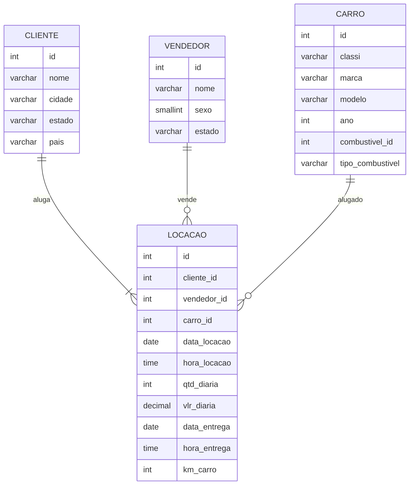
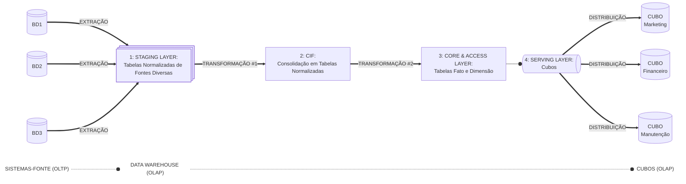

#

||
|---|
||
||

## SEÇÕES

- **Compreensão Inicial dos Dados** [֍]()
  - Diagrama Conceitual [֍]()
    - Tratamento de Dados [֍]()
    - Data de Locação e Data de Entrega [֍]()
    - Hora de Locação e Hora de Entrega [֍]()
  - Bônus Investigativo [֍]()
- **Contextualização: Sistemas OLTP x OLAP** [֍]()
  - Sistemas-Fonte: Normalização [֍]()
  - Data Warehouse: Modelagem Dimensional [֍]()
- **Metodologia Adotada: Híbrido de Inmon e Kimball** [֍]() 
- **Processo de Normalização** [֍]()
  - 1NF [֍]()
  - 2NF [֍]()
  - 3NF [֍]()
  - Concessionária: Banco Relacional Normalizado [֍]()
    - Obtendo a Kilometragem Atual: Exemplo de Implementação com View [֍]()
- **Processo de Modelagem Dimensional** [֍]()
  - Surrogate Keys: Chaves Substitutas [֍]()
  - Tabela-Fato Locação: Tipo Snapshot Acumulativo [֍]()
    - Dimensão Data: Tipo Role-Playing [֍]()
  - Star Schema [֍]()
  - Snowflake Schema [֍]()
  - Cube Slicing: Exemplo de Análise Multidimensional [֍]()
- **Considerações Finais** [֍]()
- **Referências** [֍]()

## COMPREENSÃO INICIAL DOS DADOS

*Voltar para **Seções*** [֍]()

Antes de iniciar qualquer processamento, é preciso compreender não somente os dados a serem tratados, mas também qual seu contexto de utilização, a finalidade das transformações a serem feitas, bem como uma projeção de necessidades de negócio futuras.

As etapas de **normalização** e **modelagem dimensional** foram projetadas considerando o sistema em que esses dados seriam encontrados e quais tipos de ações seriam aplicadas em cada contexto.

Primeiramente, os dados foram observados em seu estado bruto.


Por meio de explorações iniciais, foi possível identificar algumas relações já presentes entre valores, relevantes para a etapa de normalização, e só então foi traçado um diagrama conceitual. A seguir, algumas dessas relações não triviais:

**1. Os dados em `kmCarro` são variáveis de acordo com o `idLocacao`, logo, independem da entidade `Carro`.**

```sql
    SELECT idLocacao,
	       idCarro,
	       modeloCarro,
	       kmCarro
    FROM tb_locacao
    ORDER BY idCarro ASC, kmCarro DESC;
```


> ❗ Na seção [***Obtendo A Kilometragem Atual: Exemplo Com View***](), será mostrada uma maneira de obter os valores de kilometragem para cada veículo, de modo a facilitar a análise operacional sem comprometer a **normalização** do banco relacional.

**2. Em um único caso, o dado `vlrDiaria` apresentou variação para o mesmo `idCarro`, logo, também não poderia ser inferido por essa entidade, e foi associado ao `idLocacao`.**

```sql
    SELECT idCarro, 
           modeloCarro, 
           idLocacao, 
           vlrDiaria
    FROM tb_locacao
    WHERE idCarro IN (
        SELECT idCarro
        FROM tb_locacao
        GROUP BY idCarro
        HAVING COUNT(DISTINCT vlrDiaria) > 1
    )
    ORDER BY idCarro;
```


A partir dessas observações, foi construído o diagrama conceitual para fundamentar os processos seguintes. Nesta etapa, somente foi considerada a organização de entidades e seus atributos, e a cardinalidade dos relacionamentos entre entidades.

### DIAGRAMA CONCEITUAL

*Voltar para **Seções*** [֍]()

[//]: # (Caso não possua suporte para mermaid, sugiro abrir no site do GitHub para visualizar o diagrama a seguir ou instalar extensão compatível)



### TRATAMENTO DE DADOS

*Voltar para **Seções*** [֍]()

Analisando o formato das datas e horas, nota-se uma inconsistência que prejudica o reconhecimento e manipulação dos tipos de dados corretamente. Em SQLite, os formatos de datas e horas devem ser `YYYY-MM-DD` e `HH:MM`, respectivamente.

```sql
    SELECT dataLocacao,
	       horaLocacao,
	       dataEntrega,
	       horaEntrega
    FROM tb_locacao
    ORDER BY horaLocacao;
```

Abaixo, já é possível notar um problema gerado pela não adequação dos valores aos tipos: ao ordernarmos as horas de locação de modo ascendente, o valor `8:00` não é reconhecido, e fica fora de ordem.


#### DATA DE LOCAÇÃO E DATA DE ENTREGA

*Voltar para **Seções*** [֍]()

Durante a população das tabelas normalizadas já criadas, foi utilizada a tratativa abaixo para cada atributo de data, na qual são selecionados ano, mês e dia com a função `SUBSTR` , separados por `-` por meio do operador de concatenação `||`.

- **SUBSTR ( *string*, *início*, [*quantidade de caracteres*] )** : a função subtrai e retorna um trecho de uma string, identificada pelo index do caractere (iniciado em 1).

```sql
    SUBSTR(dataLocacao, 1, 4) || '-' || 
    SUBSTR(dataLocacao, 5, 2) || '-' || 
    SUBSTR(dataLocacao, 7, 2) AS dataLocacao
```

Além disso, os tipos dos atributos divergiam em `DATE` e `DATETIME`; na criação da tabela de locação normalizada, foi mantido o tipo `DATE` para ambas.

#### HORA DE LOCAÇÃO E HORA DE ENTREGA

*Voltar para **Seções*** [֍]()

Para a tratativa dos dados de hora, foi necessário assegurar que a porção das horas no formato `HH:MM` sempre conteriam 2 dígitos; por exemplo, o valor `8:00` deve aparecer como `08:00` para ser reconhecido devidamente como tipo `TIME`.

- **INSTR ( *string*, *trecho buscado* )** : a função localiza e retorna o index do trecho buscado na string.
  - No caso de seleção de **hora**, ao subtrair 1 do index retornado para o separador `:` obtém-se:

    - `8:00` 1, para casos de hora com 1 dígito  
    - `12:00` 2, para casos de hora com 2 dígitos
  - Para seleção de **minutos**, soma-se 1 ao index retornado.
  - O valor retornado por esta função é inserido como parâmetro da função SUBSTR.
- **PRINTF ( *formato*, *valor1*, *[valor2]* )** : a função recebe os 2 inteiros referentes à hora e aos minutos, retornados na etapa anterior, e aplica o formato `%02d:%02d` passado como parâmetro.
  
  - `%` indica o início de um formato
  - `0` valor de preenchimento, caso o valor passado por parâmetro não contenha o mesmo número de dígitos determinado
  - `2d` quantidade de dígitos determinada
  - `:` valor literal que separa horas e minutos

```sql
    PRINTF('%02d:%02d', 
        CAST(SUBSTR(horaLocacao, 1, INSTR(horaLocacao, ':') - 1) AS INTEGER),
        CAST(SUBSTR(horaLocacao, INSTR(horaLocacao, ':') + 1) AS INTEGER)
    	) AS horaLocacao
```

### BÔNUS INVESTIGATIVO 🕵🏽‍♀️

*Voltar para **Seções*** [֍]()

Durante a análise do atributo `kmCarro`, foi notada uma inconsistência nas transações, na qual um dos ids apresenta uma data de locação posterior à data de entrega. Veja mais abaixo:

```sql
    SELECT idCarro, 
           modeloCarro, 
           kmCarro,
           idLocacao,
           dataLocacao,
           horaLocacao,
           dataEntrega,
           horaEntrega 
    FROM tb_locacao
    ORDER BY idCarro, kmCarro DESC;
```

Ao rodar a query acima, nota-se um problema nas transações de ids 15 e 16.


Suspeito? No mínimo. Necessário manter as observações e coletar mais indícios de atividades fraudulentas. 🧐🔎

## CONTEXTUALIZAÇÃO: SISTEMAS OLTP X OLAP

*Voltar para **Seções*** [֍]()

### SISTEMAS-FONTE: NORMALIZAÇÃO

*Voltar para **Seções*** [֍]()

O processo de **normalização** de dados é característico de sistemas OLTP, *Online Transaction Processing*, nos quais ocorrem transações em tempo real e demandam a utilização do banco de dados para processos CRUD: criação, leitura, atualização e deleção. É um sistema com intuito operacional e está atrelado às aplicações do negócio.

Os objetivos buscados com a **normalização** são (CODD, 1971, p. 1):

1. *Liberar a coleção de relações de dependências indesejáveis de inserção, atualização e deleção;*
2. *minimizar a necessidade de reestruturação da coleção de relações conforme novos tipos de dados são introduzidos e, com isso, aumentando o tempo de vida das aplicações;*
3. *tornar o modelo relacional mais informativo para os usuários;*
4. *tornar a coleção de relações neutra em relação às estatísticas de queries, visto que estas estão sujeitas a mudanças com o passar do tempo.*

Considerando sua aplicação, em geral, tomaram-se as decisões para as formas normais:

- padronização de tipos de dados
- eliminação de dados duplicados
- restrições de unicidade e valores não nulos, com tratamento para casos em que poderiam ocorrer

### DATA WAREHOUSE: MODELAGEM DIMENSIONAL

*Voltar para **Seções*** [֍]()

O processo de **modelagem dimensional** é característico de sistemas OLAP, *Online Analytical Processing*, nos quais o foco principal é a consolidação de diversos bancos de dados provenientes de sistemas-fonte diferentes, buscando uma visão histórica do negócio para análises mais complexas e suporte à tomada de decisões.

## METODOLOGIA ADOTADA: HÍBRIDO DE KIMBALL E INMON

Abaixo uma hibridização das metodologias de Inmon e Kimball, a qual serviu de inspiração para a arquitetura planejada para o projeto `Concessionária` (SERRA, 2024, p. 118):


A seguir a estrutura da implementação adotada para o projeto, a ser detalhada adiante:

[//]: # (Caso não possua suporte para mermaid, sugiro abrir no site do GitHub para visualizar o diagrama a seguir ou instalar extensão compatível)



1. **Staging Layer**
2. **CIF: Corporate Information Factory**  
   Uma adoção do conceito de Inmon de *Fábrica de Informação Corporativa*, aqui os dados provenientes das diversas franquias são integrados, consolidados e preservados.

   > *[...] onde todos os dados são centralizados e armazenados no nível atômico (o mais granular possível) na terceira forma normal. Pode-se considerar como um data warehouse empresarial que é uma fonte única da verdade.* (SERRA, 2024, p. 114)

3. **Core & Access Layer**
   Considerando o fato de que um sistema OLAP busca a otimização para análise trazida com a modelagem dimensional
   
4. **Serving Layer**

> The CIF is off-limits to end users, who access data through the data marts or cubes.
One drawback is that this means the data is permanently duplicated up to three times
for the CIF, the data mart, and the cube. (p. 116)

## PROCESSO DE NORMALIZAÇÃO

*Voltar para **Seções*** [֍]()

> *A inconsistência nos dados, a dificuldade em codificar o controle na inserção de dados, e gerenciamento de erros [...] são riscos reais, assim como empobrecimento em performance e a incapacidade de evolução do modelo. Esses riscos têm uma alta probabilidade de ocorrer se não aderimos às formas normais.* (FAROULT, p.5)

### 1NF

*Voltar para **Seções*** [֍]()

- assegurar atomicidade de atributos: separação de atributos multivalorados
- caracterização de chaves-primárias: localizar (ou criar, quando necessário) o atributo que identifica uma linha como única.

### 2NF

*Voltar para **Seções*** [֍]()

> *To remove dependencies on a part of the key, we must create tables (such ascar_model).The keys of those new tables will each be a part of the key for our original table (in ourexample, make, model, version, and style). Then we must move all the attributes thatdepend on those new keys to the new tables, and retain only make, model, version, andstyle in the original table. We may have to repeat this process, since the engine and itscharacteristics will not depend on the style. Once we have completed the removal ofattributes that depend on only a part of the key, our tables are insecond normal form (2NF).* (FAROULT, p. 9)

> There are two issues with the storage ofredundant data. First, redundant data increases the odds of encountering contra-dictory information because of input errors (and it makes correction more time-consuming). Second, redundant data is an obvious storage waste. [...] Besidesthe mere cost of storage, sometimes—more importantly—there is also the issueof recovery. [...] a database that is twice as big as necessarywill take twice the time to restore than would otherwise be needed. (FAROULT, p. 9)


### 3NF

*Voltar para **Seções*** [֍]()

> 3NF is reached when we cannotinfer the value of an attribute from any attribute other than those in the unique key. FAROULT, p. 9
>
> duplicate data is costly, both in terms of disk spaceand processing power, but it also introduces a much-increased possibility of databecoming corrupt. Corruption happens when one instance of a data value ismodified, but the same data held in another part of the database fails to be simul-taneously (and identically) modified. (FAROULT, p.10)

### CONCESSIONÁRIA: BANCO RELACIONAL NORMALIZADO

*Voltar para **Seções*** [֍]()

A seguir, a execução do script de normalização:


#### OBTENDO A KILOMETRAGEM ATUAL: EXEMPLO DE IMPLEMENTAÇÃO COM VIEW

*Voltar para **Seções*** [֍]()

Uma objeção dos utilizadores do banco de dados, com a remoção da relação de km com o id dos veículos após a normalização, pode ser a não trivialidade no acesso do valor atual de kilometragem para cada veículo da base.

Retomando a 1ª e 4ª motivações de Codd, o banco normalizado busca a otimização de inserção, atualização e deleção (e consultas rápidas e pontuais); logo, não é recomendado prejudicar as dependências do banco para ater-se a necessidades de buscas específicas.

No entanto, esse tipo de problema pode ser facilmente solucionado com a implementação de uma view, tornando os dados normalizados mais intuitivos aos usuários finais:

```sql
    CREATE VIEW kilometragem (
			carro_id,
			classi,
			modelo,
			ano,
			km_atual
	)
    AS
    SELECT car.carro_id,
           car.classi,
           car.modelo,
           car.ano,
           MAX(loc.km_carro) as km_atual
    FROM carro car
    JOIN locacao loc
        ON car.carro_id = loc.carro_id
    GROUP BY car.carro_id, car.modelo
    ORDER BY 1, 3 DESC;
```

A partir da criação da view `kilometragem` , pode-se analisar o portfolio de veículos, e obter informações como o fato de que "*os veículos mais rodados não são necessariamente os mais antigos*", como é possível notar no modelo Frontier.


## PROCESSO DE MODELAGEM DIMENSIONAL

*Voltar para **Seções*** [֍]()

> *Modelos dimensionais usam um processo chamado **desnormalização**, no qual você inclui cópias redundantes dos dados em diversas tabelas. Isso reduz o número de tabelas. Quando você realiza uma busca no banco de dados, não há necessidade de fazer joins entre tantas tabelas, tornando a busca muito mais rápida. [...] No entanto, significa que as cópias redundantes de dados precisam ser mantidas em sincronia para assegurar a integridade dos dados [...]* (SERRA, 2024, p. 109)

Um **fato** é caracterizado por:

- numérico e mensurável
- medidas e métricas
- não é lógico (booleano)

A **tabela-fato** contém os fatos, os quais no caso da `Concessionária` são caracterizados pelos atributos que definem as transações de locações.

### SURROGATE KEYS: CHAVES SUBSTITUTAS

*Voltar para **Seções*** [֍]()

Pensando no contexto de data warehouse, os dados extraídos são provenientes de diversos sistemas-fonte, cada um com seu schema e sequência de ids de chaves primárias. Durante o processo de consolidação desses dados, a boa prática é criar **chaves substitutas**, ***surrogate keys***, que servirão de chaves primárias e manterão a sequência e unicidade no data warehouse.

As principais motivações para substituição das chaves naturais originárias são (SERRA, 2024, p.107):

- *podem ser mais longas e complexas do que chaves substitutas e, logo, mais complicadas para lidar;*
- *geralmente contêm informação sensível, o que pode resultar em questões de privacidade;*
- *geralmente geram dificuldades devido a formatos duplicados e despadronizados. [...] Duplicações podem ser um problema ao mesclar ou comparar dados entre sistemas diferentes, e a inconsistência entre formatos pode complicar o processo de integração ainda mais.*

As **chaves naturais**, as chaves primárias trazidas dos sistemas-fonte, podem ser mantidas como referência dentro das suas respectivas tabelas dimensão.

O projeto atual para a `Concessionária` lida com uma única fonte de dados, no entanto, caso surjam novas franquias, esse seria um problema já solucionado. Abaixo, um exemplo de uma possível inconsistência na dimensão `Carro` tratada com a utilização de ***surrogate keys***:


### TABELA-FATO LOCAÇÃO: TIPO SNAPSHOT ACUMULATIVO

*Voltar para **Seções*** [֍]()

A regra de negócio identificada pelas transações de locação no projeto `Concessionária` indica que cada fato é demarcado por uma data de início, `data_locacao`, e uma data de finalização, `data_entrega`. Essa característica implica na implementação de uma tabela-fato do tipo **snapshot acumulativo**:

> *Uma linha em uma tabela-fato de snapshot acumulativo sumariza os eventos mensurados que ocorrem em etapas previsíveis entre o início e o fim de um processo. [...] Existe uma chave-estrangeira de data na tabela-fato para cada etapa crítica do processo. Uma linha individual [...] é inicialmente inserida quando a transação é criada. Conforme o progresso do pipeline ocorre, a linha do fato acumulativo é revisitada e atualizada.* (KIMBALL, ROSS, p. 44)

In addition to the date
foreign keys associated with each critical process step, accumulating snapshot fact
tables contain foreign keys for other dimensions and optionally contain degenerate dimensions. (KIMBALL, ROSS, p. 44)

> Typically, the dateassociated with a series of measures (a row) in the fact table will not be stored as a datecolumn in the fact table, but as a system-generated number that will reference a row inthedate_dimension table in which the date will bedeclinedunder all possible forms. (p. 265)


#### DIMENSÃO DATA: TIPO ROLE-PLAYING

*Voltar para **Seções*** [֍]()

Uma dimensão do tipo **role-playing** é aquela referenciada mais de uma vez por um fato. Nas tabelas de tipo **snapshot acumulativo** é comum acontecer com a dimensão de tempo, referenciada ao demarcar início e fim das etapas temporais de um fato.

No diagrama, a existência de uma dimensão **role-playing** é caracterizada por mais de uma relação entre a tabela fato e a dimensão.


### STAR SCHEMA

*Voltar para **Seções*** [֍]()

- todas as dimensões de uma hierarquia representadas em **uma tabela dimensional**
- um único nível de distância da **tabela fato**
- menor quantidade de joins necessários
- relações simples entre chave-primária->chave-estrangeira
- maior armazenamento necessário para dados dimensionais (maior duplicação)
- tabela dimensão "não-normalizada" (maior duplicação)

A partir das tabelas já normalizadas, foi executado o script de modelagem dimensional em star schema:


### SNOWFLAKE SCHEMA

*Voltar para **Seções*** [֍]()

- cada dimensão de uma hierarquia representadas em **uma tabela dimensional**
- um ou mais níveis de distância da **tabela fato** ao longo de cada hierarquia
- menor quantidade de joins necessários
- relações complexas entre chave-primária->chave-estrangeira
- menor armazenamento necessário para dados dimensionais (menor duplicação)
- tabela dimensão "normalizada" (menor duplicação)


### CUBE SLICING: EXEMPLO DE ANÁLISE MULTIDIMENSIONAL

*Voltar para **Seções*** [֍]()

Com a query abaixo, é demonstrado visualmente o conceito de análise multidimensional por cubos, a qual ocorre na etapa de distribuição e consumo dos dados em um sistema OLAP.

> *Um banco de dados OLAP é tipicamente composto de um ou mais cubos. Em um cubo OLAP, os dados são pré-agregados [...] isto é, já foram sumarizados e agrupados por certas dimensões [...] Criar um cubo OLAP geralmente involve a utilização de um modelo multidimensional, o qual utiliza-se de um schema em star ou snowflake para representar os dados.* (SERRA, 2024, p. 92)

```sql
    SELECT loc.carro_key,
	   car.modelo,
	   dt.dia_semana,
	   SUM(loc.qtd_diaria) AS dias_locado,
	   SUM(loc.valor_total) AS lucro_total
    FROM locacao_fact loc
    JOIN carro_dim car
        ON loc.carro_key = car.carro_key 
    JOIN data_dim dt 
        ON loc.data_locacao_key = dt.data_key
    GROUP BY loc.carro_key, dt.dia_semana
    ORDER BY 1 ASC;
```


Na metodologia adotada para o projeto `Concessionária`, em vista do escopo estreito dos dados tratados, optou-se por não utilizar uma camada de ***data marts***, utilizando a distribuição dos dados diretamente por meio de cubos.

Os benefícios advindos da adoção de cubos é mais do que suficiente para o projeto (SERRA, 2024, p. 118):

- proporciona uma camada semântica;
- lida com diversos usuários concorrentes;
- obtém melhor performance com dados agregados;
- evita a necessidade de lidar com joins e relacionamentos;
- pode conter hierarquias e KPIs;
- integra segurança ao nível da tupla/linha, a qual aumenta a privacidade de dados ao restringir acesso de usuário a linhas;específicas;
- entre outros.

> *A view também pode ser utilizada em cubos. [...] Usar views simplifica o gerenciamento de variações rápidas e proporciona controle total de quaisquer joins enviados à fonte da qual o cubo consome os dados.* (SERRA, 2024, p. 119)

## CONSIDERAÇÕES FINAIS

*Voltar para **Seções*** [֍]()

Para o projeto de normalização e modelagem dimensional da `Concessionária` foi levado em conta uma utilização a médio prazo, com a possível integração de outras franquias no projeto, e a utilização de um data warehouse para a integração e consolidação dos dados para análise otimizada do negócio em sua totalidade.

A normalização seria, inicialmente, aplicada diretamente nos sistemas OLTP de cada franquia. Sem prejuízo de uma nova etapa de normalização no processo de extração e ingestão desses sistemas-fontes no data warehouse, a qual serviria como ***single source of truth*** e um backup potencial para os sistemas-fonte OLTP.

A metodologia adotada foi uma hibridização dos modelos de Inmon e Kimball, adaptada às necessidades atuais do projeto. No entanto, conforme este torna-se mais complexo, existe a possibilidade de agregar novas camadas sem prejuízo à arquitetura atual.

---

## REFERÊNCIAS

*Voltar para **Seções*** [֍]()

*Publicações indicadas na seção [Bibliografia](https://github.com/jqln-vc/compass-academy/blob/main/sprint2/README.md#bibliografia), localizada no diretório `sprint2`.*
