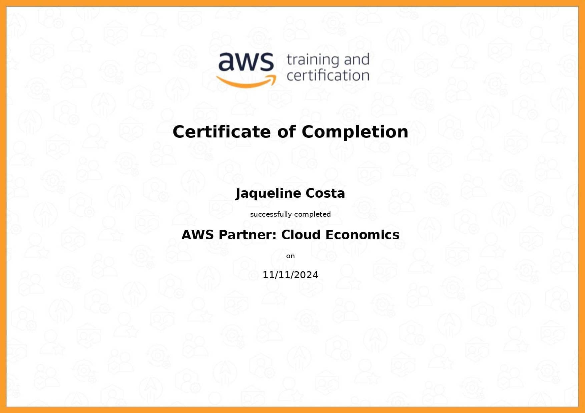

#

||
|---|
||
||

## RELATOS DE APRENDIZADO

### Python & ETL

### AWS Partner: Cloud Economics

---

## EXERCÍCIOS

Todos os códigos dos exercícios foram implementados seguindo as recomendações de estilo do PEP8, indicado na seção [Bibliografia](#bibliografia).

## DESAFIO

## EVIDÊNCIAS

Na pasta `evidencias`, encontram-se prints referentes a momentos de execução do código, exemplificando abordagens adotadas para a conclusão do desafio.  
No passo a passo explicativo, encontrado na pasta `desafio`, serão comentados outros prints de pontos específicos.

## CERTIFICADOS AWS SKILL BUILDER

### AWS Partner: Cloud Economics

| |
|---|
||
||

## CERTIFICADOS COMPLEMENTARES

Para absorver melhor o conteúdo desta sprint e me aprofundar em pontos de interesse, concluí em paralelo os cursos abaixo, externos à Udemy.

## BIBLIOGRAFIA

VAN ROSSUM, Guido; WARSAW, Barry; COGHLAN, Alyssa. **PEP 8 – Style Guide for Python Code**. Última atualização: 2013. Disponível em: <[peps.python.org/pep-0008/](https://peps.python.org/pep-0008/)>.
