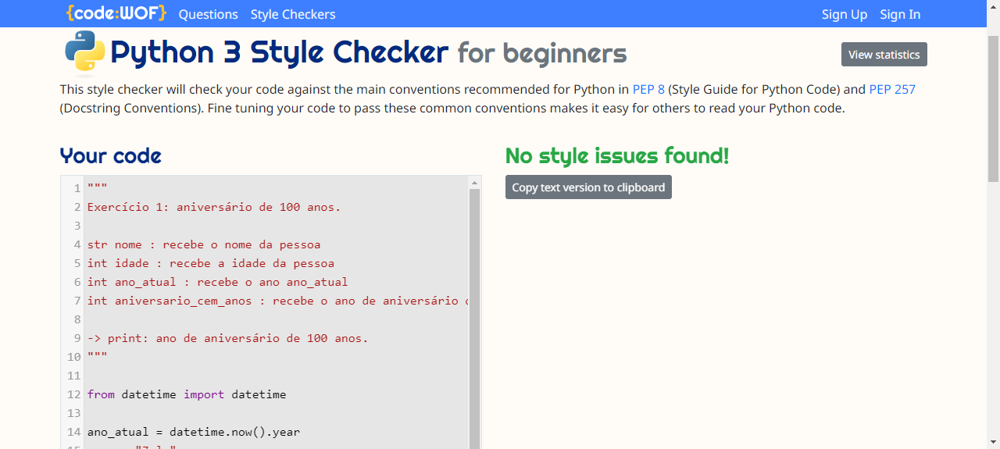
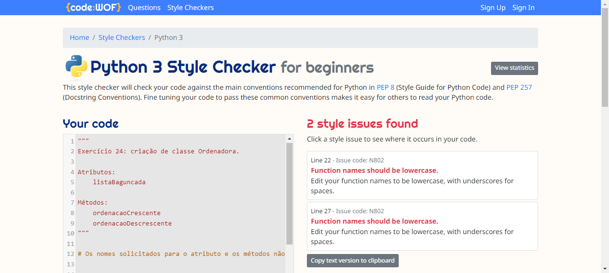
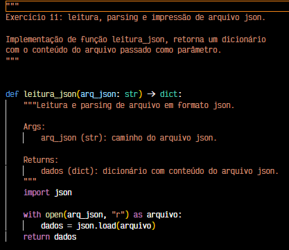
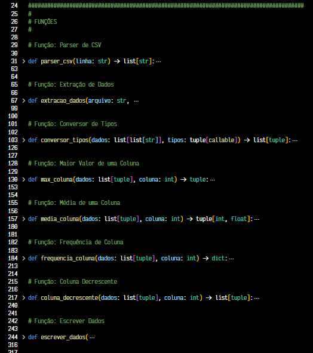
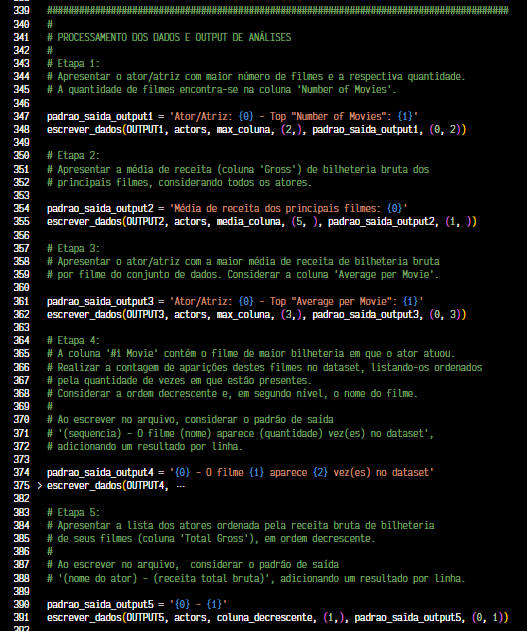

#

||
|---|
||
||

## EXERCÍCIOS

Todos os códigos dos exercícios foram implementados seguindo os Python Enhancement Proposal, especificamente as recomendações de estilo do PEP8 e convenções de docstrings do PEP257, indicados na seção [Bibliografia](#bibliografia), com validação no [*CodeWOF: Python 3 Style Checker*](https://www.codewof.co.nz/style/python3/) online.

Na pasta `evidencias`, estão localizadas as imagens com a validação de cada exercício.

> ❗ Vale ressaltar que, devido às especificações de nomes de métodos e variáveis solicitadas no exercício 24 não estarem em conformidade com o PEP8, não foi possível obter a validação desse exercício.

### PARTE I

- [Exercício 1](./exercicios/exercicio1.py)
- [Exercício 2](./exercicios/exercicio2.py)
- [Exercício 3](./exercicios/exercicio3.py)
- [Exercício 4](./exercicios/exercicio4.py)
- [Exercício 5](./exercicios/exercicio5.py)

### PARTE 2

- [Exercício 6](./exercicios/exercicio6.py)
- [Exercício 7](./exercicios/exercicio7.py)
- [Exercício 8](./exercicios/exercicio8.py)
- [Exercício 9](./exercicios/exercicio9.py)
- [Exercício 10](./exercicios/exercicio10.py)
- [Exercício 11](./exercicios/exercicio11.py)
- [Exercício 12](./exercicios/exercicio12.py)
- [Exercício 13](./exercicios/exercicio13.py)
- [Exercício 14](./exercicios/exercicio14.py)
- [Exercício 15](./exercicios/exercicio15.py)
- [Exercício 16](./exercicios/exercicio16.py)
- [Exercício 17](./exercicios/exercicio17.py)
- [Exercício 18](./exercicios/exercicio18.py)
- [Exercício 19](./exercicios/exercicio19.py)
- [Exercício 20](./exercicios/exercicio20.py)
- [Exercício 21](./exercicios/exercicio21.py)
- [Exercício 22](./exercicios/exercicio22.py)
- [Exercício 23](./exercicios/exercicio23.py)
- [Exercício 24](./exercicios/exercicio24.py)
- [Exercício 25](./exercicios/exercicio25.py)

### SCRIPT ETL & RELATÓRIOS

- [Script ETL](./exercicios/etl.py)
  - [Relatório - Etapa 1](./exercicios/etl-etapa1.txt)
  - [Relatório - Etapa 2](./exercicios/etl-etapa2.txt)
  - [Relatório - Etapa 3](./exercicios/etl-etapa3.txt)
  - [Relatório - Etapa 4](./exercicios/etl-etapa4.txt)
  - [Relatório - Etapa 5](./exercicios/etl-etapa5.txt)

## DESAFIO

- [Notebook: Google Play Store](./desafio/analise_playstore.ipynb)

## EVIDÊNCIAS

Na pasta `evidencias`, encontram-se prints referentes a momentos de execução do código, exemplificando abordagens adotadas para a conclusão do desafio.  
No passo a passo explicativo, encontrado na pasta `desafio`, serão comentados outros prints de pontos específicos.

### PEP8

#### Exercícios Parte I: Validação PEP8

#### Exercícios Parte I: Não Conformidade com PEP8 - Exercício 24

### PEP257: Convenções de Docstrings | *Docstrings Conventions*

O propósito desse PEP é documentar as semânticas e convenções associadas com ***docstrings***. É uma boa prática que assegura legibilidade, manutenibilidade e clareza ao código e às intenções do desenvolvedor.

> *Uma **docstring** é uma string literal que ocorre como primeira declaração em um módulo, função, classe ou definição de método. Essa **docstring** torna-se o atributo especial `__doc__` daquele objeto.
> Todos os módulos devem, normalmente, conter docstrings, e todas as funções e classes exportadas por um módulo também devem conter docstrings. Métodos públicos (incluindo o construtor `__init__`) também deve conter docstrings.* (VAN ROSSUM; GOODGER, 2001)

A seguir um exemplo de docstrings no início do script do Exercício 11, e dentro das funções. Bem como a utilização de *type hinting*, uma boa prática de manutenção e documentação do código:

### Exercício ETL: Modularização de Script em Seções e Funções

A seguir a adoção de modularização do processo em funções especializadas para lidar com cada etapa do pipeline ETL:

E a seção de execução das funções e consumo dos dados já tratados, demonstrando a reutilização de código e aplicação do conceito DRY:

## BIBLIOGRAFIA

FAROULT, Stephane; ROBSON, Peter. **The Art of SQL**. Sebastopol: O'Reilly, 2006.

VAN ROSSUM, Guido; WARSAW, Barry; COGHLAN, Alyssa. **PEP 8 – Style Guide for Python Code**. Última atualização: 2013. Disponível em: <[peps.python.org/pep-0008/](https://peps.python.org/pep-0008/)>.  

VAN ROSSUM, Guido; GOODGER, David. **PEP 257 – Docstring Conventions**. Última atualização: 2001. Disponível em: <[peps.python.org/pep-0257/](https://peps.python.org/pep-0257/)>.

VIAFORE, Patrick. **Robust Python: Write Clean and Maintainable Code**. Sebastopol: O'Reilly, 2021.  

WILKER, Claus O. **Fundamentals of Data Visualization: A Primer on Making Informative and Compelling Figures**. Sebastopol: O'Reilly, 2019.
