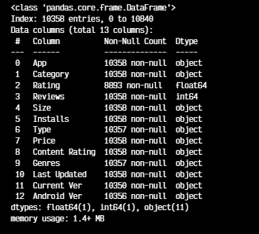
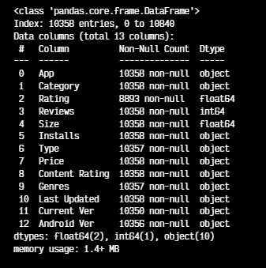
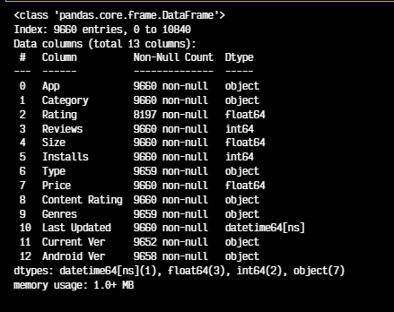
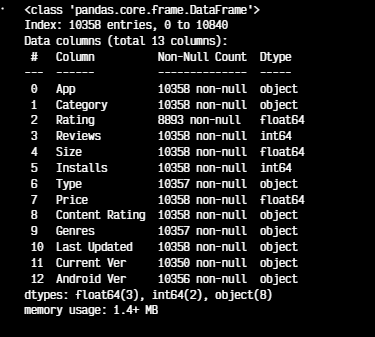

#

||
|---|
||
||

## SEÇÕES

## INTRODUÇÃO AO DATASET: GOOGLE PLAY STORE

Para este projeto, foram realizados os tratamentos iniciais e primeiras análises de um dataset da Google Play Store. Porém, antes de começar qualquer tratamento nos dados, e análises subsequentes, é importante a familiarização com o dataset e com a finalidade do projeto.

Para a manipulação do dataset foi utilizada a biblioteca Pandas e, para a plotagem dos gráficos, a biblioteca Matplotlib.

### CONTEXTO DOS DADOS

Ao importar o arquivo `csv` com a biblioteca Pandas, ele assume o tipo `DataFrame`, o qual contém diversos métodos de manipulação de dados. A seguir, uma amostra com as 5 primeiras linhas do dataset utilizando `head()`, o qual assume o valor 5 por *default* porém pode receber outros valores como parâmetro.  

```python
    df.head()
```


O dataset fornece informações referentes a categorias e gêneros de aplicativos, quantidade média de estrelas, quantidade de avaliações, mínimo de instalações atuais, última data de atualização, etc. O intuito desta análise é entender tendências de consumo atuais, explorando nichos e lacunas, para caracterizar o mercado de aplicativos antes do desenvolvimento e lançamento de novos produtos.

### TAMANHO DO DATASET

O tamanho do dataset, descrito pelo seu "formato" em linhas (*rows*) e colunas (*columns*), pode ser acessado pelo atributo `shape`. Obtém-se o valor de `10841` linhas e `13` colunas:

```python
    df.shape

    >> (10841, 13)
```

É importante ter uma noção não só da quantidade de atributos nas colunas, mas também da quantidade de linhas com que se está lidando, principalmente ao começar a fazer os recortes de filtros, entendendo se a quantidade de linhas retornadas é condizente com o total do dataset.

### TIPOS DOS DADOS

Com o método `ìnfo()` é possível visualizar o schema da tabela: além das colunas e respectivos tipos, quantidade de linhas, também é obtida a quantidade de valores nulos em cada coluna.

```python
    df.info()
```


Nota-se que a maior quantidade de valores nulos está na coluna `Rating`. Além disso, com relação aos tipos, basicamente todo o restante das colunas está com o tipo `object`, que é um tipo padrão do Pandas para colunas com tipos variados / misturados.

Portanto, antes de qualquer análise dessas colunas, será necessário tratá-las para valores numéricos adequados aos dados.

### PADRÕES DE VALORES NAS COLUNAS

A seguir, serão analisados os valores distintos de algumas colunas de interesse para as primeiras análises, utilizando os métodos `nunique()` e `unique()` para obter quantidade e amostra desses valores respectivamente.

#### VALORES DISTINTOS: CATEGORY & GENRES

```python
    # Amostra de valores distintos da coluna Category
    print(f"Quantidade de valores distintos: {df['Category'].nunique()}.\n \
      {'-'*100}\nAmostra de valores:\n\n{df['Category'].unique()}")
```


```python
    print(f"Quantidade de valores distintos: {df['Genres'].nunique()}.\n \
      {'-'*100}\nAmostra de valores:\n\n{df['Genres'].unique()}")
```


O padrão geral identificado para a coluna `Category` são valores todos em maiúsculas com underlines em lugar de espaços para separar as palavras. Um valor está fora do padrão e deve ser identificado:

```python
    df[df['Category'] == '1.9']
```


Nota-se que, ao comparar com a amostra de valores obtida com `head()` anteriormente, os valores da linha `10472` estão deslocados à esquerda, sendo o valor `1.9`, contido em `Category`, referente à coluna da direita `Rating`.

O tratamento desta linha será especificado na seção seguinte, o qual deve ocorrer antes de qualquer tratamento de tipos, visto que valores fora do padrão causam erros ao realizar a conversão.

Para a coluna `Genres` é identificada a presença de multivaloração, utilizando `;` como separador, a qual poderá ser tratada num momento futuro, mas por agora não irá interferir nas análises iniciais.

Abaixo serão priorizadas as visualizações dos padrões das demais colunas numéricas de interesse para as conversões de tipos.

#### VALORES DISTINTOS: REVIEWS

Os valores de `Reviews` serão convertidos para `int`:

```python
    # Amostra de valores distintos da coluna Reviews
    print(f"Quantidade de valores distintos: {df['Reviews'].nunique()}.\n \
      {'-'*100}\nAmostra de valores:\n\n{df['Reviews'].unique()}")
```


#### VALORES DISTINTOS: SIZE

Os valores de `Size` serão convertidos para `float`. Para o tratamento, será necessário adotar uma única medida de grandeza, convertendo os valores em kilobytes para megabytes, e verificar se existem outros casos fora desse padrão:

```python
    # Amostra de valores distintos da coluna Size
    print(f"Quantidade de valores distintos: {df['Size'].nunique()}.\n \
      {'-'*100}\nAmostra de valores:\n\n{df['Size'].unique()}")
```


#### VALORES DISTINTOS: INSTALLS

Os valores de `Installs` serão convertidos para `int`. Para o tratamento, será necessário remover as vírgulas e o `+` ao final dos valores. Além disso, posteriormente, a coluna será renomeada para refletir a semântica de que os valores são referentes ao "mínimo de instalações".

```python
    # Amostra de valores distintos da coluna Installs
    print(f"Quantidade de valores distintos: {df['Installs'].nunique()}.\n \
      {'-'*100}\nAmostra de valores:\n\n{df['Installs'].unique()}")
```


#### VALORES DISTINTOS: PRICE

Os valores de `Price` serão convertidos para `float`. Para o tratamento, será necessário remover os símbolos `$`.

```python
    # Amostra de valores distintos da coluna Price
    print(f"Quantidade de valores distintos: {df['Price'].nunique()}.\n \
      {'-'*100}\nAmostra de valores:\n\n{df['Price'].unique()}")
```


#### VALORES DISTINTOS: LAST UPDATED

Os valores de `Last Updated` serão convertidos para `datetime`. Não será necessário nenhum tipo de tratamento, pois os dados já estão em um formato adequado para a conversão.

```python
    # Amostra de valores distintos da coluna Last Updated
    print(f"Quantidade de valores distintos: {df['Last Updated'].nunique()}.\n \
      {'-'*100}\nAmostra de valores:\n\n{df['Last Updated'].unique()}")
```


## TRATAMENTO DE DADOS

### IDENTIFICAÇÃO E CARACTERIZAÇÃO DE DUPLICAÇÕES

> *The question of null values is probably the thorniest issue of the relational theory. [...] The problem is that “notknown” may encompass quite a number of different cases. Let’s consider a list of famouswriters, each with a birth date and a death date. A null birth date would unambiguouslymean “unknown.” But what does a null death date mean? Alive? We don’t know whenthis author died? We don’t know whether this author is alive or not? [...] I don’t find it unusual to have null values for, to put it in Rumsfeldese, “knownunknowns,” attributes that are known to exist and have some value we don’t know atone point in time, for various reasons. For the rest, speculating leads nowhere.* (FAROULT, ROBSON; 2006, p. 14)

### LINHA 10472: DESLOCAMENTO DE VALORES

```python
    # Obtendo os valores atuais da linha 10472
    valores = df.loc[10472].tolist()

    # Convertendo valores[1] para float, visto que a coluna 'Ratings' já possui tipo float64
    valores[1] = float(valores[1])

    # Mantendo o valor inicial da coluna 'App', adicionando 'Não Informado' na coluna seguinte, e deslocando o restante dos valores para a direita
    valores_realocados = [valores[0]] + ['NAO_INFORMADO'] + valores[1:-1]

    # Atualizando os valores no DataFrame com os valores realocados
    df.loc[10472] = valores_realocados
```


### CONVERSÃO DE TIPOS

Antes da conversão dos tipos em cada coluna, após uma análise superficial com a relação de valores únicos, foi realizada uma análise mais aprofundada considerando os padrões esperados para cada coluna.

Para tanto, foram utilizados padrões em expressões regulares, para localizar valores alfabéticos, numéricos, sufixos, caracteres especiais, etc, em colunas em que não deveriam aparecer.

#### REGEX: EXPRESSÕES REGULARES

Aplicando uma conversão temporária para `string` com `.str`, utiliza-se o método `contains()` com padrões RegEx, para identificar valores na coluna que contenham o padrão indicado.

Para os casos em que era necessário a extração de padrões específicos das colunas, desprezando símbolos e/ou valores desnecessários, foi utilizado o método `extract()` que utiliza um padrão RegEx para capturar strings. O parâmetro `expand` retorna:

- `True` o DataFrame completo
- `False` somente o Array com a coluna

A seguir a descrição detalhada de alguns padrões utilizados:

- `[a-zA-Z]+` um ou mais caracteres alfabéticos, incluindo minúsculas e maiúsculas
- `^[0-9]+\.?[0-9]*[^Mk]$` um ou mais valores numéricos, com ou sem decimal, que não terminem em M ou k
- `^[0-9]+\.?[0-9]*k$` um ou mais valores numéricos, com ou sem decimal, que terminem k
- `^[^0-9].*$` ao menos um caractere não-numérico

### CONVERSÃO: COLUNA REVIEWS

Após a confirmação com RegEx, de que a coluna não continha nenhum valor não-numérico, foi feita a conversão para `int` .

```python
    # Confirmação de que nenhum valor não-numérico seria retornado
    df[df['Reviews'].str.contains(r'[a-zA-Z]+', regex=True, na=False)]

    # Conversão da coluna para integer
    df['Reviews'] = df['Reviews'].astype(int)
    df.info()
```



### CONVERSÃO: COLUNA SIZE

Para a conversão da coluna `Size`, foi optado pelo tipo `float` e todos os valores em *megabytes*, sendo necessária a conversão daqueles em *kilobytes*. Antes disso, é necessário confirmar que existe somente esses sufixos de tamanho, pois poderiam também existir valores em *gigabytes*, por exemplo.

A coluna será posteriormente renomeada para indicar que os valores estão em *megabytes*, pois somente serão mantidos os valores numéricos.

```python
    # Confirmação de que nenhum outro sufixo existe entre os valores
    df[df['Size'].str.contains(r'^[0-9]+\.?[0-9]*[^Mk]$', regex=True)]
```

A seguir, foi criada uma **máscara booleana** (*boolean mask*) para identificar quais valores estão em *kilobytes*:

```python
    # Localizando valores em kilobytes e salvando em uma variável boolean mask
    kilobytes_mask = df['Size'].str.contains(r'^[0-9]+\.?[0-9]*k$', regex=True)
```

A seguir, a máscara é aplicada na coluna `Size` para capturar somente os valores em *kilobytes* e realizar a conversão para *megabytes* dividindo por `1000` :

```python
    df.loc[kilobytes_mask, 'Size'] = (                    # Atualizando a coluna com as modificações a seguir
        df.loc[kilobytes_mask, 'Size']                    # Selecionando somente os valores True em 'kilobytes_mask'
        .str.extract(r'([0-9]+\.?[0-9]*)', expand=False)  # Extraindo somente a parte numérica
        .astype(float)                                    # Convertendo para float
        .div(1000)                                        # Convertendo para megabytes
    )
```

A extração dos valores numéricos das colunas remanescentes em *megabytes* foi feita adotando a mesma lógica acima, com uma alteração no padrão utilizado na máscara booleana:

```python
    # Localizando valores em megabytes e salvando em uma variável boolean mask
    megabytes_mask = df['Size'].str.contains(r'^[0-9]+\.?[0-9]*M$', regex=True, na=False)

    # Conversão para float
    df.loc[megabytes_mask, 'Size'] = (                    # Atualizando a coluna com as modificações a seguir
        df.loc[megabytes_mask, 'Size']                    # Selecionando somente os valores True em 'megabytes_mask'
        .str.extract(r'([0-9]+\.?[0-9]*)', expand=False)  # Extraindo somente a parte numérica
        .astype(float)                                    # Convertendo para float
    )
```

A seguir é verificada a existência de valores não-numéricos, para esses casos de `Varies with device`, foi adotado um número que receberia a semântica de "valor variável", para isso foi optado um número negativo que não ocorreria naturalmente no dataset.


```python
    # Verificação de existência de valores não numéricos
    df[df['Size'].str.contains(r'^[^0-9].*$', regex=True, na=False)]

    # Confirmação de que não existiriam outros valores não-numéricos | só retorna 'Varies with device'
    df[df['Size'].str.contains(r'^[^0-9].*$', regex=True, na=False)]['Size'].unique()

    # Substituição de 'Varies with device' para o valor -1
    df.loc[df['Size'].str.contains(r'^[^0-9].*$', regex=True, na=False), 'Size'] = -1
```

Após isso, foi possível a conversão total da coluna para `float` :

```python
    df['Size'] = df['Size'].astype(float)
    df.info()
```



### CONVERSÃO: COLUNA INSTALLS

Para a coluna `Installs`, foram removidas as vírgulas e desconsiderados os caracteres finais `+` antes da conversão para `int` . Esta é uma coluna que deverá ser renomeada posteriormente para refletir a semântica perdida com a remoção de `+`.

O método `replace()` substitui as ocorrências de `,` por "nada", realizando a remoção. Em seguida, os valores não numéricos são extraídos, desprezando os `+` :

```python
    df['Installs'] = df['Installs'].str.replace(',', '')
    df['Installs'] = df['Installs'].str.extract(r'([0-9]+\.?[0-9]*)', expand=False)
```

Com isso, é realizada a conversão:

```python
    df['Installs'] = df['Installs'].astype(int)
    df.info()
```



### CONVERSÃO: COLUNA PRICE

Para a coluna `Price`, foi desprezado o caractere `$` e realizada a conversão para `float` :

```python
    # Extração dos valores numéricos
    df['Price'] = df['Price'].str.extract(r'([0-9]+\.?[0-9]*)', expand=False)

    df['Price'] = df['Price'].astype(float)
    df.info()
```



### CONVERSÃO: COLUNA LAST UPDATED

A coluna `Last Updated` foi convertida para `datetime`, como já estava em um formato reconhecido, não foi necessário realizar nenhum tratamento adicional:

```python
    df['Last Updated'] = pd.to_datetime(df['Last Updated'])
    df.info()
```


## ESTATÍSTICA DESCRITIVA & VISUALIZAÇÃO DE DADOS

- Mostrar os dados
- Reduzir as desordenações
- Integrar gráficos e textos
- Evitar o "gráfico espaguete"
- Começar com o cinza

### TOP 5 APPS: Nº DE INSTALAÇÕES | *BAR PLOT*

Antes de plotar o **gráfico de barras (*bar plot*)** solicitado para a análise, foi verificada a quantidade de apps com o valor máximo de instalações do dataset:

```python
    df[df['Installs'] == df['Installs'].max()].value_counts().sum()

```

O código acima retorna `20` linhas, ou seja, existem "Top 20 Apps de Instalações". Abaixo a relação desses aplicativos:


Com um gráfico de 5 barras, não é possível visualizar a quantidade total nem a relação desses valores com os demais, pois a amostra é pequena e o valor é constante.


#### VISUALIZAÇÃO ALTERNATIVA: HORIZONTAL BAR PLOT

Uma alternativa para compreender melhor quais as tendências que norteiam um alto número de instalações é entender visualizar quais as `Categorias` e os `Gêneros` mais baixados, e para isso será utilizado um **gráfico de barras horizontal (*horizontal bar plot*)**.


### DISTRIBUIÇÃO DE FREQUÊNCIA DE CATEGORIAS | *PIE PLOT*

Devido ao grande número de categorias diferentes na coluna `Category`, o  **gráfico de pizza (*pie plot*)** solicitado para esta análise não apresenta uma boa visualização da relação de valores entre as diversas categorias, e a legibilidade também fica comprometida.


#### VISUALIZAÇÃO ALTERNATIVA: HORIZONTAL BAR PLOT


### APP MAIS CARO

```python
    df.nlargest(1, 'Price')
```

### QUANTIDADE DE APPS COM CLASSIFICAÇÃO 'MATURE 17+'

```python
    df[df['Content Rating'] == 'Mature 17+']['Content Rating'].value_counts()
```


#### VISUALIZAÇÃO ALTERNATIVA: CLASSIFICAÇÃO ETÁRIA | BAR PLOT


### TOP 10 APPS: Nº DE REVIEWS


### APPS 5 ESTRELAS: DISTRIBUIÇÃO POR GÊNERO E Nº DE AVALIAÇÕES

```python
    # Agrupando os dados por 'Genre', agregando pela quantidade de 'Apps' e a soma de 'Reviews'
    sumario_genero = cinco_estrelas.groupby('Genres').agg(
        contagem_apps=('App', 'count'),                     # Contando a quantidade de Apps em cada gênero
        total_reviews=('Reviews', 'sum')                    # Soma de avaliações para cada gênero
    ).reset_index()

    # Ordenando por 'contagem_apps' para organizar os pontos por quantidade de 'Apps'
    sumario_genero = sumario_genero.sort_values('contagem_apps', ascending=False)
```


> ❗ *Não é a lista completa, algumas linhas não couberam.*

#### RELACIONAMENTOS X-Y | *BUBBLE SCATTER PLOT*

> ***Gráficos de dispersão, ou scatter plots**, [...] representam a visualização arquetipal quando queremos mostrar uma variável quantitativa em relação a outra. Se temos três variáveis quantitativas, podemos mapear uma delas no tamanho do ponto, criando uma variante do gráfico de dispersão chamada **gráfico de bolha (bubble chart)***. (WILKER, 2019, p. 41)


### PIOR APP: QUANTIDADE DE ESTRELAS

### QUANTIDADES

> 8The most common approach to visualizing amounts (i.e., numerical values shown for
some set of categories) is using bars, either vertically or horizontally arranged (Chap‐
ter 6).* (WILKER, 2019, p. 37)

#### BAR PLOT

> *To save horizontal space, we could place the bars closer together and rotate the labels
(Figure 6-2). However, I am not a big proponent of rotated labels. I find the resulting
plots awkward and difficult to read. And, in my experience, whenever the labels are
too long to place horizontally, they also don’t look good rotated.* (WILKER, 2019, p. 46)

> *The better solution for long labels is usually to swap the x and y axes, so that the bars
run horizontally (Figure 6-3). After swapping the axes, we obtain a compact figure in
which all visual elements, including all text, are horizontally oriented. As a result, the
figure is much easier to read [...]. (WILKER, 2019, p. 47)

> * Regardless of whether we place bars vertically or horizontally, we need to pay atten‐
tion to the order in which the bars are arranged. I often see bar plots where the bars
are arranged arbitrarily or by some criterion that is not meaningful in the context of
the figure. Some plotting programs arrange bars by default in alphabetical order of
the labels, and other similarly arbitrary arrangements are possible (Figure 6-4). In
general, the resulting figures are more confusing and less intuitive than figures where
bars are arranged in order of their size.* (WILKER, 2019, p. 48)

##### STACKED BAR PLOT

> *Stacking is useful when the sum of the amounts repre‐
sented by the individual stacked bars is in itself a meaningful amount.* (WILKER, 2019, p. 52)

> *Figure 6-10 differs from the previous bar plots I have shown in that there is no
explicit y axis. I have instead shown the actual numerical values that each bar repre‐
sents. Whenever a plot is meant to display only a small number of different values, it
makes sense to add the actual numbers to the plot. This substantially increases the
amount of information conveyed by the plot without adding much visual noise, and
it removes the need for an explicit y axis.* (WILKER, 2019, p. 53)

#### DOT PLOT

> * If we had used bars
instead of dots (Figure 6-12), we’d have made a much less compelling figure. Because
the bars are so long in this figure, and they all have nearly the same length, the eye is
drawn to the middle of the bars rather than to their endpoints, and the figure fails to
convey its message.* (WILKER, 2019, p. 54)

> *Regardless of whether we use bars or dots, however, we need to pay attention to the ordering of the data values. In Figures 6-11 and 6-12, the countries are ordered in
descending order of life expectancy. If we instead ordered them alphabetically, we’d
end up with a disordered cloud of points that is confusing and fails to convey a clear
message (Figure 6-13)*. (WILKER, 2019, p. 55)


### PROPORÇÕES

> *Proportions can be visualized as pie charts, side-by-side bars, or stacked bars (Chap‐
ter 10). As for amounts, when we visualize proportions with bars, the bars can be
arranged either vertically or horizontally. Pie charts emphasize that the individual
parts add up to a whole and highlight simple fractions. However, the individual pieces are more easily compared in side-by-side bars. Stacked bars look awkward for a single
set of proportions, but can be useful when comparing multiple sets of proportions. When visualizing multiple sets of proportions or changes in proportions across con‐
ditions, pie charts tend to be space-inefficient and often obscure relationships. Grou‐
ped bars work well as long as the number of conditions compared is moderate, and
stacked bars can work for large numbers of conditions. Stacked densities (Chap‐
ter 10) are appropriate when the proportions change along a continuous variable.*  (WILKER, 2019, p. 39)

> *We often want to show how some group, entity, or amount breaks down into individ‐
ual pieces that each represent a proportion of the whole. Common examples include
the proportions of men and women in a group of people, the percentages of people
voting for different political parties in an election, or the market shares of companies.
The archetypal such visualization is the pie chart, omnipresent in any business pre‐
sentation and much maligned among data scientists. As we will see, visualizing pro‐
portions can be challenging, in particular when the whole is broken into many
different pieces or when we want to see changes in proportions over time or across
conditions. *  (WILKER, 2019, p. 93)

> *In general, pie charts work well when the goal is to emphasize simple fractions, such
as one-half, one-third, or one-quarter. They also work well when we have very small
datasets.*  (WILKER, 2019, p. 96)


## CONSIDERAÇÕES FINAIS

## REFERÊNCIAS