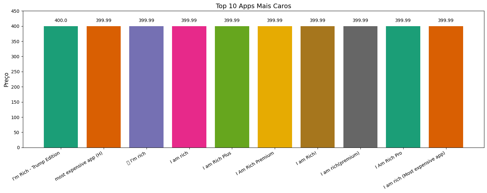
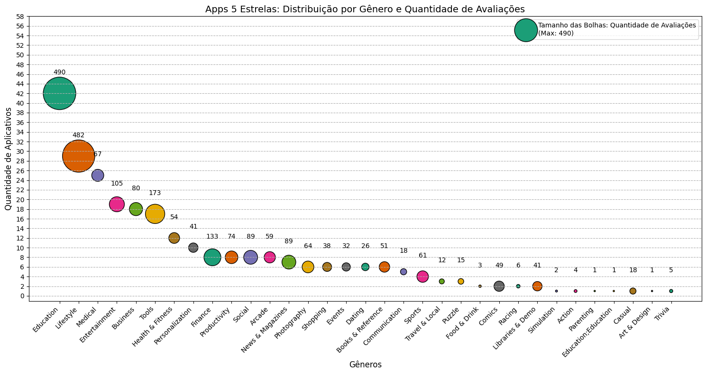

#

||
|---|
||
||

## SEÇÕES

* Introdução ao Dataset: Google Play Store [֍]()
  * Contexto dos Dados [֍]()
  * Tamanho do Dataset [֍]()
  * Tipos dos Dados [֍]()
  * Padrões de Valores nas Colunas [֍]()
    * Valores Distintos: Category & Genres [֍]()
    * Valores Distintos: Reviews [֍]()
    * Valores Distintos: Size [֍]()
    * Valores Distintos: Installs [֍]()
    * Valores Distintos: Price [֍]()
    * Valores Distintos: Last Updated [֍]()
* Tratamento de Dados [֍]()
  * Caracterização de Duplicações e Valores Desconhecidos [֍]()
  * Linhas 10472: Deslocamento de Valores [֍]()
  * Conversão de Tipos [֍]()
    * RegEx: Expressões Regulares [֍]()
  * Conversão: Coluna Reviews [֍]()
  * Conversão: Coluna Size [֍]()
  * Conversão: Coluna Installs [֍]()
  * Conversão: Coluna Price [֍]()
  * Conversão: Coluna Last Updated [֍]()
* Estatística Descritiva & Visualização de Dados [֍]()
  * Top 5 Apps: Nº de Instalações | Bar Plot [֍]()
    * Visualização Alternativa: Instalações por Categorias e Gêneros | Barra Horizontal [֍]()
  * Distribuição de Frequências de Categorias | Pie Plot [֍]()
    * Visualização Alternativa: Distribuição de Categorias | Barra Horizontal [֍]()
  * App Mais Caro [֍]()
  * Quantidade de Apps com Classificação 'Mature 17+' [֍]()
    * Visualização Alternativa: Classificação Etária | Bar Plot [֍]()
  * Top 10 Apps: Nº de Reviews [֍]()
  * Apps 5 Estrelas: Distribuição por Gênero e Nº de Avaliações | Bubble Chart [֍]()
  * Pior App: Quantidade de Estrelas e Avaliações | Line Plot [֍]()
* Considerações Finais [֍]()
* Referências [֍]()

## INTRODUÇÃO AO DATASET: GOOGLE PLAY STORE

*Voltar para **Seções*** [֍](#se%C3%A7%C3%B5es)

Para este projeto, foram realizados os tratamentos iniciais e primeiras análises de um dataset da Google Play Store. Porém, antes de começar qualquer tratamento nos dados, e análises subsequentes, é importante a familiarização com o dataset e com a finalidade do projeto.

Para a manipulação do dataset foi utilizada a biblioteca Pandas e, para a plotagem dos gráficos, a biblioteca Matplotlib.

### CONTEXTO DOS DADOS

*Voltar para **Seções*** [֍](#se%C3%A7%C3%B5es)

Ao importar o arquivo `csv` com a biblioteca Pandas, ele assume o tipo `DataFrame`, o qual contém diversos métodos de manipulação de dados. A seguir, uma amostra com as 5 primeiras linhas do dataset utilizando `head()`, o qual assume o valor 5 por *default* porém pode receber outros valores como parâmetro.  

```python
    df.head()
```


O dataset fornece informações referentes a categorias e gêneros de aplicativos, quantidade média de estrelas, quantidade de avaliações, mínimo de instalações atuais, última data de atualização, etc. O intuito desta análise é entender tendências de consumo atuais, explorando nichos e lacunas, para caracterizar o mercado de aplicativos antes do desenvolvimento e lançamento de novos produtos.

### TAMANHO DO DATASET

*Voltar para **Seções*** [֍](#se%C3%A7%C3%B5es)

O tamanho do dataset, descrito pelo seu "formato" em linhas (*rows*) e colunas (*columns*), pode ser acessado pelo atributo `shape`. Obtém-se o valor de `10841` linhas e `13` colunas:

```python
    df.shape

    >> (10841, 13)
```

É importante ter uma noção não só da quantidade de atributos nas colunas, mas também da quantidade de linhas com que se está lidando, principalmente ao começar a fazer os recortes de filtros, entendendo se a quantidade de linhas retornadas é condizente com o total do dataset.

### TIPOS DOS DADOS

*Voltar para **Seções*** [֍](#se%C3%A7%C3%B5es)

Com o método `ìnfo()` é possível visualizar o schema da tabela: além das colunas e respectivos tipos, quantidade de linhas, também é obtida a quantidade de valores nulos em cada coluna.

```python
    df.info()
```


Nota-se que a maior quantidade de valores nulos está na coluna `Rating`. Além disso, com relação aos tipos, basicamente todo o restante das colunas está com o tipo `object`, que é um tipo padrão do Pandas para colunas com tipos variados / misturados.

Portanto, antes de qualquer análise dessas colunas, será necessário tratá-las para valores numéricos adequados aos dados.

### PADRÕES DE VALORES NAS COLUNAS

*Voltar para **Seções*** [֍](#se%C3%A7%C3%B5es)

A seguir, serão analisados os valores distintos de algumas colunas de interesse para as primeiras análises, utilizando os métodos `nunique()` e `unique()` para obter quantidade e amostra desses valores respectivamente.

#### VALORES DISTINTOS: CATEGORY & GENRES

*Voltar para **Seções*** [֍](#se%C3%A7%C3%B5es)

```python
    # Amostra de valores distintos da coluna Category
    print(f"Quantidade de valores distintos: {df['Category'].nunique()}.\n \
      {'-'*100}\nAmostra de valores:\n\n{df['Category'].unique()}")
```


```python
    print(f"Quantidade de valores distintos: {df['Genres'].nunique()}.\n \
      {'-'*100}\nAmostra de valores:\n\n{df['Genres'].unique()}")
```


O padrão geral identificado para a coluna `Category` são valores todos em maiúsculas com underlines em lugar de espaços para separar as palavras. Um valor está fora do padrão e deve ser identificado:

```python
    df[df['Category'] == '1.9']
```


Nota-se que, ao comparar com a amostra de valores obtida com `head()` anteriormente, os valores da linha `10472` estão deslocados à esquerda, sendo o valor `1.9`, contido em `Category`, referente à coluna da direita `Rating`.

O tratamento desta linha será especificado na seção seguinte, o qual deve ocorrer antes de qualquer tratamento de tipos, visto que valores fora do padrão causam erros ao realizar a conversão.

Para a coluna `Genres` é identificada a presença de multivaloração, utilizando `;` como separador, a qual poderá ser tratada num momento futuro, mas por agora não irá interferir nas análises iniciais.

Abaixo serão priorizadas as visualizações dos padrões das demais colunas numéricas de interesse para as conversões de tipos.

#### VALORES DISTINTOS: REVIEWS

*Voltar para **Seções*** [֍](#se%C3%A7%C3%B5es)

Os valores de `Reviews` serão convertidos para `int`:

```python
    # Amostra de valores distintos da coluna Reviews
    print(f"Quantidade de valores distintos: {df['Reviews'].nunique()}.\n \
      {'-'*100}\nAmostra de valores:\n\n{df['Reviews'].unique()}")
```


#### VALORES DISTINTOS: SIZE

*Voltar para **Seções*** [֍](#se%C3%A7%C3%B5es)

Os valores de `Size` serão convertidos para `float`. Para o tratamento, será necessário adotar uma única medida de grandeza, convertendo os valores em kilobytes para megabytes, e verificar se existem outros casos fora desse padrão:

```python
    # Amostra de valores distintos da coluna Size
    print(f"Quantidade de valores distintos: {df['Size'].nunique()}.\n \
      {'-'*100}\nAmostra de valores:\n\n{df['Size'].unique()}")
```


#### VALORES DISTINTOS: INSTALLS

*Voltar para **Seções*** [֍](#se%C3%A7%C3%B5es)

Os valores de `Installs` serão convertidos para `int`. Para o tratamento, será necessário remover as vírgulas e o `+` ao final dos valores. Além disso, posteriormente, a coluna será renomeada para refletir a semântica de que os valores são referentes ao "mínimo de instalações".

```python
    # Amostra de valores distintos da coluna Installs
    print(f"Quantidade de valores distintos: {df['Installs'].nunique()}.\n \
      {'-'*100}\nAmostra de valores:\n\n{df['Installs'].unique()}")
```


#### VALORES DISTINTOS: PRICE

*Voltar para **Seções*** [֍](#se%C3%A7%C3%B5es)

Os valores de `Price` serão convertidos para `float`. Para o tratamento, será necessário remover os símbolos `$`.

```python
    # Amostra de valores distintos da coluna Price
    print(f"Quantidade de valores distintos: {df['Price'].nunique()}.\n \
      {'-'*100}\nAmostra de valores:\n\n{df['Price'].unique()}")
```


#### VALORES DISTINTOS: LAST UPDATED

*Voltar para **Seções*** [֍](#se%C3%A7%C3%B5es)

Os valores de `Last Updated` serão convertidos para `datetime`. Não será necessário nenhum tipo de tratamento, pois os dados já estão em um formato adequado para a conversão.

```python
    # Amostra de valores distintos da coluna Last Updated
    print(f"Quantidade de valores distintos: {df['Last Updated'].nunique()}.\n \
      {'-'*100}\nAmostra de valores:\n\n{df['Last Updated'].unique()}")
```


## TRATAMENTO DE DADOS

*Voltar para **Seções*** [֍](#se%C3%A7%C3%B5es)

### CARACTERIZAÇÃO DE DUPLICAÇÕES E VALORES DESCONHECIDOS

*Voltar para **Seções*** [֍](#se%C3%A7%C3%B5es)

Com relação à caracterização de duplicações, inicialmente, quando o dataset ainda não havia sido explorado, a remoção de duplicações foi cautelosa, considerando valores iguais em todas as colunas, ou seja, considerando a linha como um todo.

```python
    df.drop_duplicates(inplace=True)
```

No entanto, ao gerar as visualizações, visto que nenhum delas abarcava séries temporais de mudança de versões, foi feito um novo tratamento de remoção de duplicações, considerando a coluna `App` :

```python
    df.drop_duplicates(subset=['App'], inplace=True, keep='last')
```

Com relação à tratativa de valores nulos, com exceção de um valor referente ao caso de [deslocamento da linha 10472](), não foi necessário tratar para as análises realizadas, visto que os valores nulos foram excluídos das agregações numéricas.

Porém, no caso de valores variáveis e, portanto, desconhecidos da coluna `Size`, valorados como `Varies with device` foi necessária uma tratativa, visto que a coluna deveria ser numérica. Para essa abordagem foi considerada a seguinte discussão semântica:

> *A questão de valores nulos é provavelmente a mais espinhosa da teoria relacional. [...] O problema é que "não conhecido" pode abarcar um grande número de casos diferentes. Consideremos uma lista de escritores famosos, cada qual com uma data de nascimento e uma de falecimento. Uma data de nascimento "null" certamente significaria "desconhecido". Mas o que significa uma data de falecimento "null"? Vivo? Não se sabe quando morreu? Não se sabe se este autor está vivo ou morto?* [^1]

O valor `Varies with device`, apesar de indefinido, é conhecido só não determinado, é variável, por isso possui uma semântica particular.

> *Não acho incomum manter valores nulos para [...] "desconhecidos conhecidos", atributos que sabemos existirem mas não temos o valor no momento, por diversas razões. Para os demais casos, especulações não levam a lugar nenhum.* [^2]

Nesse caso, foi preferível não substituí-lo por nenhum valor que mascarasse essa semântica, e ou resultasse em "especulações", por exemplo ao utilizar a mediana da coluna. Logo, foi valorado com um número negativo, que seria utilizado somente para esse fim.

### LINHA 10472: DESLOCAMENTO DE VALORES

*Voltar para **Seções*** [֍](#se%C3%A7%C3%B5es)

A seguir o tratamento feito para a realocação de valores da linha `10472` :

```python
    # Obtendo os valores atuais da linha 10472
    valores = df.loc[10472].tolist()

    # Convertendo valores[1] para float, visto que a coluna 'Ratings' já possui tipo float64
    valores[1] = float(valores[1])

    # Mantendo o valor inicial da coluna 'App', adicionando 'Não Informado' na coluna seguinte, e deslocando o restante dos valores para a direita
    valores_realocados = [valores[0]] + ['NAO_INFORMADO'] + valores[1:-1]

    # Atualizando os valores no DataFrame com os valores realocados
    df.loc[10472] = valores_realocados
```


### CONVERSÃO DE TIPOS

*Voltar para **Seções*** [֍](#se%C3%A7%C3%B5es)

Antes da conversão dos tipos em cada coluna, após uma análise superficial com a relação de valores únicos, foi realizada uma análise mais aprofundada considerando os padrões esperados para cada coluna.

Para tanto, foram utilizados padrões em expressões regulares, para localizar valores alfabéticos, numéricos, sufixos, caracteres especiais, etc, em colunas em que não deveriam aparecer.

#### REGEX: EXPRESSÕES REGULARES

*Voltar para **Seções*** [֍](#se%C3%A7%C3%B5es)

Aplicando uma conversão temporária para `string` com `.str`, utiliza-se o método `contains()` com padrões RegEx, para identificar valores na coluna que contenham o padrão indicado.

Para os casos em que era necessário a extração de padrões específicos das colunas, desprezando símbolos e/ou valores desnecessários, foi utilizado o método `extract()` que utiliza um padrão RegEx para capturar strings. O parâmetro `expand` retorna:

* `True` o DataFrame completo
* `False` somente o Array com a coluna

A seguir a descrição detalhada de alguns padrões utilizados:

* `[a-zA-Z]+` um ou mais caracteres alfabéticos, incluindo minúsculas e maiúsculas
  * `[a-zA-Z]` cada colchete representa um caractere, dentro dos colchetes colocamos os caracteres ou símbolos aceitos
  * `+` um ou mais caracteres (indicados anteriormente)
* `^[0-9]+\.?[0-9]*[^Mk]$` um ou mais valores numéricos, com ou sem decimal, que não terminem em M ou k
  * `^` indica o início de uma string
  * `[0-9]+` um ou mais caracteres numéricos
  * `\.` o ponto é um caractere "wildcard", representa qualquer valor, então, quando queremos encontrar um ponto é preciso escapar sua função original com `\`
  * `?` zero ou um do valor anterior (significa: opcional)
  * `*` zero ou mais do valor anterior
  * `[^]` o acento circunflexo dentro de colchetes representa uma negação
  * `$` fim da string
* `^[0-9]+\.?[0-9]*k$` um ou mais valores numéricos, com ou sem decimal, que terminem k
* `^[^0-9].*$` ao menos um caractere não-numérico

### CONVERSÃO: COLUNA REVIEWS

*Voltar para **Seções*** [֍](#se%C3%A7%C3%B5es)

Após a confirmação com RegEx, de que a coluna não continha nenhum valor não-numérico, foi feita a conversão para `int` .

```python
    # Confirmação de que nenhum valor não-numérico seria retornado
    df[df['Reviews'].str.contains(r'[a-zA-Z]+', regex=True, na=False)]

    # Conversão da coluna para integer
    df['Reviews'] = df['Reviews'].astype(int)
```

### CONVERSÃO: COLUNA SIZE

*Voltar para **Seções*** [֍](#se%C3%A7%C3%B5es)

Para a conversão da coluna `Size`, foi optado pelo tipo `float` e todos os valores em *megabytes*, sendo necessária a conversão daqueles em *kilobytes*. Antes disso, é necessário confirmar que existe somente esses sufixos de tamanho, pois poderiam também existir valores em *gigabytes*, por exemplo.

A coluna será posteriormente renomeada para indicar que os valores estão em *megabytes*, pois somente serão mantidos os valores numéricos.

```python
    # Confirmação de que nenhum outro sufixo existe entre os valores
    df[df['Size'].str.contains(r'^[0-9]+\.?[0-9]*[^Mk]$', regex=True)]
```

A seguir, foi criada uma **máscara booleana** (*boolean mask*) para identificar quais valores estão em *kilobytes*:

```python
    # Localizando valores em kilobytes e salvando em uma variável boolean mask
    kilobytes_mask = df['Size'].str.contains(r'^[0-9]+\.?[0-9]*k$', regex=True)
```

A seguir, a máscara é aplicada na coluna `Size` para capturar somente os valores em *kilobytes* e realizar a conversão para *megabytes* dividindo por `1000` :

```python
    df.loc[kilobytes_mask, 'Size'] = (                    # Atualização da coluna com as modificações
        df.loc[kilobytes_mask, 'Size']                    # Seleção dos valores True em 'kilobytes_mask'
        .str.extract(r'([0-9]+\.?[0-9]*)', expand=False)  # Extração da parte numérica
        .astype(float)                                    # Conversão para float
        .div(1000)                                        # Conversão para megabytes
    )
```

A extração dos valores numéricos das colunas remanescentes em *megabytes* foi feita adotando a mesma lógica acima, com uma alteração no padrão utilizado na máscara booleana:

```python
    # Localizando valores em megabytes e salvando em uma variável boolean mask
    megabytes_mask = df['Size'].str.contains(r'^[0-9]+\.?[0-9]*M$', regex=True, na=False)

    df.loc[megabytes_mask, 'Size'] = (                    # Atualização da coluna com as modificações
        df.loc[megabytes_mask, 'Size']                    # Seleção de valores True em 'megabytes_mask'
        .str.extract(r'([0-9]+\.?[0-9]*)', expand=False)  # Extração da parte numérica
        .astype(float)                                    # Conversão para float
    )
```

A seguir é verificada a existência de valores não-numéricos, para esses casos de `Varies with device`, foi adotado um número que receberia a semântica de "valor variável", para isso foi optado um número negativo que não ocorreria naturalmente no dataset.


```python
    # Verificação de existência de valores não numéricos
    df[df['Size'].str.contains(r'^[^0-9].*$', regex=True, na=False)]

    # Confirmação de que não existiriam outros valores não-numéricos | só retorna 'Varies with device'
    df[df['Size'].str.contains(r'^[^0-9].*$', regex=True, na=False)]['Size'].unique()

    # Substituição de 'Varies with device' para o valor -1
    df.loc[df['Size'].str.contains(r'^[^0-9].*$', regex=True, na=False), 'Size'] = -1
```

Após isso, foi possível a conversão total da coluna para `float` :

```python
    df['Size'] = df['Size'].astype(float)
```

### CONVERSÃO: COLUNA INSTALLS

*Voltar para **Seções*** [֍](#se%C3%A7%C3%B5es)

Para a coluna `Installs`, foram removidas as vírgulas e desconsiderados os caracteres finais `+` antes da conversão para `int` . Esta é uma coluna que deverá ser renomeada posteriormente para refletir a semântica perdida com a remoção de `+`.

O método `replace()` substitui as ocorrências de `,` por "nada", realizando a remoção. Em seguida, os valores não numéricos são extraídos, desprezando os `+` :

```python
    df['Installs'] = df['Installs'].str.replace(',', '')
    df['Installs'] = df['Installs'].str.extract(r'([0-9]+\.?[0-9]*)', expand=False)
```

Com isso, é realizada a conversão:

```python
    df['Installs'] = df['Installs'].astype(int)
```

### CONVERSÃO: COLUNA PRICE

*Voltar para **Seções*** [֍](#se%C3%A7%C3%B5es)

Para a coluna `Price`, foi desprezado o caractere `$` e realizada a conversão para `float` :

```python
    # Extração dos valores numéricos
    df['Price'] = df['Price'].str.extract(r'([0-9]+\.?[0-9]*)', expand=False)

    df['Price'] = df['Price'].astype(float)
```

### CONVERSÃO: COLUNA LAST UPDATED

*Voltar para **Seções*** [֍](#se%C3%A7%C3%B5es)

A coluna `Last Updated` foi convertida para `datetime`, como já estava em um formato reconhecido, não foi necessário realizar nenhum tratamento adicional:

```python
    df['Last Updated'] = pd.to_datetime(df['Last Updated'])
```

Abaixo o dataframe, com as colunas e seus respectivos tipos, após a finalização das conversões:


## ESTATÍSTICA DESCRITIVA & VISUALIZAÇÃO DE DADOS

*Voltar para **Seções*** [֍](#se%C3%A7%C3%B5es)

Nesta etapa, os valores das colunas são agrupados, agregados, ordenados, calculados e/ou reduzidos com funções como:

* `min()` : valor mínimo
* `max()` : valor máximo
* `groupby()` : agrupamento de agregações por coluna
* `count()` e `value_counts()` : contagem de linhas
* `sum()` : soma

### TOP 5 APPS: Nº DE INSTALAÇÕES | *BAR PLOT*

*Voltar para **Seções*** [֍](#se%C3%A7%C3%B5es)

Antes de plotar o **gráfico de barras (*bar plot*)** solicitado para a análise, foi verificada a quantidade de apps com o valor máximo de instalações do dataset:

```python
    df[df['Installs'] == df['Installs'].max()].value_counts().sum()

```

O código acima retorna `20` linhas, ou seja, existem "Top 20 Apps de Instalações". Abaixo a relação desses aplicativos:


Com um gráfico de 5 barras, não é possível visualizar a quantidade total nem a relação desses valores com os demais, pois a amostra é pequena e o valor é constante.


#### VISUALIZAÇÃO ALTERNATIVA: INSTALAÇÕES POR CATEGORIAS E GÊNEROS | BARRA HORIZONTAL

*Voltar para **Seções*** [֍](#se%C3%A7%C3%B5es)

Uma alternativa para compreender melhor quais as tendências que norteiam um alto número de instalações é entender visualizar quais as `Categorias` e os `Gêneros` mais baixados, e para isso será utilizado um **gráfico de barras horizontal (*horizontal bar plot*)**.


Em um gráfico de barras, principalmente um com grande quantidade de categorias como os exemplos acima, a ordenação é muito importante para a legibilidade.

> *Independentemente de posicionarmos as barras vertical ou horizontalmente, é preciso prestar atenção à ordem na qual as barras são arranjadas. Comumente vejo gráficos de barras em que as barras são arranjadas arbitrariamente or por algum critério não significativo ao contexto da figura. [...] Em geral, as figuras resultantes tornam-se mais confusas e menos intuitivas do que figuras com barras ordenadas por tamanho.* [^3]

### DISTRIBUIÇÃO DE FREQUÊNCIAS DE CATEGORIAS | *PIE PLOT*

*Voltar para **Seções*** [֍](#se%C3%A7%C3%B5es)

Devido ao grande número de categorias diferentes na coluna `Category`, o  **gráfico de pizza (*pie plot*)** solicitado para esta análise não apresenta uma boa visualização da relação de valores entre as diversas categorias, e a legibilidade também fica comprometida.


> *A visão arquetipal para tais visualizações é o gráfico de pizza, onipresente em qualquer apresentação de negociós e muito caluniada entre cientistas de dados [...] visualizar proporções pode ser desafiador, em particular quando o todo está repartido em diversas partes diferentes [...]* [^4]

#### VISUALIZAÇÃO ALTERNATIVA: DISTRIBUIÇÃO DE CATEGORIAS | BARRA HORIZONTAL

*Voltar para **Seções*** [֍](#se%C3%A7%C3%B5es)

Como alternativa, foi proposta uma visualização em barras horizontais, deste modo, fica mais fácil tanto a leitura das categorias quanto a relação entre os valores.

> *Gráficos de pizza enfatizam que as partes individuais compõem um todo e evidenciam frações simples. No entanto, as partes individuais são mais facilmente comparadas em barras lado a lado. [...] Quando visualizamos uma grande quantidade de proporções ou mudanças em um conjunto de proporções através de condições, os gráficos de pizza tendem a ser ineficientes em relação ao espaço e frequentemente obscurecem os relacionamentos.* [^5]


Foi optado manter o eixo-Y invertido, pois assim os valores maiores (supostamente mais interessantes) ficam mais próximos das legendas do eixo-X.

### APP MAIS CARO

*Voltar para **Seções*** [֍](#se%C3%A7%C3%B5es)

Para visualizar o app mais caro, foi utilizado o método `nlargest()` na coluna `Price`:

```python
    df.nlargest(1, 'Price')
```


Complementarmente, foram plotados os 10 aplicativos mais caros para visualizar como o app acima se relaciona com os demais:



Com isso, nota-se que existe uma tendência de preços e nomes similares, caracterizando um nicho de mercado para aplicativos de luxo e ostentação.

### QUANTIDADE DE APPS COM CLASSIFICAÇÃO 'MATURE 17+'

*Voltar para **Seções*** [֍](#se%C3%A7%C3%B5es)

Para a contagem de linhas com a classificação `Mature 17+` foram selecionadas as linhas na coluna `Content Rating`, em seguida, feita a contagem dos valores:

```python
    df[df['Content Rating'] == 'Mature 17+']['Content Rating'].value_counts()
```


#### VISUALIZAÇÃO ALTERNATIVA: CLASSIFICAÇÃO ETÁRIA | BAR PLOT

*Voltar para **Seções*** [֍](#se%C3%A7%C3%B5es)

Complementarmente, foram plotadas as contagens das demais classificações para uma análise comparativa:


Nota-se que a maior parte dos aplicativos visa um público geral, o que pode ser um mercado menos arriscado. No entanto, o nicho de aplicativos para maiores também pode ser promissor por não ser tão concorrido.

### TOP 10 APPS: Nº DE REVIEWS

*Voltar para **Seções*** [֍](#se%C3%A7%C3%B5es)

A seguir a listagem, em ordem decrescente, dos aplicativos com maior número da coluna `Reviews` :


Complementarmente, a listagem acima foi plotada para facilitar a visualização de uma análise comparativa:


Nota-se que os apps com maior número de avaliações são aqueles utilizados no cotidiano: redes sociais, ferramentas de manutenção do smartphone e jogos populares.

### APPS 5 ESTRELAS: DISTRIBUIÇÃO POR GÊNERO E Nº DE AVALIAÇÕES

*Voltar para **Seções*** [֍](#se%C3%A7%C3%B5es)

Como análise adicional, foi realizado um agrupamento por gênero dos apps avaliados com 5 estrelas na coluna `Rating`, relacionando o número de aplicativos com o total de avaliações em `Reviews`:

```python
    # Agrupando os dados por 'Genre', agregando pela quantidade de 'Apps' e a soma de 'Reviews'
    sumario_genero = cinco_estrelas.groupby('Genres').agg(
        contagem_apps=('App', 'count'),                     # Contando a quantidade de Apps em cada gênero
        total_reviews=('Reviews', 'sum')                    # Soma de avaliações para cada gênero
    ).reset_index()

    # Ordenando por 'contagem_apps' para organizar os pontos por quantidade de 'Apps'
    sumario_genero = sumario_genero.sort_values('contagem_apps', ascending=False)
```


> ❗ *Não é a lista completa, algumas linhas não couberam.*

Para uma visualização de relacionamento entre 3 variáveis, foi escolhido o gráfico de bolha, ou *bubble scatter plot*, uma variação do gráfico de dispersão.

> ***Gráficos de dispersão, ou scatter plots**, [...] representam a visualização arquetipal quando queremos mostrar uma variável quantitativa em relação a outra. Se temos três variáveis quantitativas, podemos mapear uma delas no tamanho do ponto, criando uma variante do gráfico de dispersão chamada **gráfico de bolha (bubble chart)***. [^6]



### PIOR APP: QUANTIDADE DE ESTRELAS

*Voltar para **Seções*** [֍](#se%C3%A7%C3%B5es)

Por fim, foi localizado o app com a pior avaliação. Para isso foram realizadas 2 seleções cruzadas:

* lista de apps com menor nº de estrelas em `Rating`
* o app com maior nº de avaliações em `Reviews`

```python
    # Selecionando os aplicativos piores avaliados
    uma_estrela = df[df['Rating'] == df['Rating'].min()]

    # Filtrando para obter o aplicativo com a maior quantidade de avaliações
    pior_avaliado = uma_estrela[uma_estrela['Reviews'] == uma_estrela['Reviews'].max()]
```

Após isso, foi selecionada a visualização de ponto e linha para a relação entre as 3 variáveis:


## CONSIDERAÇÕES FINAIS

*Voltar para **Seções*** [֍](#se%C3%A7%C3%B5es)

Após as primeiras análises do mercado de aplicativos, considerando a Google Play Store, é possível identificar algumas oportunidades de nichos com baixa concorrência, ou então, quais categorias são mais interessantes para os usuários.

Posteriormente, seria interessante continuar as análises explorando relações entre diversas variáveis, buscando lacunas de fornecimento de soluções para usuários ou entendendo fraquezas nos produtos atuais, aliando uma subsequente pesquisa de análise de sentimentos e tratamento dos textos das avaliações.

Além disso, seria interessente também entender se a precificação é um impedimento para a adoção e fidelização dos usuários, sendo possível identificar se seria mais oportuno um aplicativo grátis com propagandas ou calcular uma faixa de valor ideal, que estivesse de acordo com a aceitação do mercado.

Desse modo, seria possível desenvolver um produto com base nas necessidades de usuários e má performance de aplicativos já utilizados por uma boa parcela da população.

## REFERÊNCIAS

*Voltar para **Seções*** [֍](#se%C3%A7%C3%B5es)

[^1]: FAROULT, ROBSON; 2006, p. 14
[^2]: Ibid.
[^3]: WILKER, 2019, p. 48
[^4]: Ibid., p. 93
[^5]: Ibid., p. 39
[^6]: Ibid., p. 41
