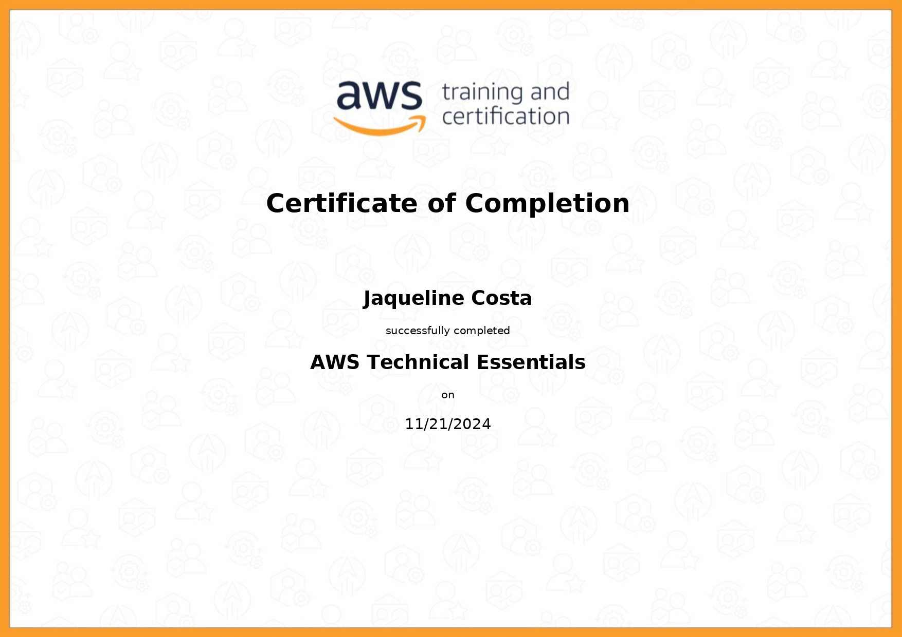

#

||
|---|
||
||

## RELATOS DE APRENDIZADO

### Arquitetura de Microsserviços, Contêineres & Docker

[](/guide/containeres.md)

Achei muito interessante a transformação na forma de pensar e desenvolver aplicações ao considerarmos uma estrutura baseada em componentes. Entendo que é extremamente importante absorver tais práticas, pois é fundamental para o ambiente de Cloud Computing.

Sinto que comecei a entender os princípios e fundamentos da Arquitetura de Microsserviços, porém ainda preciso praticar mais a elaboração de imagens no dia a dia para adquirir confiança. Gostaria também de praticar a orquestração de contêineres com Kubernetes, o que não foi possível com as atividades propostas nesta sprint, portanto tenho intenção de estudar no meu tempo livre.

### AWS Partner: Technical

[](/guide/aws_fundamentos.md)  
[](/guide/aws_orchestration.md)

Me sinto cada vez mais confiante com os fundamentos da AWS, e o curso de Technical Essentials foi ótimo para reforçar conceitos. Ainda tenho dificuldades com o domínio de Networking, e durante a sprint busquei estudar conceitos gerais de redes para entender melhor como se interrelacionam os serviços da AWS.

### Bônus: Assimilação Versificada

```html
    arquitetando-se em micro-ser-vivo
    ---------------------------------

    instanciação da imagem
    cuidadosamente elaborada
    por um ego já atualizado
    existência projetada
    novas versões me multiplicam
    me inutilizam e me derrubam
    mera recomposição de um ego do passado

    eu não tenho estado
    eu não tenho estado
    eu sei que eu não tenho estado
    (me perdoe)
    e logo já não mais saberei

    pois numa próxima execução
    estarei isolada
    sem persistência de dados
    sem persistência de ideias
    sem persistência de mim
    contida num espaço designado
    espero partilhar a hospedagem
    desta resistência efêmera
    e mesmo sem estado
    persistir por um momento
    ao seu lado
```

---

## EXERCÍCIOS

Todos os códigos dos exercícios foram implementados seguindo os Python Enhancement Proposal, especificamente as recomendações de estilo do PEP8 e convenções de docstrings do PEP257, indicados na seção [Bibliografia](#bibliografia), com validação no [*CodeWOF: Python 3 Style Checker*](https://www.codewof.co.nz/style/python3/) online.

Na pasta `evidencias`, estão localizadas as imagens com a validação de cada exercício.

- [Exercício 1](./exercicios/exercicio1.py)
- [Exercício 2](./exercicios/exercicio2.py)
- [Exercício 3](./exercicios/exercicio3.py)
- [Exercício 4](./exercicios/exercicio4.py)
- [Exercício 5](./exercicios/exercicio5.py)
- [Exercício 6](./exercicios/exercicio6.py)
- [Exercício 7](./exercicios/exercicio7.py)

## DESAFIO

- **Carguru: Imagem e Contêiner**
  - [carguru.py](./desafio/carguru/carguru.py): script de randomização de veículos.
  - [Dockerfile](./desafio/carguru/Dockerfile): template para imagem do contêiner Docker.
- **Mascarar Dados: Imagem e Contêiner**
  - [mascarador.py](./desafio/mascarador/mascarador.py): script de criptografia de dados com SHA-1.
  - [Dockerfile](./desafio/mascarador/Dockerfile): template para imagem do contêiner Docker.
- **Reutilização de Contêineres**
  - [Seção: Reutilização de Contêineres](./desafio/README.md#reutilização-de-contêineres): Documentação sobre reutilização de contêineres no contexto de desenvolvimento de software e arquitetura de microsserviços.

## EVIDÊNCIAS

Na pasta `evidencias`, encontram-se prints referentes a momentos de execução do código, exemplificando abordagens adotadas para a conclusão do desafio.  
No passo a passo explicativo, encontrado na pasta `desafio`, serão comentados outros prints de pontos específicos.

### Build de Imagens com Dockerfile


### Instanciação e Execução de Contêineres


### Sequência de Comandos para Reutilização de Contêiner


## CERTIFICADOS AWS SKILL BUILDER

### AWS Partner: Accreditation (Technical)

| |
|---|
||
||

### AWS Technical Essentials

| |
|---|
||
||

## BIBLIOGRAFIA

SCHOLL, Boris; SWANSON,  Trent; JAUSOVEC, Peter. **Cloud Native: Using Containers, Functions, and Data to Build Next-Generation Applications**. Sebastopol: O'Reilly, 2019.

KANE, Sean P.; MATTHIAS, Karl. **Docker Up & Running: Shipping Reliable Containers in Production**. Sebastopol: O'Reilly, 2023.

NADAREISHVILI, Irakli et al. **Microservice Architecture: Aligning Principles, Practices and Culture**. Sebastopol: O'Reilly, 2016.

RICE, Liz. **Container Security: Fundamental Technology Concepts That Protect Containerized Applications**. Sebastolpol: O'Reilly, 2020.

VAN ROSSUM, Guido; WARSAW, Barry; COGHLAN, Alyssa. **PEP 8 – Style Guide for Python Code**. Última atualização: 2013. Disponível em: <[peps.python.org/pep-0008/](https://peps.python.org/pep-0008/)>.  

VAN ROSSUM, Guido; GOODGER, David. **PEP 257 – Docstring Conventions**. Última atualização: 2001. Disponível em: <[peps.python.org/pep-0257/](https://peps.python.org/pep-0257/)>.