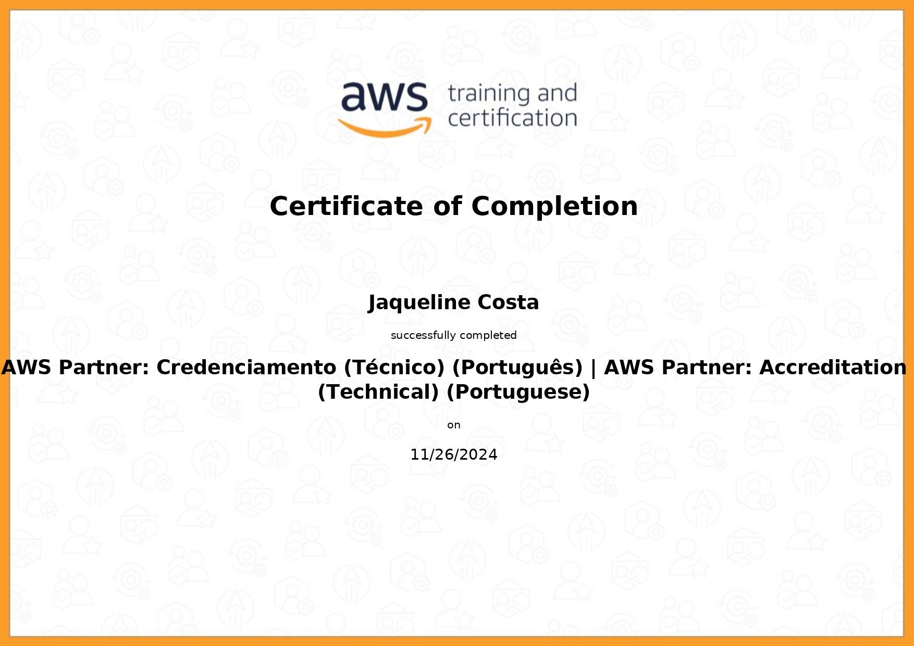

#

||
|---|
||
||

## RELATOS DE APRENDIZADO

### Contêineres & Docker

  

### AWS Partner: Technical

  
  

---

## EXERCÍCIOS

Todos os códigos dos exercícios foram implementados seguindo os Python Enhancement Proposal, especificamente as recomendações de estilo do PEP8 e convenções de docstrings do PEP257, indicados na seção [Bibliografia](#bibliografia), com validação no [*CodeWOF: Python 3 Style Checker*](https://www.codewof.co.nz/style/python3/) online.

Na pasta `evidencias`, estão localizadas as imagens com a validação de cada exercício.

- [Exercício 1](./exercicios/exercicio1.py)
- [Exercício 2](./exercicios/exercicio2.py)
- [Exercício 3](./exercicios/exercicio3.py)
- [Exercício 4](./exercicios/exercicio4.py)
- [Exercício 5](./exercicios/exercicio5.py)
- [Exercício 6](./exercicios/exercicio6.py)
- [Exercício 7](./exercicios/exercicio7.py)

## DESAFIO

- **Carguru: Imagem e Contêiner**
- **Reutilização de Contêiners**
- **Mascarar Dados: Imagem e Contêiner**

## EVIDÊNCIAS

Na pasta `evidencias`, encontram-se prints referentes a momentos de execução do código, exemplificando abordagens adotadas para a conclusão do desafio.  
No passo a passo explicativo, encontrado na pasta `desafio`, serão comentados outros prints de pontos específicos.

## CERTIFICADOS AWS SKILL BUILDER

### AWS Partner: Accreditation (Technical)

| |
|---|
||
||

## CERTIFICADOS COMPLEMENTARES

Para absorver melhor o conteúdo desta sprint e me aprofundar em pontos de interesse, concluí em paralelo os cursos abaixo, externos à Udemy.

| |
|---|
||
||

## BIBLIOGRAFIA

NADAREISHVILI, Irakli et al. **Microservice Architecture: Aligning Principles, Practices and Culture**. Sebastopol: O'Reilly, 2016.

RICE, Liz. **Container Security: Fundamental Technology Concepts That Protect Containerized Applications**. Sebastolpol: O'Reilly, 2020.

VAN ROSSUM, Guido; WARSAW, Barry; COGHLAN, Alyssa. **PEP 8 – Style Guide for Python Code**. Última atualização: 2013. Disponível em: <[peps.python.org/pep-0008/](https://peps.python.org/pep-0008/)>.  

VAN ROSSUM, Guido; GOODGER, David. **PEP 257 – Docstring Conventions**. Última atualização: 2001. Disponível em: <[peps.python.org/pep-0257/](https://peps.python.org/pep-0257/)>.

VIAFORE, Patrick. **Robust Python: Write Clean and Maintainable Code**. Sebastopol: O'Reilly, 2021.  
