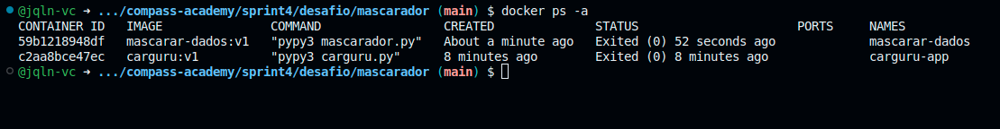
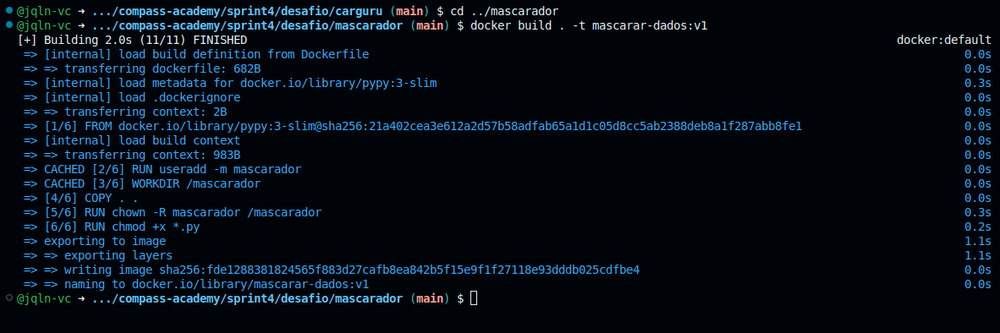
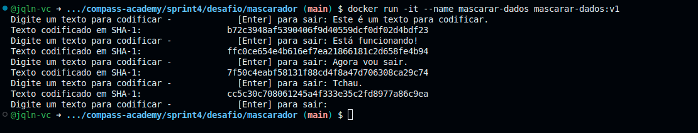

#

||
|---|
||
||

## SEÇÕES

* Docker & Princípios de Arquitetura de Microsserviços [֍](#docker--princ%C3%ADpios-de-arquitetura-de-microsservi%C3%A7os)
* Criação de Imagens [֍](#cria%C3%A7%C3%A3o-de-imagens)
  * Dockerfile: Carguru [֍](#dockerfile-carguru)
  * Dockerfile: Mascarador [֍](#dockerfile-mascarador)
  * Instrução FROM: PyPy [֍](#instru%C3%A7%C3%A3o-from-pypy)
  * Instruções WORKDIR & COPY [֍](#instru%C3%A7%C3%B5es-workdir--copy)
  * Instruções RUN: Useradd, Chown & User [֍](#instru%C3%A7%C3%B5es-run-useradd-chown--user)
  * Instrução RUN: Chmod [֍](#instru%C3%A7%C3%A3o-run-chmod)
  * Instrução CMD: Execução dos Scripts [֍](#instru%C3%A7%C3%A3o-cmd-execu%C3%A7%C3%A3o-dos-scripts)
* Desenvolvimento do Script: Mascarador [֍](#desenvolvimento-do-script-mascarador)
* Comandos de Execução: Imagem & Contêiner [֍](#comandos-de-execu%C3%A7%C3%A3o-imagem--cont%C3%AAiner)
  * Execução: Carguru [֍](#execu%C3%A7%C3%A3o-carguru)
  * Execução: Mascarador [֍](#execu%C3%A7%C3%A3o-mascarador)
* Reutilização de Contêineres [֍](#reutiliza%C3%A7%C3%A3o-de-cont%C3%AAineres)
* Considerações Finais [֍](#considera%C3%A7%C3%B5es-finais)
* Referências [֍](#refer%C3%AAncias)

## DOCKER & PRINCÍPIOS DE ARQUITETURA DE MICROSSERVIÇOS

*Voltar para **Seções*** [֍](#se%C3%A7%C3%B5es)

Para a conteineirização dos projetos `carguru` e `mascarador`, primeiramente, é necessário contextualizar tais projetos no contexto de **Arquitetura de Microsserviços** para, só então, ser possível fundamentar as escolhas durante o desenvolvimento, buscando adequação a boas práticas e diretrizes de segurança na nuvem.

- **Imutabilidade**

Cada contêiner deve ser uma instância de uma imagem, ou seja, é um reflexo do ambiente criado pelo template `Dockerfile`; tudo que for necessário para sua execução é configurado no template da imagem, assim, o ambiente da aplicação se torna previsível e monitorável.

Similar aos princípios de programação funcional, o contêiner é um ambiente sem persistência de estado, quaisquer necessidades de armazenamento de dados devem ser direcionadas a volumes ou bancos de dados externos ao ambiente do contêiner.

> *Cockcroft diz que o princípio da imutabilidade é usado na Netflix para assegurar que grupos autoescaláveis de instâncias de serviços são **stateless** e idênticas, o que permite ao sistema da Netflix uma "escalabilidade horizontal". O "Macaco do Caos", um membro do Exército Símio, remove instâncias regularmente para reforçar o princípio de serviços **stateless**. Outra técnica relacionada é o uso de **"Red/Black pushes"**. Ainda que cada componente lançado seja imutável, uma nova versão de um serviço é introduzida em paralelo à versão antiga, em novas instâncias, e então o tráfego é redirecionado das antigas para as novas. Após a espera de que tudo correu bem, as instâncias antigas são derrubadas.* [^1]

- **Desenvolva do Zero**

Como cada contêiner é um reflexo da configuração de uma imagem, a cada nova versão de uma aplicação é preferível a execução de um novo contêiner, com ambiente "limpo", sem risco de herdar resquícios do ambiente de uma aplicação antiga.

> *Parte da filosofia Unix é criar uma coleção de ferramentas poderosas que sejam previsíveis e consistentes por um longo período de tempo. [...] É melhor desenvolver um novo componente de um microsserviço do que tentar utilizar um componente existente que já esteja em produção e mudá-lo para executar novas tarefas.* [^2]

- **Não hesite em descartar**

Este princípio é uma consequência dos anteriores, ao manter um ambiente ***stateless***, unicamente dependente do template de configuração do `Dockerfile`, o descarte de componentes torna-se indolor e seguro, assim também tornando o projeto mais resiliente a mudanças.

> *Ao longo do tempo, componentes que tinham uma função importante podem não ser mais necessários. Você pode ter aplicado o princípio **desenvolva do zero** e substuído este componente com um que executa melhor a tarefa. [...] O importante é estar disposto a descartar um componente quando não é mais útil para sua proposta inicial.* [^3]

- **Uma Aplicação por Contêiner**

A ideia principal da **Arquitetura de Microsserviços*** é a separação de todo um projeto em componentes isolados, especializados em uma única função. Desse modo, os processos de CI/CD são otimizados e simplificados. Para os projetos atuais, `carguru` e `mascarador`, cada script é uma função, representando um componente de uma arquitetura maior.

> *Sempre rode uma única aplicação dentro de um contêiner. Contêineres foram desenvolvidos para conter uma única aplicação, tendo o mesmo ciclo de vida que a aplicação que roda ali. Rodar múltiplas aplicações em um mesmo contêiner torna o gerenciamento difícil, e você pode acabar com um contêiner em que um dos processos falhou ou está irresponsivo.* [^4]

## CRIAÇÃO DE IMAGENS

*Voltar para **Seções*** [֍](#se%C3%A7%C3%B5es)

Para ambos projetos, tanto o `carguru` quanto o `mascarador`, foram utilizadas abordagens de criação de imagens Docker similares, com modificações somente referentes ao nome de diretórios, usuários e scripts.

Portanto, será apresentada a seguir a estrutura utilizada para cada projeto, com comentários específicos mais adiante.

### DOCKERFILE: CARGURU

*Voltar para **Seções*** [֍](#se%C3%A7%C3%B5es)

```docker
    FROM pypy:3-slim

    RUN useradd -m carguru

    WORKDIR /carguru

    COPY . .

    RUN chown -R carguru /carguru

    USER carguru

    RUN chmod +x *.py

    CMD [ "pypy3", "carguru.py" ]
```

### DOCKERFILE: MASCARADOR

*Voltar para **Seções*** [֍](#se%C3%A7%C3%B5es)

```docker
    FROM pypy:3-slim

    RUN useradd -m mascarador

    WORKDIR /mascarador

    COPY . .

    RUN chown -R mascarador /mascarador

    USER mascarador

    RUN chmod +x *.py

    CMD [ "pypy3", "mascarador.py" ]
```

### INSTRUÇÃO FROM: PYPY

*Voltar para **Seções*** [֍](#se%C3%A7%C3%B5es)

Foi utilizada a imagem oficial `PyPy`, um interpretador de `Python` mais ágil e eficiente para desenvolvimento, pois compila em tempo de execução. E a utilização da versão da ***slim*** torna a imagem ainda mais leve, ao utilizar recursos básicos porém suficientes para cada projeto.

>❗ Após o build das imagens, estas ficaram com tamanho abaixo de 300 Mb.

```docker
    # imagem:versão
    FROM pypy:3-slim
```

Para maiores informações, acessar a [página oficial](https://hub.docker.com/_/pypy) da imagem no Docker Hub.

### INSTRUÇÕES WORKDIR & COPY

*Voltar para **Seções*** [֍](#se%C3%A7%C3%B5es)

Neste processo, é criado o diretório de trabalho do contêiner com `WORKDIR`, o qual receberá todos os arquivos da aplicação, que serão copiados em `COPY`.

```docker
    WORKDIR /mascarador
    COPY . .
```

A ordem dos processos listados em um `Dockerfile` é essencial para a otimização do tempo de build, e a etapa `COPY` é um ponto que pode ser considerado na otimização. Cada processo já executado no build da imagem é salvo em *cache*, e builds subsequentes só serão reexecutados a partir de um processo em que tenha ocorrido alguma modificação.

Portanto, é interessante criar 2 processos de `COPY`: o primeiro, logo após a criação do diretório, para arquivos essenciais, que não sofrem modificações; mais abaixo, ao final do `Dockerfile`, é realizada a cópia de arquivos de desenvolvimento da aplicação que são alterados com mais frequência. Deste modo, é aproveitado o processo de cacheamento das execuções anteriores.

Essa boa prática não foi necessária para os projetos `carguru` e `mascarador`, visto que ambos contêm somente um arquivo de script.

### INSTRUÇÕES RUN: USERADD, CHOWN & USER

*Voltar para **Seções*** [֍](#se%C3%A7%C3%B5es)

Como boa prática de segurança, ao serem criados usuários específicos para a aplicação, dispensa-se o uso de usuário `root`, assim os contêineres são executados com acesso limitado ao *host*. Abaixo alguns fatores considerados:

- **Redução de Vulnerabildades**
Caso o contêiner sofra algum tipo de ameaça, ao limitar seu acesso ao *host*, a exposição a usuários mal-intencionados é contida ao ambiente daquele contêiner, protegendo assim os demais componentes no *host* de ataques.

- **Princípio do Menor Prilégio**
Uma boa prática a qualquer sistema, o acesso a quaisquer tipos de recursos deve ser restringido ao mínimo necessário para a execução das funções, seja concernente a usuários humanos ou aplicações.

- **Isolamento de Contêineres**
Dentro da arquitetura de microsserviços, cada componente deve rodar em isolamento dos demais. Caso os contêineres sejam executados com acesso `root` ao *host*, tanto o seu isolamento quanto o dos demais componentes é comprometido.

- **Adequação a Diretrizes**
A adoção de usuários restritos para os contêineres é uma adequação a requisitos de diretrizes e frameworks de Segurança da Informação, como **CIS (Center for Internet Security) Docker Benchmark** e **PCI-DSS (Payment Card Industry Data Security Standard)**.

Logo após a etapa de execução da imagem `PyPy`, é criado um usuário para a aplicação com o comando `useradd -m`. A flag `-m` cria um diretório específico para o usuário em `/home`, caso seja necessário salvar alguns dados de configuração ou logs para gerenciamento da aplicação.

Ainda assim, estes diretórios mantêm a natureza efêmera e *stateless* do componente, sendo destruídos juntamente com o contêiner.

```docker
    RUN useradd -m <user-app>
```

Após a criação do diretório de trabalho e a cópia dos arquivos da aplicação para lá, é definida ao usuário da aplicação a propriedade do diretório de trabalho com o comando `chown -R`. A flag `-R` define a propriedade de modo recursivo, abrangendo todo o conteúdo do diretório.

```docker
    RUN chown -R <user-app> /<app>
```

Em seguida, é mantida a execução do contêiner a partir do usuário da aplicação.

```docker
    USER <user-app>
```

### INSTRUÇÃO RUN: CHMOD

*Voltar para **Seções*** [֍](#se%C3%A7%C3%B5es)

Após fornecimento de permissões e propriedades ao usuário da aplicação, é utilizado o comando `chmod +x` para habilitar a execução de todos os arquivos `.py` .

```docker
    RUN chmod +x *.py
```

### INSTRUÇÃO CMD: EXECUÇÃO DOS SCRIPTS

*Voltar para **Seções*** [֍](#se%C3%A7%C3%B5es)

Por fim, a sequência de comandos que executa a aplicação.

```docker
    CMD [ "pypy3", "app.py" ]
```

## DESENVOLVIMENTO DO SCRIPT: MASCARADOR

*Voltar para **Seções*** [֍](#se%C3%A7%C3%B5es)

- **Adequação ao PEP-8 e PEP-257**

O script está em conformidade com as sugestões de estilo do PEP-8 e das utilizações de ***docstrings*** do PEP-257 para documentação.


- **Modularização do Script**

Para manter a modularidade, todo o código incluindo a importação da biblioteca `hashlib` foram desenvolvidos dentro da função `mascarador`, assim assegura-se a atomicidade da atividade desempenhada pela função.


- **Captura de Erro: EOFError - End Of File Error**

Ao executar o contêiner, se este não é feito no modo interativo, ocorre o erro `EOFError`. Este é lançado quando uma das funções `input()` ou `raw_input()` chega numa condição de fim de arquivo (EOF) sem ter lido nenhum dado durante a execução.

- **Captura de Erro: UnicodeEncodeError**

Durante algumas execuções com teste de strings variadas como input, em alguns casos foram lançados erros de codificação `UnicodeEncodeError`.

Para tratativa de ambos, foi utilizado o fluxo de `try` & `except`.

## COMANDOS DE EXECUÇÃO: IMAGEM & CONTÊINER

*Voltar para **Seções*** [֍](#se%C3%A7%C3%B5es)

A seguir os comandos utilizados no terminal para execuções de rotina de conteinerização com Docker:

- **Criação da Imagem com Dockerfile**

O comando `build` gera uma imagem a partir de um template `Dockerfile`. Abaixo, o `build` é feito a partir do diretório atual.

A flag `-t` possibilita a inserção de uma tag, que é uma boa prática, para indicar nome e versão da imagem.

```bash
    docker build . -t <imagem:versao>
```

- **Visualização de Imagens**

O comando `images` faz a listagem das imagens criadas.

```bash
    docker images -a
```


- **Instanciação de Contêiner**

Para instanciar um contêiner a partir de uma imagem, utiliza-se o comando `run`. O uso da flag `-it` permite a execução com interatividade no terminal, e `--name` possibilita a nomeação do contêiner.

```bash
    docker run -it --name <container> <imagem:versao>
```

- **Visualização de Contêineres**

O comando `ps` faz a listagem dos contêineres criados, e o uso da flag `-a` inclui contêineres parados.

```bash
    docker ps -a
```



### EXECUÇÃO: CARGURU

*Voltar para **Seções*** [֍](#se%C3%A7%C3%B5es)

* **Build de Imagem**


* **Run do Contêiner**


* **Execução de Comandos**


### EXECUÇÃO: MASCARADOR

*Voltar para **Seções*** [֍](#se%C3%A7%C3%B5es)

* **Build de Imagem**



* **Run do Contêiner**



* **Execução de Comandos**

Apesar de o projeto e o script terem sido nomeados como `mascarador`, durante a execução abaixo, a criação do contêiner foi feita com o nome solicitado, `mascarar-dados`, mantendo o padrão de inclusão do sufixo `-app` já utilizado para a aplicação `carguru`.


> ❗ Para contornar o lançamento do erro `EOFError`, a execução do contêiner deve ser feita de forma interativa com a flag `-it` .

## REUTILIZAÇÃO DE CONTÊINERES

*Voltar para **Seções*** [֍](#seções)

Sobre a reutilização de contêineres parados com `docker stop` ou que concluíram sua execução, pode-se reiniciá-los com `docker start`. Porém, antes do detalhamento dos comandos, serão retomadas as boas práticas reforçadas pelo Docker:

> *Sua filosofia arquitetural é centralizada em contêineres atômicos ou descartáveis. Durante o deploy, todo o ambiente em execução da aplicação antiga é descartado juntamente com ela. [...] Isso significa que aplicações não correm o risco de depender de artefatos deixados por uma versão anterior. Significa que mudanças efêmeras de debugging são menos prováveis de persistirem em versões futuras que as herdarem pelo sistema de arquivos local. [...] Isso resulta em aplicações mais escaláveis e também mais confiáveis.* [^5]

Suponha-se um ambiente de desenvolvimento (e testes), em que o desenvolvedor utiliza um contêiner para trabalhar em uma aplicação em sua máquina local. Ao fim do expediente, é possível pausar o contêiner em utilização para sua retomada posterior:

```bash
    # Para parar manualmente um contêiner
    docker stop <nome_ou_id_do_container>
```

Esse procedimento não causará nenhum problema, ou implicará em quebra de boas práticas, caso o código a ser desenvolvido ainda não tenha sido finalizado e, logo, não constitua uma nova versão da aplicação.

Ao retomar seu desenvolvimento, é possível reutilizar o ambiente (incluindo arquivos no diretório home, por exemplo) do contêiner pausado anteriormente:

```bash
    # Para reiniciar a execução de contêiner
    docker start <nome_ou_id_do_container>
```

Contudo, se o contexto não é o exemplificado acima, o ideal seria instanciar um novo contêiner a cada execução. A não ser que seja estritamente necessário retomar um ambiente anterior, todo desenvolvimento e, principalmente, o ambiente de produção em contêineres deve se manter ***stateless***.

Um dos motivos, o qual afeta diretamente a robustez da engenharia de software e dos processos de DevOps, é a garantia do controle e monitoramento sobre o ambiente e as alterações em andamento.

> *O contêiner é instanciado de sua imagem, e então o conteúdo do contêiner não deve mudar. Quaisquer executáveis ou dependências que o código-fonte precise deve ser incluído naquela imagem. Isso foi discutido anteriormente com relação à detecção de vulnerabilidades: você não pode monitorar vulnerabilidades em um código que não tenha sido incluído na imagem, portanto, você deve ter certeza que tudo que você deseja monitorar tenha sido incluído.* [^6]

A seguir uma demonstração de reinicialização de um contêiner parado manualmente a partir da imagem utilizada para a aplicação `mascarador`. Como a aplicação precisa de interação com o usuário, o contêiner é reinicializado com a flag `-i` .


## CONSIDERAÇÕES FINAIS

*Voltar para **Seções*** [֍](#se%C3%A7%C3%B5es)

Por fim, é possível concluir que a adoção da conteinerização em uma arquitetura de microsserviços torna os projetos mais resilientes, eficientes, flexíveis e seguros. No entanto, para que esses benefícios sejam obtidos, não basta simplesmente passar a utilizar contêineres no projeto, é necessário adequar-se à mudança cultural e cognitiva de como pensar e agir durante o processo de desenvolvimento e produção, pois sem isso, a arquitetura criada pode se tornar complexa demais e causar efeitos contrários.

## REFERÊNCIAS

*Voltar para **Seções*** [֍](#se%C3%A7%C3%B5es)

[^1]: NADAREISHVILI et al, 2016, p. 45

[^2]: Ibid., p. 47

[^3]: Ibid., p. 48

[^4]: SCHOLL, SWANSON, JAUSOVEC, 2019, p. 249

[^5]: KANE, MATTHIAS, 2023, p. 23

[^6]: RICE, 2020, p. 155
