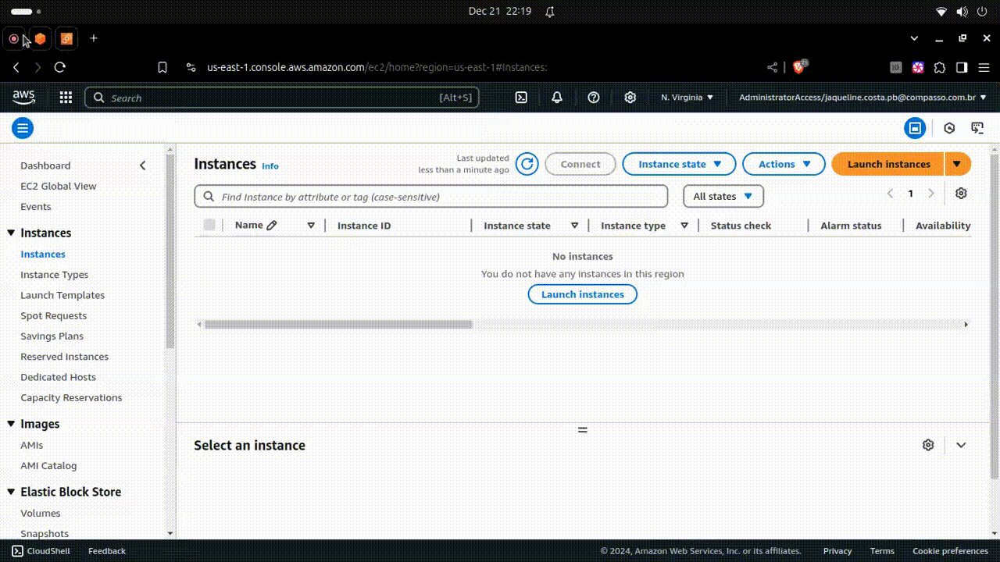
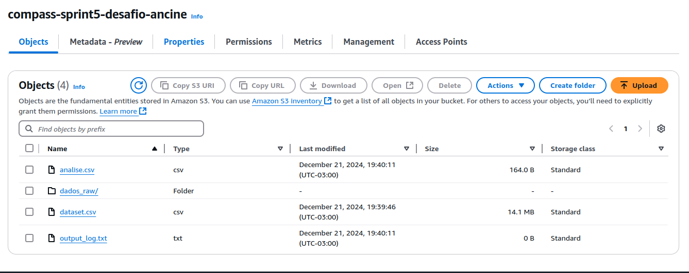
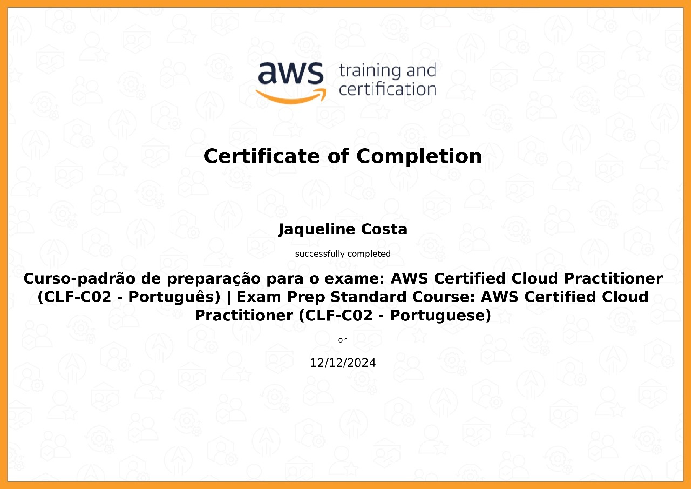
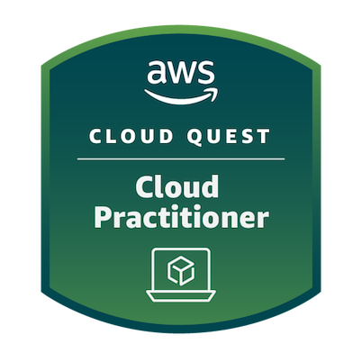
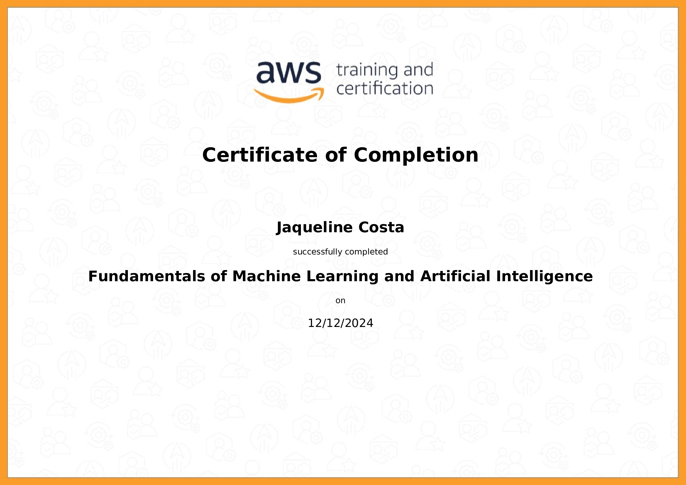

#

||
|---|
||
||

## RELATOS DE APRENDIZADO

### Fundamentos de Cloud & AWS S3

  

Até então, eu tinha estudado muito de aspectos teóricos dos serviços de cloud da AWS. E esta sprint me possibilitou uma experiência de aprendizado na prática, que faltava para entender a relação entre alguns serviços e recursos aplicados nos estudos de caso verossimilhantes.

### Boto3 API

Procurei me dedicar ao desenvolvimento com o Boto, pois considero essencial adquirir familiaridade com a API, visto que um dos conceitos principais da arquitetura de microsserviços e segurança é a automatização de processos.

Busquei explorar algumas formas de integração, utilizando o modo `client` e `resource`, e praticar o desenvolvimento de scripts ao automatizar a criação de uma instância EC2, além da integração com o S3 realizada no desafio. Espero continuar desenvolvendo essa habilidade ao longo da trilha.

### Polars

Comecei a estudar, mas não tive tempo de aplicar a versão em Polars na minha análise. No entanto, me empolguei muito com a biblioteca ao aprender e ver o quão ágil ela pode ser: uma das colegas do programa só conseguiu tratar o dataset dela (de +- 6.5 M de linhas) com Polars. Essa demonstração do poder da biblioteca me motiva a continuar estudando, pois me parece uma ferramenta essencial para big data.

---

## EXERCÍCIOS

Todos os códigos dos exercícios foram implementados seguindo os Python Enhancement Proposal, especificamente as recomendações de estilo do PEP8 e convenções de docstrings do PEP257, indicados na seção [Bibliografia](#bibliografia), com validação no [*CodeWOF: Python 3 Style Checker*](https://www.codewof.co.nz/style/python3/) online.

Na pasta `evidencias/exercicios`, estão localizadas as imagens com a validação de cada exercício.

* **instancia_ec2.py** : criação de uma instância EC2 com especificações solicitadas:
  * **Tipo de Instância** | t2.micro
  * **Tags** | Instance e Volume
    * `Name` : compass-sprint5
    * `Project` : Programa de Bolsas
    * `CostCenter` : Data & Analytics
* **Hospedagem S3** : criação e hospedagem de website em bucket S3 por meio do console.
  * **/bucket-app** : contém os arquivos HTML de index e erro do app de teste.
  * **/dados** : contém o arquivo CSV do app de teste.
  * Conteúdo do bucket:
    * `index.html`
    * `404.html`
    * `dados/nomes.csv`
  * Link para o website [֍](http://compass-sprint5-lab.s3-website-us-east-1.amazonaws.com/)

## DESAFIO

Integração de pipeline de tratamento e análise de dados com um bucket no AWS S3. O dataset utilizado para análise é disponilibilizado pela ANCINE, referente aos certificados emitidos anualmente para obras audiovisuais não publicitárias. Maiores informações no [site](https://dados.gov.br/dados/conjuntos-dados/crt-obras-nao-publicitarias-registradas).

A seguir uma descrição dos componentes do desafio:

* **[/dados_raw](./desafio/dados_raw/)**: diretório com os arquivos CSV originais, emitidos anualmente.
* **[etl.py](./desafio/etl.py)**: script de execução do pipeline do desafio. Responsável pelas etapas:
  * **[dataset.csv](./desafio/dataset.csv)**: arquivo consolidado a partir da concatenação dos arquivos CSV em `dados_raw`, é exportado pelo script acima.
  * Criação do bucket, upload e download de arquivos gerados durante a execução.
  * Chamada e execução do script `analise.py`.
  * **[output_log.txt](./desafio/output_log.txt)**: arquivo de log de execução.
* **[analise.py](./desafio/analise.py)**: script de análise do dataset, utilizando a biblioteca Pandas. Exporta a análise final no formato CSV.
  * **[analise.csv](./desafio/analise.csv)**: arquivo com a análise final, é exportado pelo script acima.

## EVIDÊNCIAS

Na pasta `evidencias`, encontram-se prints referentes a momentos de execução, exemplificando abordagens adotadas para o desenvolvimento dos exercícios e do desafio.  
No passo a passo explicativo, encontrado na pasta `desafio`, serão comentados outros prints de pontos específicos.

### CRIAÇÃO DE INSTÂNCIA EC2

Criação de instância EC2 para teste, tanto no console quanto a partir de script Python com a API Boto3.

#### EXECUÇÃO NO MANAGEMENT CONSOLE

#### EXECUÇÃO COM SCRIPT PYTHON E BOTO3

### AWS LAB S3 BUCKET: HOSPEDAGEM DE SITE ESTÁTICO

Hospedagem de site estático em um bucket, utilizando o AWS S3.

#### EXECUÇÃO NO MANAGEMENT CONSOLE

### DESAFIO: ESTRUTURA FINAL DO BUCKET

## CERTIFICADOS AWS SKILL BUILDER

### AWS Curso-Padrão de Preparação para o Exame: CLF-C02 - Português

| |
|---|
| |
||

### AWS Cloud Quest: Cloud Practitioner

| |
|---|
| |
||

## CERTIFICADOS COMPLEMENTARES

Para absorver melhor o conteúdo desta sprint e me aprofundar em pontos de interesse, concluí em paralelo os cursos abaixo, externos à Udemy.

### AWS Fundamentals of Machine Learning and Artificial Intelligence

| |
|---|
||
||

## BIBLIOGRAFIA

AMAZON WEB SERVICES. **Boto Documentation**. Última atualização: 2024. Disponível em: <[boto3.amazonaws.com/v1/documentation](https://boto3.amazonaws.com/v1/documentation/api/latest/index.html)>.

AMAZON WEB SERVICES. **Simple Storage Service: User Guide**. Última atualização: 2024. Disponível em: <[docs.aws.amazon.com/pdfs/AmazonS3](https://docs.aws.amazon.com/pdfs/AmazonS3/latest/userguide/s3-userguide.pdf)>.

VAN ROSSUM, Guido; WARSAW, Barry; COGHLAN, Alyssa. **PEP 8 – Style Guide for Python Code**. Última atualização: 2013. Disponível em: <[peps.python.org/pep-0008/](https://peps.python.org/pep-0008/)>.  

VAN ROSSUM, Guido; GOODGER, David. **PEP 257 – Docstring Conventions**. Última atualização: 2001. Disponível em: <[peps.python.org/pep-0257/](https://peps.python.org/pep-0257/)>.
