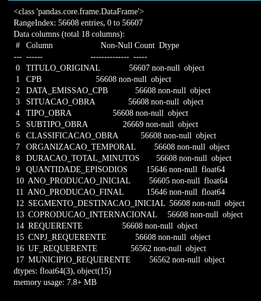
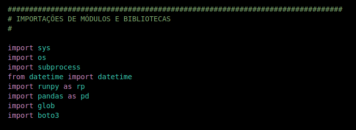
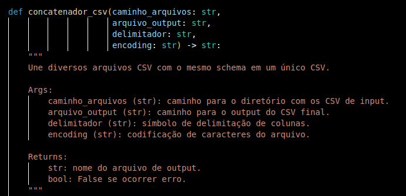
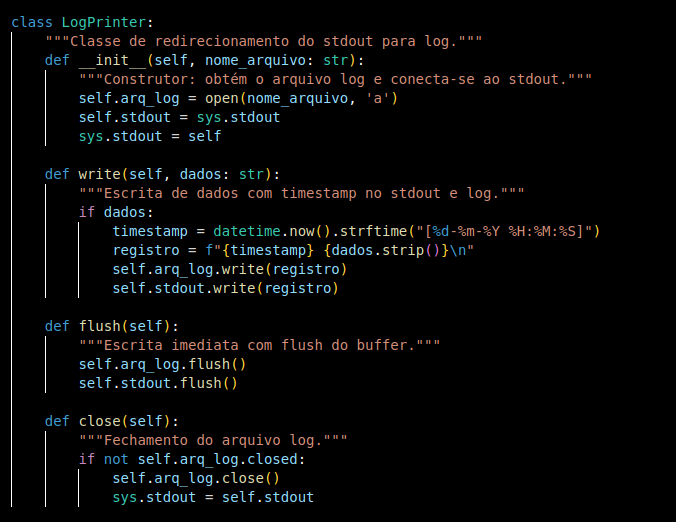
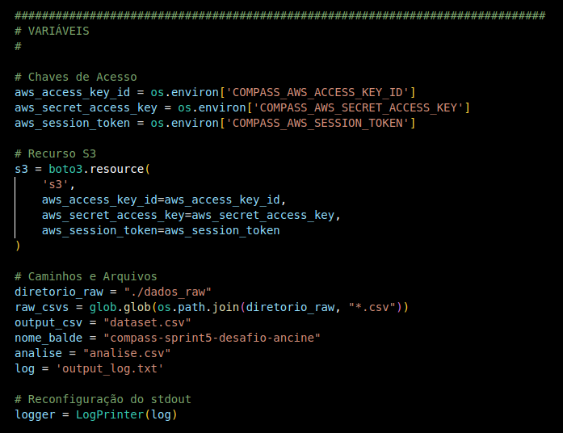
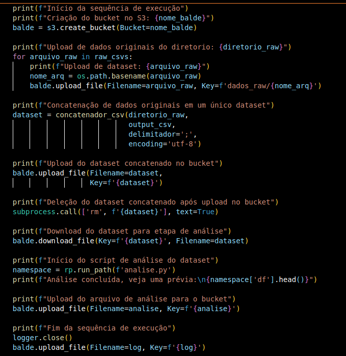
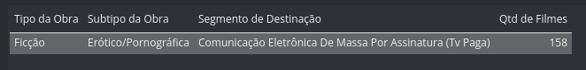

#

||
|---|
||
||

## SEÇÕES

* **Introdução ao Dataset: Obras Não Publicitárias Registradas** [֍](#introdução-ao-dataset-obras-não-publicitárias-registradas)
  * **Análise: Produção Audiovisual Durante a Pandemia** [֍](#análise-produção-audiovisual-durante-a-pandemia)
* **Introdução ao AWS S3: Simple Storage Service** [֍](#introdução-ao-aws-s3-simple-storage-service)
  * **Armazenagem de Objetos** [֍](#armazenagem-de-objetos)
  * **Características Gerais de Uso** [֍](#características-gerais-de-uso)
  * **Chaves & Prefixos** [֍](#chaves--prefixos)
* **Introdução à API Boto** [֍](#introdução-à-api-boto)
* **Script Análise: Sequência de Manipulações no Dataset** [֍](#script-análise-sequência-de-manipulações-no-dataset)
  * **Tratamento de Strings** [֍](#tratamento-de-strings)
  * **Manipulação de Data** [֍](#manipulação-de-data)
  * **Conversão Adicional Para Float** [֍](#conversão-adicional-para-float)
  * **Filtro com Atributos de Data, Condicionais & Operadores Lógicos** [֍](#filtro-com-atributos-de-data-condicionais--operadores-lógicos)
  * **Funções de Agregação: Group By, Count & Max** [֍](#funções-de-agregação-group-by-count--max)
* **Script ETL: Sequência de Execuções** [֍](#script-etl-sequência-de-execuções)
  * **Importações** [֍](#importações)
  * **Função Concatenador CSV** [֍](#função-concatenador-csv)
  * **Classe LogPrinter** [֍](#classe-logprinter)
  * **Variáveis** [֍](#variáveis)
  * **Pipeline de Execução** [֍](#pipeline-de-execução)
    * **Criação do Bucket** [֍](#criação-do-bucket)
    * **Upload de Dados Originais no Bucket** [֍](#upload-de-dados-originais-no-bucket)
    * **Consolidação do Dataset** [֍](#consolidação-do-dataset)
    * **Upload do Dataset Consolidado no Bucket** [֍](#upload-do-dataset-consolidado-no-bucket)
    * **Deleção do Dataset Após Upload** [֍](#deleção-do-dataset-após-upload)
    * **Download do Dataset para Análise** [֍](#download-do-dataset-para-análise)
    * **Execução do Script de Análise** [֍](#execução-do-script-de-análise)
    * **Upload da Análise para o Bucket** [֍](#upload-da-análise-para-o-bucket)
    * **Upload do Arquivo de Log & Fim da Execução** [֍](#upload-do-arquivo-de-log--fim-da-execução)
  * **Dataset com Análise Final** [֍](#dataset-com-análise-final)
  * **Demonstração de Execução do Script** [֍](#demonstração-de-execução-do-script)
* **Considerações Finais** [֍](#considerações-finais)
* **Referências** [֍](#referências)

## INTRODUÇÃO AO DATASET: OBRAS NÃO PUBLICITÁRIAS REGISTRADAS

*Voltar para **Seções*** [֍](#seções)

O [dataset](https://dados.gov.br/dados/conjuntos-dados/crt-obras-nao-publicitarias-registradas) utilizado neste projeto, pertencente ao banco de dados da ANCINE (Agência Nacional do Cinema), refere às obras não publicitárias com CPB (Certificado de Produto Brasileiro) emitidos no período de  2002 a 2024.

O **CPB** é um registro gratuito concedido pela ANCINE a obras audivisuais não publicitárias, obrigatório para todas as obras que visarem à exportação ou a sua comunicação pública, em território brasileiro, nos segmentos de mercado regulados pela ANCINE. Sendo também um requisito para a obtenção do CRT (Certificado de Registro de Título) das obras audiovisuais não publicitárias brasileiras.

A seguir a listagem e descrição dos campos:

|||
|:---|:---|
|**Título Original**|Nome que descreve o título original da obra não publicitária.|
|**CPB**|Número do Certificado de Produto Brasileiro.|
|**Data de Emissão do CPB**|Data de emissão do registro do CPB.|
|**Situação da Obra**|Situação do registro da obra.|
|**Tipo da Obra**|Informa o tipo da obra, indicando seu gênero de produção. *Exemplos: Animação, Documentário, Ficção, entre outros.*|
|**Subtipo da Obra**|Informa o subtipo da obra. *Exemplos: Vídeoaula, Registro de Eventos, entre outros.*|
|**Classificação da Obra**|Informa a categoria da obra. *Exemplos: Comum, Brasileira Constituinte de Espaço Qualificado, entre outras.*|
|**Organização Temporal**|Informa a organização temporal da obra. *Exemplos: Não Seriada, Seriada em Temporada Única, entre outras.*|
|**Duração Total (Minutos)**|Duração, em minutos, do tempo de exibição da obra. Caso obra seriada, somatório total dos episódios.|
|**Quantidade de Episódios**|Para obras seriadas, indica a quantidade de episódios.|
|**Ano de Produção Inicial**|Informa o ano de produção da obra. Caso obra seriada, o ano inicial de produção.|
|**Ano de Produção Final**|Caso obra seriada, informa o último ano de produção da obra.|
|**Segmento de Destinação**|Informa o segmento de mercado de veiculação da obra. *Exemplos: Salas de exibição, Mídias Móveis, entre outros.*|
|**Coprodução Internacional**|Indica se a obra é coproduzida por requerentes estrangeiros.|
|**Requerente**|Nome do requerente do registro da obra.|
|**CNPJ do Requerente**|Registro de CNPJ do requerente do registro da obra.|
|**UF do Requerente**|Sigla da unidade federativa referente ao endereço do requerente.|
|**Município do Requerente**|Município referente ao endereço do requerente.|
|||

Com exceção das colunas de `Quantidade de Episódios`, `Ano de Produção Inicial` e `Ano de Produção Final`, todas as demais colunas possuem originalmente o tipo `object`. E, mesmo as colunas citadas, possuem o tipo `float64`, inadequado para o tipo de valor que contêm.



### ANÁLISE: PRODUÇÃO AUDIOVISUAL DURANTE A PANDEMIA

*Voltar para **Seções*** [֍](#seções)

A partir dos dados coletados, após a concatenação dos datasets referentes às produções anuais, foi realizada uma análise da produção audiovisual brasileira no período de pandemia do COVID-19, abarcando as obras de longa metragens (a partir de 60 minutos de duração) com CPB emitido entre 2020 e 2022, no qual foram agrupados os totais da coluna `Qtd de Filmes` por:

* **Tipo da Obra**
* **Subtipo da Obra**
* **Segmento de  Destinação**

Deste modo, busca-se interpretar quais os tipos e subtipos de obras mais produzidas no período crítico de quarentena, e quais os segmentos de destinação mais utilizados.

## INTRODUÇÃO AO AWS S3: SIMPLE STORAGE SERVICE

### ARMAZENAGEM DE OBJETOS

*Voltar para **Seções*** [֍](#seções)

O armazenamento de objetos é uma estrutura achatada (*flat*), na qual os dados, denominados **objetos** se localizam em um único repositório chamado de ***bucket***. Os objetos podem ser organizados de modo a "imitar" um estrutura hierárquica, utilizando prefixos e delimitadores. Assim, a organização se torna mais visual, facilitando e otimizando o acesso aos dados.

### CARACTERÍSTICAS GERAIS DE USO

*Voltar para **Seções*** [֍](#seções)

* **Owner**: cada *bucket* é propriedade da conta que o cria, e não pode ser transferido para outras contas
* **Nomes**: os nomes de *bucket* são globalmente únicos, não podem haver duplicações dentro de toda a infraestrutura S3
* **Renomeação**: uma vez criado, não é possível renomear um *bucket*
* **Entidade Permanentes**: *buckets* são entidades de armazenamento permanente e só removíveis quando estão vazios. Após deletar um *bucket*, o nome se torna disponível para reutilização em 24 horas.
* **Limites de Armazenamento de Objetos**: não há limite ao número de objetos a serem armazenados em um *bucket*. No entanto, não é possível criar um *bucket* dentro de um *bucket*, conceito também denominado *nesting buckets*.
* **Limites de Criação de Buckets**: por padrão, é possível criar até 100 *buckets* por conta AWS. Se houver necessidade, é possível aumentar esse limite para até 1000 *buckets*.
* **Tamanho dos Objetos**: cada objeto pode ter até 5 TB.

### CHAVES & PREFIXOS

*Voltar para **Seções*** [֍](#seções)

Ao criar um objeto, deve ser especificada uma chave que o identifica unicamente. É o caminho absoluto do objeto no bucket. O armazenamento no bucket é *flat*, não possui hierarquias; no entanto, é possível simular um sistema de arquivos através de prefixos e delimitadores.

```python
    https://compass-sprint5-desafio-ancine.s3-us-east-1.amazonaws.com/dados_raw/obras-nao-pub-brasileiras-2002.csv
```

Acima um exemplo de endereço de um dos arquivos tratados, o **prefixo** é `dados_raw/`, que compõe o nome da chave com `obras-nao-pub-brasileiras-2002.csv`.

> *Você pode utilizar prefixos para organizar os dados armazenados em buckets Amazon S3. Um prefixo é uma string de caracteres no início do nome-chave (**key name**) de um objeto. Um prefixo pode ter qualquer tamanho, sujeito ao tamanho máximo do key name do objeto (1024 bytes). Você pode interpretar os prefixos como uma maneira de organizar seus dados em uma maneira similar aos diretórios. No entanto, prefixos não são diretórios.* [^1]

É importante lembrar que, apesar da aparência de diretórios, eles não existem de fato, o "caminho" é simplesmente um nome de chave "muito longo".

## INTRODUÇÃO À API BOTO

*Voltar para **Seções*** [֍](#seções)

A integração com os serviços AWS via Python é realizada com a API Boto, as informações para sua utilização foram consultadas na [documentação](https://boto3.amazonaws.com/v1/documentation/api/latest/index.html).

Existem 4 tipos de chamadas aos recursos:

* **Client**
  * Interface de baixo nível, com métodos que são mapeados quase diretamente aos serviços AWS.
  * Parâmetros devem ser passados como argumentos nomeados (*keywords*), não funcionam se forem passados como arumentos posicionais.
  * Respostas são retornadas como dicionários.

```python
    s3 = boto3.client('s3')
```

* **Resources**
  * Interface de alto nível, orientada a objetos
  * Permite tratar os recursos AWS como objetos Python, com atributos e métodos

```python
    s3 = boto3.resource('s3')
    # Cada bucket pode ser tratado como um objeto.
    bucket = s3.create_bucket(Bucket='novo-bucket')
```

* **Paginators**
  * Resultados paginados por requisições subsequentes, os resultados são iterados e retornados em "páginas". O limite de objetos retornado por requisição é 1000, portanto, para resultados com maior número de retornos é necessário utilizar **paginação**.
  * Acessado a partir de um `client`.

```python
    # Necessário criar um cliente
    cliente = boto3.client('s3', region_name='us-west-2')

    # Cria um paginador reutilizável
    paginador = cliente.get_paginator('list_objects_v2')

    # Cria um iterador de páginas a partir de um paginador
    iterador = paginador.paginate(Bucket='novo-bucket')

    # Acesso do conteúdo das páginas
    for pagina in iterador:
        print(pagina['Contents'])
```

* **Waiters**
  * Utiliza a execução de um serviço de cliente para consultar (*polling*) a conclusão de estados específicos em um serviço AWS.
  * Suspende a execução do programa até obter o estado desejado ou alguma falha durante o *polling*.

```python
    s3 = boto3.client('s3')

    # Caso um cliente não possua nenhum waiter, o comando abaixo retorna uma lista vazia.
    s3.waiter_names

    # Armazena uma instância de waiter que irá aguardar até que determinado bucket exista.
    s3_bucket_exists_waiter = s3.get_waiter('bucket_exists')

    # Comando para iniciar a espera de existência do bucket.
    s3_bucket_exists_waiter.wait(Bucket='novo-bucket')
```

## SCRIPT ANÁLISE: SEQUÊNCIA DE MANIPULAÇÕES NO DATASET

*Voltar para **Seções*** [֍](#seções)

Nas próximas subseções, serão descritas as etapas de manipulação de dados solicitadas, na ordem em que foram realizadas. E abaixo encontra-se o fluxo de execução das funções no script, concatenadas para a obtenção de uma única análise.

Esta sequência foi executada a partir do script `analise.py`, utilizando a biblioteca Pandas.

### TRATAMENTO DE STRINGS

*Voltar para **Seções*** [֍](#seções)

Primeiramente, é realizado o tratamento do nome das colunas que, originalmente, constam todas em maiúsculas. Além de facilitar a memorização, auxilia na leitura do dataset final da análise.

```python
    colunas = ['Título Original',
            'CPB',
            'Data de Emissão do CPB',
            'Situação da Obra',
            'Tipo da Obra',
            'Subtipo da Obra',
            'Classificação da Obra',
            'Organização Temporal',
            'Duração Total (Minutos)',
            'Quantidade de Episódios',
            'Ano de Produção Inicial',
            'Ano de Produção Final',
            'Segmento de Destinação',
            'Coprodução Internacional',
            'Requerente',
            'CNPJ do Requerente',
            'UF do Requerente',
            'Município do Requerente']
    
    df.columns = colunas
```

Em seguida, as colunas de interesse, que constarão no dataset da análise final, têm seus valores de string tratados com o método `title()`, deixando cada palavra com maiúscula inicial seguida de minúsculas.

```python
    df['Tipo da Obra'] = df['Tipo da Obra'].str.title()
    df['Subtipo da Obra'] = df['Subtipo da Obra'].str.title()
    df['Segmento de Destinação'] = df['Segmento de Destinação'].str.title()
```

### MANIPULAÇÃO DE DATA

*Voltar para **Seções*** [֍](#seções)

Na coluna `Data de Emissão do CPB`, utilizada para filtrar o período concernente à pandemia do COVID-19, é preciso fazer o tratamento da data, originalmente no formato DD/MM/YYYY, com o método `to_datetime()`.

```python
    df['Data de Emissão do CPB'] = pd.to_datetime(
        df['Data de Emissão do CPB'], 
        dayfirst=True,  # Considera o formato DD/MM/YYYY
        errors='coerce')
```

### CONVERSÃO ADICIONAL PARA FLOAT

*Voltar para **Seções*** [֍](#seções)

Para filtrar a coluna de `Duração Total (Minutos)`, originalmente do tipo `object`, é necessário substituir as vírgulas por pontos, adequando o formato antes da conversão para `float`.

```python
    df['Duração Total (Minutos)'] = df['Duração Total (Minutos)'].str.replace(',', '.').astype(float)
```

### FILTRO COM ATRIBUTOS DE DATA, CONDICIONAIS & OPERADORES LÓGICOS

*Voltar para **Seções*** [֍](#seções)

A seguir, algumas 4 operações condicionais são concatenadas 3 operadores lógicos AND (&), nesse bloco são selecionadas as linhas com data de emissão do certificado entre 2020 e 2022, excluindo séries e curta metragens.

```python
df = df[(df['Data de Emissão do CPB'].dt.year >= 2020) & 
        (df['Data de Emissão do CPB'].dt.year <= 2022) & 
        (df['Organização Temporal'] == 'NÃO SERIADA') &
        (df['Duração Total (Minutos)'] >= 60)]
```

### FUNÇÕES DE AGREGAÇÃO: GROUP BY, COUNT & MAX

*Voltar para **Seções*** [֍](#seções)

No bloco final, o dataset filtrado é agrupado com `groupby()` por **tipo** e **subtipo** de obra e pelo segmento de destinação do filme (ex. TV Aberta, salas de cinema, etc). As linhas são contadas com `count()` a partir da coluna `CPB`, que contém números únicos de certificados emitidos, e a indexagem é feita pela nova coluna nomeada `Qtd de Filmes`.

Após isso, a análise é concluída selecionando a linha com maior quantidade de filmes produzidos, utilizando `max()` .

```python
    df = df.groupby([
        'Tipo da Obra',
        'Subtipo da Obra',
        'Segmento de Destinação'
    ])['CPB']\
        .count()\
        .reset_index(name='Qtd de Filmes')

    df = df.loc[df['Qtd de Filmes'] == df['Qtd de Filmes'].max()]
```

## SCRIPT ETL: SEQUÊNCIA DE EXECUÇÕES

*Voltar para **Seções*** [֍](#seções)

O script `etl.py` executa a concatenação dos arquivos CSV originais (anuais) em um único dataset, faz a integração com o AWS S3 via API Boto, e executa o script `analise.py` gerando o dataset final.

### IMPORTAÇÕES

*Voltar para **Seções*** [֍](#seções)

A seguir, um breve comentário sobre a finalidade de cada módulo ou função importado.



* **sys** : permite o acesso ao terminal
* **os** : permite o acesso às variáveis de ambiente e aos caminhos de diretórios
* **subprocess** : permite a execução de um subprocesso no shell
* **datetime** : permite o acesso ao horário atual
* **runpy** : permite a execução de um script no ambiente atual de execução
* **pandas** : permite a manipulação dos dados dos arquivos CSV
* **glob** : permite a busca por padrões
* **boto3** : permite o acesso aos serviços AWS

### FUNÇÃO CONCATENADOR CSV

*Voltar para **Seções*** [֍](#seções)



Em um bloco `try` (externo), o caminho dos arquivos é concatenado com o padrão de busca `*.csv`. No caso da execução, o argumento passado `caminho_arquivos` é o caminho `./dados_raw`, resultando no padrão `./dados_raw/*.csv`.

Esse padrão é passado na chamada do método `glob()`, resultando em uma lista de strings com os caminhos relativos dos arquivos CSV a serem concatenados.

```python
    # Obter todos os arquivos CSV no diretório
    arqs_csv = glob.glob(os.path.join(caminho_arquivos, "*.csv"))
```

Em seguida, essa lista será iterada em um bloco `try` (interno), gerando um DataFrame para cada arquivo. Além do tratamento de valores nulos feito na configuração passada no método `read_csv`, quaisquer linhas vazias são posteriormente removidas, e o DataFrame adicionado à lista.

Qualquer erro na leitura dos arquivos CSV é capturado num bloco `except` (interno), e cada etapa do processo será registrada no arquivo de logs com a chamada das funções `print()`.

```python
    # Armazenar os DataFrames individualmente
    dfs = []
        
    # Ler cada arquivo CSV e adicionar à lista
    for arquivo in arqs_csv:
        print(f"Processando: {arquivo}")
        try:
            df = pd.read_csv(
                arquivo,
                delimiter=delimitador,
                encoding=encoding,
                quotechar='"',
                na_values=['', 'NA', 'NULL'],  # Tratar campos vazios
                keep_default_na=True
            )
                
            # Remover quaisquer linhas vazias
            df = df.dropna(how='all')
                
            dfs.append(df)
            print(f"Arquivo {arquivo} processado com sucesso")
                
        except Exception as e:
            print(f"Erro ao processar o arquivo {arquivo}: {str(e)}")
            return False
```

Ao fim do loop, a lista de DataFrames é concatenada com o método `concat()`, passando o argumento para ignorar os indexes originais.

```python
    # Concatenar todos os DataFrames
    final_df = pd.concat(dfs, ignore_index=True)
```

Por fim, o arquivo é exportado para CSV, passando alguns argumentos de formatação como exclusão de index, mantendo o mesmo delimitador de coluna, utilizando aspas duplas e representando valores NA como strings vazias.

```python
    # Exportar o DataFrame concatenado para um arquivo CSV
    final_df.to_csv(
        arquivo_output,
        index=False,
        sep=delimitador,
        quotechar='"',
        na_rep=''  # Representa valores NA como strings vazias
    )
```

Os últimos registros de log são lançados e a função retorna o nome do arquivo. Esse retorno é útil, pois será a variável `dataset` utilizada para upload/download do bucket.

```python
    print(f"{len(arqs_csv)} arquivos concatenados em {arquivo_output}")
    print(f"Quantidade de linhas no arquivo final: {len(final_df)}")
        
    return arquivo_output
```

O bloco `try` (externo) é encerrado, fechando o script com um bloco `except` (externo) para capturar erros no processo de localização do diretório e captura dos nomes de arquivos no padrão informado.

```python
    except Exception as e:
        print(f"Um erro ocorreu: {str(e)}")
        return False
```

### CLASSE LOGPRINTER

*Voltar para **Seções*** [֍](#seções)

A classe `LogPrinter` faz a reconfiguração do `stdout` para redirecionar os prints do terminal para um arquivo de log.



* **Construtor**

```python
    # Abre um arquivo de log no modo 'append'
    self.arq_log = open(nome_arquivo, 'a')

    # Salva as impressões enviadas para o terminal
    self.stdout = sys.stdout

    # Direciona a saída do terminal para esta classe
    sys.stdout = self
```

* **Método: write**

O método `write()` é chamado em toda utilização da função `print()`, da seguinte maneira:

```python
    # O comando print("Olá") executa esta chamada
    sys.stdout.write("Olá\n")
```

Portanto, o método abaixo sobrescreve a execução padrão de `print()`, enviando tanto para o terminal quanto para o arquivo de log.

```python
    # Confere se existe alguma string passada como argumento
    if dados:
        # Obtém data e hora atuais
        timestamp = datetime.now().strftime("[%d-%m-%Y %H:%M:%S]")
        # Prepara o registro do log, com timestamp e string recebida no argumento
        registro = f"{timestamp} {dados.strip()}\n"
        # Faz a escrita no arquivo
        self.arq_log.write(registro)
        # Faz a escrita no terminal
        self.stdout.write(registro)
```

* **Método: flush**

As impressões em arquivos e no terminal, geralmente, são coletadas em um *buffer* para otimização de performance, sendo processadas em "lotes". O método `flush()` esvazia o *buffer* e faz a escrita imediatamente.

```python
    self.arq_log.flush()
    self.stdout.flush()
```

Esse método é chamado automaticamente pelo Python em vários contextos de chamadas de `print()`:

1. Quando o *buffer* está cheio
2. Quando `flush = True` é passado como argumento de `print()`
3. Quando Python encontra um caractere de nova linha
4. Quando o programa é terminado
5. Ao utilizar o método diretamente com `sys.stdout.flush()`

* **Método: close**

Fecha o arquivo de log, e reconfigura o `sys.stdout` para seu estado original, anteriormente salvo como atributo da classe.

```python
    if not self.arq_log.closed:
        self.arq_log.close()
        sys.stdout = self.stdout  
```

### VARIÁVEIS

*Voltar para **Seções*** [֍](#seções)



* **Chaves de Acesso** : as chaves para utilizar os serviços AWS foram acessadas como variáveis de ambiente com o `os.environ`.

* **Recurso S3** : a integração com a API para acessar o S3 foi feita a partir do método `resource`.

* **Caminhos e Arquivos** : aqui os caminhos e arquivos de input e output são definidos.

* **Reconfiguração do stdout** : a instância de redirecionamento do `stdout` é declarada na variável `logger`, a qual permitirá o acesso ao método de fechar o arquivo de log ao final da execução do script.

### PIPELINE DE EXECUÇÃO

*Voltar para **Seções*** [֍](#seções)

A seguir a sequência de etapas realizadas para a conclusão do desafio.
Todos os comandos de `print()`, além de enviados para o terminal, são registros no arquivo `output_log.txt`.



#### CRIAÇÃO DO BUCKET

*Voltar para **Seções*** [֍](#seções)

A execução é iniciada e o bucket é criado.

```python
    print(f"Início da sequência de execução")
    print(f"Criação do bucket no S3: {nome_balde}")
    balde = s3.create_bucket(Bucket=nome_balde)
```

#### UPLOAD DE DADOS ORIGINAIS NO BUCKET

*Voltar para **Seções*** [֍](#seções)

A partir de um for loop, é realizado o upload dos arquivos CSV originais, localizados no diretório `/dados_raw`, no bucket criado na etapa anterior. 

Como os arquivos estão com seu caminho absoluto na variável `arquivo_raw`, é necessário o uso de `os.path.basename` para obter somente o nome do arquivo antes do upload.

No bucket, é utilizado um prefixo 'dados_raw/' ao nomear os arquivos, de modo a organizar o bucket com a aparência de diretório.

```python
    print(f"Upload de dados originais do diretorio: {diretorio_raw}")
    for arquivo_raw in raw_csvs:
        print(f"Upload de dataset: {arquivo_raw}")
        nome_arq = os.path.basename(arquivo_raw)
        balde.upload_file(Filename=arquivo_raw, Key=f'dados_raw/{nome_arq}')
```

#### CONSOLIDAÇÃO DO DATASET

*Voltar para **Seções*** [֍](#seções)

Nesta etapa, todos os arquivos CSV originais, referentes às produções audivisuais anuais, são consolidados em um único dataset.

Aqui é utilizada a função `concatenador_csv`, indicando o delimitador dos datasets originais e codificação de caracteres.

```python
    print(f"Concatenação de dados originais em um único dataset")
    dataset = concatenador_csv(diretorio_raw,
                               output_csv,
                               delimitador=';',
                               encoding='utf-8')
```

#### UPLOAD DO DATASET CONSOLIDADO NO BUCKET

*Voltar para **Seções*** [֍](#seções)

Terminada a concatenação, é feito o upload do dataset consolidado no bucket.

```python
    print(f"Upload do dataset concatenado no bucket")
    balde.upload_file(Filename=dataset,
                      Key=f'{dataset}')
```

#### DELEÇÃO DO DATASET APÓS UPLOAD

*Voltar para **Seções*** [֍](#seções)

Logo após o término do upload, o mesmo arquivo é deletado, limpando o diretório para o download do mesmo, evitando conflitos de arquivos com mesmo nome.

Para isso, é utilizado uma chamada de um subprocesso no shell que remove o arquivo.

```python
    print(f"Deleção do dataset concatenado após upload no bucket")
    subprocess.call(['rm', f'{dataset}'], text=True)
```

#### DOWNLOAD DO DATASET PARA ANÁLISE

*Voltar para **Seções*** [֍](#seções)

Após a remoção, o download é realizado.

```python
    print(f"Download do dataset para etapa de análise")
    balde.download_file(Key=f'{dataset}', Filename=dataset)
```

#### EXECUÇÃO DO SCRIPT DE ANÁLISE

*Voltar para **Seções*** [֍](#seções)

O script `analise.py` é executado com a biblioteca `runpy`, utilizando o mesmo *runtime* do script atual, deste modo temos acesso ao namespace utilizado pelo script de análise.

Assim, conseguimos acessar a variável `df` declarada no script `analise.py`, imprimindo a linha gerada.

```python
    print(f"Início do script de análise do dataset")
    namespace = rp.run_path(f'analise.py')
    print(f"Análise concluída, veja uma prévia:\n{namespace['df'].head()}")
```

#### UPLOAD DA ANÁLISE PARA O BUCKET

*Voltar para **Seções*** [֍](#seções)

A etapa anterior resulta em um novo arquivo `analise.csv`, aqui é realizado o upload desse arquivo para o bucket.

```python
    print(f"Upload do arquivo de análise para o bucket")
    balde.upload_file(Filename=analise, Key=f'{analise}')
```

#### UPLOAD DO ARQUIVO DE LOG & FIM DA EXECUÇÃO

*Voltar para **Seções*** [֍](#seções)

O último registro de log é feito, anunciando o fim da execução, o arquivo é fechado e o script termina com o upload do arquivo de logs da execução.

```python
    print(f"Fim da sequência de execução")
    logger.close()
    balde.upload_file(Filename=log, Key=f'{log}')
```

### DATASET COM ANÁLISE FINAL

*Voltar para **Seções*** [֍](#seções)

Após a execução do script `analise.py`, obtemos uma única linha com o `Tipo de Obra`, `Subtipo de Obra` e `Segmento de Destinação` que mais teve longa metragens produzidos no período entre 2020 e 2022, caracterizado pelas medidas de isolamento social da pandemia COVID-19.



### DEMONSTRAÇÃO DE EXECUÇÃO DO SCRIPT

*Voltar para **Seções*** [֍](#seções)


## CONSIDERAÇÕES FINAIS

*Voltar para **Seções*** [֍](#seções)

Considerando os princípios de arquitetura de microsserviços e *infrastructure as code*, a automatização de processos garante a reproducibilidade e robustez do desenvolvimento de serviços. A utilização de APIs para trabalhar com *cloud* é essencial, pois a execução de processos pelo console torna-se inviável em um ambiente ágil, e propensa a riscos, devido à quantidade de parâmetros configuráveis.

A familiarização com recursos novos é facilitada pelo console, no entanto, assim que uma rotina se estabelece, o desenvolvimento de scripts para administração de componentes torna-se fundamental.

## REFERÊNCIAS

*Voltar para **Seções*** [֍](#seções)

[^1]: AWS, S3: User Guide, p. 358
