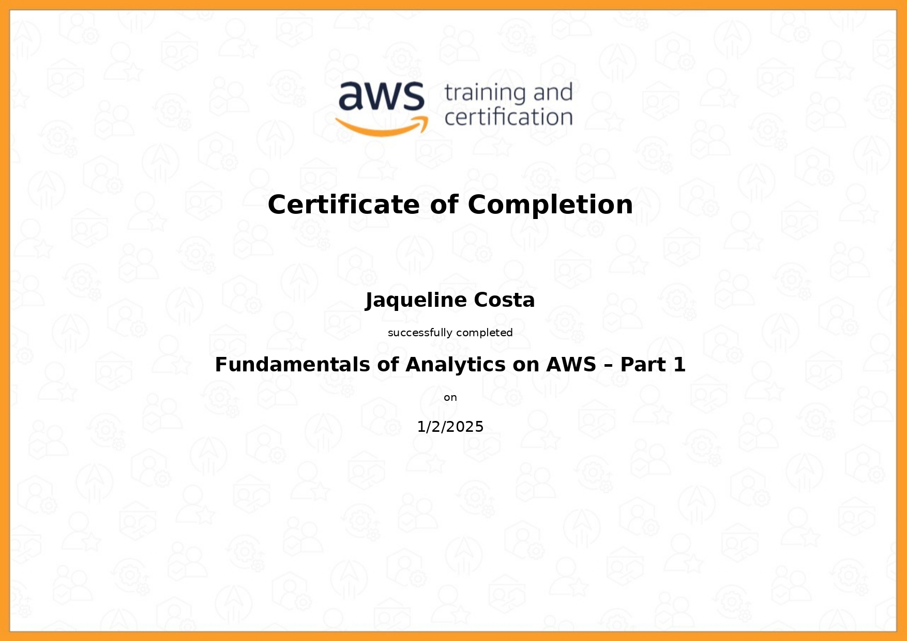
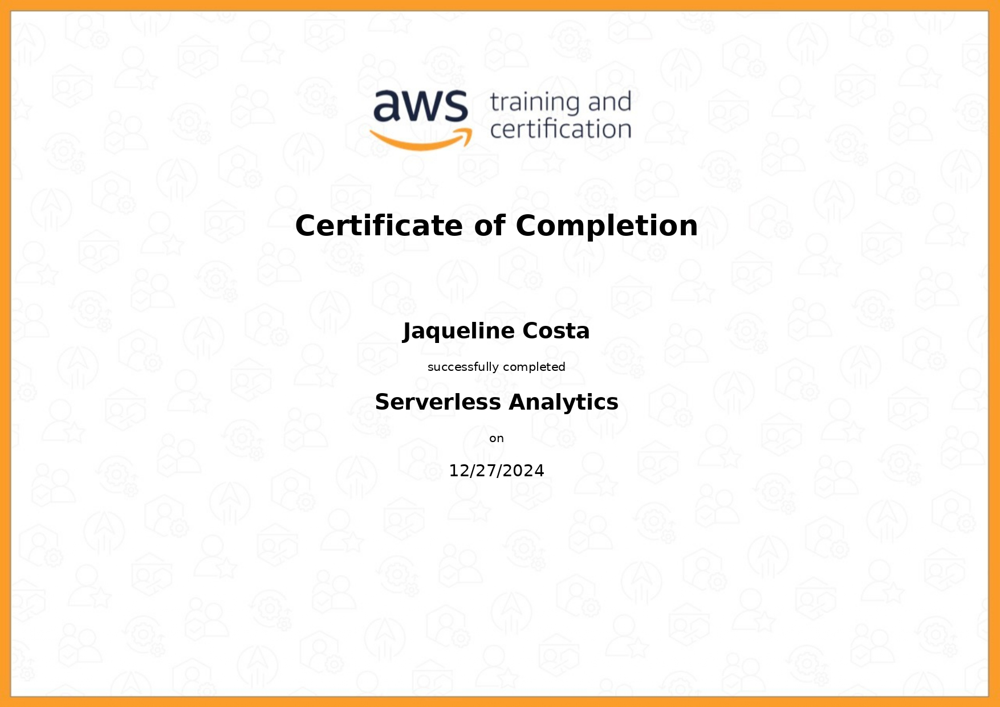
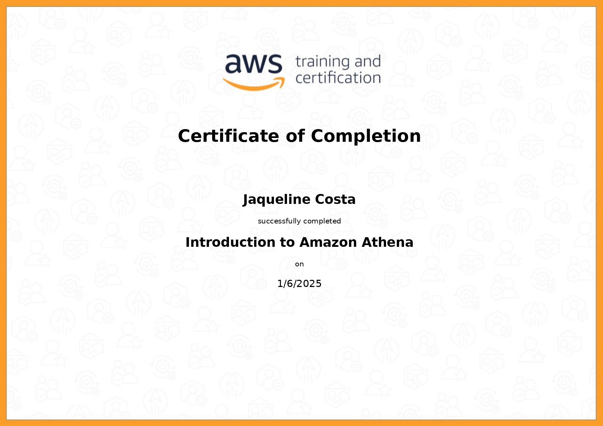
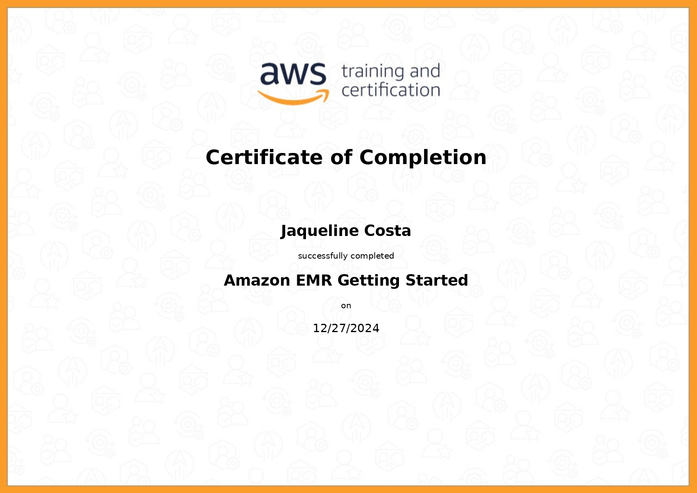
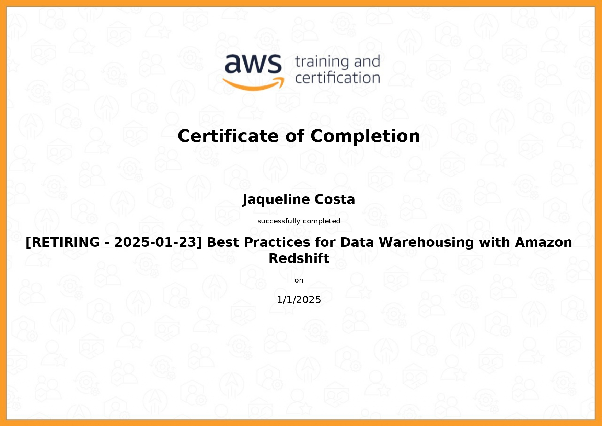
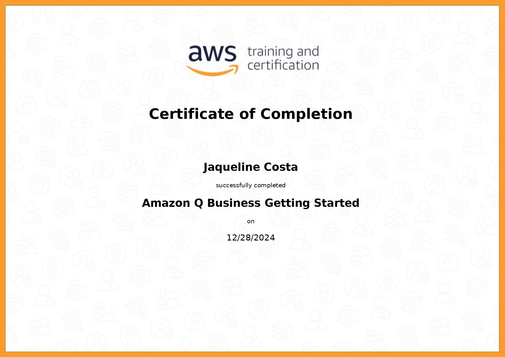
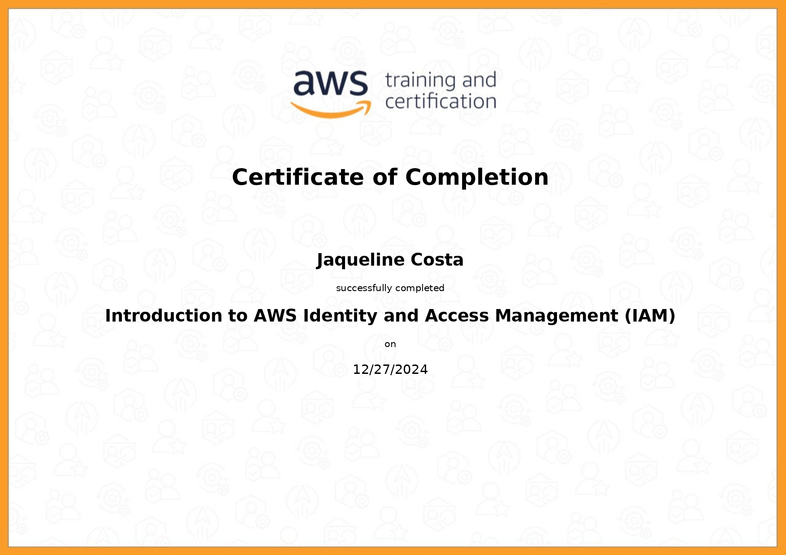
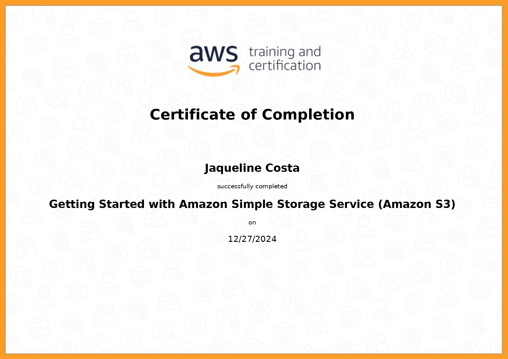
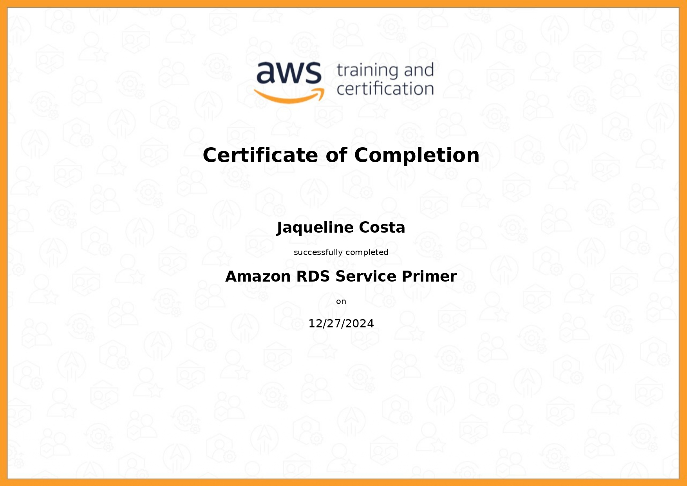

#

||
|---|
||
||

## RELATOS DE APRENDIZADO

### AWS S3 Athena, Lambda

  

---

## EXERCÍCIOS

Todos os códigos dos exercícios foram implementados seguindo os Python Enhancement Proposal, especificamente as recomendações de estilo do PEP8 e convenções de docstrings do PEP257, indicados na seção [Bibliografia](#bibliografia), com validação no [*CodeWOF: Python 3 Style Checker*](https://www.codewof.co.nz/style/python3/) online.

Na pasta `evidencias/exercicios`, estão localizadas as imagens com a validação de cada exercício.

* **Hospedagem S3** : criação e hospedagem de website em bucket S3 por meio do console.
  * [**/bucket-app**](./exercicios/bucket-app/) : contém os arquivos HTML de index e erro do app de teste.
  * [**/dados**](./exercicios/dados/) : contém o arquivo CSV do app de teste.
  * Conteúdo do bucket:
    * [**index.html**](./exercicios/bucket-app/index.html)
    * [**404.html**](./exercicios/bucket-app/404.html)
    * [**dados/nomes.csv**](./exercicios/dados/nomes.csv)
  * Link para o website [֍](http://compass-sprint5-lab.s3-website-us-east-1.amazonaws.com/)
* **Análise com Athena** : análise de dados *serverless* em um bucket S3 utilizando Athena.
  * [**/sql**](./exercicios/sql/) : contém os arquivos SQL com os comandos utilizados.
    * [**create_db_table.sql**](./exercicios/sql/create_db_table.sql) comandos DDL para criação de banco de dados e tabela consumida a partir de conexão com S3.
    * [**analise.sql**](./exercicios/sql/analise.sql) comando DQL utilizado para a pesquisa dos 3 nomes mais utilizados em cada década, a partir desta, é gerado o arquivo CSV a seguir.
  * [**analise_athena.csv**](./exercicios/analise_athena.csv) arquivo gerado com os resultados da query.

## DESAFIO

O projeto final desenvolve um fluxo de processamento e análise de dados, a partir de uma arquitetura data lake. Para a primeira etapa, é implementada a camada raw, onde os arquivos originais são armazenados e organizados de acordo com a origem e data de processamento. A execução do script de ingestão de dados ao bucket S3 é realizada isolada em um container.

* [**./dados_raw**](./desafio/dados_raw/) : diretório com os arquivos originais.
  * [**movies.csv**](./desafio/dados_raw/movies.csv)
  * [**series.csv**](./desafio/dados_raw/series.csv)
* [**Dockerfile**](./desafio/Dockerfile) : arquivo de imagem Docker.
* [**ingestão.py**](./desafio/ingestao.py) : script de execução da etapa de criação do bucket S3 e camada raw, seguida da ingestão dos arquivos originais.
  * [**log-ingestao-20250106.txt**](./desafio/log-ingestao-20250106.txt) : arquivo de log gerado pela execução do script de ingestão.

## EVIDÊNCIAS

Na pasta `evidencias`, encontram-se prints referentes a momentos de execução, exemplificando abordagens adotadas para o desenvolvimento dos exercícios e do desafio.  
No passo a passo explicativo, encontrado na pasta `desafio`, serão comentados outros prints de pontos específicos.

### AWS LAB S3 BUCKET: HOSPEDAGEM DE SITE ESTÁTICO

Hospedagem de site estático em um bucket, utilizando o AWS S3.

#### EXECUÇÃO NO MANAGEMENT CONSOLE

### AWS LAB ATHENA & S3: ANÁLISE DE DADOS SERVERLESS

Análise de dados *serverless*, consumindo dados de um bucket S3, utilizando Athena.

#### ETAPA 1: CRIAÇÃO DO BANCO DE DADOS E TABELA DO S3

#### ETAPA 2: ANÁLISE DE DADOS

### AWS LAB LAMBDA

## CERTIFICADOS AWS SKILL BUILDER

### Fundamentals of Analytics on AWS - Part 1

| |
|---|
| |
||

### Fundamentals of Analytics on AWS - Part 2

| |
|---|
| |
||

### AWS Serverless Analytics

| |
|---|
| |
||

### Introduction to Amazon Athena

| |
|---|
| |
||

### AWS Glue Getting Started

| |
|---|
| |
||

### Amazon EMR Getting Started

| |
|---|
| |
||

### Amazon Redshift Getting Started

| |
|---|
| |
||

### Best Practices for Data Warehousing with Amazon Redshift

| |
|---|
| |
||

### Amazon QuickSight - Getting Started

| |
|---|
| |
||

## CERTIFICADOS COMPLEMENTARES

Para absorver melhor o conteúdo desta sprint e me aprofundar em pontos de interesse, concluí em paralelo os cursos abaixo, externos à Udemy.

### Amazon Q Business Getting Started

| |
|---|
||
||

### Introduction to AWS Identity and Access Management (IAM)

| |
|---|
||
||

### Getting Started with Amazon Simple Storage Service (S3)

| |
|---|
||
||

### Amazon RDS Primer

| |
|---|
||
||

## BIBLIOGRAFIA

AMAZON WEB SERVICES. **Boto Documentation**. Última atualização: 2024. Disponível em: <[boto3.amazonaws.com/v1/documentation](https://boto3.amazonaws.com/v1/documentation/api/latest/index.html)>.

AMAZON WEB SERVICES. **AWS Prescriptive Guidance: Defining S3 Bucket and Path Names for
Data Lake Layers on the AWS Cloud**. Última atualização: 2024. Disponível em: <[docs.aws.amazon.com/pdfs/prescriptive-guidance](https://docs.aws.amazon.com/pdfs/prescriptive-guidance/latest/defining-bucket-names-data-lakes/definiing-bucket-names-data-lakes.pdf#raw-data-layer-naming-structure)>.

AMAZON WEB SERVICES. **Simple Storage Service: User Guide**. Última atualização: 2024. Disponível em: <[docs.aws.amazon.com/pdfs/AmazonS3](https://docs.aws.amazon.com/pdfs/AmazonS3/latest/userguide/s3-userguide.pdf)>.

VAN ROSSUM, Guido; WARSAW, Barry; COGHLAN, Alyssa. **PEP 8 – Style Guide for Python Code**. Última atualização: 2013. Disponível em: <[peps.python.org/pep-0008/](https://peps.python.org/pep-0008/)>.  

VAN ROSSUM, Guido; GOODGER, David. **PEP 257 – Docstring Conventions**. Última atualização: 2001. Disponível em: <[peps.python.org/pep-0257/](https://peps.python.org/pep-0257/)>.
