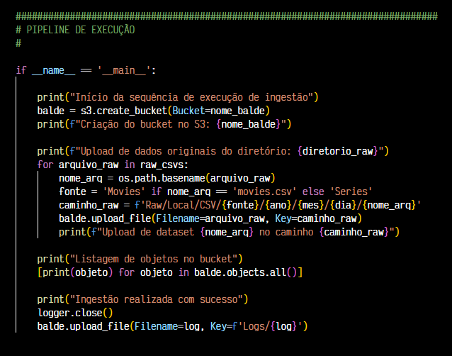
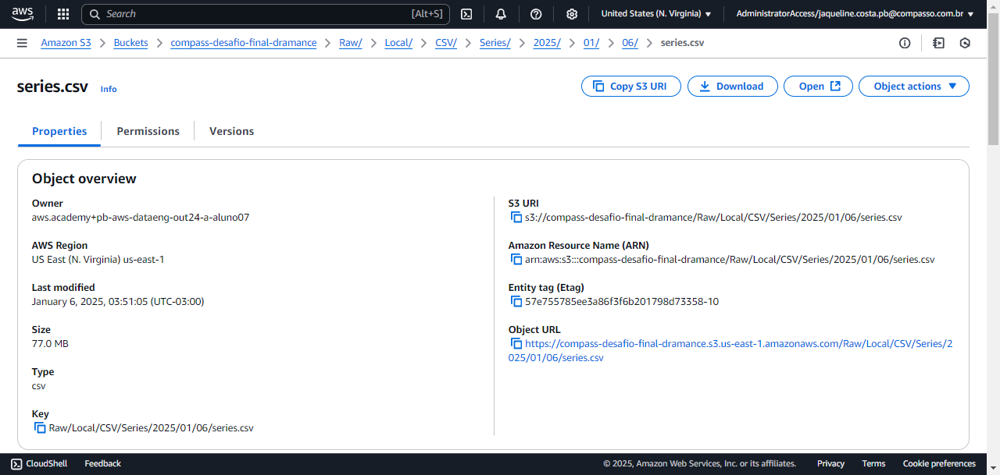

#

||
|---|
||
||

## SEÇÕES

* **Introdução aos Datasets** [֍](#introdução-aos-datasets)
  * **Tamanhos: Quantidade de Linhas e Colunas** [֍](#tamanhos-quantidade-de-linhas-e-colunas)
  * **Colunas e Tipos de Dados** [֍](#colunas-e-tipos-de-dados)
  * **Análise Final: Contra-hegemonia Cinematográfica na Era Pós-streaming** [֍](#análise-final-contra-hegemonia-cinematográfica-na-era-pós-streaming)
    * **Recorte Regional e Linguístico** [֍](#recorte-regional-e-linguístico)
    * **Recorte Temporal** [֍](#recorte-temporal)
    * **Questões e Indicadores** [֍](#questões-e-indicadores)
* **Introdução à Arquitetura de Data Lake** [֍](#introdução-à-arquitetura-de-data-lake)
  * **Estrutura do Data Lake com AWS S3** [֍](#estrutura-do-data-lake-com-aws-s3)
  * **Camada Raw** [֍](#camada-raw)
* **Processamento de Dados no Data Lake: Etapa de Ingestão** [֍](#processamento-de-dados-no-data-lake-etapa-de-ingestão)
  * **Análise do Script** [֍](#análise-do-script)
    * **Declaração de Variáveis** [֍](#declaração-de-variáveis)
    * **Pipeline de Execução** [֍](#pipeline-de-execução)
  * **Preparação da Imagem Docker** [֍](#preparação-da-imagem-docker)
    * **Build da Imagem com Dockerfile** [֍](#build-da-imagem-com-dockerfile)
  * **Execução do Container e Criação de Named Volume** [֍](#execução-do-container-e-criação-de-named-volume)
  * **Demonstração da Ingestão de Dados no S3 Raw** [֍](#demonstração-da-ingestão-de-dados-no-s3-raw)
    * **Organização dos Objetos no Bucket** [֍](#organização-dos-objetos-no-bucket)
* **Considerações Finais** [֍](#considerações-finais)
* **Referências** [֍](#referências)

## INTRODUÇÃO AOS DATASETS

*Voltar para **Seções*** [֍](#seções)

Os [datasets](./dados_raw) utilizados neste projeto, `series.csv` e `movies.csv`, referem-se à produção audiovisual seriada e não-seriada de diversos países e períodos. Cada linha, no entanto, é detalhada a nível dos intérpretes que atuaram na obra. Assim, ocorrem duplicações de títulos de filmes e séries para intérpretes da mesma obra.

### TAMANHOS: QUANTIDADE DE LINHAS E COLUNAS

*Voltar para **Seções*** [֍](#seções)

O dataset `series.csv` possui 468783 linhas e 16 colunas, e o `filmes.csv` 1045161 linhas e 15 colunas.


### COLUNAS E TIPOS DE DADOS

*Voltar para **Seções*** [֍](#seções)

A seguir a listagem e descrição dos campos:

|||
|:---|:---|
|**ID**|Identificador do registro.|
|**Título Principal**|Título comercial de distribuição global em língua inglesa.|
|**Título Original**|Título original, na língua de produção.|
|**Ano de Lançamento**|Ano de lançamento da produção.|
|**Ano de Término**|Para produções seriadas, o ano de lançamento da última temporada.|
|**Tempo em Minutos**|Duração em minutos.|
|**Gênero**|Gênero tema da produção. *Exs.: Drama, Romance, Adventure, etc.*|
|**Nota Média**|Nota média em avaliações.|
|**Número de Votos**|Quantidade de avaliações.|
|**Gênero do Artista**|Gênero da atriz/ator. *Exs: actor, actress*.|
|**Personagem**|Nome da personagem interpretada.|
|**Nome do Artista**|Nome da atriz/ator que interpretou a personagem.|
|**Ano de Nascimento**|Ano de nascimento da atriz/ator.|
|**Ano de Falecimento**|Ano de falecimento da atriz/ator.|
|**Profissão**|Funções desempenhadas na indústria audiovisual.|
|**Títulos Mais Conhecidos**|Código ID dos filmes mais populares em que atuou.|
|||

No dataset `series.csv` existe uma coluna adicional `anoTermino`, referente ao ano em que a série teve sua última temporada.

* **Séries: Colunas e DataTypes**


* **Filmes: Colunas e DataTypes**


### ANÁLISE FINAL: CONTRA-HEGEMONIA CINEMATOGRÁFICA NA ERA PÓS-STREAMING

*Voltar para **Seções*** [֍](#seções)

Para a análise final será utilizado somente o dataset `filmes.csv` e os gêneros pré-selecionados **Drama** e **Romance**. A exploração do dataset se dará após a realização dos recortes comentados a seguir.

#### RECORTE REGIONAL E LINGUÍSTICO

*Voltar para **Seções*** [֍](#seções)

Partindo desse recorte inicial, será analisada a emergência e popularização de produções audiovisuais de países pertencentes às **regiões das Américas Caribenha e Latina, África, Ásia, Polinésia e Leste Europeu, interpretadas em língua materna não-anglófona**, no período concernente à globalização cultural incentivada com os novos paradigmas de distribuição midiática.

Para efetuar este recorte, será utilizada uma biblioteca de NLP (ainda a definir) para a identificação da língua dos títulos da coluna `tituloOriginal`, primeiramente, excluindo o inglês devido sua disseminação estar relacionada ao colonialismo, em todas suas facetas.


Após isso, será necessário obter dados auxiliares do país de produção a partir das APIs do IMDB e TMDB.

#### RECORTE TEMPORAL

*Voltar para **Seções*** [֍](#seções)

Para tanto, será realizada uma **seleção baseada em marcos temporais de consolidação de mercado da empresa de streaming Netflix**. Esta foi escolhida em vista da grande quantidade e visibilidade de títulos pertencentes aos países de interesse na plataforma; em contraste a outras plataformas de presença global que possuem uma quantidade irrisória de tais títulos, como Amazon Prime e HBO Max, ou àquelas que visam um público menor e mais específico, já consumidores de "cinema de arte", como a Mubi.

Será considerada a coluna `anoLancamento`, filtrando o **período de 2013 aos dias de hoje**, visto que nesse ano, a presença da plataforma Netflix começa a se expandir para outros continentes. Porém, só em 2016 pode-se considerar sua quasi-onipresença global, ano em que é anunciado que, com exceção de alguns países (China, Crimeia, Coreia do Norte e Síria), o serviço da plataforma estaria disponível em todos os países.


Partindo de um ano inicial em que a plataforma ainda não tinha presença global (2013), é possível verificar possíveis aumentos em indicativos de popularização nos anos após 2016.

#### QUESTÕES E INDICADORES

*Voltar para **Seções*** [֍](#seções)

Após filtrados os títulos lançados a partir das regiões, línguas e período de interesse, serão utilizadas, a princípio, as seguintes questões norteadoras para embasar a análise final:

* ***Qual a quantidade de filmes lançados anualmente, por região?***
* ***Quais as atrizes/atores com maior atuação e em qual(is) língua(s)?***
* ***Quais diretoras/diretores com maior quantidade de títulos, em quais línguas?***
* ***Dentre os 100 títulos melhores votados, quais as nacionalidades das produções?***

## INTRODUÇÃO À ARQUITETURA DE DATA LAKE

*Voltar para **Seções*** [֍](#seções)

### ESTRUTURA DO DATA LAKE COM AWS S3

*Voltar para **Seções*** [֍](#seções)

Para a arquitetura de um Data Lake utilizando buckets no S3, a AWS sugere a implementação das seguintes camadas para o processo de ETL (AWS, Prescriptive Guidance, p. 5):


> *Você pode utilizar uma camada de **landing** para datasets parcialmente sensíveis (por exemplo, se encriptação é somente necessária a nível de linhas ou colunas). Esses dados são ingeridos na camada **landing** de um bucket S3 e, então, mascarados. Depois que os dados são mascarados, são ingeridos na camada **raw** do bucket S3, o qual é encriptado com criptografia do lado do servidor (SSE - Server Side Encryption) com o Gerenciamento de Chaves S3 (SSE-S3).* (AWS Prescriptive Guidance, p. 12)

### CAMADA RAW

*Voltar para **Seções*** [֍](#seções)

> *A camada **raw** contém os dados ingeridos que não foram transformados e que estão em seu arquivo original (por exemplo, JSON ou CSV). Esses dados são tipicamente organizados por fonte e pela data em que foi ingerido no bucket S3 da camada **raw** .* (AWS Prescriptive Guidance, p. 7)

## PROCESSAMENTO DE DADOS NO DATA LAKE: ETAPA DE INGESTÃO

*Voltar para **Seções*** [֍](#seções)

### ANÁLISE DO SCRIPT

*Voltar para **Seções*** [֍](#seções)

A seguir, alguns comentários sobre detalhes do código e alterações realizadas para facilitar a execução em container.

#### DECLARAÇÃO DE VARIÁVEIS

*Voltar para **Seções*** [֍](#seções)


* **Chaves de Acesso**

Desta vez, foi utilizada uma abordagem diferente para a configuração das chaves de acesso. Anteriormente, foram utilizadas variáveis de ambiente, no entanto, com a execução em container, essa abordagem apresenta falhas de segurança ao enviar conteúdo pessoal juntamente com os arquivos.

```python
  # Chaves de Acesso
  aws_access_key_id = getpass.getpass("Insira sua AWS Access Key ID: ")
  aws_secret_access_key = getpass.getpass("Insira sua AWS Secret Access Key: ")
  aws_session_token = getpass.getpass("Insira seu AWS Session Token: ")
```

Para contornar esse problema, a configuração foi feito por meio de input mascarado, utilizando a biblioteca `getpass` . Deste modo, os dados sensíveis não aparecem no terminal ao serem digitados.

* **Recurso S3**

Essa forma de integração aos serviços AWS, por ***resource***, possibilita o acesso aos recursos como um objeto Python, simplificando a escrita do código.

```python
  # Recurso S3
  s3 = boto3.resource(
      's3',
      aws_access_key_id=aws_access_key_id,
      aws_secret_access_key=aws_secret_access_key,
      aws_session_token=aws_session_token
  )
```

* **Data Atual**

Os dados de ano, mês e dia são salvos em variáveis para facilitar a inclusão no nome de arquivos e pastas.

```python
  # Data Atual
  ano, mes, dia = datetime.now().year,\
      f"{datetime.now().month:02}", f"{datetime.now().day:02}"
```

* **Caminhos e Arquivos**

Aqui são definidos o diretório com os arquivos originais, a união desses arquivos em um iterável para facilitar o upload personalizado, o nome do *bucket* a ser criado e o arquivo de log. 
  
```python
  # Caminhos e Arquivos
  diretorio_raw = "./dados_raw"
  raw_csvs = glob.glob(os.path.join(diretorio_raw, "*.csv"))
  nome_balde = "compass-desafio-final-dramance"
  log = f'log-ingestao-{ano}{mes}{dia}.txt'
```

* **Reconfiguração do stdout**

A função de `LogPrinter`, já apresentada em outra sprint, é utilizada para a geração de registros de log a partir da função `print()` .

```python
  # Reconfiguração do stdout
  logger = LogPrinter(log)
```

#### PIPELINE DE EXECUÇÃO

*Voltar para **Seções*** [֍](#seções)

A sequência de ingestão se dá em 4 etapas, pontuadas com registros de log de inicialização, processo e conclusão.



* **Criação do Bucket**

A sequência se inicia com a criação do *bucket*, salvo como um objeto na variável `balde`.

```python
    print("Início da sequência de execução de ingestão")
    balde = s3.create_bucket(Bucket=nome_balde)
    print(f"Criação do bucket no S3: {nome_balde}")
```

* **Upload de Dados Originais à Camada Raw do Bucket**

O upload de cada arquivo é feito pela iteração de `raw_csvs`:

1. Recupera-se o nome do arquivo no formato `planilha.csv`, obtendo o ***basename*** do caminho completo contido em `arquivo_raw`.
2. Verifica-se qual a fonte dos dados, se "Series" ou "Movies", salvando na variável `fonte`. A ser utilizada no caminho a ser passado no nome do arquivo, estruturando a **camada raw** dentro do bucket.
3. É definido o nome do objeto a enviado ao bucket, com prefixos e delimitadores, simulando uma hierarquia de pastas.
4. O upload é realizado.

```python
    print(f"Upload de dados originais do diretório: {diretorio_raw}")
    for arquivo_raw in raw_csvs:
        nome_arq = os.path.basename(arquivo_raw)  # 1
        fonte = 'Movies' if nome_arq == 'movies.csv' else 'Series'  # 2
        caminho_raw = f'Raw/Local/CSV/{fonte}/{ano}/{mes}/{dia}/{nome_arq}'  # 3
        balde.upload_file(Filename=arquivo_raw, Key=caminho_raw)  # 4
        print(f"Upload de dataset {nome_arq} no caminho {caminho_raw}")
```

* **Listagem do Conteúdo do Bucket**
  
Após a criação e os uploads, os objetos do bucket são listados.

```python
    print("Listagem de objetos no bucket")
    [print(objeto) for objeto in balde.objects.all()]
```

* **Finalização e Geração de Arquivo de Log**

Após o último registro, o arquivo de logs é fechado e enviado para o bucket, em um diretório especial para conter arquivos de logs dos processos executados no datalake.

```python
    print("Ingestão realizada com sucesso")
    logger.close()
    balde.upload_file(Filename=log, Key=f'Logs/{log}')
```

### PREPARAÇÃO DA IMAGEM DOCKER

*Voltar para **Seções*** [֍](#seções)

A execução da ingestão será realizada em um ambiente isolado de container com volume, a seguir o detalhamento do arquivo `Dockerfile` da imagem.

#### BUILD DA IMAGEM COM DOCKERFILE

*Voltar para **Seções*** [֍](#seções)

O arquivo `Dockerfile` abaixo mantém a mesma estrutura já utilizada em outros projetos, com a exceção do bloco `RUN` que atualiza o gerenciador de pacotes Python `pip` e realiza a instalação da biblioteca `Boto3` no ambiente do container. 

```docker
  # Uso de imagem pypy slim (mais ágil e eficiente)
  FROM pypy:3-slim

  # Criação de usuário para a aplicação, flag -m para criação de /home
  RUN useradd -m ingestao

  # Definição do diretório de trabalho
  WORKDIR /datalake/raw

  # Update de pip e instalação do boto3
  RUN pypy3 -m ensurepip && \
  pypy3 -m pip install --upgrade pip && \
  pypy3 -m pip install boto3

  # Cópia dos arquivos da aplicação para o WORKDIR
  COPY . .

  # Alteração da propriedade da pasta e conteúdo para o usuário "ingestao"
  RUN chown -R ingestao /datalake

  # Definição do usuário atual como "ingestao"
  USER ingestao

  # Fornecimento de permissão de execução para os arquivos da aplicação
  RUN chmod +x *.py

  # Comando de execução da aplicação
  CMD [ "pypy3", "ingestao.py" ]
```

Para agilidade e eficiência de execução, é utilizada uma imagem base PyPy Slim, que é menor e compila em tempo de execução. E como diretriz de segurança, é  utilizado um usuário para a execução, assim limitando os direitos de acesso ao host.

Após a configuração do Dockerfile, é realizado o `build` da imagem a partir do diretório atual.
A utilização de tags com a flag `-t` é uma boa prática para indicar nome e versão da imagem.

```bash
    docker build . -t dl_ingestao:versao
```


E a confirmação da criação da imagem com `docker images -a` :


### EXECUÇÃO DO CONTAINER E CRIAÇÃO DE NAMED VOLUME

*Voltar para **Seções*** [֍](#seções)

Para a criação do volume, foi utilizada a flag `-v` junto à execução do container com o comando `docker run`. É importante que o caminho indicado após os `:` seja coerente com o diretório de trabalho configurado no Dockerfile em `WORKDIR`.

Abaixo, o trecho do comando referente à criação do volume:

```bash
  docker run -v <nome-do-volume>:<caminho-para-montagem-do-volume>
```

Após a execução, é possível confirmar a criação do volume e inspeção de sua configuração com os comandos a seguir:

```bash
  # Listagem de volumes
  docker volume ls

  # Inspeção de um volume específico
  docker volume inspect dl_volume
```


### DEMONSTRAÇÃO DA INGESTÃO DE DADOS NO S3 RAW

*Voltar para **Seções*** [֍](#seções)

A seguir o comando completo para a execução do container com utilização de volume:

```bash
  docker run -it --name dl_ingestao -v dl_volume:/datalake/raw/data dl_ingestao:v1
```


#### ORGANIZAÇÃO DOS OBJETOS NO BUCKET

*Voltar para **Seções*** [֍](#seções)

Dentro do AWS Management Console, a estrutura final após a conclusão da ingestão dos arquivos na camada raw fica assim disposta:

***Visão Geral do Bucket***


***Logs***


***Movies***


***Series***



## CONSIDERAÇÕES FINAIS

*Voltar para **Seções*** [֍](#seções)

Nesta etapa do projeto final, é implementada a **camada raw** do datalake em um bucket AWS S3, onde os arquivos originais são armazenados e organizados de acordo com a origem e data de processamento.

A ideia geral para análise final é poder visualizar protagonistas de direção e atuação nesse novo cenário de produção e distribuição cinematográfica que, alicerçado nas plataformas de streaming, em especial a líder de mercado Netflix, com sua variedade de legendas e dublagens, possibilita o acesso em massa de cultura global.

## REFERÊNCIAS

*Voltar para **Seções*** [֍](#seções)

[^1]:
