#

||
|---|
||
||

## EXERCÍCIOS

Todos os códigos dos exercícios foram implementados seguindo os Python Enhancement Proposal, especificamente as recomendações de estilo do PEP8 e convenções de docstrings do PEP257, indicados na seção [Bibliografia](#bibliografia), com validação no [*CodeWOF: Python 3 Style Checker*](https://www.codewof.co.nz/style/python3/) online.

Na pasta `evidencias/exercicios`, estão localizadas as imagens com a validação de cada exercício.

* **Spark | Contador de Palavras** : a partir de um container com PySpark, execução de um script para a contagem de palavras de um arquivo de texto, testado com este README.
  * [**contador_de_palavras.py**](./exercicios/spark/contador_de_palavras.py)
  * **comando de execução do container**:
  
  ```bash
    docker run -it --name spark_contador_07 -v ./README.md:/home/readme.md -v ./exercicios/spark/contador_de_palavras.py:/home/contador.py 0add pyspark
  ```

* **API TMDB | Teste de Acesso** : obtenção de dados do database TMDB por meio de API.
  * [**api_teste.py**](./exercicios/tmdb/api_teste.py)

* **AWS Lab Glue** : execução de ETL, leitura de schema com crawler, e análise de dados com integração no S3, CloudWatch Logs e Athena.
  * [**job_intro_teste.py**](./exercicios/glue/job_intro_teste.py) : script de introdução ao AWS Glue, teste com filtro de dataset e output em parquet.
    * [**analise_ano_1934.parquet**](./exercicios/glue/analise_ano_1934.parquet) : arquivo gerado com a execução do job acima.
  * [**job_exercicio.py**](./exercicios/glue/job_exercicio.py) : script de resolução do exercício, visualização de schema, 6 etapas de análise de dados e output particionado em JSON no bucket S3.
    * [**data_catalog_freq_registro_nomes_eua.csv**](./exercicios/glue/data_catalog_freq_registro_nomes_eua.csv) : arquivo de dados gerado com o crawler.
    * [**log_events_viewer_result.csv**](./exercicios/glue/log_events_viewer_result.csv) : arquivo de logs da execução gerado com o CloudWatch.

## DESAFIO

O projeto final desenvolve um fluxo de processamento e análise de dados, a partir de uma arquitetura data lake. Para a segunda etapa, o processo de ingestão é enriquecido a partir de outras fontes de dados, considerando suas especificidades.

Realizado em ambiente *serverless* com AWS Lambda, a coleta de via API do banco de dados TMDB resulta em arquivos JSON, particionados em arquivos de 100 registros cada, no máximo, armazenados na camada Raw do data lake.

* [**analise_exploratoria.ipynb**](./desafio/analise_exploratoria.ipynb) : notebook Jupyter utilizado para exploração e aplicação de filtros iniciais no dataset. Gera os arquivos em [./csv](./desafio/csv/) .
* [**lambda_ingestao_tmdb_api.py**](./desafio/lambda_ingestao_tmdb_api.py) : script Python utilizado no deploy da função Lambda, faz as requisições de dados do TMDB em batches de 100, e prossegue com a ingestão na camada Raw do data lake no bucket S3. Gera os arquivos em [./api_data](./desafio/api_data/) .
* [**log-ingestao-20250118.txt**](./desafio/log-ingestao-20250118.txt) : arquivo de logs gerados com a execução do script acima.
* [**./api_data**](./desafio/api_data/) : diretório com arquivos de dados em formato JSON coletados do TMDB.
  * [**filmes_attr_batch_XX.json**](./desafio/api_data/filmes_attr_batch_1.json) : arquivos com dados complementares, obtidos através de requisições executadas com o script [lambda_ingestao_tmdb_api.py](./desafio/lambda_ingestao_tmdb_api.py) .
  * [**linguas.json**](./desafio/api_data/linguas.json) : arquivo geral de códigos de línguas da base de dados, obtido via site do TMDB.
  * [**paises.json**](./desafio/api_data/paises.json) : arquivo geral de códigos de línguas da base de dados, obtido via site do TMDB.
* [**./csv**](./desafio/csv/) : diretório com arquivos de dados em formato CSV, obtidos após filtros iniciais referentes à análise final executadas com o notebook [analise_exploratoria.ipynb](./desafio/analise_exploratoria.ipynb)
  * [**dataset_base_com_elenco.csv**](./desafio/csv/dataset_base_com_elenco.csv) : dataset com 3976 linhas, o qual será utilizado como base para responder às perguntas da análise após consolidação com dados coletados do TMDB.
  * [**ids_distintos_attr_em_ingles.csv**](./desafio/csv/ids_distintos_attr_em_ingles.csv) : arquivo de referência, com ids de filmes sem duplicação, obtido após experimentação de filtro de língua inglesa com modelo de classificação de texto.
* [**./lambda_layer**](./desafio/lambda_layer/) : diretório referente à layer utilizada no AWS Lambda.
  * [**requests_layer.zip**](./desafio/lambda_layer/requests_layer.zip) : arquivos de bibliotecas e dados comprimidos para utilização na execução da ingestão em ambiente *serverless*.

### REFORMULAÇÃO DA ANÁLISE / PERGUNTAS

Após maior familiarização com o dataset e os dados disponíveis no TMDB, algumas perguntas foram reformuladas, e alguns recortes aplicados.

Na seção, [**Primeiras Explorações no Dataset**](./desafio/README.md/#primeiras-explorações-no-dataset), são comentados os filtros iniciais e as motivações para a reformulação, explicitada na subseção [**Reformulação da Análise Final**](./desafio/README.md/#reformulação-da-análise-final).

## EVIDÊNCIAS

Na pasta `evidencias`, encontram-se prints referentes a momentos de execução, exemplificando abordagens adotadas para o desenvolvimento dos exercícios e do desafio.  
No passo a passo explicativo, encontrado na pasta `desafio`, serão comentados outros prints de pontos específicos.

### APACHE SPARK: CONTADOR DE PALAVRAS

#### ETAPA 1: PULL DA IMAGEM


#### ETAPA 2: EXECUÇÃO DO SCRIPT CONTADOR EM CONTAINER COM VOLUME


### API TMDB


### AWS LAB GLUE

#### ETAPA 1: CRIAÇÃO DE IAM ROLE E PERMISSÕES

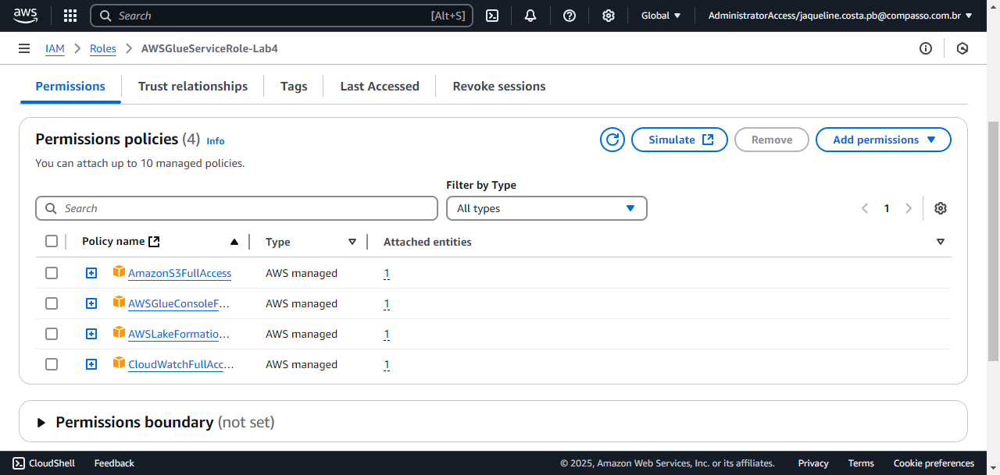

#### ETAPA 2: CRIAÇÃO DE DATABASE NO LAKE FORMATION

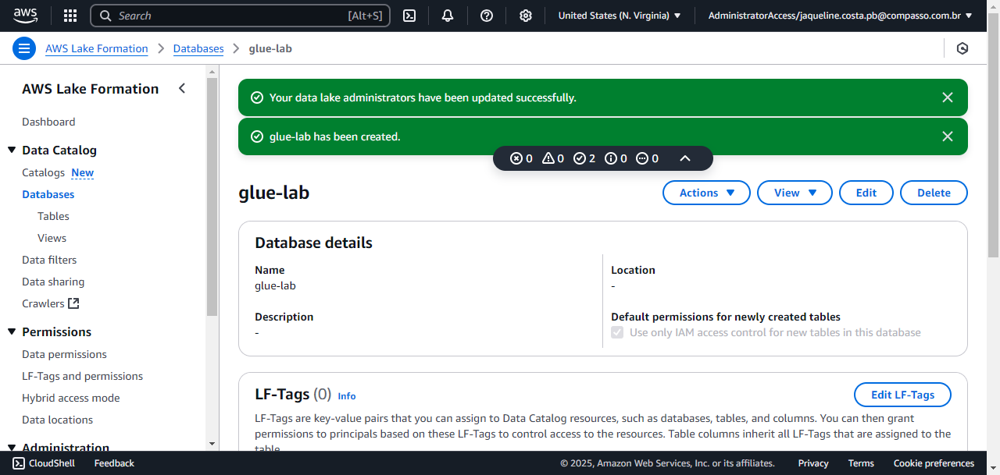

#### ETAPA 3: GLUE JOB INTRODUTÓRIO

Job referente ao exercício guiado com fins introdutórios.

##### ETAPA 3.1: CRIAÇÃO DO JOB

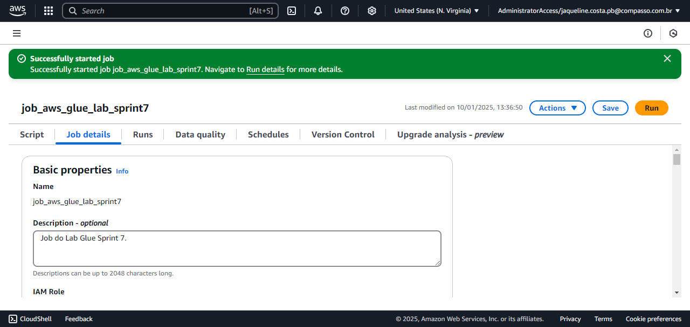

##### ETAPA 3.2: EXECUÇÃO DO JOB

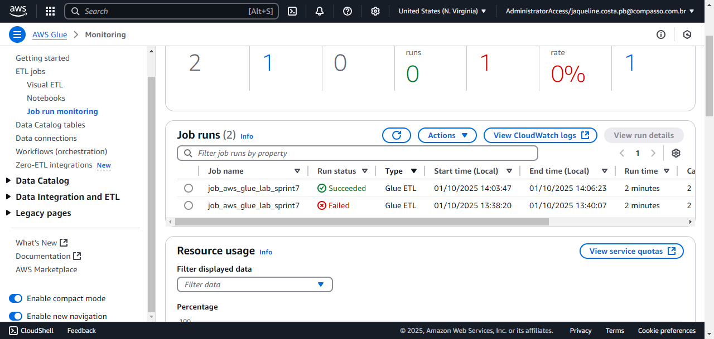

##### ETAPA 3.3: CRIAÇÃO DO ARQUIVO PARQUET NO S3

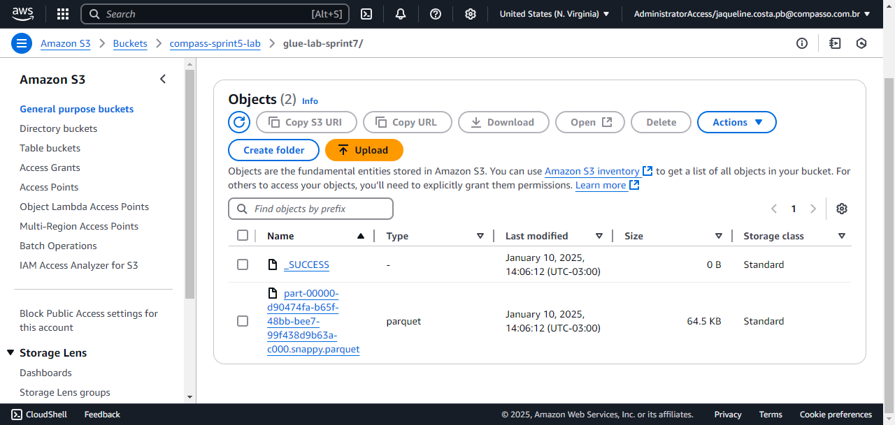

##### ETAPA 3.4: LEITURA DO ARQUIVO PARQUET COM SPARK

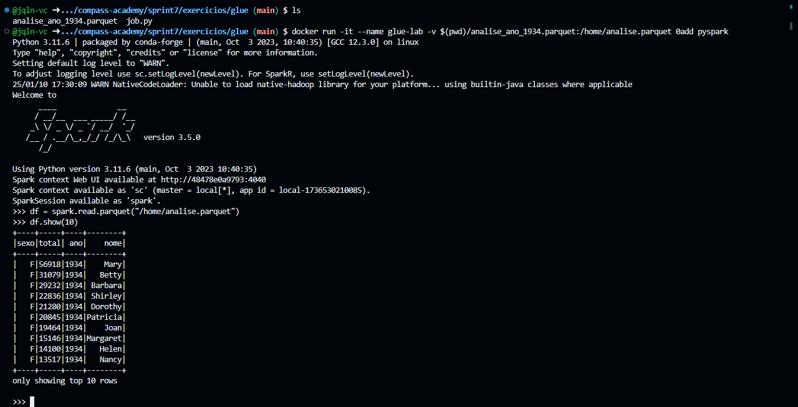

#### ETAPA 4: GLUE JOB FAÇA-VOCÊ-MESMO

Job referente ao exercício pessoal com fins de aplicação dos conceitos aprendidos.

##### ETAPA 4.1: EXECUÇÃO DO JOB

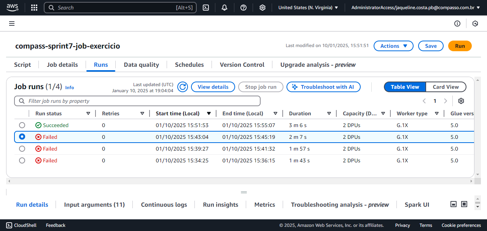

##### ETAPA 4.2: CRIAÇÃO DO GLUE CRAWLER

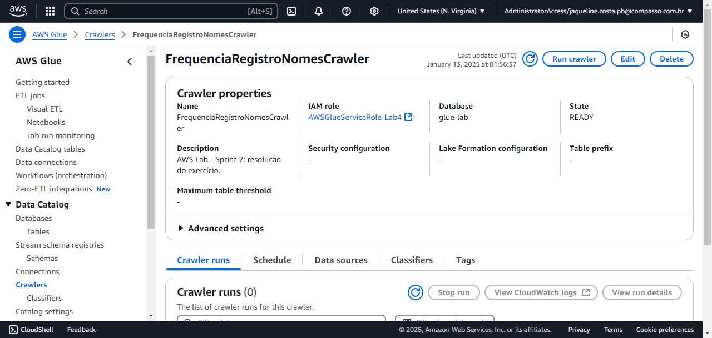

##### ETAPA 4.3: EXECUÇÃO DO CRAWLER

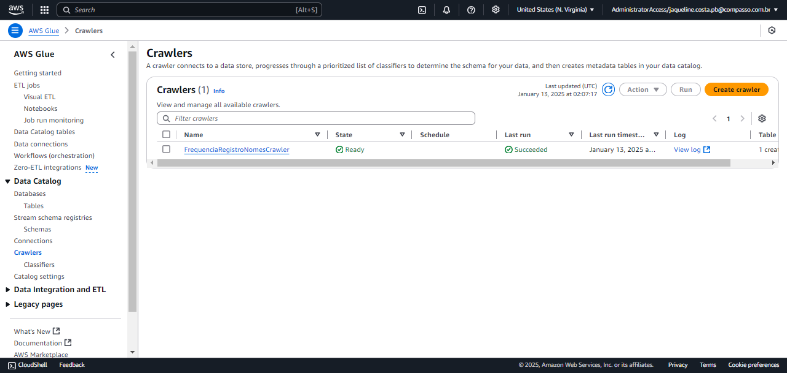

##### ETAPA 4.4: CRIAÇÃO DE GLUE TABLE

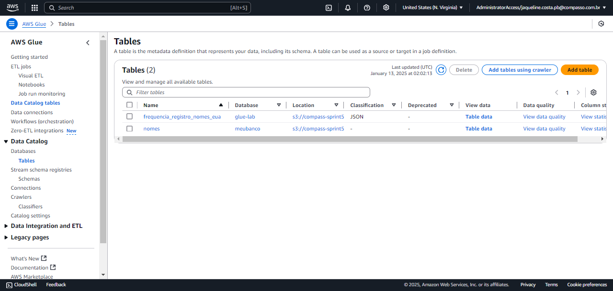

##### ETAPA 4.5: QUERY NO DATA CATALOG COM ATHENA

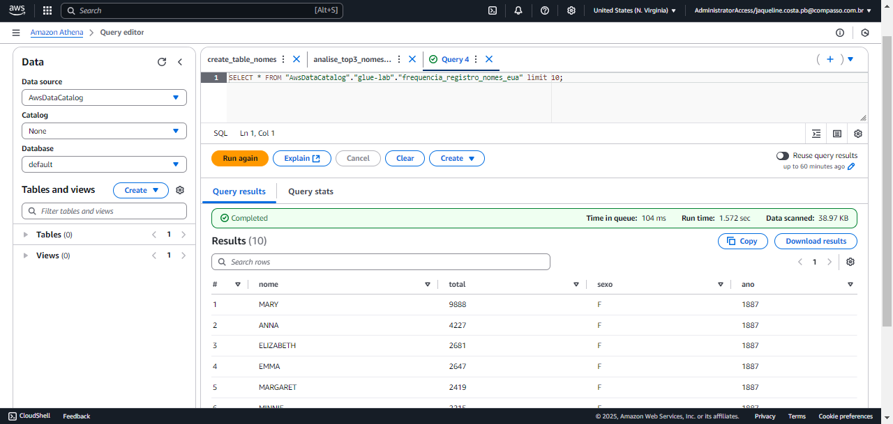

##### ETAPA 4.6: ESTRUTURAS DOS ARQUIVOS CRIADOS NO S3

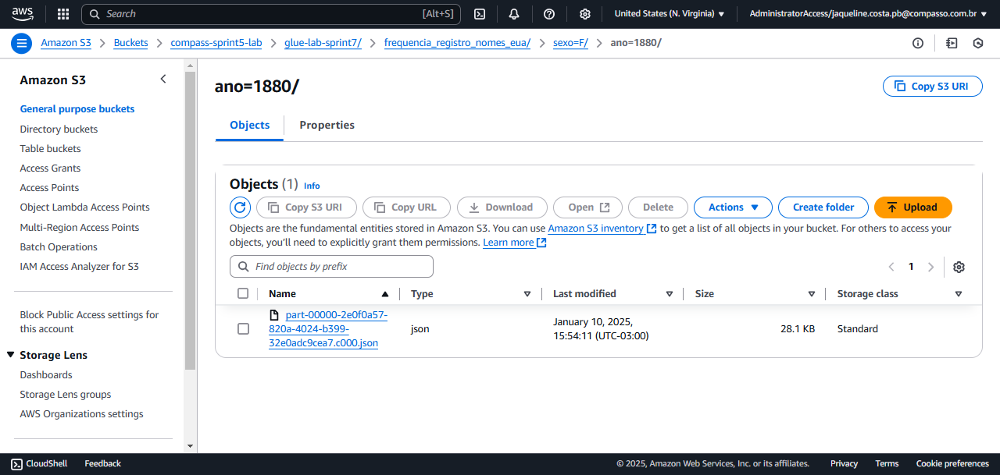

## BIBLIOGRAFIA

AMAZON WEB SERVICES. **Boto Documentation**. Última atualização: 2024. Disponível em: <[boto3.amazonaws.com/v1/documentation](https://boto3.amazonaws.com/v1/documentation/api/latest/index.html)>.

REIS, Joe; HOUSLEY, Matt. **Fundamentals of Data Engineering: Plan and Build Robust Data Systems**. Sebastopol: O’Reilly, 2022.

VAN ROSSUM, Guido; WARSAW, Barry; COGHLAN, Alyssa. **PEP 8 – Style Guide for Python Code**. Última atualização: 2013. Disponível em: <[peps.python.org/pep-0008/](https://peps.python.org/pep-0008/)>.  

VAN ROSSUM, Guido; GOODGER, David. **PEP 257 – Docstring Conventions**. Última atualização: 2001. Disponível em: <[peps.python.org/pep-0257/](https://peps.python.org/pep-0257/)>.
