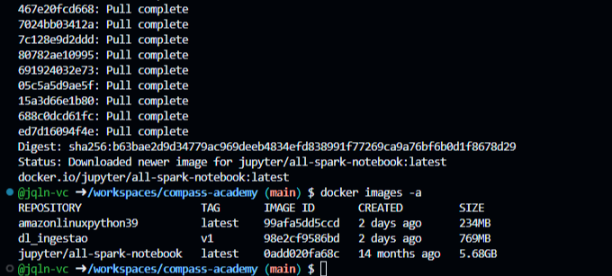
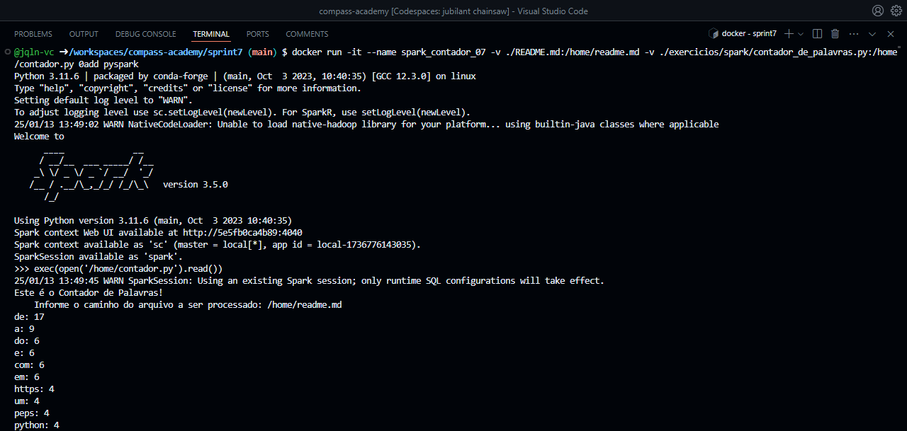
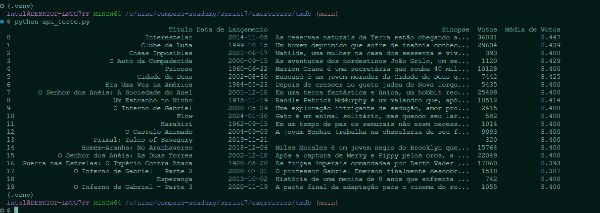

#

||
|---|
||
||

## RELATOS DE APRENDIZADO

### Apache Spark

### AWS Glue

---

## EXERCÍCIOS

Todos os códigos dos exercícios foram implementados seguindo os Python Enhancement Proposal, especificamente as recomendações de estilo do PEP8 e convenções de docstrings do PEP257, indicados na seção [Bibliografia](#bibliografia), com validação no [*CodeWOF: Python 3 Style Checker*](https://www.codewof.co.nz/style/python3/) online.

Na pasta `evidencias/exercicios`, estão localizadas as imagens com a validação de cada exercício.

* **Spark | Contador de Palavras** : a partir de um container com PySpark, execução de um script para a contagem de palavras de um arquivo de texto, testado com este README.
  * [**contador_de_palavras.py**](./exercicios/spark/contador_de_palavras.py)
  * **comando de execução do container**:
  
  ```bash
    docker run -it --name spark_contador_07 -v ./README.md:/home/readme.md -v ./exercicios/spark/contador_de_palavras.py:/home/contador.py 0add pyspark
  ```

* **API TMDB | Teste de Acesso** : obtenção de dados do database TMDB por meio de API.
  * [**api_teste.py**](./exercicios/tmdb/api_teste.py)

* **AWS Lab Glue** : execução de ETL, leitura de schema com crawler, e análise de dados com integração no S3, CloudWatch Logs e Athena.
  * [**job_intro_teste.py**](./exercicios/glue/job_intro_teste.py) : script de introdução ao AWS Glue, teste com filtro de dataset e output em parquet.
    * [**analise_ano_1934.parquet**](./exercicios/glue/analise_ano_1934.parquet) : arquivo gerado com a execução do job acima.
  * [**job_exercicio.py**](./exercicios/glue/job_exercicio.py) : script de resolução do exercício, visualização de schema, 6 etapas de análise de dados e output particionado em JSON no bucket S3.
    * [**data_catalog_freq_registro_nomes_eua.csv**](./exercicios/glue/data_catalog_freq_registro_nomes_eua.csv) : arquivo de dados gerado com o crawler.
    * [**log_events_viewer_result.csv**](./exercicios/glue/log_events_viewer_result.csv) : arquivo de logs da execução gerado com o CloudWatch.

## DESAFIO

O projeto final desenvolve um fluxo de processamento e análise de dados, a partir de uma arquitetura data lake. Para a primeira etapa, é implementada a camada raw, onde os arquivos originais são armazenados e organizados de acordo com a origem e data de processamento. A execução do script de ingestão de dados ao bucket S3 é realizada isolada em um container.

## EVIDÊNCIAS

Na pasta `evidencias`, encontram-se prints referentes a momentos de execução, exemplificando abordagens adotadas para o desenvolvimento dos exercícios e do desafio.  
No passo a passo explicativo, encontrado na pasta `desafio`, serão comentados outros prints de pontos específicos.

### APACHE SPARK: CONTADOR DE PALAVRAS

#### ETAPA 1: PULL DA IMAGEM



#### ETAPA 2: EXECUÇÃO DO SCRIPT CONTADOR EM CONTAINER COM VOLUME



### API TMDB



### AWS LAB GLUE

## CERTIFICADOS COMPLEMENTARES

Para absorver melhor o conteúdo desta sprint e me aprofundar em pontos de interesse, concluí em paralelo os cursos abaixo, externos à Udemy.

###

| |
|---|
||
||

## BIBLIOGRAFIA

AMAZON WEB SERVICES. **Boto Documentation**. Última atualização: 2024. Disponível em: <[boto3.amazonaws.com/v1/documentation](https://boto3.amazonaws.com/v1/documentation/api/latest/index.html)>.

EAGAR, Gareth. **Data Engineering with AWS**. Birmingham: Packt Publishing, 2021.

REIS, Joe; HOUSLEY, Matt. **Fundamentals of Data Engineering: Plan and Build Robust Data Systems**. Sebastopol: O’Reilly, 2022.

VAN ROSSUM, Guido; WARSAW, Barry; COGHLAN, Alyssa. **PEP 8 – Style Guide for Python Code**. Última atualização: 2013. Disponível em: <[peps.python.org/pep-0008/](https://peps.python.org/pep-0008/)>.  

VAN ROSSUM, Guido; GOODGER, David. **PEP 257 – Docstring Conventions**. Última atualização: 2001. Disponível em: <[peps.python.org/pep-0257/](https://peps.python.org/pep-0257/)>.
