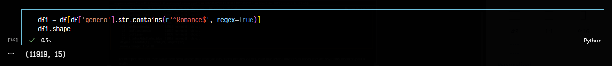
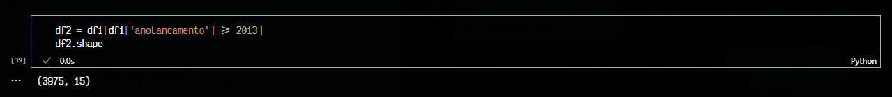
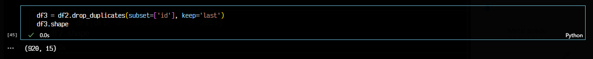
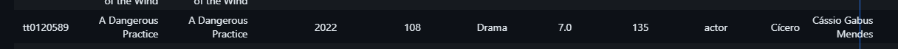
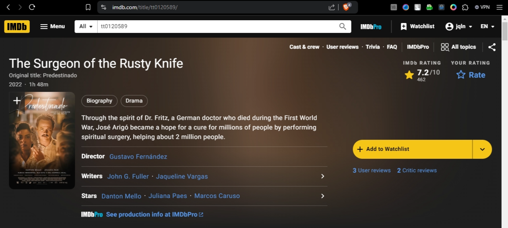

#

||
|---|
||
||

## SEÇÕES

## INTRODUÇÃO AO HADOOP E APACHE SPARK

## PRIMEIRAS EXPLORAÇÕES NO DATASET

### RECAPITULANDO A ANÁLISE INICIAL

* ***Qual a quantidade de filmes lançados anualmente, por região?***
* ***Quais as atrizes/atores com maior atuação e em qual(is) língua(s)?***
* ***Quais diretoras/diretores com maior quantidade de títulos, em quais línguas?***
* ***Dentre os 100 títulos melhores votados, quais as nacionalidades das produções?***

### FILTROS INICIAIS NO DATASET ORIGINAL

Inicialmente, a análise buscava considerar tanto filmes de **drama** quanto **romance**, porém ao fim da etapa do [filtro 3](#filtro-3-ids-distintos), o dataset recortado ainda possuía mais de 16000 linhas.

Para o próximo **recorte linguístico e regional**, seria necessário diminuir o tamanho desse dataset a partir dos dados obtidos pela API do TMDB. Para isso, seriam necessárias mais de 16000 requisições, aumentando o overhead de execução na AWS Lambda (a qual possui *max timeout* de 900 segundos). Logo, foi decidido um novo recorte, mantendo-se somente o gênero **romance**.

#### FILTRO 1: GÊNERO

Primeiro filtro, utilizando expressão regular, para filmes exclusivamente do gênero **romance**. Nesta etapa, o dataset foi reduzido para 11919 linhas.

* `^` indica início da string
* `$` indica o fim da string

```python
    df1 = df[df['genero'].str.contains(r'^Romance$', regex=True)]
```



#### FILTRO 2: DATA DE LANÇAMENTO

Neste filtro, é realizado o recorte temporal do período entre 2013 e dias atuais. Primeiramente, foram tratados possíveis valores nulos caracterizados por caracteres não-numéricos, identificados com expressão regular.

* `[a-zA-Z]+` 1 ou mais caracteres alfabéticos, considerando minúsculas e maiúsculas

```python
    # Tratamento de dados nulos com 0
    df1.loc[df1['anoLancamento'].str.contains(r'^[a-zA-Z]+$', regex=True), 'anoLancamento'] = 0
    # Conversão da coluna para integer
    df1['anoLancamento'] = df1['anoLancamento'].astype(int)
```

Após o tratamento do tipo da coluna, é realizado o filtro temporal. O dataset resultante nesta etapa ficou com 3975 linhas.

```python
    df2 = df1[df1['anoLancamento'] >= 2013]
```



Este dataset contém mais de uma linha para cada filme, devido às colunas referentes aos artistas do elenco. Como este dataset já possui os dados-base para a análise final, a serem complementados com os dados do TMDB, o mesmo foi salvo no arquivo [filmes_filtrados_com_elenco.csv](../desafio/filmes_filtrado_com_elenco.csv).

#### FILTRO 3: IDS DISTINTOS

Nesta etapa, são mantidas somente 1 linha para cada filme, assim gerando posteriormente uma lista de IDs distintos para a iteração de requisições de dados via API. Nesta etapa, o dataset possui 920 linhas.

```python
    df3 = df2.drop_duplicates(subset=['id'], keep='last')
```



#### FILTRO 4 (DESCARTADO): TÍTULOS ORIGINAIS EM INGLÊS

Considerando que filmes com idioma original inglês não serão considerados na análise final, nesta etapa buscou-se reduzir ainda mais a quantidade de IDs utilizados na etapa de requisição de dados via API.

Utilizando a biblioteca de transformers do Hugging Face, foi escolhido um modelo de língua específico para identificação de língua, o `papluca/xlm-roberta-base-language-detection` , para classificar os valores presentes na coluna `tituloOriginal` , caso estivessem em inglês, com `True` ou `False`. Assim, ao final, seriam mantidos somente as linhas com classificação `False`.

O modelo obteve um ótimo resultado, uma amostra foi mantida no arquivo [filmes_coluna_em_ingles.csv](../desafio/filmes_coluna_em_ingles.csv).

No entanto, foram identificadas inconsistências nos valores da coluna: existiam casos com título original em inglês, que não correspondiam aos títulos corretos, em línguas de interesse para a análise. Como é o caso do exemplo a seguir, do id `tt0120589` que possui título original em português:



> ❗ Esta verificação foi feita antes do recorte exclusivo para o gênero **romance**, no entanto, uma única inconsistência já pode ser generalizada para outras possíveis ocorrências que impactariam a análise final.

Abaixo a verificação do ID no IMDB, atestando a divergência entre a coluna título original e valores reais.



### REFORMULAÇÃO DA ANÁLISE FINAL


### DADOS COMPLEMENTARES NECESSÁRIOS

## DATA LAKE E INGESTÃO DE DADOS: FONTES DISTINTAS

## PROCESSAMENTO DE DADOS NO DATA LAKE: ETAPA DE INGESTÃO PT. 2

### API TMDB: SELEÇÃO DE DADOS

### ANÁLISE DO SCRIPT LAMBDA

### CRIAÇÃO DE LAYER

### EXECUÇÃO DA LAMBDA E INGESTÃO NO DATA LAKE

## CONSIDERAÇÕES FINAIS

## REFERÊNCIAS
