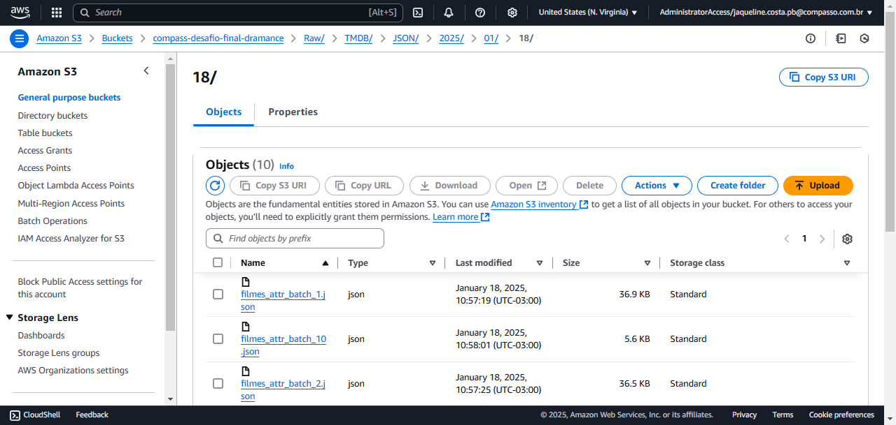
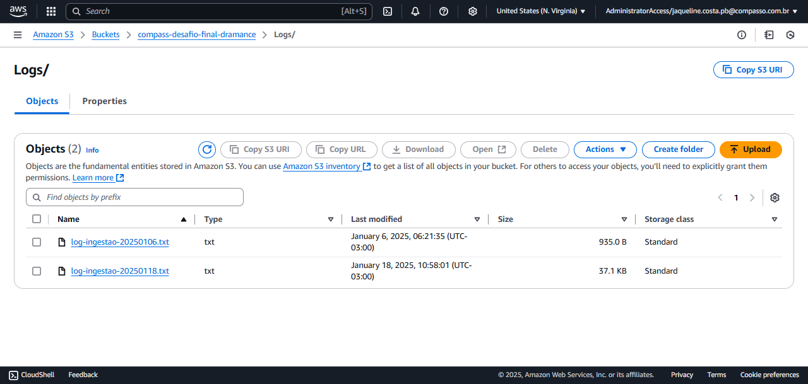

#

||
|---|
||
||

## SEÇÕES

## PRIMEIRAS EXPLORAÇÕES NO DATASET

*Voltar para **Seções*** [֍](#seções)

Inicialmente, esta etapa busca afunilar os dados originais, obtidos na sprint anterior, utilizando filtros referentes à análise final. Deste modo, é gerado um arquivo CSV de referência, a ser complementado com os dados obtidos via TMDB.

### RECAPITULANDO A ANÁLISE INICIAL

*Voltar para **Seções*** [֍](#seções)

Antes de detalhar os filtros utilizados, faz-se necessário retomar as questões iniciais, elaboradas para a análise final em torno do tema **Contra-hegemonia Cinematográfica na Era Pós-streaming**.

* ***Qual a quantidade de filmes lançados anualmente, por região?***
* ***Quais as atrizes/atores com maior atuação e em qual(is) língua(s)?***
* ***Quais diretoras/diretores com maior quantidade de títulos, em quais línguas?***
* ***Dentre os 100 títulos melhores votados, quais as nacionalidades das produções?***

### FILTROS INICIAIS NO DATASET ORIGINAL

*Voltar para **Seções*** [֍](#seções)

Inicialmente, a análise buscava considerar tanto filmes de **drama** quanto **romance**, porém ao fim da etapa do [filtro 3](#filtro-3-ids-distintos), o dataset recortado ainda possuía mais de 16000 linhas.

Para o próximo **recorte linguístico e regional**, seria necessário diminuir o tamanho desse dataset a partir dos dados obtidos pela API do TMDB. Para isso, seriam necessárias mais de 16000 requisições, aumentando o overhead de execução na AWS Lambda (a qual possui *max timeout* de 900 segundos). Logo, foi decidido um novo recorte, mantendo-se somente o gênero **romance**.

#### FILTRO 1: GÊNERO

*Voltar para **Seções*** [֍](#seções)

Primeiro filtro, utilizando expressão regular, para filmes exclusivamente do gênero **romance**. Nesta etapa, o dataset foi reduzido para 11919 linhas.

* `^` indica início da string
* `$` indica o fim da string

```python
    df1 = df[df['genero'].str.contains(r'^Romance$', regex=True)]
```


#### FILTRO 2: DATA DE LANÇAMENTO

*Voltar para **Seções*** [֍](#seções)

Neste filtro, é realizado o recorte temporal do período entre 2013 e dias atuais. Primeiramente, foram tratados possíveis valores nulos caracterizados por caracteres não-numéricos, identificados com expressão regular.

* `[a-zA-Z]+` 1 ou mais caracteres alfabéticos, considerando minúsculas e maiúsculas

```python
    # Tratamento de dados nulos com 0
    df1.loc[df1['anoLancamento'].str.contains(r'^[a-zA-Z]+$', regex=True), 'anoLancamento'] = 0
    # Conversão da coluna para integer
    df1['anoLancamento'] = df1['anoLancamento'].astype(int)
```

Após o tratamento do tipo da coluna, é realizado o filtro temporal. O dataset resultante nesta etapa ficou com 3975 linhas.

```python
    df2 = df1[df1['anoLancamento'] >= 2013]
```


Este dataset contém mais de uma linha para cada filme, devido às colunas referentes aos artistas do elenco. Como este dataset já possui os dados-base para a análise final, a serem complementados com os dados do TMDB, o mesmo foi salvo no arquivo [dataset_base_com_elenco.csv](../desafio/csv/dataset_base_com_elenco.csv).

#### FILTRO 3: IDS DISTINTOS

*Voltar para **Seções*** [֍](#seções)

Nesta etapa, são mantidas somente 1 linha para cada filme, assim gerando posteriormente uma lista de IDs distintos para a iteração de requisições de dados via API. Nesta etapa, o dataset possui 920 linhas.

```python
    df3 = df2.drop_duplicates(subset=['id'], keep='last')
```


#### FILTRO 4 (DESCARTADO): TÍTULOS ORIGINAIS EM INGLÊS

*Voltar para **Seções*** [֍](#seções)

Considerando que filmes com idioma original inglês não serão considerados na análise final, nesta etapa buscou-se reduzir ainda mais a quantidade de IDs utilizados na etapa de requisição de dados via API.

Utilizando a biblioteca de transformers do Hugging Face, foi escolhido um modelo de língua específico para identificação de língua, o `papluca/xlm-roberta-base-language-detection` , para classificar os valores presentes na coluna `tituloOriginal` , caso estivessem em inglês, com `True` ou `False`. Assim, ao final, seriam mantidos somente as linhas com classificação `False`.


O modelo obteve um ótimo resultado, uma amostra foi mantida no arquivo [ids_distintos_attr_em_ingles.csv](../desafio/csv/ids_distintos_attr_em_ingles.csv).

No entanto, foram identificadas inconsistências nos valores da coluna: existiam casos com título original em inglês, que não correspondiam aos títulos corretos, em línguas de interesse para a análise. Como é o caso do exemplo a seguir, do id `tt0120589` que possui título original em português:


> ❗ Esta verificação foi feita antes do recorte exclusivo para o gênero **romance**, no entanto, uma única inconsistência já pode ser generalizada para outras possíveis ocorrências que impactariam a análise final.

Abaixo a verificação do ID no IMDB, atestando a divergência entre a coluna título original e valores reais.


### REFORMULAÇÃO DA ANÁLISE FINAL

*Voltar para **Seções*** [֍](#seções)

Considerando os fatores comentados acima, o fato de que para os dados de **direção** existiam muitos desfalques de ids sem essa informação, bem como novas perspectivas, as perguntas foram reformuladas em:

* ***Qual a quantidade de filmes lançados anualmente, por região?***
* ***Quais os 5 países com maior quantidade de filmes lançados? Desses países, quais línguas são mais utilizadas***
* ***Quais as atrizes/atores com maior atuação e em qual(is) língua(s)?***
* ***Quais as 5 línguas com maior quantidade de títulos?***
* ***Dentre os 100 títulos melhores votados, quais as nacionalidades das produções?***
* ***Quais os tópicos mais recorrentes nas narrativas dos títulos selecionados?***

Com isso, também será reformulado o tema central da análise, enfocando somente o gênero romance: **Contra-hegemonia no Cinema: Novas Perspectivas Afetivas na Era Pós-streaming**.

## DATA LAKE E INGESTÃO DE DADOS: FONTES DISTINTAS

*Voltar para **Seções*** [֍](#seções)

Nesta etapa do projeto, a camada **raw** do data lake é enriquecida com dados provenientes de fontes externas, um processo corriqueiro porém nada trivial, pois engloba o estudo das especificidades de fonte, formato, tempo, volume e utilização dos dados.

> *Ingestão de dados é o processo de mover dados de um lugar para outro. A ingestão de dados implica na movimentação de dados de sistemas-fonte para o armazenamento no ciclo de vida de engenharia de dados, sendo a ingestão um passo intermediário.* (REIS & HOUSLEY, 2022, p. 234)


### PROCESSAMENTO DE DADOS NO DATA LAKE: ETAPA DE INGESTÃO PT. 2

*Voltar para **Seções*** [֍](#seções)

No ciclo de vida da engenharia de dados, a etapa de ingestão precisa considerar alguns fatores para otimização do processo de coleta de dados, incluindo finalidade, fonte dos dados, quantidade e frequência, entre outros. A seguir, alguns pontos a nortearem o planejamento da ingestão (REIS & HOUSLEY, 2022, p. 235):

* *Qual a utilidade dos dados que estou ingerindo?*
* *Posso reutilizar esses dados e evitar a ingestão de múltiplas versões do mesmo dataset?*
* *Para onde esses dados estão indo? Qual o destino?*
* *Com que frequência os dados da fonte precisam ser atualizados?*
* *Qual o volume de dados esperado?*
* *Qual o formato que os dados estão? As etapas seguintes de armazenamento e transformação conseguirão aceitar esse formato?*
• *A fonte dos dados está em boa forma para consumo imediato nas etapas seguintes? Isto é, os dados têm boa qualidade? Qual é o pós-processamento necessário para distribuição? Quais são os riscos de qualidade (ex. o tráfego de bots em um website poderia contaminar os dados)?*
* *Os dados necessitam de processamento "em trânsito" para ingestão caso os dados sejam provenientes de uma fonte em **streaming**?*

### API TMDB: SELEÇÃO DE DADOS

*Voltar para **Seções*** [֍](#seções)

Para a complementação dos dados existentes no dataset `movies.csv`, foi necessário obter os seguintes dados do TMDB via requisição GET, utilizando a URL abaixo:

```python
    f"https://api.themoviedb.org/3/movie/{imdb_id}?language=en-US"
```

* `imdb_id` : código externo referente ao id no IMDB, e utilizado como "chave estrangeira" para alinhar com os filmes no dataset em CSV
* `original_title` : título na língua original
* `origin_country` : sigla do país de origem
* `original_language` : língua original, no formato ISO 639-1
* `spoken_languages` : lista de línguas adicionais faladas no filme, no formato ISO 639-1
* `overview` : sinopse do filme em inglês, utilizado para obter os tópicos das narrativas

Além disso, foram obtidos, diretamente no site do TMDB, a lista de códigos de países e línguas utilizadas na base de dados. Abaixo uma amostra desses dados, localizados nos arquivos [linguas.json](./api_data/linguas.json) e [paises.json](./api_data/paises.json) :


### CRIAÇÃO DE ARQUIVO ZIP PARA LAYER

*Voltar para **Seções*** [֍](#seções)

Para utilizar tanto a biblioteca `requests` e o arquivo `csv`, utilizado para obter os ids de filmes para as requisições do TMDB, foi criada uma ***layer*** para carregar o ambiente necessário para a execução da Lambda.

Abaixo os comandos utilizados no terminal para a criação do arquivo zipado `requests_layer.zip` localizado no diretório [lambda_layer/](./lambda_layer):


### CRIAÇÃO E CONFIGURAÇÃO DA LAMBDA E LAYER

*Voltar para **Seções*** [֍](#seções)

Para que não ocorresse erro por Timeout, foi configurado o limite máximo de execução, e acrescentada uma quantidade maior de memória para a Lambda.


A ***layer*** é criada com o arquivo `zip` e configurada na Lambda desta etapa:


### VARIÁVEIS DE AMBIENTE

*Voltar para **Seções*** [֍](#seções)

Foi necessário configurar algumas variáveis de ambiente, seja pela praticidade de acessar caminhos ou pela segurança de restringir o acesso a chaves de acesso. O arquivo `CSV` incluído na ***layer*** é acessado por meio do diretório `/opt` . A seguir as variáveis utilizadas:


### CRIAÇÃO DO IAM ROLE

*Voltar para **Seções*** [֍](#seções)

Para as permissões da Lambda, foi reutilizado um IAM Role criado para o Lab da sprint 6, acrescentando a permissão de escrita e leitura dos arquivos no S3.


### ANÁLISE DO SCRIPT LAMBDA

*Voltar para **Seções*** [֍](#seções)

### EXECUÇÃO DA LAMBDA E INGESTÃO NO DATA LAKE

*Voltar para **Seções*** [֍](#seções)

A seguir uma amostra da execução da Lambda e os arquivos ingeridos no S3.


#### ARQUIVOS JSON CONSUMIDOS APÓS A INGESTÃO

*Voltar para **Seções*** [֍](#seções)



#### ARQUIVO DE LOG GERADO

*Voltar para **Seções*** [֍](#seções)



## CONSIDERAÇÕES FINAIS

*Voltar para **Seções*** [֍](#seções)

## REFERÊNCIAS

*Voltar para **Seções*** [֍](#seções)
