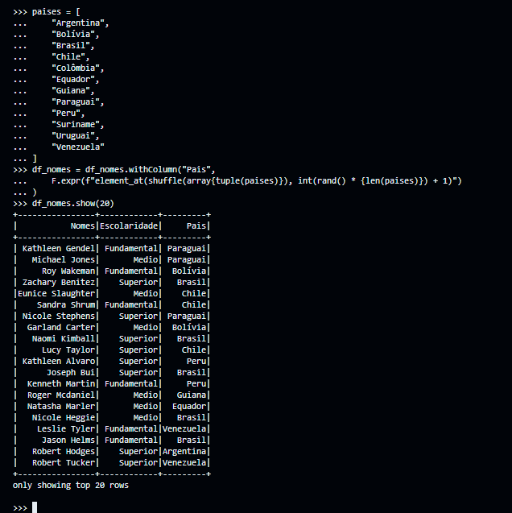
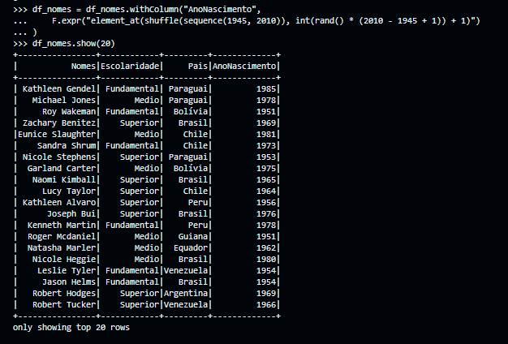

#

||
|---|
||
||

## RELATOS DE APRENDIZADO

## EXERCÍCIOS

Todos os códigos dos exercícios foram implementados seguindo os Python Enhancement Proposal, especificamente as recomendações de estilo do PEP8 e convenções de docstrings do PEP257, indicados na seção [Bibliografia](#bibliografia), com validação no [*CodeWOF: Python 3 Style Checker*](https://www.codewof.co.nz/style/python3/) online.

Na pasta `evidencias/exercicios`, estão localizadas as imagens com a validação de cada exercício.

* **Gerador em Massa de Dados** : utilização de aleatoriedade para geração de dados em massa.
  * [**gerador_dados.py**](./exercicios/spark_batch/gerador_dados.py) : script que gera 2 arquivos de dados aleatórios de animais e nomes de pessoas.
    * [**nomes_animais.csv**](./exercicios/spark_batch/nomes_animais.csv) : arquivo CSV com nomes de animais ordenados em ordem alfabética.
    * [**nomes_aleatorios.txt**](./exercicios/spark_batch/nomes_aleatorios.txt) : arquivo TXT com quantidade massiva de nomes gerados aleatoriamente.

* **Lab Spark SQL** : utilização do framework PySpark para manipulação e análise de alto volume de dados, a partir do arquivo `nomes_aleatorios.txt` gerado no exercício acima.
  * [**lab_spark_sql.py**](./exercicios/spark_batch/lab_spark_sql.py) : script de execução das sequência de manipulações e análises solicitados.

* **API TMDB | Teste de Acesso** : obtenção de dados do database TMDB por meio de API.
  * [**api_teste.py**](./exercicios/tmdb/api_teste.py)

## DESAFIO

O projeto final desenvolve um fluxo de processamento e análise de dados, a partir de uma arquitetura data lake. Para a terceira etapa

## EVIDÊNCIAS

Na pasta `evidencias`, encontram-se prints referentes a momentos de execução, exemplificando abordagens adotadas para o desenvolvimento dos exercícios e do desafio.  
No passo a passo explicativo, encontrado na pasta `desafio`, serão comentados outros prints de pontos específicos.

### GERADOR EM MASSA DE DADOS

#### ETAPA 1: NÚMEROS ALEATÓRIOS

#### ETAPA 2: LISTA DE ANIMAIS

#### ETAPA 3: NOMES ALEATÓRIOS

### APACHE SPARK

#### ETAPA 1: CRIAÇÃO DA SESSÃO E DO DATAFRAME

#### ETAPA 2: RENOMEAÇÃO PARA COLUNA "NOMES" E VERIFICAÇÃO DO SCHEMA

#### ETAPA 3: CRIAÇÃO DA COLUNA "ESCOLARIDADE"

#### ETAPA 4: CRIAÇÃO DA COLUNA "PAÍS"

#### ETAPA 5: CRIAÇÃO DA COLUNA "ANONASCIMENTO" (1946 ~ 2010)

#### ETAPA 6: SELECT DE PESSOAS NASCIDAS NESTE SÉCULO

#### ETAPA 7: SELECT DA ETAPA 6 COM SPARK SQL

#### ETAPA 8: CONTAGEM DE MILLENNIALS (1980 ~ 1994) COM FILTER

#### ETAPA 9: CONTAGEM DA ETAPA 8 COM SPARK SQL

#### ETAPA 10: QUANTIDADE DE PESSOAS POR PAÍS E GERAÇÃO

#### EXECUÇÃO COMPLETA DO SCRIPT

### API TMDB

## CERTIFICADOS COMPLEMENTARES

Para absorver melhor o conteúdo desta sprint e me aprofundar em pontos de interesse, concluí em paralelo os cursos abaixo, externos à Udemy.

### AWS

| |
|---|
||
||

## BIBLIOGRAFIA

AMAZON WEB SERVICES. **Boto Documentation**. Última atualização: 2024. Disponível em: <[boto3.amazonaws.com/v1/documentation](https://boto3.amazonaws.com/v1/documentation/api/latest/index.html)>.

CHAMBERS, Bill; ZAHARIA, Matei. **Spark: The Definitive Guide**. Sebastopol: O'Reilly, 2018.

DEAN, Jeffrey; GHEMAWAT, Sanjay. **MapReduce: Simplified Data Processing on Large Clusters** In: Communications of the ACM, v. 51, n. 1. New York: Association for Computing Machinery, 2008.

REIS, Joe; HOUSLEY, Matt. **Fundamentals of Data Engineering: Plan and Build Robust Data Systems**. Sebastopol: O’Reilly, 2022.

VAN ROSSUM, Guido; WARSAW, Barry; COGHLAN, Alyssa. **PEP 8 – Style Guide for Python Code**. Última atualização: 2013. Disponível em: <[peps.python.org/pep-0008/](https://peps.python.org/pep-0008/)>.  

VAN ROSSUM, Guido; GOODGER, David. **PEP 257 – Docstring Conventions**. Última atualização: 2001. Disponível em: <[peps.python.org/pep-0257/](https://peps.python.org/pep-0257/)>.
