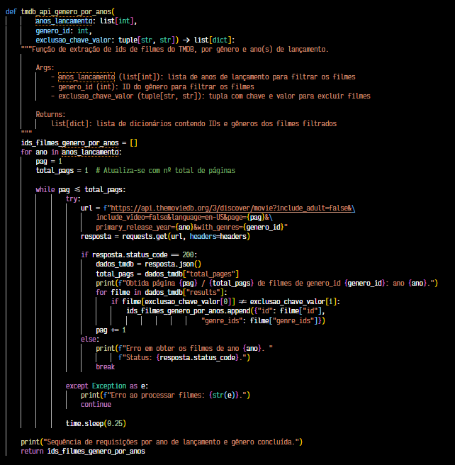
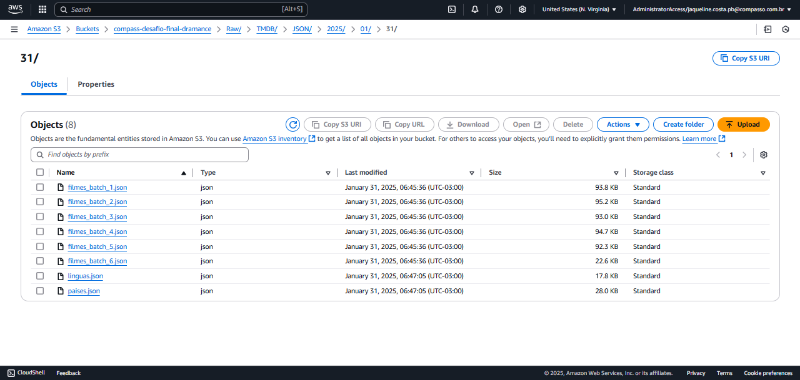
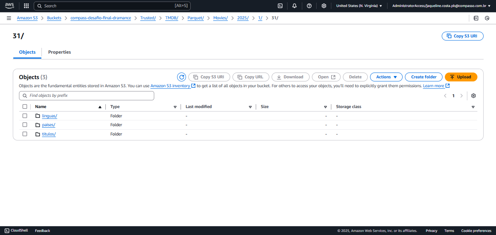

#

||
|---|
||
||

## SEÇÕES

* **Introdução à Computação Distribuída** [֍](#introdução-à-computação-distribuída)
  * **Visão Geral do Hadoop** [֍](#visão-geral-do-hadoop)
  * **Visão Geral do Apache Spark** [֍](#visão-geral-do-apache-spark)
    * **Modelo de Processamento** [֍](#modelo-de-processamento)
    * **Tables X DataFrames** [֍](#tables-x-dataframes)
* **Visão Geral do AWS Glue** [֍](#visão-geral-do-aws-glue)
* **Reformulação da Análise Final** [֍](#reformulação-da-análise-final)
  * **Funções do Script de Reingestão para Raw Zone** [֍](#funções-do-script-de-reingestão-para-raw-zone)
  * **Visão Geral dos Dados Após Reingestão do TMDB** [֍](#visão-geral-dos-dados-após-reingestão-do-tmdb)
  * **Diagrama de Tabelas, Colunas e Tipos** [֍](#diagrama-de-tabelas-colunas-e-tipos)
* **Data Lake e Trusted Zone** [֍](#data-lake-e-trusted-zone)
  * **Processamento de Dados: Etapa de Transformação Pt. 1** [֍](#processamento-de-dados-etapa-de-transformação-pt-1)
  * **Visão Geral da Raw Zone** [֍](#visão-geral-da-raw-zone)
  * **Análise do Script do Glue Job** [֍](#análise-do-script-do-glue-job)
    * **Importações** [֍](#importações)
    * **Variáveis** [֍](#variáveis)
      * **Classe Auxiliar: LogPrinter** [֍](#classe-auxiliar-logprinter)
    * **Criação dos DataFrames** [֍](#criação-dos-dataframes)
    * **Transformações** [֍](#transformações)
      * **Filmes Local** [֍](#filmes-local)
      * **Filmes TMDB** [֍](#filmes-tmdb)
      * **Línguas e Países TMDB** [֍](#línguas-e-países-tmdb)
    * **Ingressão na Trusted Zone** [֍](#ingressão-na-trusted-zone)
  * **Configuração de Recursos: Glue e Lake Formation** [֍](#configuração-de-recursos-glue-e-lake-formation)
    * **Criação do IAM Role** [֍](#criação-do-iam-role)
    * **Execução do Glue Job** [֍](#execução-do-glue-job)
    * **Criação de Database e Execução do Crawler** [֍](#criação-de-database-e-execução-do-crawler)
  * **Visão Geral da Trusted Zone** [֍](#visão-geral-da-trusted-zone)
    * **Amostra de Arquivos Parquet Gerados** [֍](#amostra-de-arquivos-parquet-gerados)
* **Considerações Finais** [֍](#considerações-finais)
* **Referências** [֍](#referências)

## INTRODUÇÃO À COMPUTAÇÃO DISTRIBUÍDA

*Voltar para **Seções*** [֍](#seções)

Com a acessibilização de Big Data - dados em alto volume, variedade e velocidade de geração -, novas soluções de processamento em larga escala se tornaram necessários, e daí surgem tecnologias de computação distribuída.

> *Máquinas sozinhas não têm energia e recursos suficientes para executar computações em quantidades enormes de informação (ou o usuário provavelmente não tem o tempo necessário para que a computação termine). Um **cluster**, ou grupo, de computadores, rateiam os recursos de várias máquinas juntas, fornecendo a capacidade de utilização de todos os recursos acumulados, como se fossem um único computador. Agora, um grupo de máquinas per se não é poderoso, é necessário um framework para coordenar trabalhos entre elas.* [^1]

A distribuição de processos em *threads* localmente ou máquinas diferentes não é algo novo, porém é necessário um sistema que coordene as execuções e otimize os recursos para obter as vantagens da arquitetura paralela de cluster, aí entra o Hadoop.

### VISÃO GERAL DO HADOOP

*Voltar para **Seções*** [֍](#seções)

Hadoop surge, na Google, como um framework *open-source* de computação e armazenamento distribuídos, baseado em escalabilidade horizontal e paralelismo entre os nós de um **cluster**. Seus principais componentes são:

* **HDFS (Hadoop Distributed File System)** : armazenamento de arquivos distribuídos no *cluster*. É composto de :
  * **NN - Name Node** : armazena os metadados dos arquivos distribuídos em blocos pelo cluster.
    * nome do arquivo
    * localização do diretório
    * tamanho do arquivo
    * blocos do arquivo, ids dos blocos, sequência dos blocos, localização dos blocos
  * **DN - Data Node** : nós que armazenam os blocos que compõem o arquivo.

* **YARN (Yet Another Resource Negotiator)** : é o sistema operacional que gerencia os recursos do *cluster*, para onde as submissões de aplicações são enviadas. É composto de :
  * **RM - Resource Manager** : processo Master responsável por gerenciar o cluster.
    * aloca recursos às aplicações
    * cronograma tarefas e estabelece prioridades de execução de *jobs*
  * **NM - Node Manager** : roda em cada Worker Node, é responsável pelo monitoramento de recursos e execução de tarefas.
    * recebe requisições de recursos do RM
    * inicializa e monitora containers, que executam tarefas
    * monitora utilização de CPU, memory e disco no nó e reporta de volta ao RM
  * **AM - Application Master** : existe um para cada *job*, gere o ciclo de vida da aplicação.
    * negociação de recursos com RM
    * monitora o progresso e lida com os erros lançados pelo *job*
    * opera em conjunto com NMs para inicializar containers de tarefas
    * é desalocado quando o *job* se encerra, liberando recursos

* **MapReduce** : um modelo de programação, que também é um framework, inspirado em programação funcional, que busca facilitar a computação paralela e que processa dados em batch.

> *Como  reação a essa complexidade, nós desenvolvemos uma nova abstração que nos permite expressar as computações simples que buscávamos executar, mas oculta os detalhes confusos da paralelização, tolerância a falhas, distribuição de dados e balanceamento de carga em uma biblioteca. [...] Nós percebemos que a maioria das nossas computações envolviam aplicar uma operação **map** a cada registro lógico de nosso input, de modo a computar uma série de pares chave-valor intermediários e, então, aplicar uma operação **reduce** em todos os valores que partilham a mesma chave, de maneira a combinar os dados derivados apropriadamente.* [^2]

A seguir, uma visão de como cada componentes se organiza na estrutura do cluster, e em cada um dos nós.


Apesar das vantagens, Hadoop apresenta alguns desafios como a alta complexidade de um código MapReduce, é mais adequado para processamento em batch e requer gerenciamento granular do cluster para otimização e escalabilidade horizontal.

### VISÃO GERAL DO APACHE SPARK

*Voltar para **Seções*** [֍](#seções)

O framework Spark surge para simplificar a computação distribuída, podendo rodar localmente, em nuvem ou em cima de um cluster físico. Em comparação com Hadoop, consegue aprimorar os seguintes aspectos problematizantes:

* redução de latência com processamento de dados em memória
* API simplificada e suporte para múltiplas linguagens
* motor de processamento unificado para diversos tipos de cargas de trabalho, como processamento em batch (Spark Core), queries em SQL (Spark SQL), fluxo de dados (Spark Streaming), aprendizado de máquina (MLlib) e processamento de grafos (GraphX)
* otimização de execuções com escalonador de DAGs - Directed Acyclic Graphs (DAGScheduler)
* integração suave com Hadoop, podendo rodar em cima do sistema HDFS e se beneficiando de clusters Hadoop

#### MODELO DE PROCESSAMENTO

*Voltar para **Seções*** [֍](#seções)


* **Modos de Execução (Execution Modes)**
  * Cliente
  * Cluster

* ** Gerenciadores de Cluster (Cluster Managers)**
  * local [n]: simulação local de uma arquitetura client-driver, em que `n` é o número de threads disponibilizadas para o processo.
    * 1 thread: driver
    * n-1 threads: executores
  * Standalone: execução por script ou manual de um cluster com uma interface web para gerenciamento.
  * YARN: gerenciador nativo Hadoop
  * Kubernetes
  * Apache Mesos

* **Ferramentas de Execução (Execution Tools)**
  * **IDE/Notebooks**
  * **Spark Submit**

#### TABLES X DATAFRAMES

*Voltar para **Seções*** [֍](#seções)

|---|Spark Table|Spark DataFrame|
|---|:---:|:---:|
|***Schema***|On-Write|On-Read|
|***Armazenamento do Schema***|Metadata Store|Runtime Catalog|
|***Persistência***|Tabelas e metadata são acessíveis por aplicações diversas|DataFrame e Catalog são objetos acessíveis somente pela aplicação, durante seu tempo de execução|
|***Acesso***|SQL Expressions, não utiliza APIs|APIs, não utiliza SQL Expressions|
||||

Tanto os DataFrames quanto as Tables são objetos que podem ser convertidos entre si. A seguir, alguns dos métodos mais comuns de DataFrames, os quais podem ser subdividos em 3 categorias, de acordo com seus efeitos dentro do fluxo de processamento:

* **Funções (Functions)** : métodos sem as especificidades dos demais, recebe um input e retorna um output sem modificar a entrada inicial.

|Spark Built-In|Somente PySpark|
|:---|---:|
|cache|corr|
|createGlobalTempView|cov|
|createOrReplaceGlobalTempView|freqItems|
|createOrReplaceTempView|mapInPandas|
|expr|replace|
|printSchema|sameSemantics|
|toDF|semanticHash|
|toJSON|to_koalas|
|writeTo|to_pandas_on_spark|

* **Transformações (Transformations)** : produzem um novo DataFrame transformado, podendo sofrer alterações no número de linhas e/ou colunas.

||Exemplos||
|:---|:---:|---:|
|agg|alias|count|
|coalesce|colRegex|join|
|distinct|drop|drop_duplicates|
|dropna|filter|groupby|
|limit|orderby|repartition|
|sample|select|sort|
|transform|where|withColumn|

> ❗ `GroupedData.count()` Quando `count()` for usado em dados agrupados, é aplicado como uma transformação na sequência, podendo ser seguido de demais métodos.

* **Ações (Actions)** : operações que lançam a execução de um Spark Job e retornam, depois, para o Spark Driver. É a última operação de um encadeamento de métodos, e por conta de ***Lazy Evaluation***, as transformações só se efetuam com uma ação.

||Exemplos||
|:---|:---:|---:|
|collect|first|show|
|count|foreach|summary|
|describe|head|tail|
|take|||

> ❗ `DataFrame.count()` Quando `count()` for usado em um DataFrame, é aplicado como uma ação na sequência, não podendo ser sucedido e lançando o job para o cluster.

## VISÃO GERAL DO AWS GLUE

*Voltar para **Seções*** [֍](#seções)

O AWS Glue é um serviço *serverless* de integração de dados, possibilitando sua descoberta, transformação e movimentação ao longo de toda a arquitetura, unindo fontes diversas. Considerando os processos de ETL, é possível executar com Glue [^3]:

* transformação de dados visualmente com interface
* agendamento e monitoramento de pipelines complexos
* limpeza e transformação de dados em trânsito
* limpeza de dados com machine learning
* definir, detectar e remediar dados sensíveis
* escalabilidade automática de acordo com a carga
* automação de job a partir de eventos

Além disso, as seguintes ferramentas do ecossistema Glue abordam outros aspectos do ciclo de engenharia de dados [^4] :

* **Glue Data Catalog** : catálogo unificado de dados.
  * **Repositório de Metadados** : armazena informações sobre localização, schema e propriedades das fontes de dados. Os metadados são organizados em databases e tabelas, semelhante a um catálogo de banco de dados relacional.
  * **Encontrabilidade de Dados Automática** : com Crawlers é possível monitorar e atualizar alterações nos schemas automaticamente.
  * **Linhagem de Dados** : mantém um registro das transformações e operações executadas em seus dados, provendo informações sobre linhagem dos dados. A qual é valiosa para auditamentos, compliance, e compreensão do histórico dos dados.

* **Glue Data Quality**: permite mensurar e monitorar a qualidade dos dados, opera com Data Quality Defition Language, uma linguagem específica para definir regras de qualidade de dados.

## REFORMULAÇÃO DA ANÁLISE FINAL

*Voltar para **Seções*** [֍](#seções)

Como introdução para as modificações realizadas na ingestão de dados, segue um panorama dos recortes principais :

* Filmes de países fora do eixo Europa Ocidental Colonial-EUA
* Exclusão de produções originais em inglês
* Período de lançamento entre 2013-2025 (período de transição de popularização da Netflix)
* Produções do gênero Romance

Antes, a proposta do estudo abarcava o elenco e sua popularidade, sendo uma maneira de representação do *ethos*, autoridade discursiva e persona do "falante", dos novos referenciais afetivos, os quais seriam os protagonistas dos novos discursos.

No entanto, o enfoque será reorientado para as dimensões discursivas do *pathos*, exploração das dimensões da emoção,  e da *lexis*, o estilo e forma de apresentação do discurso.

Assim, procura-se explorar aspectos semânticos na construções de novas representatividades culturais, popularizadas com a atual expansão comercial de produções audiovisuais traduzidas. Para isso, serão utilizadas técnicas de processamento de língua natural para análise dos títulos e sinopses.

Estas são algumas das buscas a serem realizadas nas próximas etapas :

* *Qual a quantidade de filmes lançados anualmente, por região?*
* *Quais os 5 países com maior quantidade de filmes lançados? Desses países, quais línguas são mais utilizadas?*
* *Quais as 5 línguas com maior quantidade de títulos?*
* *Dentre os 100 títulos melhores votados, quais as nacionalidades das produções?*
* *Quais as línguas com mais lançamentos por região?*
* *Quais os termos mais recorrentes nas narrativas dos títulos selecionados?*
  * *Unigramas: substantivo, verbo*
  * *Bigramas: substantivo + adjetivo, substantivo + verbo*
  * *Trigrama: substantivo + verbo + substantivo*
* *Quais os tópicos mais encontrados em cada país?*
* *Quais os tópicos mais encontrados por língua?*
* *Qual a análise de "toxicidade" e/ou sentimentos de cada filme (sinopse e títulos)?*

Caso seja possível identificar recorrências interessantes de representações de personagens nas sinopses, utilizando métodos de Named Entity Recognition (NER), será considerada uma reincorporação da análise de *ethos*.

Com isso, o título é alterado para: **Contra-hegemonia no Cinema: Semânticas Afetivas na Era Pós-streaming**, buscando assim refletir o novo enfoque da análise.

### FUNÇÕES DO SCRIPT DE REINGESTÃO PARA RAW ZONE

*Voltar para **Seções*** [֍](#seções)

Abaixo, uma visão geral das funções desenvolvidas para a reexecução de extração de dados de interesse do TMDB para a Raw Zone. Nesta nova extração, foram incluídos filmes com ano de lançamento posterior a 2022, sendo este o maior ano presente no dataset de dados locais.

A reexecução foi realizada a partir de um único script, distribuída em 4 processos:

* `tmdb_api_genero_por_anos` requisição de todos os filmes de determinado gênero `genero_id` (valor em integer, necessário obter da documentação) por ano(s) de lançamento.
  
  É necessário fazer o tratamento por páginas, a quantidade total `total_pags` é obtida na 1ª requisição e atualizada como condição de parada do laço.

  No endpoint utilizado `discover` também é incluído o filtros `include_adult=false`  para a exclusão de filmes adultos. A partir da resposta da requisição `resposta`, é possível realizar uma exclusão chave-valor e então, são obtidos os ids dos filmes filtrados e os ids de gêneros, retornados em uma lista `ids_filmes_genero_por_anos` .



* `tmdb_api_ids_pais_origem_exclusao` esta função itera por uma lista de ids de filmes e obtém atributos detalhados sobre métricas, avaliações, línguas, etc. Este endpoint contém todos os atributos de interesse para complementar a análise.
  
  Os dados recebidos na requisição passam para um filtro de países a serem excluídos e uma exclusão adicional de chave-valor. Para essa exclusão é utilizado língua original inglesa.


* `tmdb_selecao_atributos` com esta função, os dados recebidos em sua totalidade de colunas são filtrados a partir de uma lista de atributos pré-selecionados.


* `s3_ingestao_batch` esta função segue a mesma lógica de ingestão na camada Raw Zone em batches de 100 ids por vez, e não será detalhada.

### VISÃO GERAL DOS DADOS APÓS REINGESTÃO DO TMDB

*Voltar para **Seções*** [֍](#seções)

Abaixo, um exemplo de como ficaram estruturados os registros obtidos. É importante notar os atributos `origin_country` e `spoken_languages` , estes possuem coleções aninhadas e necessitam de tratamento específico em seu processamento.


### DIAGRAMA DE TABELAS, COLUNAS E TIPOS

*Voltar para **Seções*** [֍](#seções)

Após o processamento dos dados e envio para a Trusted Zone, as tabelas em `parquet` possuem a seguinte estrutura; a qual ainda sofrerá modificações na etapa de modelagem dimensional.


## DATA LAKE E TRUSTED ZONE

*Voltar para **Seções*** [֍](#seções)

Nesta etapa do pipeline, passamos os dados para a camada Trusted, iniciando o fluxo de processamento dos dados originais. Abaixo, esta é referida como "clean" ou "transform zone" :

> *O processamento inicial dos dados na **landing/raw zone**, tal como validação, limpeza e otimização de datasets, grava dados na **clean/transform zone**. Os dados aqui são frequentemente armazenados em formatos otimizados como Parquet, e são comumente particionados para acelerar a execução de queries e processamentos nos fluxos seguintes.* [^5]

Após a transformação dos dados no data lake, é importante mapear sua estrutura e consolidar o acesso às diferentes tabelas. Na arquitetura da AWS, esse processo será alcançado com o Glue Crawler, que irá mapear os metadados em tabelas no banco de dados gerenciado pelo Lake Formation.

> *[...] usuários devem ser capazes de buscar por datasets disponíveis e revisar o schema e outros metadados desses datasets. A camada de catálogo e busca provê esses metadados (schema, informações de particionamento, categorização, propriedade, etc) [...] também podendo monitorar alterações que tenham sido feitas nos schemas dos datasets no data lake.* [^6]

### PROCESSAMENTO DE DADOS: ETAPA DE TRANSFORMAÇÃO PT. 1

*Voltar para **Seções*** [֍](#seções)

Até aqui, os dados armazenados na Raw Zone estão em seu formato original, podendo ser estrututurados, semiestruturados e não-estruturados. Nesta etapa, eles serão processados para se conformar a uma estrutura tabular, sendo movimentados para a Trusted Zone, também chamada "Clean", "Transform" ou "Enriched", em geral; no geral, são realizadas 3 principais operações de transformação de dados [^7]:

* **Definição do Schema** : estruturação tabular dos dados, com definições para os valores das colunas.
* **Limpeza de Dados** : adequação dos dados ao schema definido, inclui formatação, conversão para tipos adequados, e tratativa de valores nulos ou inconformes.
* **Otimizações** : preparar os dados para padrões de consumo, no caso aplicado aqui seria a otimização para leitura ou "write-once read-many", os dados são convertidos em um formato que facilita o acesso às queries, como Parquet.

E para isso, serão utilizados os seguintes serviços AWS:

* **CloudWatch Logs** : monitoramento de logs de execução de recursos AWS em tempo real.
  
* **Lake Formation** : governança unificada do data lake, facilita e estrutura o gerenciamento dos dados de maneira similar a um armazenamento relacional.

* **S3** : serviço de armazenamento de objetos, contém a estrutura do data lake.
  * Raw Zone : arquivos em seu estado e formato originais, assim como recebidos da fonte.
  * Trusted Zone : arquivos processados, com transformações e limpezas de acordo com a necessidade, convertidos para parquet.
  * Logs : arquivos de logs de execução de cada etapa executada no data lake, exclusivo aos registros produzidos pelos scripts.

* **Glue** : serviço de ETL e integração de dados.
  * **Glue Crawler** : mapeia os schemas e metadados do data lake em tabelas.
  * **Glue Data Catalog** : repositório de metadados.
  
* **Athena** : serviço serverless de queries em SQL que permite a análise direta de dados armazenados em um bucket S3.

A seguir, uma visualização da relação entre esses serviços nesta etapa de processamento de dados.


### VISÃO GERAL DA RAW ZONE

*Voltar para **Seções*** [֍](#seções)

A seguir, uma revisão da Raw Zone do data lake, referente às fontes Local e TMDB, para entender a estrutura e os caminhos a servirem de input para os Glue Jobs de processamento de dados para a Trusted Zone.

* **Raw Zone Local**

```bash
  s3://compass-desafio-final-dramance/Raw/Local/CSV/Movies/2025/01/06/
```


* **Raw Zone TMDB**

```bash
  s3://compass-desafio-final-dramance/Raw/TMDB/JSON/2025/01/31/
```



### ANÁLISE DO SCRIPT DO GLUE JOB

*Voltar para **Seções*** [֍](#seções)

Abaixo seções comentadas dos scripts utilizados, nos casos em que as abordagens são as mesmas para ambos scripts, será utilizado somente imagem de exemplo do script [job_trusted_tmdb.py](./job_trusted_tmdb.py), referente às transformações dos dados provenientes do TMDB. No caso da seção de transformações, as quais são específicas para cada fonte de dados, ambos os scripts serão comentados.

#### IMPORTAÇÕES

*Voltar para **Seções*** [֍](#seções)


#### VARIÁVEIS

*Voltar para **Seções*** [֍](#seções)

Antes de elucidar as variáveis e contexto utilizados no script, foi utilizada a classe LogPrinter para redirecionamento de prints de terminal em um arquivo de logs, específico à execução das etapas do script. Como esta classe já foi comentada anteriormente, não será detalhada.

##### CLASSE AUXILIAR: LOGPRINTER

*Voltar para **Seções*** [֍](#seções)


E abaixo as variáveis, retiradas do script referente à Trusted Zone do TMDB, declaradas utilizadas no pipeline de transformações e reingressão. Para o script da Trusted Zone Local, foram utilizadas variáveis iguais, com exceção de algumas adições necessárias para este script:


* **Argumentos do Sistema** : recebe as variáveis de ambiente passadas como argumentos do Job.

```python
  args = getResolvedOptions(
      sys.argv,
      ["JOB_NAME",
      "S3_TMDB_INPUT_PATH",
      "S3_BUCKET"
      ])
```

* **Ambiente Spark & Glue** : configura o ambiente Spark e inicializa dentro do Glue Context.

```python
  sc = SparkContext()                  # Configuração do Spark e entry point
  glue_context = GlueContext(sc)       # Conecta o Spark ao AWS Glue
  spark = glue_context.spark_session   # Inicializa a sessão Spark
  job = Job(glue_context)              # Integra o job no contexto do AWS Glue
  job.init(args["JOB_NAME"], args)     # Inicializa o job com os argumentos
```

* **Data Atual** : captura data atual para registro do arquivo de log de execução próprio do script (externo aos logs gerados pelo CloudWatch Logs).

```python
  ano_hj, mes_hj, dia_hj = datetime.now().year,\
      f"{datetime.now().month:02}", f"{datetime.now().day:02}"
```

* **Caminho de Input** : local de input de dados da Raw Zone do TMDB.

```python
  s3_tmdb_input = args["S3_TMDB_INPUT_PATH"]
```

* **Datas dos Registros da Ingestão no Input** : extração dos dados de data de ingestão registrados no caminho de input da Raw Zone, para reutilização na Trusted Zone.

```python
  match = re.search(
      r"/(\d{4})/(\d{2})/(\d{2})",
      s3_tmdb_input)
  if match:
      ano, mes, dia = map(int, match.groups())
```

* **Caminhos de Output** : variáveis de output, incluindo caminhos e arquivos.

```python
  nome_bucket = args["S3_BUCKET"]
  s3_tmdb_output = f"s3://{bucket}/Trusted/TMDB/Parquet/Movies/{ano}/{mes}/{dia}/"
  log = f"log-transform-trusted-tmdb-{ano_hj}{mes_hj}{dia_hj}"
```

* **Integração AWS** : integração com Boto via API para envio de arquivo de log.

```python
  s3 = boto3.resource("s3")
  bucket = s3.Bucket(nome_bucket)
```

* **Reconfiguração do stdout** : configuração do stdout para registro de logs.

```python
  sys.stdout.reconfigure(encoding="utf-8")
  logger = LogPrinter(log)
```

#### CRIAÇÃO DOS DATAFRAMES

*Voltar para **Seções*** [֍](#seções)

Para a manipulação dos dados, estes foram importados para um Spark DataFrame, com as opções abaixo:


* `multiline: True` Spark lê, por default, um JSON em que cada linha é um objeto. Para lidar com JSONs em estrutura de multilinhas é necessário habilitar a opção.

* `mode: Permissive` trata dados corrompidos, deslocados para uma coluna `_corrupt_record`, sem levantar exceções.

Neste caso, o wildcard `*` seleciona todos os arquivos `json` contido no diretório passado como input.

```python
  filmes_tmdb_df = spark.read \
      .option("multiline", "true") \
      .option("mode", "PERMISSIVE") \
      .json(f"{s3_tmdb_input}/filmes*.json")
```

#### TRANSFORMAÇÕES

*Voltar para **Seções*** [֍](#seções)

Nesta seção, serão detalhados os recortes e transformações realizados nos datasets, de modo a refiná-los para a etapa de modelagem. No geral, buscou-se adotar um padrão nos nomes das colunas e identificações, seleção de dados de interesse, desaninhamento de coleções de dados e conversão de tipos.

##### FILMES LOCAL

*Voltar para **Seções*** [֍](#seções)

A seguir, o detalhamento das transformções da tabela de filmes locais, provenientes do dataset em `csv`.


* **Recorte de Gênero**: utilização de expressão regular para selecionar somente títulos com gênero (único) Romance, excluindo os demais gêneros.

```python
  romances_local_df = filmes_local_df.where(
      col("genero") \
      .rlike(r"^Romance$"))
```

* **Recorte Temporal**: para selecionar filmes com lançamento a partir do ano de 2013, primeiro, é necessário tratar os valores nulos (desprezados ao serem tratados com 0), conversão para integer e, então, a aplicação do filtro com `where` .

Os valores nulos continham caracteres alfabéticos `\\N` e, para sua identificação, foi utilizada uma expressão regular para identificar tais ocorrências.

```python
  ## Substituição de Valores Nulos (0)
  romances_local_df = romances_local_df.withColumn(
      "anoLancamento",
      when(col("anoLancamento") \
          .rlike(r"^[a-zA-Z]+$"), 0) \
          .otherwise(col("anoLancamento")))

  ## Conversão da Coluna: Integer
  romances_local_df = romances_local_df.withColumn(
      "anoLancamento",
      col("anoLancamento") \
      .cast("int"))

  ## Seleção de Valores do Recorte
  romances_local_df = romances_local_df.where(
      col("anoLancamento") >= 2013)
```

* **Remoção de Duplicações**: remoção de filmes duplicados com base na coluna `id` .

```python
  romances_local_df = romances_local_df.drop_duplicates(["id"])
```

* **Conversão de Tipos, Padronização e Seleção de Colunas**: seleção de colunas de interesse, conversão para os tipos apropriados e renomeação padronizada em português (mesmo padrão adotado para a renomeação dos dados de origem TMDB).

```python
  romances_local_df = romances_local_df.select(
      col("id").cast(StringType()).alias("imdb_id"),
      col("tituloPincipal").cast(StringType()).alias("titulo_comercial"),
      col("tituloOriginal").cast(StringType()).alias("titulo_original"),
      col("anoLancamento").cast(IntegerType()).alias("ano_lancamento"),
      col("notaMedia").cast(DoubleType()).alias("media_avaliacao"),
      col("numeroVotos").cast(IntegerType()).alias("qtd_avaliacoes")
  )
```

##### FILMES TMDB

*Voltar para **Seções*** [֍](#seções)

O processamento do dataset de filmes passa pelas seguintes etapas de transformações, todas inseridas dentro de um `select()` que atualiza o DataFrame a partir de uma query.


* **Renomeação de Colunas** : todas as colunas "simples" (sem coleções aninhadas) são renomeadas no padrão adotado, e têm seus tipos especificados.

```python
  filmes_tmdb_df = filmes_tmdb_df.select(
    # Renomeação de Colunas
    col("id").cast(IntegerType()).alias("tmdb_id"),
    col("imdb_id").cast(StringType()),
    col("title").cast(StringType()).alias("titulo_comercial"),
    col("original_title").cast(StringType()).alias("titulo_original"),
    col("original_language").cast(StringType()).alias("lingua_original"),
    col("popularity").cast(DoubleType()).alias("popularidade"),
    col("vote_average").cast(DoubleType()).alias("media_avaliacao"),
    col("vote_count").cast(IntegerType()).alias("qtd_avaliacoes"),
    col("overview").cast(StringType()).alias("sinopse")  
```

* **Extração do Ano de Lançamento** : o atributo `release-date` possui dados no formato `AAAA-MM-DD` em string, então primeiramente é convertido para data com `to_date()` para assim extrair o valor de ano com `year()`.

  Após isso, é realizada a conversão para integer e renomeação da coluna.

```python
    # Extração do Ano de Lançamento
    year(to_date(col("release_date"))).cast(IntegerType()).alias("ano_lancamento")
```

* **Tratativas Pré-Explode: Casos Sem Listas Aninhadas** : para utilizar o `explode` e separar coleções aninhadas, é preciso que todas as linhas da coluna contenham coleções.  
  Para evitar erros, é confirmado se o valor da coluna estiver nulo ou contiver uma lista vazia, assim inicializa-se um array. Caso contrário, já existe uma coleção e esta é persistida na coluna.

```python
  # Tratativas Pré-Explode: Casos Sem Listas Aninhadas
  when(col("origin_country").isNull(), array())
  .when(size(col("origin_country")) == 0, array())
  .otherwise(col("origin_country")).alias("paises_origem")
```

* **Tratativas Pré-Explode: Casos Sem Dicionários Aninhados** : a estratégia acima se repete neste caso, com a exceção de que somente a chave `iso_639_1` é verificada. Todos os valores são ainda aninhados são atualizados na coluna `linguas_faladas_total` .

```python
  # Tratativas Pré-Explode: Casos Sem Dicionários Aninhados
  when(col("spoken_languages.iso_639_1").isNull(), array())
  .when(size(col("spoken_languages.iso_639_1")) == 0, array())
  .otherwise(col("spoken_languages.iso_639_1")).alias("linguas_faladas_total")
```

* **Tratativa Explode: Desaninhamento de Coleções em Linhas** : nesta etapa, as colunas já selecionadas no 1º `select` são mantidas com `*`, e as colunas com coleções têm seus valores separados em linhas com `explode`, esses valores entram na coluna `pais_origem` e `linguas_faladas`.  
  As colunas com as coleções são removidas posteriormente com `drop()` .

```python
  # Tratativa Explode: Desaninhamento de Coleções em Linhas
  .select(  
      "*",
      explode(col("paises_origem")).alias("pais_origem"),
      explode(col("linguas_faladas_full")).alias("linguas_faladas")
  ).drop("paises_origem", "linguas_faladas_total")
  
```

##### LÍNGUAS E PAÍSES TMDB

*Voltar para **Seções*** [֍](#seções)

Os datasets de `linguas` e `paises` do TMDB trazem as referências dos códigos presentes nas colunas de detalhes de títulos de filmes, como `pais_origem` , `lingua_original` e `linguas_faladas` .


A modelagem é a mesma para ambos, uma coluna para o código ISO de cada uma e o nome do país/língua em língua inglesa. O código não é numérico, portanto também recebe tipo `string` .

```python
  paises_tmdb_df = paises_tmdb_df.select(
    col("iso_3166_1").cast(StringType()).alias("iso_cod"),
    col("english_name").cast(StringType()).alias("pais")
)
```

#### INGRESSÃO NA TRUSTED ZONE

*Voltar para **Seções*** [֍](#seções)

Finalizadas as transformações, são obtidos os dataset refinados e preparados para a etapa de modelagem. Aqui estes são enviados à Trusted Zone no bucket em formato `parquet` .


O uso função e argumento `coalesce(1)` compila o arquivo em uma única partição. E, para melhorar a organização das diversas tabelas, é acrescentado um repositório referente a cada dataset: *titulos*, *paises* e *linguas*.

```python
  filmes_tmdb_df.coalesce(1).write \
    .mode("overwrite") \
    .format("parquet") \
    .save(f"{s3_tmdb_output}/titulos/")
```

Realizadas as escritas no bucket, para fins de registro de logs, é listado o conteúdo e enviado o arquivo de logs. O script se encerra com o commit de execução do Job `job.commit` .

```python
  print(f"Listagem de objetos no bucket {nome_balde}")
  [print(objeto) for objeto in bucket.objects.all()]

  print("Transformação e ingressão na Trusted Zone TMDB realizada com sucesso")
  logger.close()
  bucket.upload_file(Filename=f"{log}", Key=f"Logs/{log}")

  job.commit()
```

### CONFIGURAÇÃO DE RECURSOS: GLUE E LAKE FORMATION

*Voltar para **Seções*** [֍](#seções)

Com o AWS Lake Formation é possível estabelecer controles de acesso com alta granularidade para Data Lakes armazenados em buckets S3 e catalogados com o AWS Glue Data Catalog (a ser realizado automaticamente por meio de um Crawler).

Após configurar o Glue e as permissões necessárias para executar tarefas no bucket S3, os Glue Jobs geram os arquivos `parquet` na camada Trusted Zone do data lake. O banco de dados é criado com o Lake Formation, e a execução de um Glue Crawler irá identificar os schemas dos arquivos monitorados, criando tabelas que podem ser analisadas com o Athena.

#### CRIAÇÃO DO IAM ROLE

*Voltar para **Seções*** [֍](#seções)

Para a criação do IAM Role, foram mantidas as mesmas permissões utilizadas em outra tarefa.


#### EXECUÇÃO DO GLUE JOB

*Voltar para **Seções*** [֍](#seções)

Após upload dos scripts e a configuração dos jobs, com variáveis de ambiente, os 2 jobs são executados concomitantemente :


E abaixo, os comandos utilizados para as (re)execuções dos Glue Jobs durante o vídeo de apresentação :

```bash
  # Listando jobs
  aws glue list-jobs

  # Executando os jobs de transformação para a Trusted Zone
  aws glue start-job-run --job-name "
job_dramance_trusted_local"

  aws glue start-job-run --job-name "
job_dramance_trusted_tmdb"
```

#### CRIAÇÃO DE DATABASE E EXECUÇÃO DO CRAWLER

*Voltar para **Seções*** [֍](#seções)

Finalizada a execução dos Glue Jobs, e gerados os arquivos na Trusted Zone, é possível extrair seu schema e metadados, catalogando-os automaticamente em tabelas com um Crawler.


E abaixo, os comandos utilizados para as verificações de databases e tabelas criados, durante o vídeo de apresentação:

```bash
  # Listando databases
  aws glue get-databases

  # Listando tabelas
  aws glue get-tables --database-name dramance_db
```

## LEITURA DE ARQUIVOS COM ATHENA

*Voltar para **Seções*** [֍](#seções)

Após a execução do Crawler, verifica-se uma amostra de cada tabela por meio do AWS Athena, com queries em SQL:

```sql
  SELECT * FROM "AwsDataCatalog"."dramance_db"."nome_tabela" limit 5;
```

* **Filmes (Local)**


* **Filmes (TMDB)**


* **Países (TMDB)**


* **Línguas (TMDB)**


E abaixo, os comandos utilizados para a (re)execução da query de teste durante o vídeo de apresentação. Para facilitar a visualização no terminal, foram selecionadas somente algumas colunas de amostra.

```bash
  aws athena start-query-execution \
      --query-string "SELECT titulo_comercial, titulo_original, pais_origem, lingua_original FROM dramance_db.titulos LIMIT 25" \
      --query-execution-context Database=dramance_db \
      --result-configuration OutputLocation=s3://compass-desafio-final-dramance/query-results/
```

E a seguir, para visualizar os resultados obtidos :

```bash
  aws athena get-query-results --query-execution-id <id-de-execução-obtido> | jq -r '.ResultSet.Rows[] | [.Data[].VarCharValue] | @csv' > /tmp/results.csv
```


## VISÃO GERAL DA TRUSTED ZONE

*Voltar para **Seções*** [֍](#seções)

A seguir, verifica-se a camada após o processamento de dados e como estes se dispõem na estrutura do data lake.

* **Trusted Zone Local Filmes**


* **Trusted Zone TMDB**



* **Trusted Zone TMDB: Tabela Títulos**


* **Logs de Execução**


### AMOSTRA DE ARQUIVOS PARQUET GERADOS

*Voltar para **Seções*** [֍](#seções)

Abaixo uma amostra da leitura dos arquivos `parquet` baixados da Trusted Zone com PySpark.

```bash
  docker run -it --name read-parquet -v ./filmes_local.parquet:/home/filmes_local.parquet -v ./filmes_tmdb.parquet:/home/filmes_tmdb.parquet -v ./linguas.parquet:/home/linguas.parquet -v ./paises.parquet:/home/paises.parquet 0add pyspark
```

* **filmes_local.parquet**

  

* **filmes_tmdb.parquet**

  

* **linguas.parquet**

* 

* **paises.parquet**

  

## CONSIDERAÇÕES FINAIS

*Voltar para **Seções*** [֍](#seções)

Em uma estrutura de dados como um data lake, a integração entre dados e a identificação do percurso e transformações por quais os dados passam é essencial para a obtenção de valor e conformidade com regulamentos, críterios de qualidade e possíveis legislações.

Isso é alcançado, por exemplo, com registros de identificação de linhagem nos prefixos de nomeação no bucket S3, na catalogação de schemas e metadados com o Glue Data Catalog e a imposição de controles de acesso e qualidade granulares com Lake Formation.

A etapa de transformação de dados, desde seu estado bruto na Raw Zone até sua limpeza e otimização na Trusted Zone, busca facilitar sua leitura e exploração, de acordo com as necessidades específicas do projeto ou análise.

Nesta etapa, foram criadas quatro tabelas, duas de títulos, uma de línguas e outra de países. As duas referentes aos títulos (Local e TMDB) serão agregadas em uma única tabela. Além disso, posteriormente, serão geradas outras colunas referentes ao processamento dos textos e categorização de regiões, conforme o escopo geográfico desenvolvido para a análise final.

## REFERÊNCIAS

*Voltar para **Seções*** [֍](#seções)

[^1]: CHAMBERS, ZAHARIA; 2018, p. 13

[^2]: DEAN, GHEMAWAT; 2008, p. 107

[^3]: AWS Glue User Guide, 2024, p. 2

[^4]: Ibid., p. 82

[^5]: GARETH, 2021, p. 43

[^6]: Ibid.

[^7]: GOPALAN, 2023, p. 75
