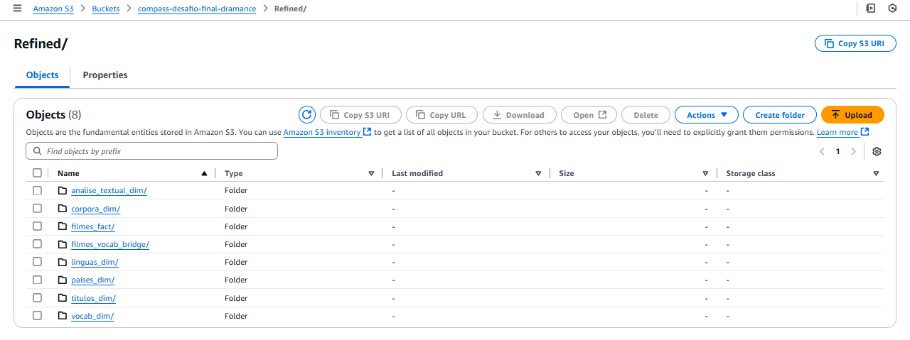

#

||
|---|
||
||

## DESAFIO

O projeto final desenvolve um fluxo de processamento e análise de dados, a partir de uma arquitetura data lake. Para a quarta etapa, foi realizada a modelagem dimensional otimizando os dados para o consumo analítico de ferramentas de BI, a ingressão dos dados é realizada na camada Refined Zone.

- [**./parquet**](./desafio/parquet/) : diretório com os arquivos Parquet gerados na camada Refined Zone.
  - [**linguas_dim.parquet**](./desafio/parquet/linguas_dim.parquet)
  - [**paises_dim.parquet**](./desafio/parquet/paises_dim.parquet)
  - [**titulos_dim.parquet**](./desafio/parquet/titulos_dim.parquet)
  - [**analise_textual_dim.parquet**](./desafio/parquet/analise_textual_dim.parquet)
  - [**corpora_dim.parquet**](./desafio/parquet/corpora_dim.parquet)
  - [**vocab_dim.parquet**](./desafio/parquet/vocab_dim.parquet)
  - [**filmes_fact.parquet**](./desafio/parquet/filmes_fact.parquet)
  - [**filmes_vocab_bridge.parquet**](./desafio/parquet/filmes_vocab_bridge.parquet)
- [**job_refined.py**](./desafio/job_refined.py) : script de execução do Glue Job, responsável pela modelagem dimensional, geração dos arquivos acima e ingressão no data lake S3 na Refined Zone.
- [**dramance_analise_exploratoria.ipynb**](./desafio/dramance_analise_exploratoria.ipynb) : notebook de testes e análises exploratórias dos dados.
- [**requirements.txt**](./desafio/requirements.txt) : arquivo de instalações de dependências.
- [**log-transform-refined-20250217**](./desafio/log-transform-refined-20250217) : arquivo de logs de execução do script.

### MODELAGEM DIMENSIONAL

As motivações para a modelagem dimensional em tabelas fato, dimensionais e uma tabela bridge de associação muitos-para-muitos foi comentada na seção [Diagrama da Modelagem Dimensional](./desafio/README.md/#diagrama-da-modelagem-dimensional) na documentação do desafio.

O diagrama se encontra também a seguir na seção [Evidências: Diagrama da Modelagem Dimensional](#diagrama-da-modelagem-dimensional)

### INTEGRAÇÃO DE DADOS ENTRE FONTES LOCAL E TMDB

Na [seção homônima](./desafio/README.md/#integração-de-dados-entre-fontes-local-e-tmdb) da documentação desta etapa, é detalhada a relação estabelecida entre os datasets das fontes utilizadas, possibilitando o JOIN entre dados e o enriquecimento de dados históricos.

## EVIDÊNCIAS

Na pasta `evidencias`, encontram-se prints referentes a momentos de execução, exemplificando abordagens adotadas para o desenvolvimento do desafio.  
No passo a passo explicativo, encontrado na pasta `desafio`, serão comentados outros prints de pontos específicos.

### DIAGRAMA DA MODELAGEM DIMENSIONAL

### VISÃO DA REFINED ZONE

## BIBLIOGRAFIA

AMAZON WEB SERVICES. **Boto Documentation**. Última atualização: 2024. Disponível em: <[boto3.amazonaws.com/v1/documentation](https://boto3.amazonaws.com/v1/documentation/api/latest/index.html)>.

JURAFSKY, Daniel; MARTIN, James H. **Speech and Language Processing: An Introduction to Natural Language Processing, Computational Linguistics, and Speech Recognition**, 3 ed (draft). Stanford: Stanford University, 2025.

PAPADIMITRIOU, Isabel; MANNING, Christopher. **Language** In: On the Opportunities and Risks of Foundation Models. Stanford University, CRFM, 2021. p. 22-27. Disponível em: <[dl.acm.org/doi/pdf](https://dl.acm.org/doi/pdf/10.1145/1327452)>.

RASCHKA, Sebastian. **Build a Large Language Model (From Scratch)**. Shelter Island: Manning Publications, 2025.

RONG-CHING, Chang; MAY, Jonathan; LERMAN, Kristina. **Feedback Loops and Complex Dynamics of Harmful Speech in Online Discussions** In: Social, Cultural,
and Behavioral Modeling. Pittsburgh: Springer Nature Switzerland, 2023. p. 85-94.

VAN ROSSUM, Guido; WARSAW, Barry; COGHLAN, Alyssa. **PEP 8 – Style Guide for Python Code**. Última atualização: 2013. Disponível em: <[peps.python.org/pep-0008/](https://peps.python.org/pep-0008/)>.  

VAN ROSSUM, Guido; GOODGER, David. **PEP 257 – Docstring Conventions**. Última atualização: 2001. Disponível em: <[peps.python.org/pep-0257/](https://peps.python.org/pep-0257/)>.

ZHENG, Alice; CASARI, Amanda. **Feature Engineering for Machine Learning: Principles and Techniques for Data Scientists**. Sebastopol: O'Reilly, 2018.
