#

||
|---|
||
||

## SEÇÕES

* **Introdução ao Processamento de Linguagem Natural (NLP)** [֍](#introdução-ao-processamento-de-linguagem-natural-nlp)
  * **Tarefas de Pré-Processamento** [֍](#tarefas-de-pré-processamento)
  * **Visão Geral do Hugging Face 🤗** [֍](#visão-geral-do-hugging-face-)
  * **Modelos Utilizados** [֍](#modelos-utilizados)
* **Camada Trusted Zone: Revisando os Dados** [֍](#camada-trusted-zone-revisando-os-dados)
  * **Primeiras Descobertas nos Dados** [֍](#primeiras-descobertas-nos-dados)
  * **Diagrama da Modelagem Dimensional** [֍](#diagrama-da-modelagem-dimensional)
* **Data Lake e Refined Zone** [֍](#data-lake-e-camada-refined-zone)
  * **Processamento de Dados: Etapa de Transformação Pt. 2** [֍](#processamento-de-dados-etapa-de-transformação-pt-2)
  * **Análise do Script do Glue Job** [֍](#análise-do-script-do-glue-job)
    * **Importações** [֍](#importações)
    * **Variáveis** [֍](#variáveis)
    * **Modelos de Língua** [֍](#modelos-de-língua)
    * **Criação dos DataFrames** [֍](#criação-dos-dataframes)
    * **Integração de Dados Entre Fontes Local e TMDB** [֍](#integração-de-dados-entre-fontes-local-e-tmdb)
    * **Funções Auxiliares, Extração de Dados e Criação de Novas Colunas** [֍](#funções-auxiliares-extração-de-dados-e-criação-de-novas-colunas)
      * **Categorização de Regiões** [֍](#categorização-de-regiões)
      * **Texto Total: Título + Sinopse** [֍](#texto-total-título--sinopse)
      * **Detecção de Conteúdo Sexual e Sexismo** [֍](#detecção-de-conteúdo-sexual-e-sexismo)
      * **Classes Sintáticas e Termos Comuns** [֍](#classes-sintáticas-e-termos-comuns)
      * **Frequência de Termos: Dicionarização** [֍](#frequência-de-termos-dicionarização)
    * **Criação das Tabelas Dimensão, Fato e Bridge** [֍](#criação-das-tabelas-dimensão-fato-e-bridge)
      * **Criação Dimensão Línguas** [֍](#criação-dimensão-línguas)
      * **Criação Dimensão Países** [֍](#criação-dimensão-países)
      * **Criação Dimensão Títulos** [֍](#criação-dimensão-títulos)
      * **Criação Dimensão Análise Textual** [֍](#criação-dimensão-análise-textual)
      * **Criação Dimensão Corpora** [֍](#criação-dimensão-corpora)
      * **Criação Dimensão Vocabulário** [֍](#criação-dimensão-vocabulário)
      * **Criação Fato Filmes**  [֍](#criação-fato-filmes)
      * **Criação Bridge Filmes-Vocabulário** [֍](#criação-bridge-filmes-vocabulário)
      * **Deleção de Colunas de ID Auxiliares** [֍](#deleção-de-colunas-de-id-auxiliares)
    * **Ingressão na Refined Zone** [֍](#ingressão-na-refined-zone)
* **Execução do Glue Job** [֍](#execução-do-glue-job)
  * **Criação e Execução do Crawler** [֍](#criação-e-execução-do-crawler)
* **Modelagem Dimensional: Visão Geral com Athena** [֍](#modelagem-dimensional-visão-geral-com-athena)
  * **Tabela Dimensional Línguas** [֍](#tabela-dimensional-línguas)
  * **Tabela Dimensional Países** [֍](#tabela-dimensional-países)
  * **Tabela Dimensional Títulos** [֍](#tabela-dimensional-títulos)
  * **Tabela Dimensional Análise Textual** [֍](#tabela-dimensional-análise-textual)
  * **Tabela Dimensional Vocabulário** [֍](#tabela-dimensional-vocabulário)
  * **Tabela Dimensional Corpora** [֍](#tabela-dimensional-corpora)
  * **Tabela Fato Filmes** [֍](#tabela-fato-filmes)
  * **Tabela Bridge Filmes-Vocabulário** [֍](#tabela-bridge-filmes-vocabulário)
* **Visão Geral do Bucket Dramance** [֍](#visão-geral-do-bucket-dramance)
* **Considerações Finais: Dificuldades e Pontos de Melhoria** [֍](#considerações-finais-dificuldades-e-pontos-de-melhoria)
* **Referências** [֍](#referências)

## INTRODUÇÃO AO PROCESSAMENTO DE LINGUAGEM NATURAL (NLP)

*Voltar para **Seções*** [֍](#seções)

Uma subárea da Inteligência Artificial, o Processamento de Linguagem Natural (ou NLP) engloba todas as técnicas de compreensão e tratamento de dados da língua humana (escrita ou oral). A complexidade da comunicação pela língua se estende para além do texto em si, dependente de referenciais externos, visões da realidade e da percepção compartilhadas pelos seres humanos, e subentendidas durante as interações pela língua.

Além disso, as maneiras de codificar a língua humana não são padronizadas, lidar com um dicionário ou um artigo acadêmico é muito diferente de lidar com comentários em redes sociais, onde a língua assume formas orgânicas e dinâmicas de significado, com neologismos, símbolos, emojis, jogos de palavras, truncações, abreviações, etc.

Apesar das especificidades, existem etapas gerais de processamento de textos já, mais ou menos, consolidadas em rotinas (*pipelines*) de fácil acesso por meio de diversos pacotes. Nesta seção, serão introduzidos alguns conceitos e ferramentas para trabalhar com NLP.

### TAREFAS DE PRÉ-PROCESSAMENTO

*Voltar para **Seções*** [֍](#seções)

Antes de começar a aplicar funções analíticas em um texto, é preciso processá-lo de forma a facilitar a separação de ocorrências relevantes, limpeza de ruídos e uniformização de formas distintas com significados similares; são tratamentos diversos com fins de otimizar a identificação de padrões significativos.

> ***Normalização** de palavras é a tarefa de colocar palavras, ou **tokens**, em um formato padrão. O caso mais simples de normalização de palavras é o **case folding**. Mapear tudo para minúsculas [...] é muito útil para generalização em muitas tarefas, tais como recuperação de informações ou reconhecimento de fala. Para análise de sentimento e outras tarefas de classificação [...], a caixa da letra pode ser muito útil, e o **case folding** geralmente não é realizado.* [^1]

A caracterização do que é mantido ou desprezado depende da tarefa em questão, no entanto, os processos em si são rotineiros; a seguir alguns relevantes, brevemente comentados para a compreensão das etapas de tratamento dos dados de texto:

* **Parsing e Tokenização**
  
O tratamento de tokenização das strings das colunas de texto foi realizado, quase inteiramente, por **expressões regulares**, primeiramente com split baseado em espaços, limpeza de caracteres especiais e consolidação de termos de interesse em uma string de tokens separados por vírgulas. Posteriormente, esses tokens foram separados a partir das vírgulas.

> *O **parsing, ou análise sintática**, é necessário quando a string contém mais do que texto simples. Por exemplo, se o texto bruto vem de uma página web, email ou algum log, então contém alguma estrutura adicional. [...] Depois de um parsing superficial, essa porção de texto simples do documento pode passar pelo processo de **tokenização**. Assim, tornando a string - uma sequência de caracteres - em uma sequência de **tokens**. Cada token pode, então, ser contabilizado como uma palavra. O tokenizador precisa saber quais caracteres indicam que um token terminou e outro está começando. Espaços e pontuação são, geralmente bons separadores.* [^2]

* **Remoção de Stopwords**

Os **tokens** gerados foram filtrados para desprezar temos não-alfabéticos e ***stopwords***, que não agregam significado lexical à análise.

> *Classificação e recuperação de dados geralmente não necessitam uma compreensão aprofundada do texto. Por exemplo, na frase "Emma bateu em uma porta", a palavras "em" e "uma" não alteram o fato de que essa frase é sobre uma pessoa e uma porta. Para tarefas menos granulares, como classificação, os pronomes, artigos e preposições não acrescentam muito valor. O caso pode ser muito diferente na análise de sentimentos, a qual requer uma compreensão mais refinada de semântica.* [^3]

* **Lematização**
  
Dentre os tokens filtrados na etapa anterior, são armazenados somente termos das classes sintáticas de substantivos, adjetivos, verbos e advérbios. Tais termos são convertidos para sua forma "lemma"; uma forma normalizada que despreza afixos, permitindo agregar ocorrências de um mesmo significado, que estejam flexionadas ou conjugadas de diversas maneiras. No vocabulário, as palavras são inseridas e contabilizadas na tabela bridge Filmes-Vocab somente após a lematização.

> *Lematização é a tarefa de determinar que 2 palavras possuem a mesma raíz, apesar de suas diferenças aparentes. As palavras "am", "are" e "is" possuem em comum o mesmo **lemma** "be"; as palavras "dinner" e "dinners" o mesmo **lemma** "dinner". [...] Os métodos mais sofisticados para a lematização envolvem uma análise morfossintática (**parsing**) completa da palavra. [...] Morfologia é o estudo do morfema, o modo que as palavras são construídas a partir de partes menores, contendo significados. Duas grandes classes de morfemas podem ser definidas: **raíz** (stem), o morfema central da palavra, que supre o significado principal, e os **afixos**, que adicionam significados diversos.* [^4]

* **Vetores e Embeddings**

Para as tarefas acima, ainda são utilizados os textos em forma de ***tokens***, em sua forma humanamente legível porém com devidas normalizações de formas.

Para tarefas de processamento utilizando modelos computacionais é preciso transformar os textos em dados numéricos, chamados **embeddings** , onde o "significado" dos ***tokens***, ao serem colocados em relação com os demais, recebe valores numéricos de acordo com sua distribuição de probabilidade a partir de coocorrências. Nas famosas palavras do linguista J.R. Firth (1957), *“You shall know a word by the company it keeps”* , em tradução direta, "conheces uma palavra pelas companhias que mantém."

> *Modelos de Redes de Aprendizado Profundo, incluindo LLMs, são incapazes de processar textos brutos diretamente. Visto que textos são categóricos, não são compatíveis com as operações matemáticas usadas para implementar e treinar redes neurais. Portanto, se faz necessária uma maneira de representar palavras como vetores de valores contínuos.* [^5]

Nos frameworks utilizados, SpaCy e Hugging Face 🤗, os modelos são carregados juntamente com um pipeline que adapta os pré-processamentos às necessidades de configuração de cada modelo (a quantidade de dimensões de cada embedding, por exemplo, difere entre modelos). Portanto, todo texto processado pelos modelos neste projeto, passou por uma etapa de vetorização camuflada.

### VISÃO GERAL DO HUGGING FACE 🤗

*Voltar para **Seções*** [֍](#seções)

O Hugging Face 🤗 é uma plataforma e repositório de desenvolvimento e compartilhamento de modelos de IA. Dentro de seu ecossistema, existem diversas ferramentas e serviços, e a maneira de interação com os modelos utilizados nesta etapa foi por meio do `pipeline`, uma maneira simples e intuitiva de utilizar transformers para tarefas pré-definidas, com poucas linhas de código.

Cada pipeline envolve 3 subprocessos, já adaptados para extração de valores paramétricos específicos de cada modelo :

* **Pré-processamento** : transformação da string de input em embeddings conforme à necessidade do modelo.
* **Processamento** : os dados de input são processados pelo modelo.
* **Pós-processamento** : os resultados das predições são transformados para facilitar a leitura dos valores obtidos.

> *[...] a abordagem moderna dominante para executar cada tarefa é utilizar um único **modelo de base (foundation model)** e adaptá-lo levemente utilizando quantidades relativamente pequenas de dados anotados, específicos para cada tarefa [...] Esta se provou uma abordagem extremamente exitosa: para a grande maioria das tarefas [...], um modelo de base adaptado para uma tarefa supera vastamente os modelos anteriores ou os pipelines de modelos que foram criados para executar aquela tarefa em específico.* [^6]

Para tarefas de NLP, alavancar resultados com base em grandes modelos de língua pré-treinados é a forma mais acessível e otimizada de trabalhar com datasets de texto. A abordagem adotada segue essa metodologia, os modelos utilizados foram treinados em cima de modelos de base, comentados na próxima seção. A seguir, algumas das tarefas relevantes para o tipo de análise deste projeto, dentre as diversas disponíveis na plataforma Hugging Face 🤗:

* `feature-extraction` obter a representação de um texto em vetores / embeddings
* `token-classification` obter classificações referentes a cada token (ex. POS tags)
* `ner` *named entity recognition*, útil para reconhecer "nomes próprios" referentes a regiões, instituições, pessoas, marcas, etc
* `summarization` reduzir o tamanho de um texto sem perda de elementos semanticamente relevantes
* `text-classification` obter uma classificação, para a qual o modelo foi treinado, específica para um determinado texto (ex. violento ou não, detecção de fake news, etc)
* `translation` tradução de textos
* `zero-shot-classification` classificação de texto sem categorias pré-definidas, identifica clusters semânticos e sugere categorias a partir deles, também aceita categorias pré-definidas pelo usuário

Para este projeto, foram utilizados 2 modelos da plataforma, treinados para tarefas específicas de `text-classification` .

### MODELOS UTILIZADOS

*Voltar para **Seções*** [֍](#seções)

A seguir os modelos utilizados nas plataformas utilizadas e algumas informações de referência.

`explosion/en_core_web_trf` | SpaCy

[Modelo em inglês](https://spacy.io/models/en#en_core_web_trf), treinado em `RoBERTa-base` utilizando textos da web (blogs, notícias, comentários), otimizado para tarefas de extração de vocabulário, classificação de sintaxe e entidades.

`annahaz/xlm-roberta-base-misogyny-sexism-indomain-mix-bal` | Hugging Face 🤗

[Modelo multilíngue](https://huggingface.co/annahaz/xlm-roberta-base-misogyny-sexism-indomain-mix-bal) de detecção de emoções, misoginia e sexismo em discursos, o treino foi realizado em cima dos modelos-base e `XLM-RoBERTa`, `BERT` e `DistilBERT`, com *corpora* de comentários em fóruns de discussão de cunho político e datasets anotados. A seguir alguns dos métodos, critérios e modelos complementares para obtenção de métricas [^7]:

* **Detecção de Toxicidade**
* **Detecção de Emoções**
* **Detecção Multilíngue de Misoginia e Sexismo**
  
`uget/sexual_content_dection` | Hugging Face 🤗

[Modelo multilíngue](https://huggingface.co/uget/sexual_content_dection) treinado com dataset anotado manualmente sobre o modelo-base `BERT-base-multilingual-cased` , especificamente para a classificação de texto, detectando conteúdo sexual no texto, com fins de moderação de conteúdo público.

## CAMADA TRUSTED ZONE: REVISANDO OS DADOS

*Voltar para **Seções*** [֍](#seções)

Abaixo, serão retomados os dados como estão dispostos na camada Trusted Zone, de onde serão consumidos para as modelagens e ingressão posterior na Refined Zone. Os caminhos a seguir são os utilizados como argumentos na execução do Job para input de dados.

* **Trusted Zone Local**

```bash
  s3://compass-desafio-final-dramance/Trusted/Local/Parquet/Movies/
```
  
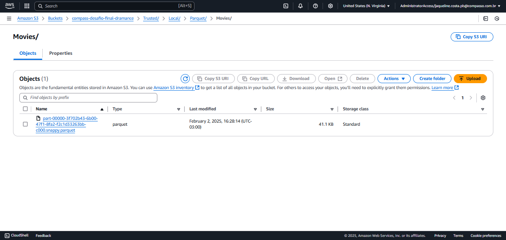

* **Trusted Zone TMDB**

```bash
  s3://compass-desafio-final-dramance/Trusted/TMDB/Parquet/Movies/2025/1/31/
```

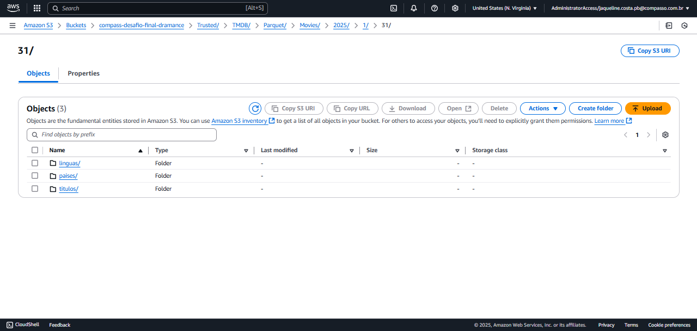

### PRIMEIRAS DESCOBERTAS NOS DADOS

*Voltar para **Seções*** [֍](#seções)

Para a análise exploratória dos datasets e desenvolvimento dos códigos para a modelagem dimensional foi utilizado um notebook no Databricks, disponibilizado no notebook [Dramance Análise Exploratória](./dramance_analise_exploratoria.ipynb) . A seguir, serão comentados alguns pontos relevantes para as decisões de modelagem :

* **Conteúdo Sexual Não-Filtrado**

A partir dos textos das colunas de títulos e sinopses, foi verificado que grande parte do conteúdo do dataset possuia conteúdo erótico explícito, mesmo utilizando o filtro `include_adult=false` abaixo no endpoint de ingestão desses dados:

  ```python
    f"https://api.themoviedb.org/3/discover/movie?include_adult=false&\
                        include_video=false&language=en-US&page={pag}&\
                        primary_release_year={ano}&with_genres={genero_id}"
  ```

Pegando o `id 660041` de exemplo, verifica-se que o problema reside na própria classificação interna do TMDB, pois ao ser consultado diretamente na base retorna-se o valor `adult: false` :

  |||
  |:---|---:|
  |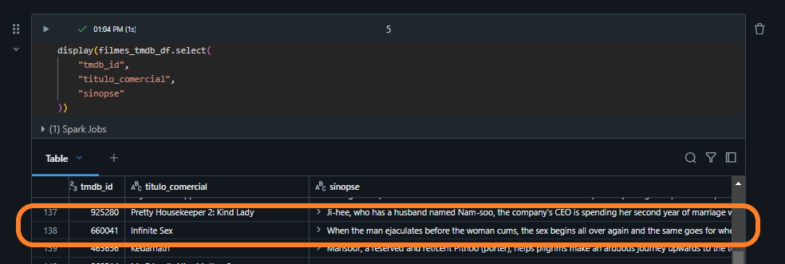|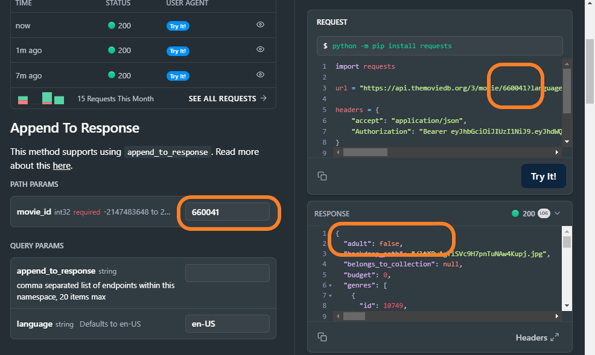|
  |||

Portanto, serão inseridos filtros de classificação de texto para possibilitar a separação de tais dados na análise, adicionando mais 2 valores a serem considerados `conteudo_sexual` e `sexismo` . Os modelos de língua utilizados para essas etapas estão descritos na seção [Modelos Utilizados](#modelos-utilizados).

* **Países Distintos | Categorização de Regiões**

Foram localizados os países contidos no recorte analisado e, então, consideradas as classificações regionais a serem utilizadas para a coluna `regiao` da dimensão de Países.

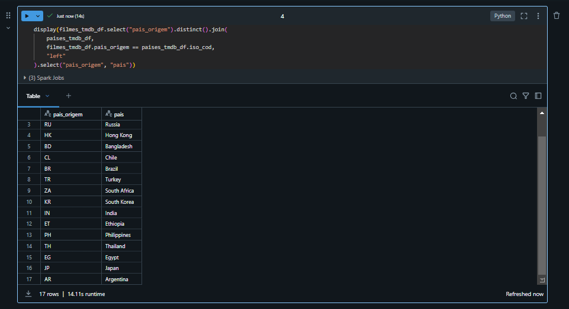

* **Frequência de Línguas**

Inicialmente, foi considerado utilizar tradutores para obter uma versão traduzida da coluna `titulo_original`, para entender discrepâncias entre a ideia original e o `titulo_comercial` das obras.

No entanto, devido ao alto custo computacional, nota-se mais vantajoso um possível recorte analítico dos títulos coreanos somente.

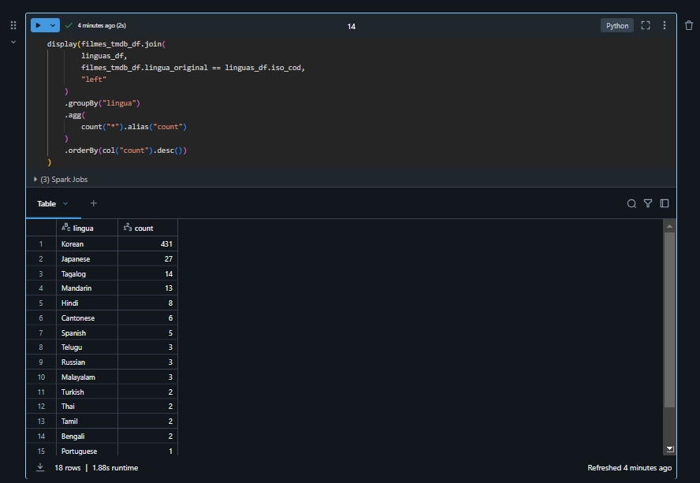

> ❗ Essa extração da tradução ficou como uma implementação futura, e não foi aplicada nesta etapa.

* **Lançamentos por Ano**

Esta análise é fundamental para entender se a disseminação do acesso global à plataforma Netflix (a partir de 2015-2016) pode indicar alguma relação com a quantidade de produções lançadas, nas regiões de interesse no recorte da análise.

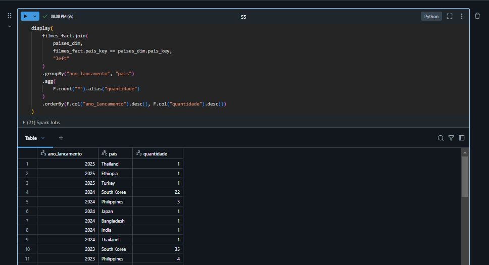

### DIAGRAMA DA MODELAGEM DIMENSIONAL

*Voltar para **Seções*** [֍](#seções)

A seguir, o diagrama utilizado para guiar o desenvolvimento da modelagem dimensional:

[//]: # (Caso não possua suporte para mermaid, sugiro abrir no site do GitHub para visualizar o diagrama a seguir ou instalar extensão compatível)

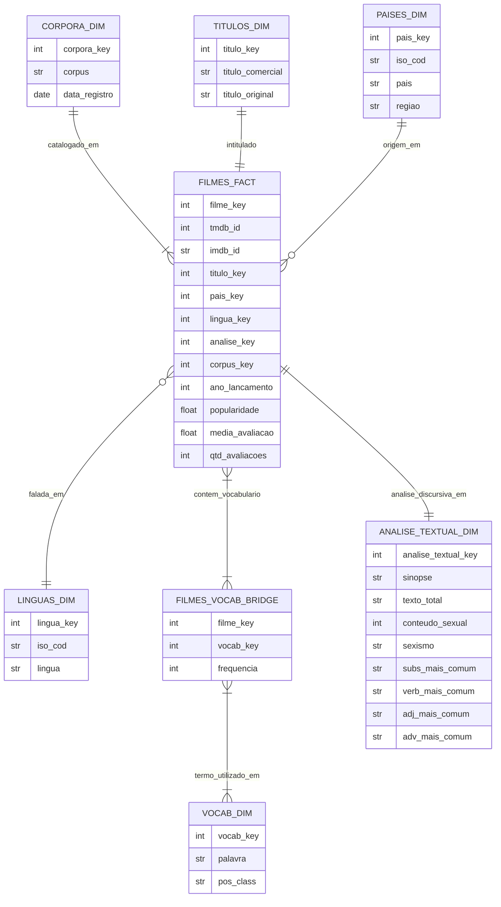
```mermaid
  erDiagram

  LINGUAS_DIM {
    int lingua_key
    str iso_cod
    str lingua
  }

  FILMES_VOCAB_BRIDGE {
    int filme_key
    int vocab_key
    int frequencia

  }

  VOCAB_DIM {
    int vocab_key
    str palavra
    str pos_class
  }

  ANALISE_TEXTUAL_DIM {
    int analise_textual_key
    str sinopse
    str texto_total
    int conteudo_sexual
    str sexismo
    str subs_mais_comum
    str verb_mais_comum
    str adj_mais_comum
    str adv_mais_comum
  }

  CORPORA_DIM ||--}|FILMES_FACT : catalogado_em
  TITULOS_DIM ||--|| FILMES_FACT : intitulado
  FILMES_FACT ||--|| ANALISE_TEXTUAL_DIM: analise_discursiva_em

      FILMES_FACT {
    int filme_key
    int tmdb_id
    str imdb_id
    int titulo_key
    int pais_key
    int lingua_key
    int analise_key
    int corpus_key
    int ano_lancamento
    float popularidade
    float media_avaliacao
    int qtd_avaliacoes
  }


  TITULOS_DIM {
    int titulo_key
    str titulo_comercial
    str titulo_original
  }

  PAISES_DIM {
    int pais_key
    str iso_cod
    str pais
    str regiao
  }

  CORPORA_DIM {
    int corpora_key
    str corpus
    date data_registro
  }

  FILMES_FACT }o--|| LINGUAS_DIM : falada_em
  PAISES_DIM ||--o{ FILMES_FACT: origem_em


  FILMES_FACT |{--}| FILMES_VOCAB_BRIDGE : contem_vocabulario
  FILMES_VOCAB_BRIDGE |{--}| VOCAB_DIM : termo_utilizado_em
```

Para as relações **muitos-para-muitos**, necessárias para organizar a frequência de termos no vocabulário de cada filme, foi utilizada uma **Tabela Bridge** ou **Tabela Associativa** que faz a conexão entre as tabelas fato `filmes_fact` e dimensional `vocab_dim` .

Para as relações de filmes com línguas, foram consideradas somente as línguas originais principais, de mesmo modo para o filme, foram desconsiderados países de produção adicionais. Assim, a relação dessas tabelas foi determinada como sendo de um (língua / país) para muitos filmes, e cada filme contendo 1 e somente 1 país ou língua original.

## DATA LAKE E CAMADA REFINED ZONE

*Voltar para **Seções*** [֍](#seções)

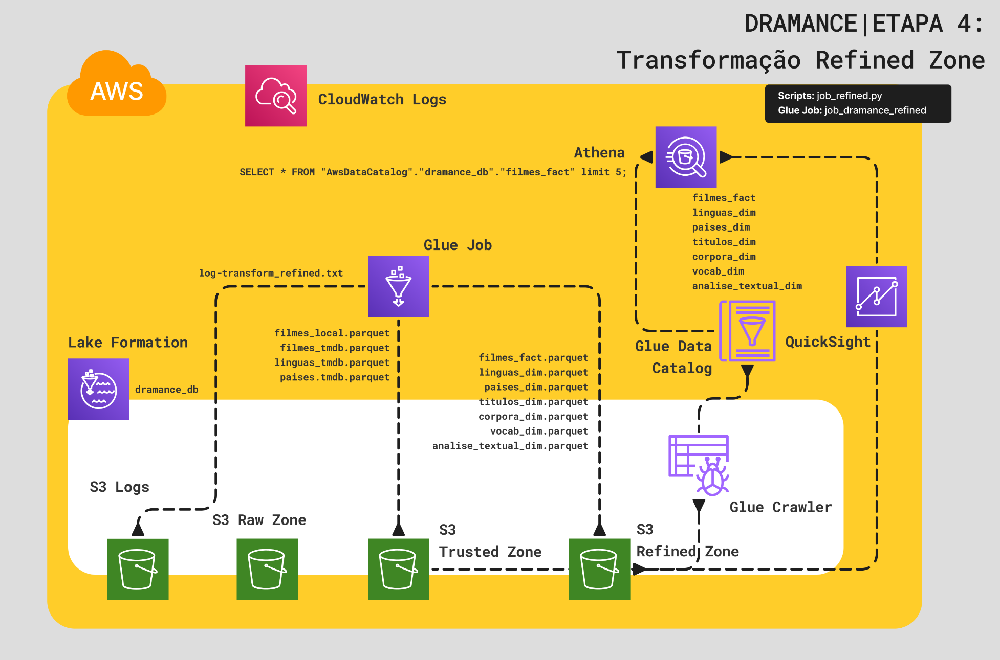

### PROCESSAMENTO DE DADOS: ETAPA DE TRANSFORMAÇÃO PT. 2

*Voltar para **Seções*** [֍](#seções)

Nesta etapa da engenharia de dados do data lake, os datasets da camada Trusted Zone passam pela **modelagem dimensional**, extraindo informações e disponibilizando atributos de forma acessível para o consumo em tarefas analíticas. A ingressão das tabelas fato, dimensões e bridge será feita na camada Refined Zone, e o processo todo será executado em um Job no AWS Glue.

### ANÁLISE DO SCRIPT DO GLUE JOB

*Voltar para **Seções*** [֍](#seções)

Antes de executar o script, é preciso instalar algumas dependências definidas em um arquivo `requirements.txt` :

```python
  torch
  spacy==3.7.2
  en_core_web_trf @ https://github.com/explosion/spacy-models/releases/download/en_core_web_trf-3.8.0/en_core_web_trf-3.8.0.tar.gz
  transformers==4.35.0
```

Este arquivo está armazenado no bucket do data lake, e é ingerido por meio de argumentos na [configuração do job](#execução-do-glue-job).

#### IMPORTAÇÕES

*Voltar para **Seções*** [֍](#seções)

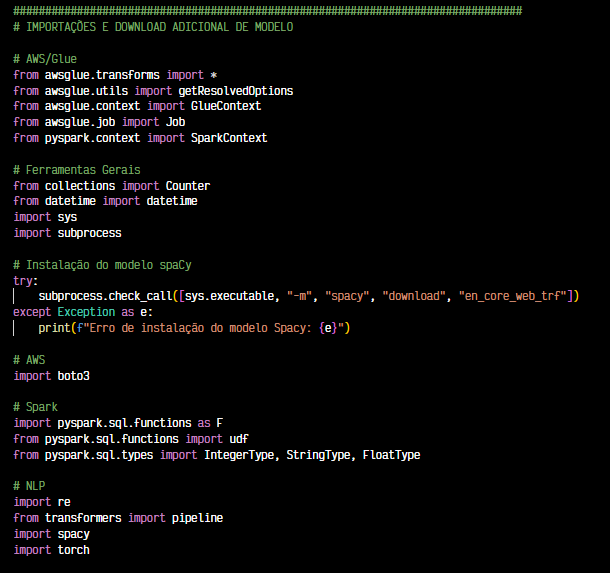

Além do ambiente de execução já reproduzido em sprints anteriores, foram incluídos os seguintes trechos para os modelos de língua utilizados.

* **Instalação do modelo do SpaCy** : download do modelo a ser utilizado por meio de subprocesso.

```python
  try:
      subprocess.check_call([sys.executable, "-m", "spacy", "download", "en_core_web_trf"])
  except Exception as e:
      print(f"Erro de instalação do modelo SpaCy: {e}")
```

* **Instalação de pacotes de NLP**
  * `torch` PyTorch é um pacote de Deep Learning que permite a utilização do tipo Tensor para o processamento de texto nos modelos de transformers utilizados.
  * `re` Expressões regulares são utilizadas na limpeza e normalização de texto customizada.
  * `transformers` e `spacy` : acesso aos modelos por meio de um pipeline de fácil acesso, com pré-processamento de texto adaptada aos parâmetros de cada modelo, inferência baseada em tarefas e output simplificado.

```python
  # NLP
  import re
  from transformers import pipeline
  import spacy
  import torch
```

#### VARIÁVEIS

*Voltar para **Seções*** [֍](#seções)

Abaixo a declaração de variáveis de ambiente, as quais não foram alteradas e seguem sendo as mesmas já detalhadas em outras etapas.
Somente serão explicitadas as variáveis passadas como argumentos do sistema na configuração do Job:

```python
  args["S3_TMDB_INPUT_PATH"] = "s3://compass-desafio-final-dramance/Trusted/TMDB/Parquet/Movies/2025/1/31"
  args["S3_LOCAL_INPUT_PATH"] = "s3://compass-desafio-final-dramance/Trusted/Local/Parquet/Movies"
  args["S3_BUCKET"] = "compass-desafio-final-dramance"
```


#### MODELOS DE LÍNGUA

*Voltar para **Seções*** [֍](#seções)

Foram utilizados os 3 modelos de língua, carregados em pipeline com os frameworks SpaCy e Hugging Face 🤗, já detalhados anteriormente na seção [Modelos Utilizados](#modelos-utilizados).

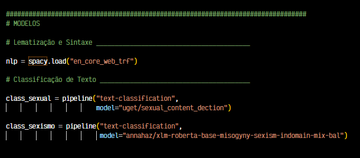

#### CRIAÇÃO DOS DATAFRAMES

*Voltar para **Seções*** [֍](#seções)

Abaixo a criação dos DataFrames com os dados da Trusted Zone, já utilizando alguns *aliases* com `.alias()` para facilitar o acesso das colunas no JOIN seguinte.

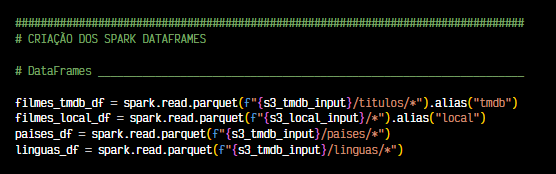

#### INTEGRAÇÃO DE DADOS ENTRE FONTES LOCAL E TMDB

Os DataFrames `filmes_local_df` e `filmes_tmdb_df` referem-se ao mesmo conjunto de dados, e são complementares. Portanto, o *schema* será definido e ambos serão agregados em um DataFrame consolidado `filmes_df`.

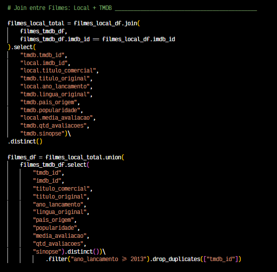

O processo é realizado em 2 etapas:

1. Os dados de filmes de origem `Local` são enriquecidos com os dados adicionais do `TMDB` . A estrutura de colunas entre os datasets fica assim:
  
  |coluna|local|tmdb|
  |:---|:---:|:---:|
  |tmdb_id||X|
  |imdb_id|X||
  |titulo_comercial|X||
  |titulo_original||X|
  |ano_lancamento|X||
  |lingua_original||X|
  |pais_origem||X|
  |popularidade||X|
  |media_avaliacao|X||
  |qtd_avaliacoes||X|
  |sinopse||X|

2. A tabela intermediária criada acima já adota o mesmo *schema* dos dados ingeridos do TMDB, portanto, pode ser consolidada com um comando UNION. Neste ponto, alguns filtros adicionais também são realizados, para precaução de duplicações.

#### FUNÇÕES AUXILIARES, EXTRAÇÃO DE DADOS E CRIAÇÃO DE NOVAS COLUNAS

*Voltar para **Seções*** [֍](#seções)

Abaixo, o processo de extração de valores adicionais a partir de inferências ou categorização dos dados. Para a utilização integrada ao ambiente Spark, os modelos de língua são acessados por meio de UDFs (*User Defined Functions*), utilizando um **decorator** na declaração de funções.

##### CATEGORIZAÇÃO DE REGIÕES

*Voltar para **Seções*** [֍](#seções)

Para esta classificação, foram criadas categorias regionais manualmente de acordo com o interesse geográfico da análise. Com o auxílio do assistente de IA `Claude 3.5 Sonnet` , foi criado um dicionário para a iteração entre valores de países e regiões. No prompt foram fornecidos os valores da tabela `paises_df` com os códigos ISO referentes aos países e as categorias a serem utilizadas.

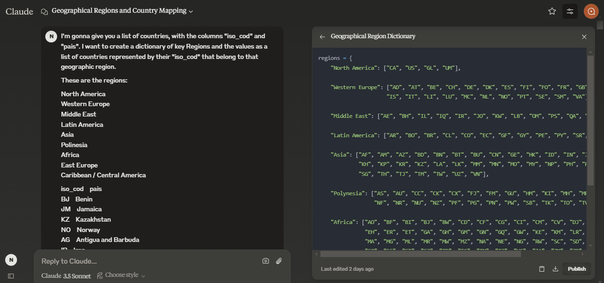

Considerando que os dados do dataset estão em inglês, as categorias criadas para as regiões foram mantidas na mesma língua. Somente um ajuste foi feito na coleção gerada, substituindo somente o país "México" da categoria "Norte América" para "Caribe / América Central", uma adoção pertinente à análise a ser feita.

A iteração sobre valores e localização da região correspondente é feita por meio da função abaixo.

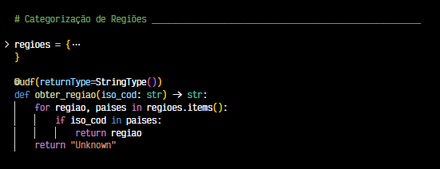

##### TEXTO TOTAL: TÍTULO + SINOPSE

*Voltar para **Seções*** [֍](#seções)

Como forma de aproveitar o conteúdo semântico presente na coluna `titulo_comercial` , foi criada uma coluna concatenando-a com a coluna `sinopse` , gerando a coluna `texto_total` , utilizada para as análises de texto subsequentes.

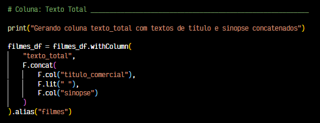

##### DETECÇÃO DE CONTEÚDO SEXUAL E SEXISMO

*Voltar para **Seções*** [֍](#seções)

Ambos os modelos utilizados, retornam um output binário (LABEL_0 ou LABEL_1) de classificação de texto com relação à presença de conteúdo sexual e discurso com tons sexistas e/ou misóginos, juntamente com o score de confiança da inferência.

* `uget/sexual_content_dection` : modelo de classificação de conteúdo sexual.
* `annahaz/xlm-roberta-base-misogyny-sexism-indomain-mix-bal` : modelo de classificação de presença de sexismo.

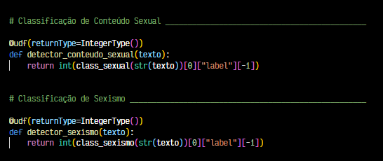

Do formato de resultado a seguir, para as duas classificações foi extraído somente o valor referente à classificação - na chave `label`, o último dígito, sendo 0 para negativo e 1 para positivo.

```json
  [{'label': 'LABEL_1', 'score': 0.999693751335144},
  {'label': 'LABEL_1', 'score': 0.9996908903121948},
  {'label': 'LABEL_0', 'score': 0.9864094257354736}]
```

Quanto à performance desses modelos, foi registrado um caso de exemplo em que foi identificado corretamente tanto a presença de conteúdo sexual quanto de sexismo, em um caso em que termos sugestivos não estavam explícitos no texto.

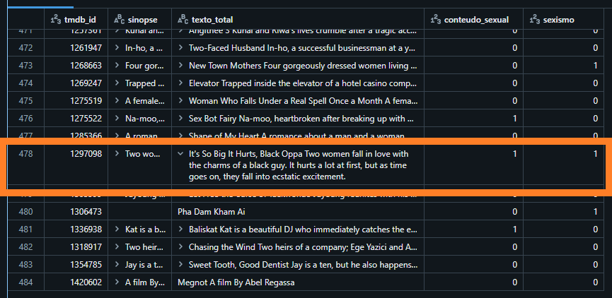

##### CLASSES SINTÁTICAS E TERMOS COMUNS

*Voltar para **Seções*** [֍](#seções)

Aqui, o modelo `en_core_web_trf` , carregado na variável `nlp` , é utilizado como *parser* para extração de classes sintáticas lexicais, como substantivos (NOUN), verbos (VERB), adjetivos (ADJ) e advérbios (ADV). E também com a tarefa de lematização dos termos, mantendo a semântica de termos em flexões diferentes.

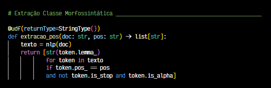

O texto em `doc` é tokenizado pelo modelo, assim é possível obter algumas informações a partir dos atributos de cada `token`.

```python
  token.lemma_      # Token em forma lematizada
  token.pos_        # Classe morfossintática (POS Part-of-Speech)
  token.is_stop     # Se o token é uma stopword
  token.is_alpha    # Se o token é composto de caracteres alfabéticos
```

A partir da classe importada `Counter`, um contador gera uma coleção de frequência de termos a partir de uma string.

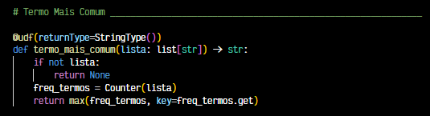

Tais funções são acessadas na criação das colunas abaixo, na tabela de `analise_textual` :

* **Colunas de lista de termos da categoria POS:** string (termos separados por vírgulas)
  * substantivos
  * verbos
  * adjetivos
  * adverbios
* **Colunas de termos mais frequente das listas acima** : string
  * subst_mais_comum
  * verb_mais_comum
  * adj_mais_comum
  * adv_mais_comum

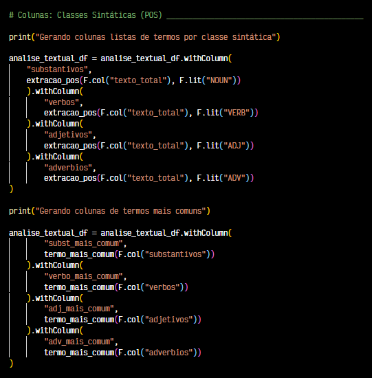

No caso de não existir um termo com frequência acima dos demais, será escolhido aleatoriamente um termo de valor mais alto.

##### FREQUÊNCIA DE TERMOS: DICIONARIZAÇÃO

*Voltar para **Seções*** [֍](#seções)

Para a integração de palavras normalizadas e classificadas em uma coleção, foi criada uma função que separa os tokens extraídos, faz a limpeza de caracteres indesejados, e posteriormente insere esses termos em uma coluna `palavra` .


Essa função foi utilizada no processo de criação das tabelas `vocab_dim` e `filmes_vocab_bridge` ela recebe os seguintes argumentos:

* `df` DataFrame com a coluna de termos a ser incluída em uma coleção ou dicionário de termos
* `coluna_palavras` coluna com a lista de termos, uma string com tokens separados
* `padrao_process` o padrão em RegEx para o tratamento de separação de termos da lista
  * `\\[|\\]` o padrão declarado seleciona colchetes para remoção
* `sep` o separador entre os tokens da lista
* `padrao_add_vocab` o padrão em RegEx para tratamento após o split, precedendo a inserção do termo
  * `^\\s+|\\s+$` o padrão declarado seleciona espaços em branco no começo e fim da string
* `coluna_extra` coluna de referência (geralmente um ID), a ser selecionada e incluída no DataFrame resultante

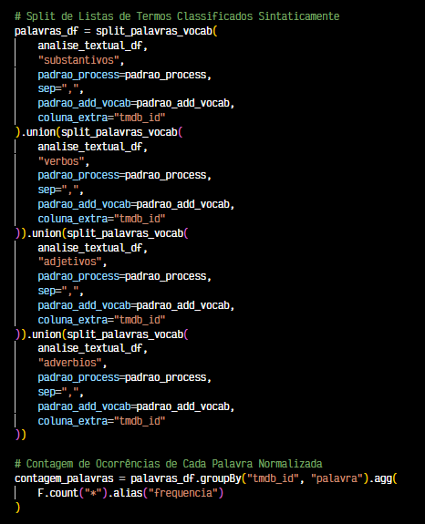

#### CRIAÇÃO DAS TABELAS DIMENSÃO, FATO E BRIDGE

*Voltar para **Seções*** [֍](#seções)

Nesta seção, as colunas criadas anteriormente e as tabelas auxiliares utilizadas nesse processo são consolidadas na versão final das tabelas após a modelagem dimensional.

Para a criação de chaves primárias, foi utilizada a função `monotonically_increasing_id()` com o acréscimo do inteiro `1` para que a indexação não comece do valor 0 (zero). Os IDs gerados são crescentes e únicos, porém não são necessariamente consecutivos, ainda assim, esse fator não prejudica a modelagem. 

E, para os caso de relações entre tabelas que possuem colunas de IDs compartilhados, foi utilizada a função `alias()` para facilitar a referenciação nos JOINs seguintes.

##### CRIAÇÃO DIMENSÃO LÍNGUAS

*Voltar para **Seções*** [֍](#seções)

Para a dimensão Línguas, foi utilizada a tabela `linguas_df` do TMDB como base, algumas células multivaloradas tiveram seus valores tratados.

* `lingua_key`
* `iso_cod`
* `lingua`

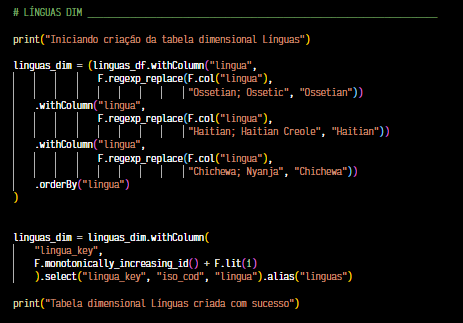

##### CRIAÇÃO DIMENSÃO PAÍSES

*Voltar para **Seções*** [֍](#seções)

A dimensão Países é criada após a extração da categoria `regiao` com a função auxiliar `obter_regiao` aplicada ao DataFrame `paises_df`, também com dados obtidos do TMDB.

* `pais_key`
* `iso_cod`
* `pais`
* `regiao`

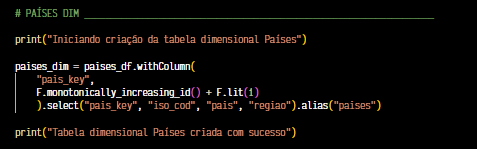

##### CRIAÇÃO DIMENSÃO TÍTULOS

*Voltar para **Seções*** [֍](#seções)

Para a dimensão de Títulos, além das colunas de interesse, foi incluído o `tmdb_id` para facilitar na relação da dimensão com a tabela fato, visto que os dados de título não são confiáveis como identificador único de cada filme.

* `titulo_key`
* `titulo_comercial`
* `titulo_original`

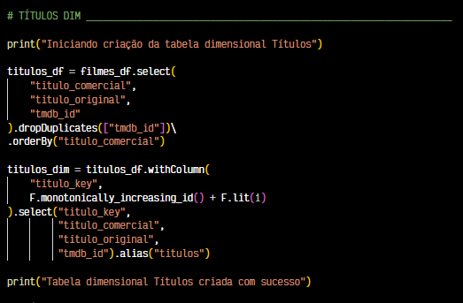

##### CRIAÇÃO DIMENSÃO ANÁLISE TEXTUAL

*Voltar para **Seções*** [֍](#seções)

Na dimensão de Análise Textual, todas as inferências e extrações de classificação de texto e tokens são selecionadas, e também é utilizado `tmdb_id` para auxiliar na relação posterior. Em alguns casos, como este, a seleção é feita em 2 etapas, primeiro com a ordenação dos valores, para depois ser gerada a chave primária. Aqui, a análise é referente a cada filme individualmente.

* `analise_key`
* `sinopse`
* `texto_total`
* `conteudo_sexual`
* `sexismo`
* `subst_mais_comum`
* `verbo_mais_comum`
* `adj_mais_comum`
* `adv_mais_comum`

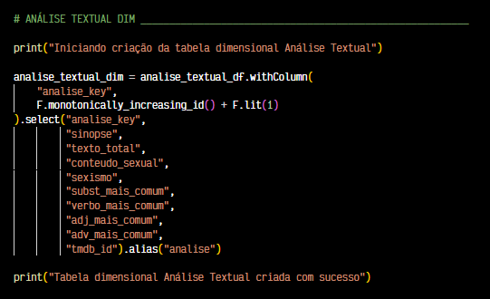

##### CRIAÇÃO DIMENSÃO CORPORA

*Voltar para **Seções*** [֍](#seções)

A dimensão Corpora busca centralizar todos os textos de um *corpus* para uma análise específica, podendo explicitar tendências que permeiam os exemplares como um todo. Ou seja, inclui todos os textos analisados na dimensão Análise Textual. Neste caso, também pareceu útil incluir o timestamp de criação, para análises comparativas com outros *corpus* ou versões do mesmo *corpus*.

* `corpus_key`
* `corpus`
* `data_registro`

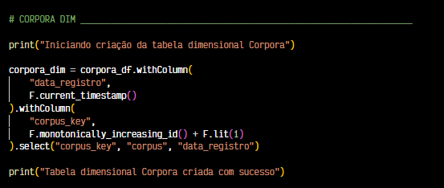

##### CRIAÇÃO DIMENSÃO VOCABULÁRIO

*Voltar para **Seções*** [֍](#seções)

Para a criação da dimensão Vocabulário, com ocorrências distintas de tokens já normalizados e categorizados, é utilizado como base o DataFrame `analise_textual_df` , o qual possui os termos extraídos da coluna `texto_total` separados por classe sintática.

O processo é realizado em 2 etapas:

* **Criação de DataFrame intermediário**: a partir da função `stack`, a qual transforma colunas em linhas. Portanto, os arrays de termos contidos nas colunas `substantivos` , `verbos` , `adjetivos` e `adverbios` são translocados para linhas individuais de um DataFrame de termos e classes.

* **Split de termos e limpeza pré-inserção**: a partir da função definida no início do script `split_palavras_vocab` , as colunas com array de termos são tratadas linha a linha com 2 padrões distintos, definidos pelo usuário (bem como o separador a se considerar), os padrões definidos foram:
  * `padrao_process = \\[|\\]` remoção de colchetes [ e ]
  * `padrao_add_vocab = ^\\s+|\\s+$` remove espaços vazios no início ou fim do token  

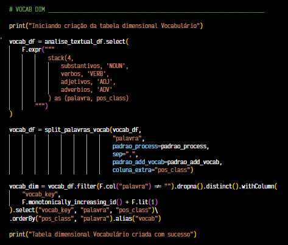

Após isso, a dimensão Vocabulário é criada, filtrando linhas vazias e valores nulos que possam ter passado nas etapas anteriores, e ordenada por classe sintática.

##### CRIAÇÃO FATO FILMES

*Voltar para **Seções*** [֍](#seções)

A criação da tabela fato Filmes foi feita em 2 etapas, somente para contornar um problema de conflito de IDs não resolvido apesar dos aliases criados, separando os JOINs em blocos. Para as dimensões que não possuiam um código único antes de sua criação, foi utilizado o `tmdb_id` como auxiliar.

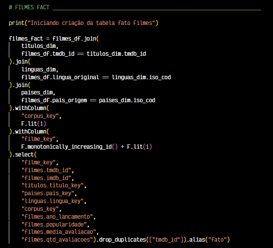

O JOIN da tabela de Análise Textual foi feito separadamente.

* `filme_key`
* `tmdb_id`
* `imdb_id`
* `titulo_key`
* `pais_key`
* `lingua_key`
* `corpus_key`
* `ano_lancamento`
* `popularidade`
* `media_avaliacao`
* `qtd_avaliacoes`

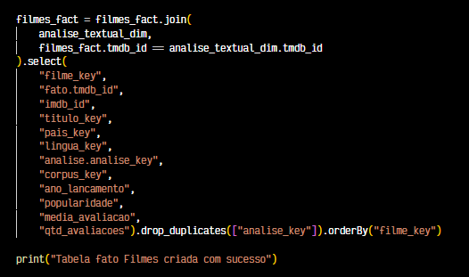

##### CRIAÇÃO BRIDGE FILMES-VOCABULÁRIO

*Voltar para **Seções*** [֍](#seções)

O DataFrame intermediário `contagem_palavras` gerado [nesta etapa](#frequência-de-termos-dicionarização), com a coluna de `frequencia` de termos por filme, é utilizado como base para a tabela associativa / bridge Filmes-Vocabulário.

As palavras são relacionadas com a dimensão Vocabulário por meio da coluna `palavra` (correspondente ao termo lematizado, sendo substantivo, adjetivo, verbo ou advérbio) e com a fato Filmes por meio do `tmdb_id`, incluso no DataFrame como auxiliar.

* `filme_key`
* `vocab_key`
* `frequencia`

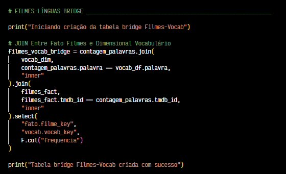

##### DELEÇÃO DE COLUNAS DE ID AUXILIARES

*Voltar para **Seções*** [֍](#seções)

Como já comentado acima, em alguns processos de criação das tabelas, foi preciso utilizar um ID comum entre os dados para estabelecer as relações em uma etapa intermediária, antes da criação das novas chaves primárias/estrangeiras para cada nova tabela.

Nesta etapa, após estabelecidas as relações com as novas chaves, essas colunas são excluídas das tabelas em que não são pertinentes. No caso presente, foi utilizada somente a coluna `tmdb_id` para os 3 casos necessários.

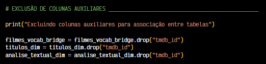

#### INGRESSÃO NA REFINED ZONE

*Voltar para **Seções*** [֍](#seções)

A ingressão de dados na Refined Zone segue o mesmo padrão para todas tabelas criadas na seção anterior, portanto, só será explicitado o bloco de ingressão da tabela que precede a conclusão do script e o commit do Job.

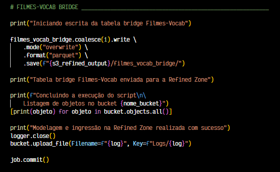

Aqui a tabela é consolidada em um único arquivo com `coalesce(1)` , salva em formato `parquet` no caminho declarado na variável `s3_refined_output`, a execução é concluída com a listagem do conteúdo do bucket, com o arquivo de logs fechado e enviado ao bucket com a data atual. A seguir, retomam-se os valores das variáveis de output para consulta:

```python
  s3_refined_output = f"s3://{nome_bucket}/Refined"
  log = f"log-transform-refined-{ano}{mes}{dia}"
```

## EXECUÇÃO DO GLUE JOB

*Voltar para **Seções*** [֍](#seções)

É preciso realizar algumas instalações de pacotes para a execução do script, registrados no arquivo `requirements.txt` , e passando os seguintes argumentos na configuração do Job:

```bash
  KEY: --python-modules-installer-option VALUE: -r
  KEY: --additional-python-modules VALUE: s3://bucket/caminho/para/requirements.txt
```

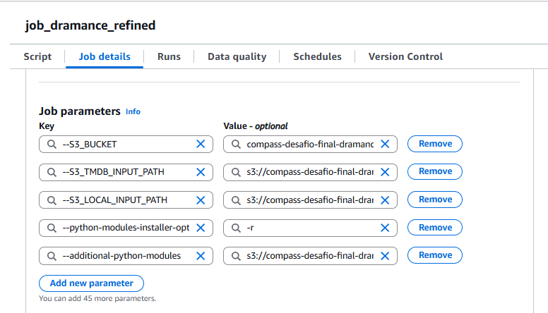

O arquivo [requirements.txt](requirements.txt) foi armazenado no bucket no seguinte caminho:

```bash
  s3://compass-desafio-final-dramance/Config/requirements.txt
```

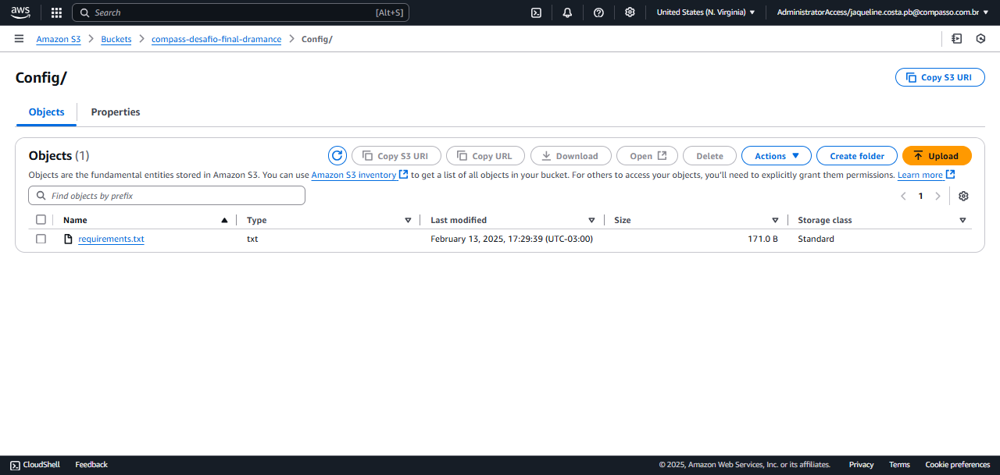

Foi necessário aumentar a capacidade e quantidade de *workers*, após erros de espaço em disco, e os tempos de execução excediam 30min. Esses fatores serão comentados mais a frente, na seção [Dificuldade e Pontos de Melhoria](#dificuldades-e-pontos-de-melhoria).


> ❗ A criação e execução do Crawler acima não é a versão com a criação da tabela Bridge Filmes-Vocab. Devido às dificuldades com a limitação de testes no Glue, tanto o Job quanto o Crawler final que gera essa tabela e se refere ao script `job_refined.py` não foram registrados em vídeo.

### CRIAÇÃO E EXECUÇÃO DO CRAWLER

*Voltar para **Seções*** [֍](#seções)

Finalizada a execução dos Glue Jobs, e gerados os arquivos na Refined Zone, é possível extrair seu schema e metadados, catalogando-os automaticamente em tabelas com um Crawler.


Abaixo, os comandos utilizados para as verificações de databases e tabelas criados, durante o vídeo de apresentação:

```bash
  # Listando databases
  aws glue get-databases

  # Listando tabelas
  aws glue get-tables --database-name dramance_db
```

> ❗ A criação e execução do Crawler acima não é a versão com a criação da tabela Bridge Filmes-Vocab. Devido às dificuldades com a limitação de testes no Glue, tanto o Job quanto o Crawler final que gera essa tabela e se refere ao script `job_refined.py` não foram registrados em vídeo.

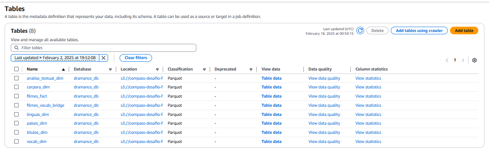

## MODELAGEM DIMENSIONAL: VISÃO GERAL COM ATHENA

*Voltar para **Seções*** [֍](#seções)

Após a execução do Crawler, é possível confirmar a correta modelagem dos dados, a partir de uma amostra de cada tabela por meio do AWS Athena com queries em SQL:

```sql
  SELECT * FROM "AwsDataCatalog"."dramance_db"."filmes_fact" limit 10;
```

### TABELA DIMENSIONAL LÍNGUAS

*Voltar para **Seções*** [֍](#seções)

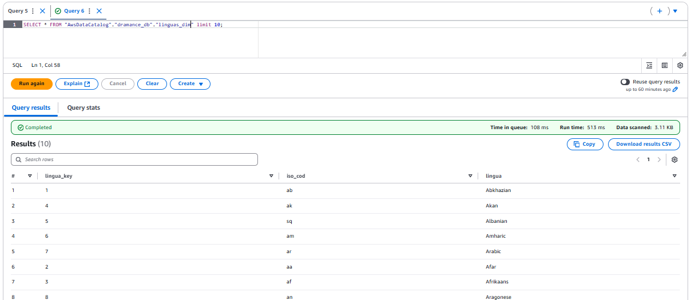

### TABELA DIMENSIONAL PAÍSES

*Voltar para **Seções*** [֍](#seções)

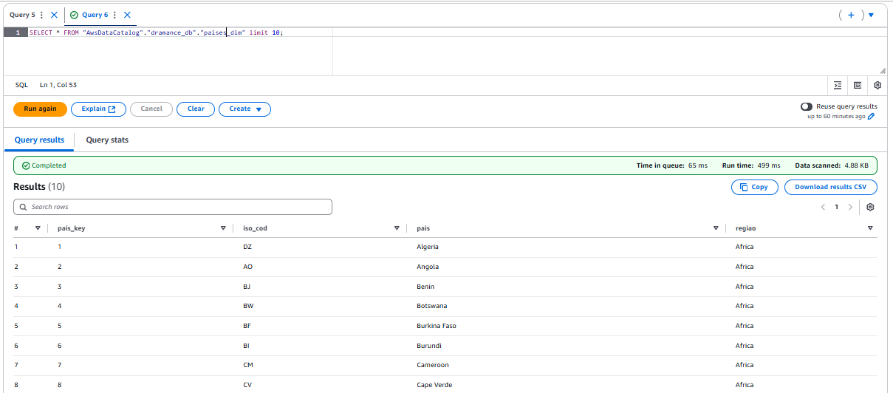

### TABELA DIMENSIONAL TÍTULOS

*Voltar para **Seções*** [֍](#seções)

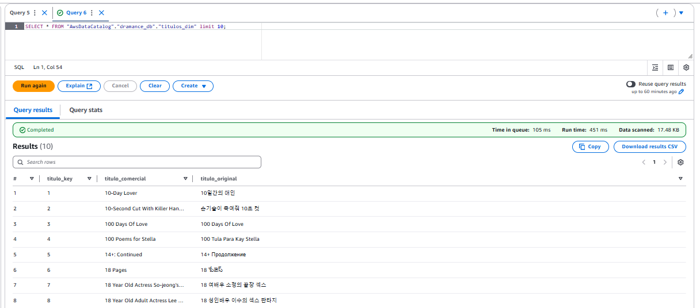

### TABELA DIMENSIONAL ANÁLISE TEXTUAL

*Voltar para **Seções*** [֍](#seções)

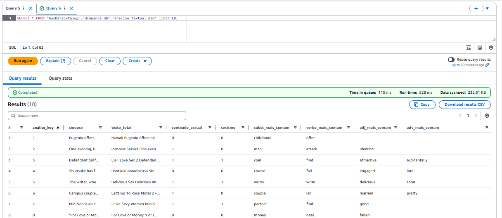

### TABELA DIMENSIONAL VOCABULÁRIO

*Voltar para **Seções*** [֍](#seções)

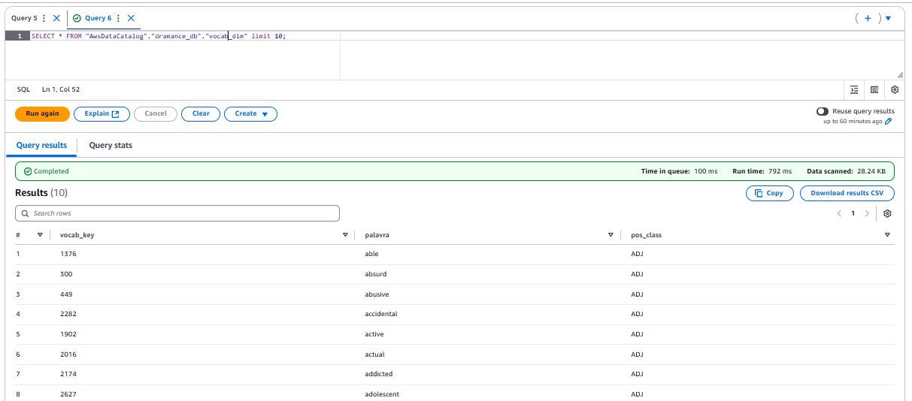

### TABELA DIMENSIONAL CORPORA

*Voltar para **Seções*** [֍](#seções)

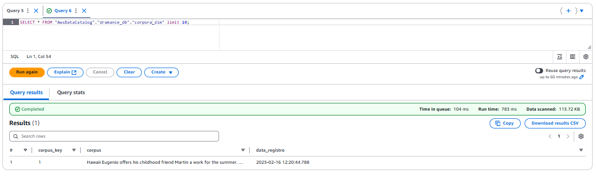

### TABELA FATO FILMES

*Voltar para **Seções*** [֍](#seções)


### TABELA BRIDGE FILMES-VOCABULÁRIO

*Voltar para **Seções*** [֍](#seções)


## VISÃO GERAL DO BUCKET DRAMANCE

*Voltar para **Seções*** [֍](#seções)

* **"Raíz" do Bucket**

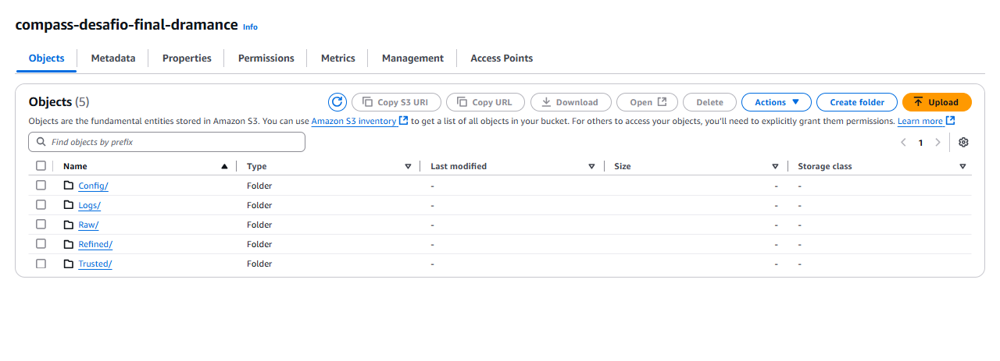

* **Refined Zone**


* **Refined Zone: Tabela-Fato Filmes**

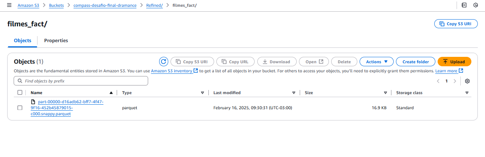

* **Logs de Execução**

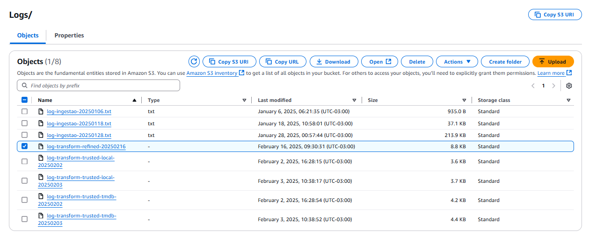

## CONSIDERAÇÕES FINAIS: DIFICULDADES E PONTOS DE MELHORIA

*Voltar para **Seções*** [֍](#seções)

O processo de desenvolvimento e testes com modelos de língua, somado ao alto custo de execução por erros no Glue, foi moroso e esteve sujeito a modificações devido ao longo tempo para experimentação com modelos e designs relacionais entre as tabelas.

Todo o projeto de modelagem e teste de inferências nos dados foi realizado em ambiente Databricks, com 15 GB RAM disponível em cluster Spark, e as tabelas demoravam mais de 10 min para conclusão das transformações.

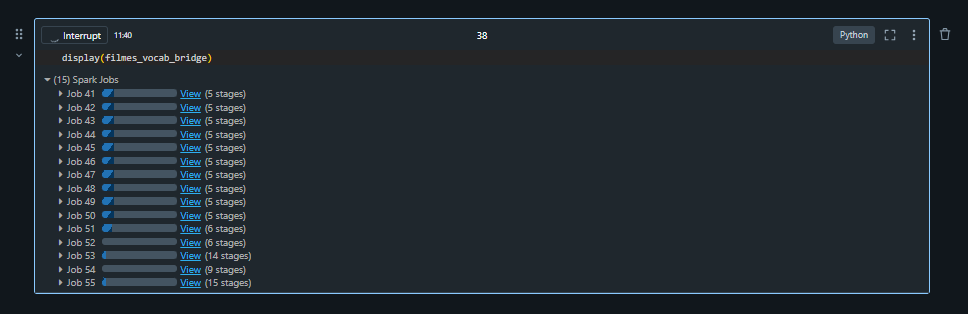

Nos primeiros testes no Glue para certificação de que as dependências estavam sendo instaladas de acordo, após alguns ajustes em runs mais curtas, foi lançado o erro:

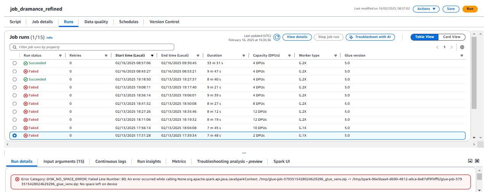

Foi preciso aumentar a configuração: primeiro no nº de *workers*; não sendo suficiente, aumentou-se a capacidade e o nº de *workers*. Nas runs subsequentes, a configuração foi sendo ajustada buscando o mínimo possível e, por isso, a quantidade de testes no Glue também foi limitada.

A 1ª execução de sucesso foi para o teste de instalações e download dos modelos, e criação da tabela `linguas_dim`, a qual não contém nenhuma inferência com modelos.

A 2ª execução de sucesso, a mais recente, foi a execução completa da modelagem das tabelas e ingressão na Refined Zone. Com exceção da tabela `filmes_vocab_bridge` , que não constava no script desse Job. O último Job, contendo a tabela `filmes_vocab_bridge` durou cerca de 12 minutos a mais, somente para a geração dessa tabela.

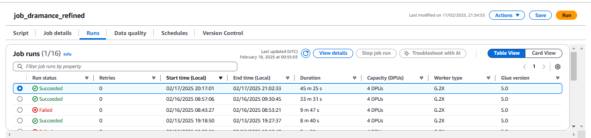

Para otimizar o fluxo, seria preciso melhorar o planejamento da capacidade de computação necessária, mapear a quantidade de cálculos e inferências necessárias para o código, entender qual esse custo de acordo com as especificidades de cada modelo e mapear possíveis duplicações de computações no script.

A seguir, alguns estudos iniciais de mapeamento de custos:

* **Tamanho do Modelo | Nº de Parâmetros**
  * **en_core_web_trf** : 463 MB | 125 M parâmetros
  * **xlm-roberta-base-misogyny-sexism-indomain-mix-bal** : 1.11 GB | 279 M parâmetros
  * **sexual_content_dection** : 711 MB | 178 M parâmetros

* **Quantidade de Inferências para Cada Modelo**
  * **en_core_web_trf** : 4 execuções x 484 linhas = 1936 inferências
  * **annahaz/xlm-roberta-base-misogyny-sexism-indomain-mix-bal** : 1 execução x 484 linhas = 484 inferências
  * **sexual_content_dection** : 1 execução x 484 linhas = 484 inferências

* **Custo Job AWS Glue** : cobrança por segundo rodado
  * **1 DPU/hora** : 0.44 USD
  * **Configuração** : 4 DPUs
  * **Tempo de execução**: 45m 25s = 0.757 horas
  * **Custo total**: 0.757 × 4 × $0.44 = 1.33 USD

## REFERÊNCIAS

*Voltar para **Seções*** [֍](#seções)

[^1]: JURAFSKY, MARTIN; 2025, p. 23
[^2]: ZHENG, CASARI; 2018, p. 52
[^3]: Ibidem, p. 48
[^4]: JURAFSKY, MARTIN; 2025, p. 23
[^5]: RASCHKA, 2025, p. 18
[^6]: PAPADIMITRIOU, MANNING; 2021, p. 23
[^7]: RONG-CHING, MAY, LERMAN; 2023, p. 88